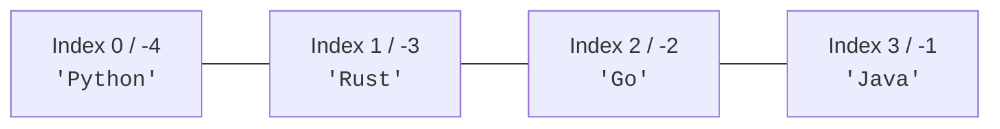
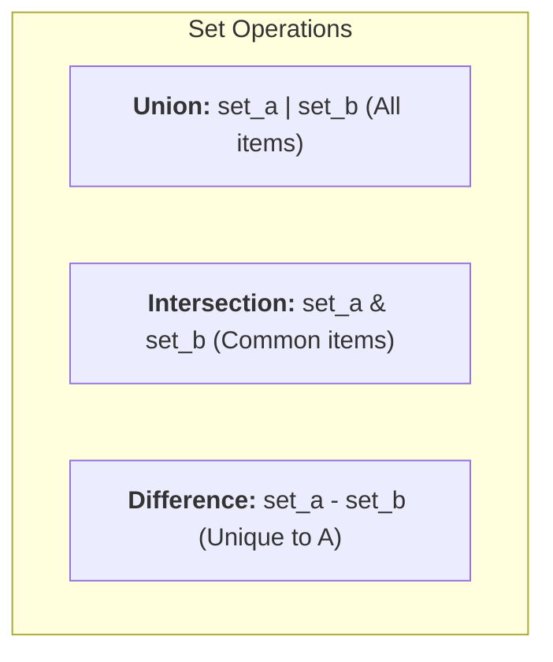

# 02 - Python Data Structures: Storing & Manipulating Data

> **Mental Model**:  
> Data structures are like **different storage containers in your kitchen**:  
> * **List `[]`**: An organized spice rack where every jar has a specific shelf position (ordered, changeable, allows duplicates).  
> * **Tuple `()`**: A sealed, tamper-proof emergency medical kit (ordered, fixed, cannot be changed).  
> * **Set `{}`**: A bag of unique marbles (unordered, no duplicates allowed).  
> * **Dictionary `{key: value}`**: A labeled filing cabinet where you find data by its label name instead of a number.

---

## 📑 Table of Contents
1. [The 4 Core Python Data Structures](#1-the-4-core-python-data-structures)
2. [Lists: Indexing, Slicing, & Negative Indices](#2-lists-indexing-slicing--negative-indices)
3. [Tuples & Tuple Unpacking](#3-tuples--tuple-unpacking)
4. [Sets: Uniqueness & Venn-Diagram Operations](#4-sets-uniqueness--venn-diagram-operations)
5. [Dictionaries: Key-Value Pairs & Safe .get() Access](#5-dictionaries-key-value-pairs--safe-get-access)
6. [Nested Data Structures (Navigating Real API Data)](#6-nested-data-structures-navigating-real-api-data)
7. [Summary & Quick Reference Cheat Sheet](#7-summary--quick-reference-cheat-sheet)

---

## 1. The 4 Core Python Data Structures

| Structure | Syntax | Ordered? | Mutable (Changeable)? | Duplicates Allowed? |
| :--- | :---: | :---: | :---: | :---: |
| **List** | `["a", "b", "c"]` | ✅ Yes | ✅ Yes | ✅ Yes |
| **Tuple** | `("a", "b", "c")` | ✅ Yes | ❌ No (Immutable) | ✅ Yes |
| **Set** | `{"a", "b", "c"}` | ❌ No | ✅ Yes | ❌ No (Unique only) |
| **Dictionary** | `{"key": "value"}` | ✅ Yes | ✅ Yes | ❌ Keys unique |

---

## 2. Lists: Indexing, Slicing, & Negative Indices



```python
languages = ["Python", "Rust", "Go", "Java"]

# 1. Direct & Negative Indexing:
first = languages[0]    # 'Python'
last = languages[-1]    # 'Java' (Pythonic last element!)
middle = languages[len(languages) // 2]  # 'Go'

# 2. Slicing [start : stop_before]:
top_two = languages[0:2]  # ['Python', 'Rust']

# 3. Appending and Modifying:
languages.append("TypeScript")
print(languages)
```

---

## 3. Tuples & Tuple Unpacking

Tuples are immutable sequences. Once created, their elements cannot be modified or reordered:

```python
# Fixed metadata record:
ai_model = ("GPT-4o", "OpenAI", 128000)

# Clean Tuple Unpacking:
model_name, provider, context_limit = ai_model

print(f"Model: {model_name} | Provider: {provider} | Context: {context_limit}")
```

---

## 4. Sets: Uniqueness & Venn-Diagram Operations

Sets automatically remove all duplicates and allow instant set comparisons:



```python
stack_a = {"Python", "FastAPI", "Docker"}
stack_b = {"Python", "Node.js", "Docker", "Redis"}

# 1. Removing duplicates:
raw_numbers = [1, 2, 2, 3, 3, 3, 4]
unique_numbers = set(raw_numbers)  # {1, 2, 3, 4}

# 2. Set operations:
common = stack_a.intersection(stack_b)  # {'Python', 'Docker'}
all_tech = stack_a.union(stack_b)        # {'Python', 'FastAPI', 'Docker', 'Node.js', 'Redis'}
only_in_a = stack_a.difference(stack_b)  # {'FastAPI'}

# 3. Add and remove:
stack_a.add("PostgreSQL")
stack_a.discard("FastAPI")  # Safe remove without KeyError
```

---

## 5. Dictionaries: Key-Value Pairs & Safe `.get()` Access

Dictionaries store information in labeled `key: value` pairs:

```python
ai_config = {
    "model": "gpt-4o",
    "temperature": 0.7,
    "max_tokens": 2048
}

# 1. Reading with safe fallback (.get prevents crashes if key doesn't exist!):
stream_mode = ai_config.get("stream", False)
model_name = ai_config.get("model", "default-model")

# 2. Updating and adding keys:
ai_config["temperature"] = 0.2
ai_config["top_p"] = 0.95

# 3. Iterating keys and values:
for key, value in ai_config.items():
    print(f"• {key}: {value}")
```

---

## 6. Nested Data Structures (Navigating Real API Data)

Real-world API responses nest dictionaries and lists together:

```python
api_response = {
    "model": "gpt-4o",
    "choices": [
        {
            "message": {
                "role": "assistant",
                "content": "Embeddings convert text to vectors."
            }
        }
    ],
    "usage": {
        "total_tokens": 25
    }
}

# Safe deep extraction:
assistant_text = (
    api_response.get("choices", [{}])[0]
    .get("message", {})
    .get("content", "No content")
)
print(f"AI Output: {assistant_text}")
```

---

## 7. Summary & Quick Reference Cheat Sheet

| Operation | Syntax | Result |
| :--- | :--- | :--- |
| **Last item in list** | `my_list[-1]` | Returns last element |
| **Slice list** | `my_list[1:4]` | Sublist from index 1 to 3 |
| **Tuple unpack** | `a, b = ("x", "y")` | `a = "x"`, `b = "y"` |
| **Remove duplicates** | `list(dict.fromkeys(l))` | Preserves order |
| **Set intersection** | `set_a.intersection(set_b)` | Common elements |
| **Safe dict get** | `d.get("key", "default")` | Returns default if missing |
| **Dict values sum** | `sum(my_dict.values())` | Total sum of numeric values |

---

## 🚀 Ready to Practice!
Open [01-python-core/02-python-data-structures/practice.py](file:///home/user2/PythonProject/Python-for-ai-engineering/01-python-core/02-python-data-structures/practice.py) to review your solutions!
