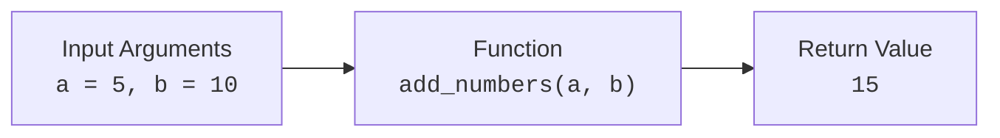
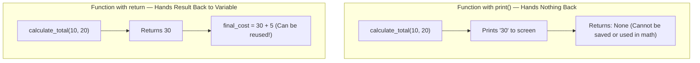
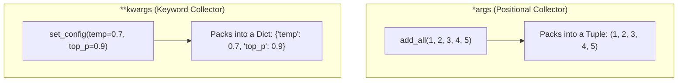
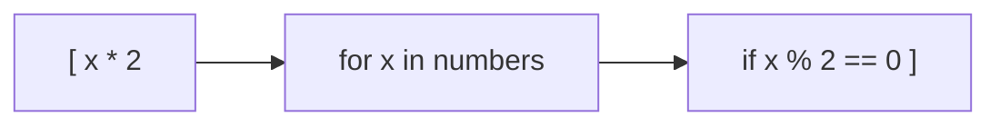

# 03 - Functions & Pythonic Code: The Complete Beginner Guide

> **Mental Model**:  
> A function is like a **kitchen blender** or a **mini-factory**.  
> You feed raw ingredients into it (**Arguments**), the blender processes them (**Function Body**), and it pours out a finished smoothie (**Return Value**).  
> In AI Engineering, functions are the building blocks for tool calls, prompt templates, API clients, and data pipelines.

---

## 📑 Table of Contents
1. [What is a Function? (Definition & Syntax)](#1-what-is-a-function-definition--syntax)
2. [print() vs. return (The Most Important Beginner Distinction)](#2-print-vs-return-the-most-important-beginner-distinction)
3. [Positional vs. Keyword Arguments](#3-positional-vs-keyword-arguments)
4. [Default Parameters (Optional Inputs)](#4-default-parameters-optional-inputs)
5. [Returning Multiple Values (Tuple Unpacking)](#5-returning-multiple-values-tuple-unpacking)
6. [Variable Arguments: *args and **kwargs](#6-variable-arguments-args-and-kwargs)
7. [First-Class Functions (Passing Functions as Arguments)](#7-first-class-functions-passing-functions-as-arguments)
8. [Lambda Functions (Anonymous One-Liners)](#8-lambda-functions-anonymous-one-liners)
9. [Essential Pythonic Helpers: map(), filter(), enumerate(), zip()](#9-essential-pythonic-helpers-map-filter-enumerate-zip)
10. [List Comprehensions (The Pythonic Superpower)](#10-list-comprehensions-the-pythonic-superpower)
11. [Summary & Quick Reference Cheat Sheet](#11-summary--quick-reference-cheat-sheet)

---

## 1. What is a Function? (Definition & Syntax)

A function is a reusable block of code that only runs when you call it.



### Basic Syntax:
```python
# 1. Defining the function
def greet(name):
    message = f"Hello, {name}!"
    return message

# 2. Calling (invoking) the function
result = greet("Manish")
print(result)  # Output: Hello, Manish!
```

* `def`: Tells Python you are defining a new function.
* `greet`: The name of the function.
* `(name)`: **Parameter** (the variable placeholder for the input).
* `return`: Sends the final result back to wherever the function was called.

---

## 2. print() vs. return (The Most Important Beginner Distinction)

Beginners often confuse `print()` and `return`. Here is the difference:



* **`print()`**: Displays text on the terminal screen for a human to see. It gives **nothing** back to your Python program (it returns `None`).
* **`return`**: Hands the computed data back to your code so you can store it in a variable, pass it into another function, or save it to a database.

```python
# ❌ WRONG: Using print when you want to compute something
def add_bad(a, b):
    print(a + b)

val = add_bad(5, 5)   # Prints 10 on screen, but val is actually None!
# val * 2  <-- 💥 Crashes with TypeError: unsupported operand type for NoneType

# ✅ RIGHT: Using return
def add_good(a, b):
    return a + b

val = add_good(5, 5)  # val is 10
total = val * 2       # total is 20
```

---

## 3. Positional vs. Keyword Arguments

When calling a function, you can pass arguments in two ways:

```python
def create_model_profile(model_name, provider, context_window):
    return f"Model: {model_name} | Provider: {provider} | Context: {context_window}"

# 1. Positional Arguments (Order matters!)
print(create_model_profile("GPT-4o", "OpenAI", 128000))

# 2. Keyword Arguments (Order does NOT matter; explicit and clear)
print(create_model_profile(
    context_window=128000,
    model_name="GPT-4o",
    provider="OpenAI"
))
```

---

## 4. Default Parameters (Optional Inputs)

You can assign **default values** to parameters. If the caller doesn't provide that input, the default is used.

```python
def format_prompt(user_query, system_prompt="You are a helpful AI assistant."):
    return f"SYSTEM: {system_prompt}\nUSER: {user_query}"

# Case 1: Using the default system prompt
print(format_prompt("What is Python?"))

# Case 2: Overriding the default system prompt
print(format_prompt("Debug this code", system_prompt="You are an expert Python debugger."))
```

> ⚠️ **Rule:** All parameters with default values **must come at the end** of the parameter list.  
> `def bad(a=10, b):` $\rightarrow$ ❌ SyntaxError  
> `def good(b, a=10):` $\rightarrow$ ✅ Valid

---

## 5. Returning Multiple Values (Tuple Unpacking)

In Python, a function can return multiple values separated by commas. Under the hood, Python packs them into a **tuple**, which you can cleanly unpack:

```python
def analyze_numbers(numbers_list):
    min_val = min(numbers_list)
    max_val = max(numbers_list)
    total = sum(numbers_list)
    return min_val, max_val, total  # Returns a tuple: (min, max, total)

# Unpacking the returned tuple directly into 3 variables:
scores = [85, 92, 78, 95, 88]
lowest, highest, overall_sum = analyze_numbers(scores)

print(f"Lowest: {lowest}, Highest: {highest}, Sum: {overall_sum}")
```

---

## 6. Variable Arguments: *args and **kwargs

What if you don't know how many arguments the user will pass?



### 1️⃣ `*args` (Collects arbitrary positional arguments into a **Tuple**)
```python
def sum_any_count(*args):
    total = 0
    for num in args:
        total += num
    return total

print(sum_any_count(1, 2))              # Output: 3
print(sum_any_count(10, 20, 30, 40))    # Output: 100
```

### 2️⃣ `**kwargs` (Collects arbitrary keyword arguments into a **Dictionary**)
```python
def print_model_config(**kwargs):
    for key, value in kwargs.items():
        print(f"• {key}: {value}")

print_model_config(model="gpt-4o", temperature=0.7, max_tokens=1500)
# Output:
# • model: gpt-4o
# • temperature: 0.7
# • max_tokens: 1500
```

---

## 7. First-Class Functions (Passing Functions as Arguments)

In Python, **functions are first-class citizens**. This means a function is just like any other object (like a string or integer):
* You can assign a function to a variable.
* You can pass a function as an argument into another function.

```python
def uppercase_formatter(text):
    return text.upper()

def exclaim_formatter(text):
    return f"{text}!!!"

# Higher-order function: accepts another function as 'transform_func'
def process_words(words_list, transform_func):
    result = []
    for word in words_list:
        result.append(transform_func(word))
    return result

items = ["ai", "python", "agent"]

print(process_words(items, uppercase_formatter))  # ['AI', 'PYTHON', 'AGENT']
print(process_words(items, exclaim_formatter))    # ['ai!!!', 'python!!!', 'agent!!!']
```

---

## 8. Lambda Functions (Anonymous One-Liners)

A **lambda** is a small, anonymous function written on a single line.

### Syntax Comparison:
```python
# Regular function:
def square(x):
    return x * x

# Lambda equivalent:
square_lambda = lambda x: x * x

print(square(5))         # 25
print(square_lambda(5))  # 25
```

> 💡 **When to use lambdas:** Use them for quick, short transformations inside `map()` or `filter()`. If the logic takes more than one simple expression, write a standard `def` function.

---

## 9. Essential Pythonic Helpers: map(), filter(), enumerate(), zip()

These 4 built-in functions make your Python code clean, readable, and professional:

### 1️⃣ `map(function, iterable)`: Transform every item
Applies a function to all items in a list.
```python
numbers = [1, 2, 3, 4, 5]
# Double every number using map and lambda
doubled = list(map(lambda x: x * 2, numbers))
print(doubled)  # [2, 4, 6, 8, 10]
```

### 2️⃣ `filter(function, iterable)`: Select items that pass a test
Keeps only elements where the function returns `True`.
```python
scores = [45, 88, 32, 91, 74, 55, 20]
# Keep only scores >= 60
passed = list(filter(lambda score: score >= 60, scores))
print(passed)  # [88, 91, 74]
```

### 3️⃣ `enumerate(iterable)`: Get Index + Item in loops
**Never write `for i in range(len(list)):` again!** Use `enumerate()` instead:
```python
models = ["GPT-4o", "Claude 3.5 Sonnet", "Llama 3 70B"]

for index, model in enumerate(models, start=1):
    print(f"{index}. {model}")

# Output:
# 1. GPT-4o
# 2. Claude 3.5 Sonnet
# 3. Llama 3 70B
```

### 4️⃣ `zip(list_a, list_b)`: Combine two parallel lists into pairs
Stitches elements from multiple lists together like a zipper:
```python
models = ["gpt-4o", "claude-3.5-sonnet", "llama-3-8b"]
costs_per_m = [5.00, 3.00, 0.20]

for model, cost in zip(models, costs_per_m):
    print(f"Model: {model:<20} | Cost: ${cost}/M tokens")
```

---

## 10. List Comprehensions (The Pythonic Superpower)

A **List Comprehension** is the most elegant, readable way in Python to create a new list from an existing list.

### 🔄 The Formula:
`[ <expression> for <item> in <iterable> if <condition> ]`



### Side-by-Side Comparison:

```python
numbers = [1, 2, 3, 4, 5, 6, 7, 8, 9, 10]

# ❌ The Traditional Way (4 lines):
even_squares_old = []
for n in numbers:
    if n % 2 == 0:
        even_squares_old.append(n * n)

# ✅ The Pythonic List Comprehension Way (1 line):
even_squares_new = [n * n for n in numbers if n % 2 == 0]

print(even_squares_new)  # [4, 16, 36, 64, 100]
```

---

## 11. Summary & Quick Reference Cheat Sheet

| Feature | Syntax Example | Purpose |
| :--- | :--- | :--- |
| **Basic Function** | `def add(a, b): return a + b` | Reusable computation block |
| **Default Arg** | `def greet(name, prefix="Hi"): ...` | Provides fallback parameter value |
| **Multiple Return** | `return min_val, max_val` | Returns a tuple of results |
| ***args** | `def func(*args): ...` | Collects any number of positional inputs as a tuple |
| ****kwargs** | `def func(**kwargs): ...` | Collects any number of keyword inputs as a dict |
| **Lambda** | `lambda x: x * 2` | Quick anonymous 1-line function |
| **enumerate()** | `for idx, val in enumerate(items):` | Clean index + element loop |
| **zip()** | `for a, b in zip(list1, list2):` | Pairs elements from two lists |
| **List Comp** | `[x * 2 for x in items if x > 0]` | Elegant, fast list transformations |

---

## 🚀 Now You're Ready to Solve `practice.py`!
Open [01-python-core/03-functions/practice.py](file:///home/user2/PythonProject/Python-for-ai-engineering/01-python-core/03-functions/practice.py) and write your solutions to the 15 questions!
