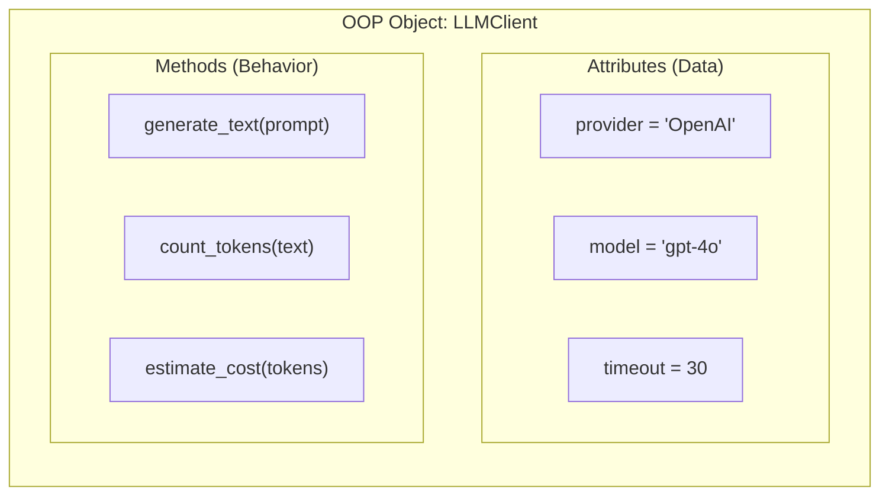
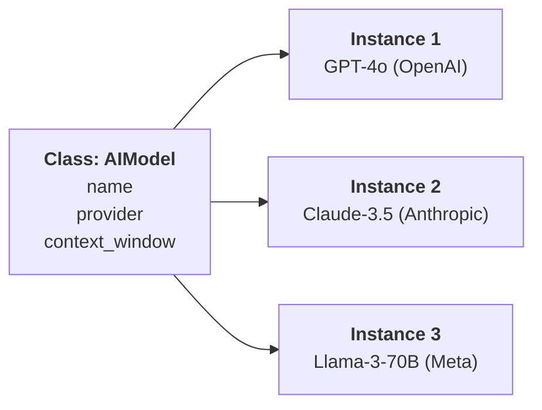
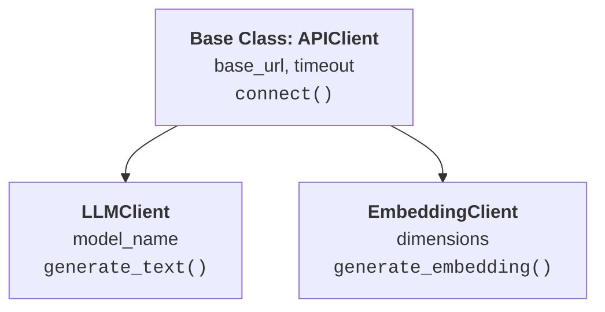
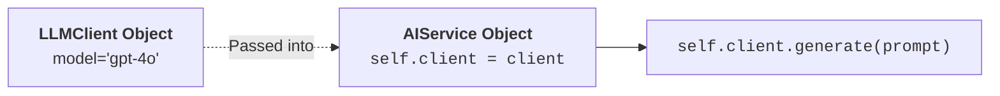

# 04 - Object-Oriented Programming (OOP) Basics for AI Engineering

> **Mental Model**:  
> A **Class** is like an architectural blueprint for a house.  
> An **Object (Instance)** is the actual physical house built using that blueprint.  
> You can build 100 different houses from a single blueprint—each house can have a different paint color or furniture (**Attributes**), but all of them share the same structure and functionality (**Methods**).

---

## 📑 Table of Contents
1. [Why OOP Matters in AI Engineering](#1-why-oop-matters-in-ai-engineering)
2. [Classes vs. Objects (The Blueprint Analogy)](#2-classes-vs-objects-the-blueprint-analogy)
3. [The __init__() Constructor and the self Keyword](#3-the-__init__-constructor-and-the-self-keyword)
4. [Instance Methods (Giving Objects Actions)](#4-instance-methods-giving-objects-actions)
5. [Creating Multiple Independent Instances](#5-creating-multiple-independent-instances)
6. [Inheritance (Parent & Child Classes)](#6-inheritance-parent--child-classes)
7. [Method Overriding (Customizing Parent Behavior)](#7-method-overriding-customizing-parent-behavior)
8. [Composition: "Has-A" vs. "Is-A" (The Production AI Pattern)](#8-composition-has-a-vs-is-a-the-production-ai-pattern)
9. [Summary & Quick Reference Cheat Sheet](#9-summary--quick-reference-cheat-sheet)

---

## 1. Why OOP Matters in AI Engineering

In modern AI systems, you are constantly managing stateful entities:
* **LLM Clients** (holding API keys, base URLs, and timeout settings).
* **RAG Documents** (holding text content, chunk IDs, and embedding vectors).
* **AI Agents** (holding memory, tool registries, and execution loops).

Object-Oriented Programming (OOP) allows you to bundle **data (attributes)** and the **actions that operate on that data (methods)** into clean, reusable units.



---

## 2. Classes vs. Objects (The Blueprint Analogy)

* **Class**: The blueprint or template. (Defines what attributes and methods every instance will have).
* **Object (Instance)**: The concrete item created from that class.



---

## 3. The `__init__()` Constructor and the `self` Keyword

When you instantiate (create) a new object, Python automatically calls the special `__init__()` method to set up the object's initial data.

```python
class AIModel:
    def __init__(self, name, provider, context_window):
        # self refers to the specific instance being created!
        self.name = name
        self.provider = provider
        self.context_window = context_window

# Creating an instance:
model_a = AIModel(name="GPT-4o", provider="OpenAI", context_window=128000)

print(model_a.name)            # Output: GPT-4o
print(model_a.provider)        # Output: OpenAI
print(model_a.context_window)  # Output: 128000
```

### 🔑 Demystifying `self`:
* `self` represents **"this specific object"**.
* When you write `self.name = name`, you are saying: *"Attach the `name` passed into this function to this specific instance."*
* Every instance method in Python must take `self` as its very first parameter so it can access its own attributes.

---

## 4. Instance Methods (Giving Objects Actions)

A **Method** is simply a function that lives inside a class. It can read and modify the object's attributes via `self`.

```python
class AIModel:
    def __init__(self, name, provider, model_type):
        self.name = name
        self.provider = provider
        self.model_type = model_type  # e.g., "Chat", "Embedding", "Vision"

    # Instance method:
    def get_description(self):
        return f"{self.name} is a {self.model_type} model developed by {self.provider}."

# Usage:
model = AIModel("Claude 3.5 Sonnet", "Anthropic", "Chat / Multimodal")
print(model.get_description())
# Output: Claude 3.5 Sonnet is a Chat / Multimodal model developed by Anthropic.
```

---

## 5. Creating Multiple Independent Instances

You can create as many objects as you need from a single class. Each object maintains its own independent memory and attribute values:

```python
class LLMClient:
    def __init__(self, provider, model_name):
        self.provider = provider
        self.model_name = model_name

    def generate(self, prompt):
        return f"[{self.provider} - {self.model_name}] Response to: '{prompt}'"

# Creating multiple clients:
openai_client = LLMClient("OpenAI", "gpt-4o")
anthropic_client = LLMClient("Anthropic", "claude-3-5-sonnet")

print(openai_client.generate("Explain Python"))
# Output: [OpenAI - gpt-4o] Response to: 'Explain Python'

print(anthropic_client.generate("Explain Python"))
# Output: [Anthropic - claude-3-5-sonnet] Response to: 'Explain Python'
```

---

## 6. Inheritance (Parent & Child Classes)

**Inheritance** allows a child class to automatically inherit all attributes and methods from a parent (base) class, while adding its own specialized behavior.



### Syntax and `super().__init__()`:
```python
# 1. Base (Parent) Class
class APIClient:
    def __init__(self, base_url, timeout=30):
        self.base_url = base_url
        self.timeout = timeout

    def test_connection(self):
        return f"Connected to {self.base_url} (Timeout: {self.timeout}s)"

# 2. Derived (Child) Class
class LLMClient(APIClient):
    def __init__(self, base_url, model_name, timeout=30):
        # super() calls the parent class's __init__ method!
        super().__init__(base_url, timeout)
        self.model_name = model_name

    def send_prompt(self, prompt):
        return f"Sending '{prompt}' to model {self.model_name} at {self.base_url}"

# Usage:
client = LLMClient(base_url="https://api.openai.com/v1", model_name="gpt-4o")
print(client.test_connection())  # Inherited from parent APIClient!
print(client.send_prompt("Hello"))  # Defined on child LLMClient!
```

---

## 7. Method Overriding (Customizing Parent Behavior)

If a child class defines a method with the **exact same name** as a method in its parent class, the child's version **overrides** (replaces) the parent's version:

```python
class Notification:
    def send(self, message):
        print(f"[Standard Alert]: {message}")

class EmailNotification(Notification):
    def send(self, message):
        # Overriding parent method with specialized email logic
        print(f"[Sending Email via SMTP]: {message}")

# Testing Polymorphic Behavior:
alerts = [Notification(), EmailNotification()]

for alert in alerts:
    alert.send("System maintenance in 10 minutes.")

# Output:
# [Standard Alert]: System maintenance in 10 minutes.
# [Sending Email via SMTP]: System maintenance in 10 minutes.
```

---

## 8. Composition: "Has-A" vs. "Is-A" (The Production AI Pattern)

There are two primary ways classes relate to each other:

| Relationship | Name | Meaning | Example in AI |
| :--- | :--- | :--- | :--- |
| **"Is-A"** | **Inheritance** | A child class is a specialized type of parent class. | `VectorDocument` **is a** `RAGDocument` (extended with embedding). |
| **"Has-A"** | **Composition** | A class contains an instance of another class as an attribute. | `AIService` **has an** `LLMClient` to generate responses. |

### 🛠️ Real-World AI Architecture Example (Composition):



```python
class LLMClient:
    def __init__(self, provider, model):
        self.provider = provider
        self.model = model

    def complete(self, prompt):
        return f"[{self.model}] Answer to: {prompt}"

class AIService:
    def __init__(self, client):
        # Composition: AIService HAS AN LLMClient!
        self.client = client

    def answer_customer_query(self, query):
        formatted_prompt = f"Customer Query: {query}"
        # Delegates generation to the client instance
        return self.client.complete(formatted_prompt)

# Setting up the architecture:
gpt_client = LLMClient("OpenAI", "gpt-4o")
service = AIService(client=gpt_client)

print(service.answer_customer_query("Where is my order?"))
# Output: [gpt-4o] Answer to: Customer Query: Where is my order?
```

> 💡 **Why Composition is King in AI Engineering:**  
> If tomorrow you want to switch from OpenAI to Anthropic or a local model, you simply pass a different client into `AIService` without changing a single line of your service code!

---

## 9. Summary & Quick Reference Cheat Sheet

| Concept | Python Code Pattern | What It Does |
| :--- | :--- | :--- |
| **Class Definition** | `class Person: ...` | Creates the blueprint template |
| **Constructor** | `def __init__(self, name): self.name = name` | Initializes new object attributes |
| **Instance Method** | `def speak(self): return f"I am {self.name}"` | Action available to every instance |
| **Inheritance** | `class VectorDoc(RAGDoc): ...` | Inherits all parent fields & methods |
| **Parent Constructor** | `super().__init__(args)` | Calls the parent's `__init__` |
| **Method Override** | Child defines method with same name as parent | Replaces parent's default behavior |
| **Composition** | `class Service: def __init__(self, client): self.client = client` | Attaches one object inside another |

---

## 🚀 Ready to Practice!
Open [01-python-core/04-oop-basics/practice.py](file:///home/user2/PythonProject/Python-for-ai-engineering/01-python-core/04-oop-basics/practice.py) and start building your OOP solutions!
