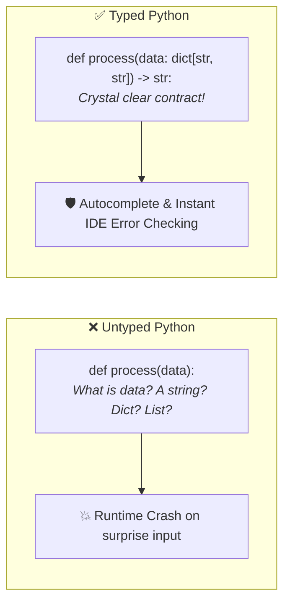
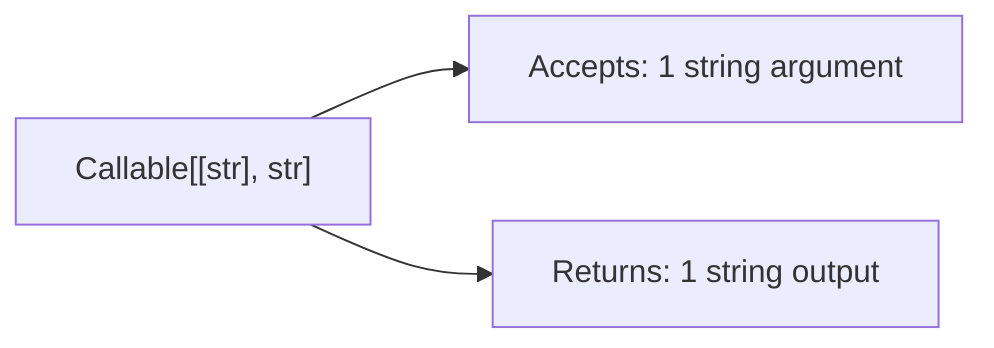

# 05 - Type Hints for AI Engineering: The Complete Beginner Guide

> **Mental Model**:  
> Think of Type Hints like **shipping labels on warehouse packages**.  
> Without a label, a worker doesn't know whether a box contains fragile glass or heavy metal until it's too late.  
> Type Hints clearly label what data goes into a function and what comes out, allowing your IDE (VS Code / PyCharm) and linters to catch bugs **before your code ever runs**.

---

## 📑 Table of Contents
1. [Why Type Hints are Essential in AI Engineering](#1-why-type-hints-are-essential-in-ai-engineering)
2. [Basic Type Annotations (Variables & Functions)](#2-basic-type-annotations-variables--functions)
3. [Collection Types: list, dict, set, tuple](#3-collection-types-list-dict-set-tuple)
4. [Optional & Union Types (Handling None & Multiple Types)](#4-optional--union-types-handling-none--multiple-types)
5. [Type Aliases (Simplifying Complex Types)](#5-type-aliases-simplifying-complex-types)
6. [TypedDict: Structuring LLM JSON Dictionaries](#6-typeddict-structuring-llm-json-dictionaries)
7. [Callable: Typing Functions Passed as Arguments](#7-callable-typing-functions-passed-as-arguments)
8. [Literal: Enforcing Exact Allowed Values](#8-literal-enforcing-exact-allowed-values)
9. [Typing Classes & AI Pipelines (RAG & LLM Clients)](#9-typing-classes--ai-pipelines-rag--llm-clients)
10. [Summary & Type Hints Cheat Sheet](#10-summary--type-hints-cheat-sheet)

---

## 1. Why Type Hints are Essential in AI Engineering

Python is a **dynamically typed** language. This means you *can* write code without specifying types, but in AI Engineering, you are constantly passing around:
* Nested JSON payloads from LLMs
* Embedding vector arrays
* Multi-field model configurations
* Token counters and pricing floats

Without type hints, one small typo (`response["content"]` vs `response["choices"]`) will crash your production service in the middle of a customer chat.



> 💡 **Important Fact:** Type hints do **NOT** slow down your code at runtime. Python ignores them when executing; they exist purely for you, your IDE, and static analysis tools!

---

## 2. Basic Type Annotations (Variables & Functions)

### 1️⃣ Primitive Types:
* `int`: Whole numbers (`10`, `-3`)
* `float`: Decimal numbers (`3.14`, `0.002`)
* `str`: Text strings (`"gpt-4o"`)
* `bool`: Boolean flags (`True`, `False`)

### 2️⃣ Annotating Functions:
Use a colon `:` for parameter types and an arrow `->` for the return type:

```python
# Function accepting two integers and returning an integer:
def add_token_counts(prompt_tokens: int, output_tokens: int) -> int:
    return prompt_tokens + output_tokens

# Function accepting a string and returning a formatted string:
def create_greeting(user_name: str) -> str:
    return f"Hello, {user_name}! Welcome to the AI Platform."
```

---

## 3. Collection Types: list, dict, set, tuple

In modern Python (3.9+), you can type generic collections directly:

### 1️⃣ Lists (`list[type]`):
```python
# A list containing only integers:
def double_numbers(numbers: list[int]) -> list[int]:
    return [n * 2 for n in numbers]

# A list containing only floats:
def calculate_average(latencies: list[float]) -> float:
    return sum(latencies) / len(latencies)
```

### 2️⃣ Dictionaries (`dict[key_type, value_type]`):
```python
# A dictionary where keys are strings and values are strings:
def extract_model_provider(model_metadata: dict[str, str]) -> str:
    return model_metadata.get("provider", "unknown")

# A dictionary mapping model name to cost (float):
pricing_table: dict[str, float] = {
    "gpt-4o": 5.00,
    "claude-3-5-sonnet": 3.00,
    "llama-3-8b": 0.20
}
```

### 3️⃣ Sets & Tuples:
```python
# A set of unique tags (strings):
active_tags: set[str] = {"llm", "rag", "agent"}

# A tuple with exact fixed types (name: str, context: int, cost: float):
model_record: tuple[str, int, float] = ("gpt-4o", 128000, 5.00)
```

---

## 4. Optional & Union Types (Handling None & Multiple Types)

### 1️⃣ Union Types (`TypeA | TypeB`):
When a parameter can accept more than one type:

```python
# Input can be a string ID or an integer ID:
def fetch_document(doc_id: str | int) -> str:
    if isinstance(doc_id, int):
        return f"Fetching doc from index #{doc_id}"
    return f"Fetching doc with key '{doc_id}'"
```

### 2️⃣ Optional Types (`Type | None`):
When a parameter is optional and defaults to `None`:

```python
def generate_response(prompt: str, system_prompt: str | None = None) -> str:
    if system_prompt is None:
        system_prompt = "You are a helpful assistant."
    return f"[{system_prompt}] Processing: {prompt}"
```

---

## 5. Type Aliases (Simplifying Complex Types)

When a type annotation becomes long and repetitive, give it a clean, human-readable alias:

```python
# Create a descriptive type alias:
LLMConfig = dict[str, str | int | float | bool]

def configure_agent(config: LLMConfig) -> str:
    model = config.get("model", "gpt-4o")
    temp = config.get("temperature", 0.7)
    return f"Agent initialized with model={model}, temp={temp}"
```

---

## 6. TypedDict: Structuring LLM JSON Dictionaries

A standard `dict[str, Any]` is too loose—it doesn't tell your code which specific keys exist inside the dictionary.  
**`TypedDict`** allows you to define strict key names and value types for dictionaries (ideal for LLM API responses!):

```python
from typing import TypedDict

# Define the exact dictionary shape:
class LLMResponse(TypedDict):
    model: str
    content: str
    tokens_used: int
    finish_reason: str

# Typed dictionary instance:
response_payload: LLMResponse = {
    "model": "gpt-4o",
    "content": "Retrieval Augmented Generation enhances LLMs with fresh data.",
    "tokens_used": 42,
    "finish_reason": "stop"
}

# A function that specifically expects this dictionary structure:
def get_response_text(response: LLMResponse) -> str:
    # IDE will provide autocomplete for 'content', 'model', etc.!
    return response["content"]

print(get_response_text(response_payload))
```

---

## 7. Callable: Typing Functions Passed as Arguments

When you pass a function into another function, use `Callable[[InputTypes], ReturnType]`:



```python
from typing import Callable

# transform_func is a function that takes a 'str' and returns a 'str'
def process_queries(
    queries: list[str], 
    transform_func: Callable[[str], str]
) -> list[str]:
    return [transform_func(q) for q in queries]

# Example usage:
clean_text = lambda s: s.strip().lower()
raw_inputs = ["  WHAT IS RAG?  ", "  Explain Agents  "]

print(process_queries(raw_inputs, clean_text))
# Output: ['what is rag?', 'explain agents']
```

---

## 8. Literal: Enforcing Exact Allowed Values

`Literal` restricts a parameter to a specific set of exact string or integer values:

```python
from typing import Literal

# The role parameter can ONLY be one of these 3 exact strings:
MessageRole = Literal["system", "user", "assistant"]

def create_message(role: MessageRole, content: str) -> dict[str, str]:
    return {"role": role, "content": content}

# ✅ Valid calls:
create_message("user", "Hello!")
create_message("system", "You are an assistant.")

# ❌ Invalid call (IDE will highlight as an error before running!):
# create_message("admin", "Reset system")
```

---

## 9. Typing Classes & AI Pipelines (RAG & LLM Clients)

Here is how all these typing patterns come together in a production-style RAG pipeline:

```python
from typing import TypedDict, Literal

class Document(TypedDict):
    id: str
    text: str
    source: str

class RAGPipeline:
    def __init__(self, model_name: str, max_docs: int = 3):
        self.model_name: str = model_name
        self.max_docs: int = max_docs

    def retrieve(self, query: str) -> list[Document]:
        # Simulated retrieval
        return [
            {"id": "doc-1", "text": "RAG connects LLMs to external knowledge.", "source": "wiki"}
        ]

    def generate_answer(
        self, 
        query: str, 
        documents: list[Document], 
        tone: Literal["concise", "detailed"] = "concise"
    ) -> str:
        context = " ".join([d["text"] for d in documents])
        return f"[{self.model_name} - {tone}] Context: {context} | Query: {query}"

# Execution:
rag = RAGPipeline(model_name="gpt-4o", max_docs=2)
docs = rag.retrieve("What is RAG?")
answer = rag.generate_answer(query="What is RAG?", documents=docs, tone="concise")
print(answer)
```

---

## 10. Summary & Type Hints Cheat Sheet

| Use Case | Type Hint Syntax | Example |
| :--- | :--- | :--- |
| **Primitives** | `int`, `float`, `str`, `bool` | `age: int = 21` |
| **Function Return** | `def f(...) -> ReturnType:` | `def get_name() -> str:` |
| **List of Items** | `list[ItemType]` | `scores: list[float]` |
| **Key-Value Map** | `dict[KeyType, ValType]` | `costs: dict[str, float]` |
| **Either/Or** | `TypeA | TypeB` | `doc_id: str | int` |
| **Optional / Nullable** | `Type | None` | `prompt: str | None = None` |
| **Structured Dict** | `class Model(TypedDict): ...` | `response: LLMResponse` |
| **Function as Arg** | `Callable[[InputTypes], OutputType]` | `fn: Callable[[str], int]` |
| **Exact Choices** | `Literal["choice1", "choice2"]` | `role: Literal["user", "system"]` |

---

## 🚀 Now You're Ready to Solve `practice.py`!
Open [01-python-core/05-type-hints/practice.py](file:///home/user2/PythonProject/Python-for-ai-engineering/01-python-core/05-type-hints/practice.py) and add type hints to all 15 questions!
