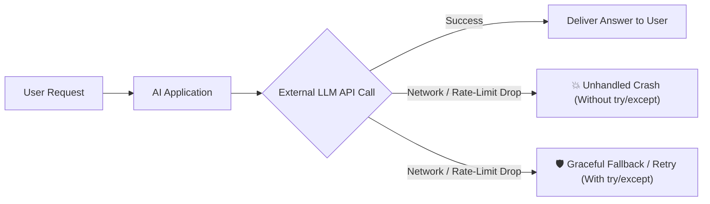
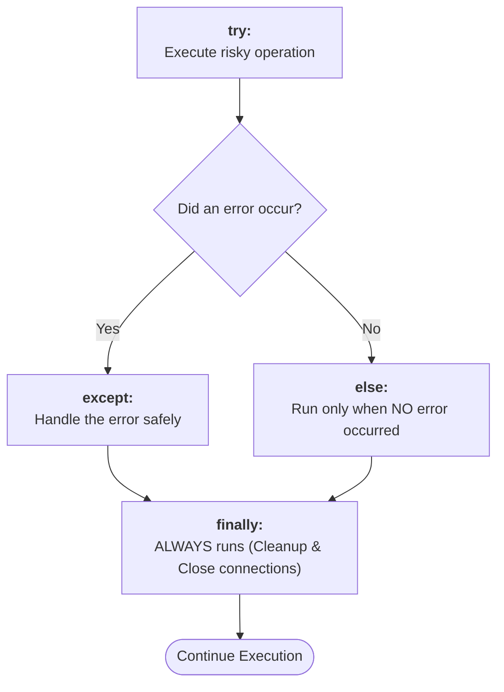
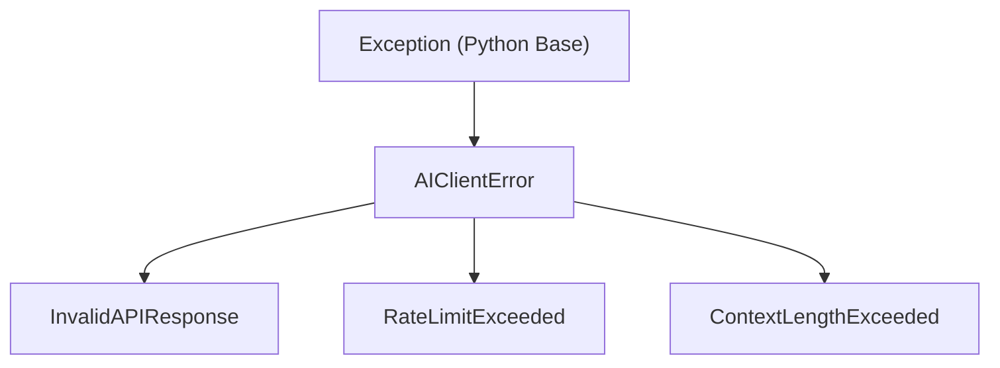

# 06 - Error Handling & Exception Resilience for AI Engineering

> **Mental Model**:  
> Think of Error Handling like the **airbags and safety fuses in an electric car**.  
> When an unexpected short-circuit happens, the fuse blows safely instead of catching the entire car on fire.  
> In AI Engineering, external APIs (OpenAI, Anthropic, Vector DBs, database connections) **will fail constantly** due to network drops, rate limits, timeouts, or malformed JSON.  
> Exception handling ensures your AI system recovers gracefully rather than crashing.

---

## 📑 Table of Contents
1. [Why Error Handling is Mission-Critical in AI](#1-why-error-handling-is-mission-critical-in-ai)
2. [The Core try / except Pattern](#2-the-core-try--except-pattern)
3. [The 5 Most Common Python Built-In Exceptions](#3-the-5-most-common-python-built-in-exceptions)
4. [The Complete Lifecycle: try, except, else, finally](#4-the-complete-lifecycle-try-except-else-finally)
5. [Catching Multiple Specific Exceptions](#5-catching-multiple-specific-exceptions)
6. [Raising Exceptions with raise](#6-raising-exceptions-with-raise)
7. [Creating Custom Exceptions for AI Systems](#7-creating-custom-exceptions-for-ai-systems)
8. [Safely Handling LLM JSON Parsing Errors](#8-safely-handling-llm-json-parsing-errors)
9. [Production Pattern: The Resilient AI Client Wrapper](#9-production-pattern-the-resilient-ai-client-wrapper)
10. [Summary & Quick Reference Cheat Sheet](#10-summary--quick-reference-cheat-sheet)

---

## 1. Why Error Handling is Mission-Critical in AI

Traditional software usually fails because of bugs in your own code. But in **AI Engineering**, 90% of failures happen outside your code:
* The LLM provider returns a **`429 Rate Limit`** (out of quota).
* The network connection times out after 10 seconds.
* The LLM generates invalid JSON instead of the schema you requested.
* The user passes an empty prompt or a prompt that exceeds the context window.



---

## 2. The Core try / except Pattern

The `try` block lets you test a block of code for errors. The `except` block lets you handle the error if one occurs:

```python
# Unsafe (Will crash if input is not a number):
# user_input = int("not_a_number")  # 💥 ValueError!

# Safe:
try:
    user_input = int("not_a_number")
    print(f"Parsed number: {user_input}")
except ValueError as e:
    print(f"⚠️ Failed to parse integer: {e}. Defaulting to 0.")
    user_input = 0

print(f"Program continues safely with user_input = {user_input}")
```

---

## 3. The 5 Most Common Python Built-In Exceptions

| Exception | When it Happens | Example |
| :--- | :--- | :--- |
| **`ValueError`** | Right type, but invalid value | `int("hello")` or `math.sqrt(-1)` |
| **`ZeroDivisionError`** | Dividing any number by 0 | `100 / 0` |
| **`IndexError`** | Accessing a non-existent list index | `items = [1, 2]; items[99]` |
| **`KeyError`** | Accessing a non-existent dictionary key | `data = {"a": 1}; data["b"]` |
| **`TypeError`** | Operation applied to incompatible types | `"abc" + 10` or `None + 5` |

---

## 4. The Complete Lifecycle: try, except, else, finally

Python provides 4 interconnected blocks for complete exception lifecycle control:



### Code Example:
```python
def safe_divide(a: float, b: float) -> float | None:
    result = None
    try:
        print("1. Attempting division...")
        result = a / b
    except ZeroDivisionError:
        print("2. ⚠️ Error: Cannot divide by zero!")
    else:
        print("2. ✅ Success: Division executed smoothly.")
    finally:
        print("3. 🔄 Cleanup: This block runs every single time.")
    return result

# Case 1: Successful run
safe_divide(10, 2)

# Case 2: Handled error run
safe_divide(10, 0)
```

---

## 5. Catching Multiple Specific Exceptions

In production AI services, **never write a blank `except:`**. Always catch specific errors so you can respond with the right recovery strategy:

```python
def retrieve_model_metric(metrics_list: list[dict], index: int, metric_key: str):
    try:
        model_dict = metrics_list[index]        # May raise IndexError
        metric_value = model_dict[metric_key]   # May raise KeyError
        return metric_value
    except IndexError:
        print(f"⚠️ Index {index} out of range! Model does not exist.")
        return None
    except KeyError:
        print(f"⚠️ Metric key '{metric_key}' not found in record.")
        return None
    except Exception as e:
        # Fallback for unexpected bugs
        print(f"⚠️ Unexpected system error: {e}")
        return None
```

---

## 6. Raising Exceptions with `raise`

Sometimes you want your code to **deliberately stop** and signal an error when invalid parameters or unsafe data are detected:

```python
def configure_temperature(temp: float) -> float:
    # Temperature in LLMs must be between 0.0 and 2.0
    if temp < 0.0 or temp > 2.0:
        raise ValueError(f"Invalid temperature: {temp}. Must be between 0.0 and 2.0!")
    return temp

# Testing valid vs invalid:
try:
    configure_temperature(0.7)   # ✅ Valid
    configure_temperature(-0.5)  # 💥 Raises ValueError
except ValueError as e:
    print(f"Configuration rejected: {e}")
```

---

## 7. Creating Custom Exceptions for AI Systems

By subclassing Python's base `Exception` class, you create clear, domain-specific error names that make debugging AI systems simple:



```python
# Define custom domain exceptions:
class AIClientError(Exception):
    """Base exception for all AI client failures."""
    pass

class InvalidAPIResponse(AIClientError):
    """Raised when the LLM returns an unparseable or empty response."""
    pass

class TimeoutError(AIClientError):
    """Raised when the API request exceeds the deadline."""
    pass

# Using custom exceptions:
def parse_llm_response(payload: dict) -> str:
    if "choices" not in payload or not payload["choices"]:
        raise InvalidAPIResponse("API payload is missing 'choices' array!")
    return payload["choices"][0]["message"]["content"]
```

---

## 8. Safely Handling LLM JSON Parsing Errors

LLMs often output markdown-wrapped JSON or malformed brackets. Using `json.loads` inside a `try/except json.JSONDecodeError` is essential:

```python
import json

def safe_parse_json(raw_llm_output: str) -> dict:
    try:
        # Attempt to parse raw text into dictionary
        parsed_data = json.loads(raw_llm_output)
        return parsed_data
    except json.JSONDecodeError as e:
        print(f"⚠️ Malformed JSON generated by LLM: {e}")
        # Return a safe fallback dictionary
        return {"error": "invalid_json_generated", "raw": raw_llm_output}

# Test with invalid JSON:
broken_json = '{"model": "gpt-4o", "response": "Hello World'  # Missing closing quote & bracket
print(safe_parse_json(broken_json))
```

---

## 9. Production Pattern: The Resilient AI Client Wrapper

Here is how a real-world AI service catches distinct exceptions and handles each with an appropriate fallback:

```python
import random

class SimulatedLLMService:
    def call_api(self, prompt: str) -> str:
        scenario = random.choice(["success", "timeout", "bad_response", "crash"])
        
        if scenario == "timeout":
            raise TimeoutError("Request timed out after 10000ms.")
        elif scenario == "bad_response":
            raise InvalidAPIResponse("Model returned empty body.")
        elif scenario == "crash":
            raise ConnectionResetError("Server disconnected unexpectedly.")
        
        return f"AI Response to: '{prompt}'"

# Resilient Caller:
service = SimulatedLLMService()

for attempt in range(1, 4):
    print(f"\n--- Attempt #{attempt} ---")
    try:
        response = service.call_api("Summarize this document")
        print(f"✅ Success: {response}")
    except TimeoutError as te:
        print(f"⏳ Timeout: {te} -> Switching to fallback fast model...")
    except InvalidAPIResponse as ie:
        print(f"⚠️ Bad Payload: {ie} -> Re-prompting model with stricter schema...")
    except Exception as general_err:
        print(f"🚨 Critical Failure: {general_err} -> Logged to telemetry.")
```

---

## 10. Summary & Quick Reference Cheat Sheet

| Syntax | Description |
| :--- | :--- |
| `try:` | Wraps code that might raise an error. |
| `except SomeError as e:` | Catches and handles a specific error type safely. |
| `else:` | Runs only if the `try` block succeeded without any errors. |
| `finally:` | Runs unconditionally after everything else (used for cleanup). |
| `raise ValueError("msg")` | Manually triggers an error when rules are violated. |
| `class MyError(Exception): pass` | Creates a custom domain-specific exception. |
| `except (ErrorA, ErrorB):` | Catches multiple error types in a single block. |

---

## 🚀 Now You're Ready to Solve `practice.py`!
Open [01-python-core/06-error-handling/practice.py](file:///home/user2/PythonProject/Python-for-ai-engineering/01-python-core/06-error-handling/practice.py) and build your resilient exception handlers!
