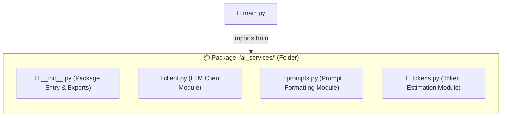
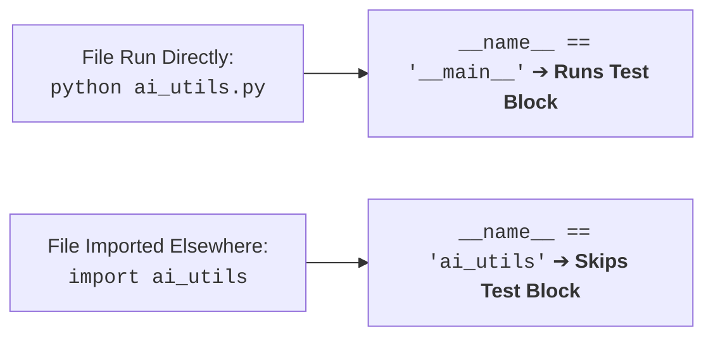
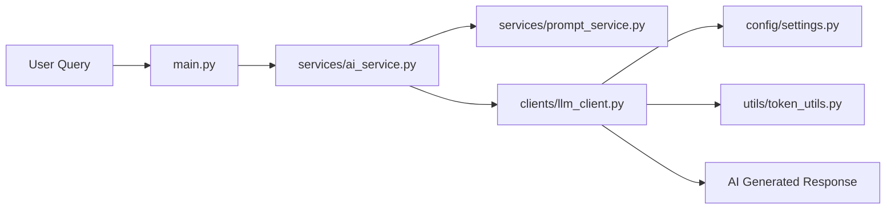
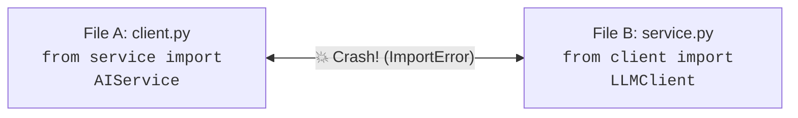

# 07 - Modules & Packages: Organizing Production AI Codebases

> **Mental Model**:  
> If Python code is like building with LEGO blocks:  
> * A **Function** is a single LEGO brick.  
> * A **Module** (`.py` file) is a specialized kit (e.g., "The Wheels & Axles Kit").  
> * A **Package** (folder with `__init__.py`) is the entire LEGO box organizing multiple kits together (e.g., "The Space Station Set").  
> Modular architecture separates API clients, prompt templates, configuration, and business logic into clean, maintainable files.

---

## 📑 Table of Contents
1. [Module vs. Package (The Core Distinction)](#1-module-vs-package-the-core-distinction)
2. [The 4 Ways to Import Code in Python](#2-the-4-ways-to-import-code-in-python)
3. [The if __name__ == "__main__" Guard](#3-the-if-__name__-==-__main__-guard)
4. [Building a Python Package (__init__.py)](#4-building-a-python-package-__init__py)
5. [Absolute vs. Relative Imports](#5-absolute-vs-relative-imports)
6. [Standard Architecture for an AI Application](#6-standard-architecture-for-an-ai-application)
7. [Avoiding Circular Imports (The Common Trap)](#7-avoiding-circular-imports-the-common-trap)
8. [Summary & Quick Reference Cheat Sheet](#8-summary--quick-reference-cheat-sheet)

---

## 1. Module vs. Package (The Core Distinction)

In Python:
* **Module**: Any single Python file ending in `.py` (e.g., `ai_utils.py`, `config.py`).
* **Package**: Any folder that contains one or more modules plus a special `__init__.py` file.



---

## 2. The 4 Ways to Import Code in Python

Suppose you have a module named `math_utils.py`:
```python
# math_utils.py
def add(a: int, b: int) -> int:
    return a + b

def multiply(a: int, b: int) -> int:
    return a * b
```

Here is how you can import and use it in `main.py`:

| Syntax | Example | When to Use |
| :--- | :--- | :--- |
| **1. Full Module Import** | `import math_utils`<br>`math_utils.add(2, 3)` | Keeps the origin clear; prevents name collisions. |
| **2. Specific Member Import** | `from math_utils import add, multiply`<br>`add(2, 3)` | Cleanest when using a few specific functions repeatedly. |
| **3. Aliased Import** | `import math_utils as mu`<br>`mu.add(2, 3)` | Great for shortening long module names (e.g. `import numpy as np`). |
| **4. Wildcard Import (Anti-Pattern)** | `from math_utils import *`<br>❌ *Avoid in production!* | **Don't use!** Pollutes namespace and hides where functions come from. |

---

## 3. The `if __name__ == "__main__":` Guard

When Python imports a file, it **executes every line of code at the top level of that file**.

To prevent test code or print statements from running during an import, wrap them in the `if __name__ == "__main__":` block:



```python
# ai_utils.py
def format_prompt(query: str, system_prompt: str) -> str:
    return f"SYSTEM: {system_prompt}\nUSER: {query}"

# This block ONLY runs when you execute 'python ai_utils.py' directly.
# When someone writes 'import ai_utils', this block is completely skipped!
if __name__ == "__main__":
    print("Running local module self-test...")
    test_res = format_prompt("Hello", "You are an assistant")
    print(f"Test output:\n{test_res}")
```

---

## 4. Building a Python Package (`__init__.py`)

A folder becomes a Python package when you add an `__init__.py` file inside it.

### The Role of `__init__.py`:
1. **Marks the directory**: Tells Python to treat the directory as an importable package.
2. **Defines Public API**: You can expose clean exports so users don't have to import deep file paths.

```text
my_toolkit/
├── __init__.py
├── string_tools.py
└── math_tools.py
```

```python
# my_toolkit/__init__.py
from .string_tools import clean_whitespace, truncate_text
from .math_tools import calculate_cost

# Now callers can simply do:
# from my_toolkit import clean_whitespace, calculate_cost
```

---

## 5. Absolute vs. Relative Imports

* **Absolute Import**: Imports from the root directory of your project down. (Recommended for production!).
* **Relative Import**: Uses dots `.` to import relative to the current file's directory.

```python
# In my_app/services/ai_service.py:

# Absolute import (Explicit & Clear):
from my_app.config.settings import DEFAULT_MODEL

# Relative import (. = current folder, .. = parent folder):
from .prompt_builder import format_template
from ..config.settings import DEFAULT_MODEL
```

---

## 6. Standard Architecture for an AI Application

In production AI engineering, follow this clean separation of concerns:

```text
ai_assistant_app/
│
├── config/
│   ├── __init__.py
│   └── settings.py          # API keys, model names, temperature, timeout configs
│
├── clients/
│   ├── __init__.py
│   └── llm_client.py        # Low-level network wrapper for OpenAI / Anthropic
│
├── services/
│   ├── __init__.py
│   ├── prompt_service.py    # Template construction & formatting
│   └── ai_service.py        # High-level business logic orchestrating client + prompts
│
├── utils/
│   ├── __init__.py
│   └── token_utils.py       # Token counters and cost calculation helpers
│
└── main.py                  # Application entry point
```

### 🔄 How Data Flows Through the Modules:



---

## 7. Avoiding Circular Imports (The Common Trap)

A **Circular Import** happens when File A imports File B, but File B also imports File A.



### 💡 How to Fix Circular Imports:
1. **Create a separate `types.py` or `models.py`**: Put shared classes and data structures in a neutral third file that both files can import.
2. **Move the import inside the function**: If an import is only needed in one specific method, import it locally inside the method rather than at the top of the file.

---

## 8. Summary & Quick Reference Cheat Sheet

| Task | Code Pattern |
| :--- | :--- |
| **Import whole module** | `import config` |
| **Import specific function** | `from utils.tokens import count_tokens` |
| **Import with alias** | `import prompt_templates as pt` |
| **Protect script tests** | `if __name__ == "__main__":` |
| **Define a package** | Add an `__init__.py` file inside the directory |
| **Package root export** | `from .client import LLMClient` inside `__init__.py` |

---

## 🚀 Now You're Ready to Solve `practice.py`!
Open [01-python-core/07-modules-packages/practice.py](file:///home/user2/PythonProject/Python-for-ai-engineering/01-python-core/07-modules-packages/practice.py) and build modular, multi-file Python solutions!
