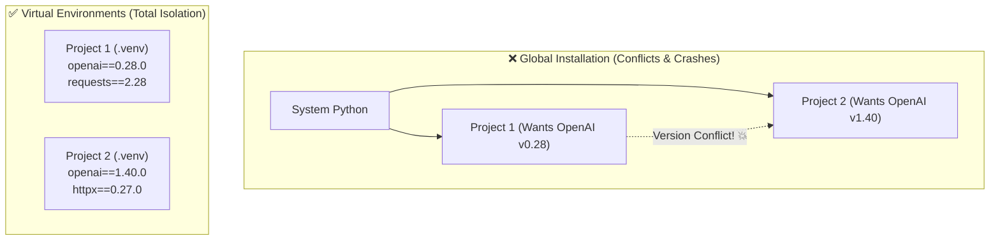
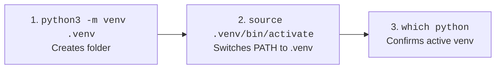
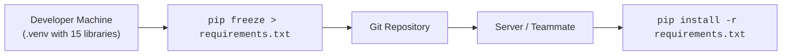

# 08 - Virtual Environments & Package Management: Isolation & Reproducibility

> **Mental Model**:  
> Think of a Virtual Environment like **renting separate furnished apartments for different tenants**.  
> If Tenant A wants modern decor and Tenant B wants vintage furniture, they don't fight over the same living room.  
> Each Python project gets its own private room (`.venv`) with its own specific library versions, completely isolated from other projects and your computer's operating system.

---

## 📑 Table of Contents
1. [The "Dependency Hell" Problem](#1-the-dependency-hell-problem)
2. [How a Virtual Environment Works Internally](#2-how-a-virtual-environment-works-internally)
3. [Step-by-Step: Creating & Activating a Virtual Environment](#3-step-by-step-creating--activating-a-virtual-environment)
4. [Managing Packages with pip](#4-managing-packages-with-pip)
5. [Freezing & Replicating Environments (requirements.txt)](#5-freezing--replicating-environments-requirementstxt)
6. [Why .venv Belongs in .gitignore](#6-why-venv-belongs-in-gitignore)
7. [Setting Up a Production AI Engineering Stack](#7-setting-up-a-production-ai-engineering-stack)
8. [CLI Commands Quick Reference Cheat Sheet](#8-cli-commands-quick-reference-cheat-sheet)

---

## 1. The "Dependency Hell" Problem

Imagine you have two AI projects on your machine:
* **Project 1 (Legacy App)**: Requires `openai==0.28.0` (old legacy API syntax).
* **Project 2 (Modern App)**: Requires `openai==1.40.0` (new SDK syntax).

If you install packages globally without a virtual environment, updating the library for Project 2 **will instantly break Project 1!**



---

## 2. How a Virtual Environment Works Internally

When you run `python -m venv .venv`, Python creates a self-contained directory:

```text
my_ai_project/
├── .venv/
│   ├── bin/ (or Scripts/ on Windows)   # Private copies of python & pip
│   │   ├── python
│   │   ├── pip
│   │   └── activate
│   ├── lib/python3.12/site-packages/   # Where all your pip libraries are stored
│   └── pyvenv.cfg                      # Config file pointing to base Python
│
├── main.py
└── requirements.txt
```

---

## 3. Step-by-Step: Creating & Activating a Virtual Environment



### 1️⃣ Create the Environment:
```bash
python3 -m venv .venv
```

### 2️⃣ Activate the Environment:
* **Linux / macOS**:
  ```bash
  source .venv/bin/activate
  ```
* **Windows (PowerShell)**:
  ```powershell
  .venv\Scripts\Activate.ps1
  ```
* **Windows (Command Prompt)**:
  ```cmd
  .venv\Scripts\activate.bat
  ```

*(Your terminal prompt will now show `(.venv)` at the beginning of the line!)*

### 3️⃣ Verify Which Python is Active:
```bash
# On Linux/macOS:
which python
# Output: /home/user/my_project/.venv/bin/python

# On Windows:
where python
# Output: C:\my_project\.venv\Scripts\python.exe
```

### 4️⃣ Deactivate When Done:
```bash
deactivate
```

---

## 4. Managing Packages with `pip`

`pip` is Python's package manager. It downloads pre-built packages from **PyPI (Python Package Index)**.

```bash
# Install a package:
pip install httpx

# Install an exact version:
pip install pydantic==2.8.2

# Install with minimum version constraint:
pip install fastapi>=0.110.0

# Upgrade an existing package:
pip install --upgrade httpx

# Uninstall a package:
pip uninstall -y requests

# Inspect all installed packages in the current venv:
pip list

# View detailed package metadata (author, location, dependencies):
pip show pydantic
```

---

## 5. Freezing & Replicating Environments (`requirements.txt`)

When sharing your project with teammates or deploying to the cloud (AWS, Docker, Render), you need a way to reproduce the exact same environment.



### 1️⃣ Save Current Dependencies:
```bash
pip freeze > requirements.txt
```
*(Creates a file listing exact versions, e.g., `httpx==0.27.0`, `pydantic==2.8.2`)*

### 2️⃣ Recreate Environment on Another Machine:
```bash
python3 -m venv .venv
source .venv/bin/activate
pip install -r requirements.txt
```

---

## 6. Why `.venv` Belongs in `.gitignore`

> ⚠️ **Golden Rule:** **NEVER commit the `.venv` folder to Git!**

### Why?
1. **It is huge**: A virtual environment contains hundreds of megabytes of binary files.
2. **It is not portable**: Binaries compiled for Linux will crash on Windows or macOS.
3. **It is redundant**: Anyone can regenerate the exact environment in 5 seconds using `requirements.txt`.

Ensure your `.gitignore` file contains:
```gitignore
.venv/
__pycache__/
*.pyc
.env
```

---

## 7. Setting Up a Production AI Engineering Stack

Here is the standard, modern set of core libraries for Python AI applications:

```bash
# 1. High-throughput async HTTP client for model APIs:
pip install httpx

# 2. Schema validation and structured outputs:
pip install pydantic

# 3. Environment variable & secret management (.env files):
pip install python-dotenv

# 4. Token counting & BPE inspection:
pip install tiktoken

# 5. Save the stack:
pip freeze > requirements.txt
```

---

## 8. CLI Commands Quick Reference Cheat Sheet

| Action | Command (Linux / macOS) | Command (Windows PowerShell) |
| :--- | :--- | :--- |
| **Create venv** | `python3 -m venv .venv` | `python -m venv .venv` |
| **Activate venv** | `source .venv/bin/activate` | `.venv\Scripts\Activate.ps1` |
| **Verify Python path** | `which python` | `where python` |
| **Install package** | `pip install <pkg>` | `pip install <pkg>` |
| **Save dependencies** | `pip freeze > requirements.txt` | `pip freeze > requirements.txt` |
| **Install from file** | `pip install -r requirements.txt` | `pip install -r requirements.txt` |
| **Deactivate** | `deactivate` | `deactivate` |

---

## 🚀 Now You're Ready to Solve `practice.py`!
Open [01-python-core/08-virtual-environments-package-management/practice.py](file:///home/user2/PythonProject/Python-for-ai-engineering/01-python-core/08-virtual-environments-package-management/practice.py) and complete the environment management exercises!
