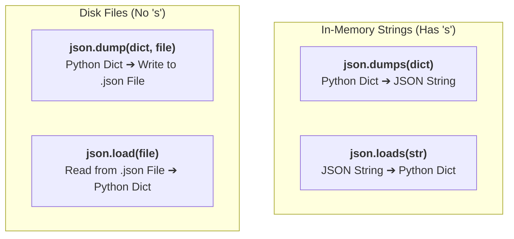

# 09 - JSON in Python: The Universal Language of AI APIs

> **Mental Model**:  
> Think of JSON as an **international passport or universal translator**.  
> Your Python program, an OpenAI server written in Rust, and a database written in C++ all speak different internal languages.  
> But when exchanging data across the internet, **all of them communicate in plain JSON text**.  
> Mastering JSON serialization and parsing is essential for constructing API requests, handling model responses, and building tool-calling schemas.

---

## 📑 Table of Contents
1. [Why JSON is Everywhere in AI Engineering](#1-why-json-is-everywhere-in-ai-engineering)
2. [Python vs. JSON: The Translation Matrix](#2-python-vs-json-the-translation-matrix)
3. [The 4 Core JSON Methods (loads, dumps, load, dump)](#3-the-4-core-json-methods-loads-dumps-load-dump)
4. [Formatting & Pretty-Printing JSON](#4-formatting--pretty-printing-json)
5. [Constructing Standard LLM Request Payloads](#5-constructing-standard-llm-request-payloads)
6. [Parsing Nested LLM Response Payloads Safely](#6-parsing-nested-llm-response-payloads-safely)
7. [Reading & Writing JSON Files on Disk](#7-reading--writing-json-files-on-disk)
8. [Aggregating Multi-Turn Token Usage](#8-aggregating-multi-turn-token-usage)
9. [Cleaning LLM Markdown Fences Before Parsing](#9-cleaning-llm-markdown-fences-before-parsing)
10. [Summary & Quick Reference Cheat Sheet](#10-summary--quick-reference-cheat-sheet)

---

## 1. Why JSON is Everywhere in AI Engineering

Every interaction with modern AI systems uses JSON:
* **API Requests**: You send messages, temperature, and model configs as a JSON object.
* **API Responses**: The LLM returns choices, message text, and token usage inside a JSON payload.
* **Structured Outputs & Agents**: Autonomous agents read and return JSON to trigger functions and tool executions.

```mermaid
flowchart LR
    PythonApp["Python App<br>(Python Dict)"] -->|"json.dumps()"| JSONText["JSON Wire Text<br><code>'{\"model\": \"gpt-4o\"}'</code>"]
    JSONText -->|"HTTP POST"| LLMAPI["LLM Provider Cloud<br>(OpenAI / Anthropic)"]
    LLMAPI -->|"HTTP 200 OK"| ResponseJSON["Response JSON Text<br><code>'{\"choices\": [...]}'</code>"]
    ResponseJSON -->|"json.loads()"| ParsedDict["Python App<br>(Python Dict)"]
```

---

## 2. Python vs. JSON: The Translation Matrix

When Python translates data to and from JSON, types map automatically:

| Python Type | JSON Type | Example Difference |
| :--- | :--- | :--- |
| `dict` | **Object** | `{"key": "value"}` |
| `list` or `tuple` | **Array** | `[1, 2, 3]` (Tuples become JSON arrays) |
| `str` | **String** | `"Hello"` (JSON *always* uses double quotes `"`) |
| `int` or `float` | **Number** | `42` or `3.14` |
| `True` / `False` | **`true` / `false`** | Lowercase in JSON! |
| `None` | **`null`** | `null` in JSON represents missing/empty value |

---

## 3. The 4 Core JSON Methods (loads, dumps, load, dump)

Remember this simple rule of thumb:
* **Methods with `s` (`loads`, `dumps`)** work on in-memory **S**trings.
* **Methods without `s` (`load`, `dump`)** work directly with **Files**.



### 1️⃣ `json.dumps()` (Dict $\rightarrow$ String):
```python
import json

python_data = {"model": "gpt-4o", "temperature": 0.7, "stream": True}
json_string = json.dumps(python_data)

print(type(json_string))  # <class 'str'>
print(json_string)        # '{"model": "gpt-4o", "temperature": 0.7, "stream": true}'
```

### 2️⃣ `json.loads()` (String $\rightarrow$ Dict):
```python
raw_json = '{"model": "gpt-4o", "total_tokens": 150, "status": "success"}'
parsed_dict = json.loads(raw_json)

print(type(parsed_dict))         # <class 'dict'>
print(parsed_dict["model"])      # 'gpt-4o'
print(parsed_dict["total_tokens"]) # 150
```

---

## 4. Formatting & Pretty-Printing JSON

By default, `json.dumps()` outputs a compact, single-line string with no extra spaces. Use `indent` and `sort_keys` for readable debugging:

```python
config = {
    "temperature": 0.7,
    "model": "claude-3-5-sonnet",
    "max_tokens": 4096,
    "system_prompt": "You are a senior engineer."
}

# Pretty-printed formatted JSON:
pretty_json = json.dumps(config, indent=2, sort_keys=True)
print(pretty_json)
```

---

## 5. Constructing Standard LLM Request Payloads

Here is the standard schema used across LLM APIs:

```python
import json

def build_llm_request_payload(
    user_prompt: str,
    system_prompt: str = "You are a helpful AI assistant.",
    model: str = "gpt-4o",
    temperature: float = 0.7
) -> str:
    payload = {
        "model": model,
        "messages": [
            {"role": "system", "content": system_prompt},
            {"role": "user", "content": user_prompt}
        ],
        "temperature": temperature,
        "max_tokens": 1024
    }
    return json.dumps(payload, indent=2)

print(build_llm_request_payload("Explain RAG in 2 sentences."))
```

---

## 6. Parsing Nested LLM Response Payloads Safely

Production LLM responses contain nested layers (`choices` $\rightarrow$ `message` $\rightarrow$ `content`). Always use safe `.get()` fallbacks:

```python
import json

sample_api_response = """
{
  "id": "chatcmpl-12345",
  "model": "gpt-4o",
  "choices": [
    {
      "index": 0,
      "message": {
        "role": "assistant",
        "content": "A Vector Database stores embeddings for fast similarity search."
      },
      "finish_reason": "stop"
    }
  ],
  "usage": {
    "prompt_tokens": 18,
    "completion_tokens": 12,
    "total_tokens": 30
  }
}
"""

data = json.loads(sample_api_response)

# Safe extraction:
model_name = data.get("model", "unknown_model")
response_text = (
    data.get("choices", [{}])[0]
    .get("message", {})
    .get("content", "No response generated.")
)
total_tokens = data.get("usage", {}).get("total_tokens", 0)

print(f"Model       : {model_name}")
print(f"Output      : {response_text}")
print(f"Tokens Used : {total_tokens}")
```

---

## 7. Reading & Writing JSON Files on Disk

Always use Python's `with open(...)` context manager so file handles close automatically:

### 1️⃣ Writing a JSON File:
```python
import json

telemetry_data = {
    "session_id": "sess-9901",
    "total_queries": 4,
    "cost_usd": 0.012
}

with open("telemetry.json", "w", encoding="utf-8") as f:
    json.dump(telemetry_data, f, indent=2)
```

### 2️⃣ Reading a JSON File:
```python
with open("telemetry.json", "r", encoding="utf-8") as f:
    loaded_data = json.load(f)

print(f"Loaded Session: {loaded_data['session_id']}")
```

---

## 8. Aggregating Multi-Turn Token Usage

In conversational apps, calculating cumulative token consumption across a list of JSON responses is a common engineering task:

```python
import json

responses = [
    '{"usage": {"prompt_tokens": 10, "completion_tokens": 15, "total_tokens": 25}}',
    '{"usage": {"prompt_tokens": 25, "completion_tokens": 30, "total_tokens": 55}}',
    '{"usage": {"prompt_tokens": 55, "completion_tokens": 20, "total_tokens": 75}}',
]

total_prompt = 0
total_completion = 0
grand_total = 0

for res_json in responses:
    parsed = json.loads(res_json)
    usage = parsed.get("usage", {})
    total_prompt += usage.get("prompt_tokens", 0)
    total_completion += usage.get("completion_tokens", 0)
    grand_total += usage.get("total_tokens", 0)

print(f"Prompt Tokens     : {total_prompt}")
print(f"Completion Tokens : {total_completion}")
print(f"Grand Total Tokens: {grand_total}")
```

---

## 9. Cleaning LLM Markdown Fences Before Parsing

When you ask an LLM to generate JSON, it often wraps the output inside markdown code fences:
````text
```json
{
  "name": "Manish",
  "status": "ready"
}
```
````
If you pass that raw string into `json.loads()`, it will crash! Here is the standard cleaning helper:

```python
import json

def parse_llm_json_fence(raw_output: str) -> dict:
    text = raw_output.strip()
    
    # Strip markdown ```json or ``` fences if present
    if text.startswith("```"):
        lines = text.splitlines()
        # Drop the first line (```json) and last line (```)
        if lines[0].startswith("```"):
            lines = lines[1:]
        if lines and lines[-1].startswith("```"):
            lines = lines[:-1]
        text = "\n".join(lines).strip()

    try:
        return json.loads(text)
    except json.JSONDecodeError as e:
        print(f"⚠️ Failed to parse cleaned JSON: {e}")
        return {"error": "invalid_json", "raw": raw_output}
```

---

## 10. Summary & Quick Reference Cheat Sheet

| Task | Syntax |
| :--- | :--- |
| **Dict $\rightarrow$ JSON String** | `json.dumps(data, indent=2)` |
| **JSON String $\rightarrow$ Dict** | `json.loads(json_str)` |
| **Dict $\rightarrow$ Write to File** | `with open("f.json", "w") as f: json.dump(data, f)` |
| **Read File $\rightarrow$ Dict** | `with open("f.json", "r") as f: data = json.load(f)` |
| **Safe Key Access** | `data.get("choices", [{}])[0].get("message", {}).get("content")` |
| **Catch Parsing Error** | `except json.JSONDecodeError as e:` |

---

## 🚀 Now You're Ready to Solve `practice.py`!
Open [01-python-core/09-json/practice.py](file:///home/user2/PythonProject/Python-for-ai-engineering/01-python-core/09-json/practice.py) and build your JSON serializers and parsers!
