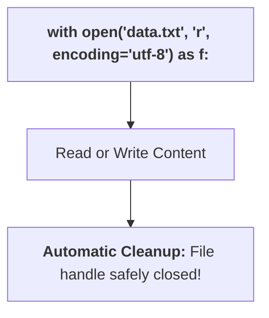
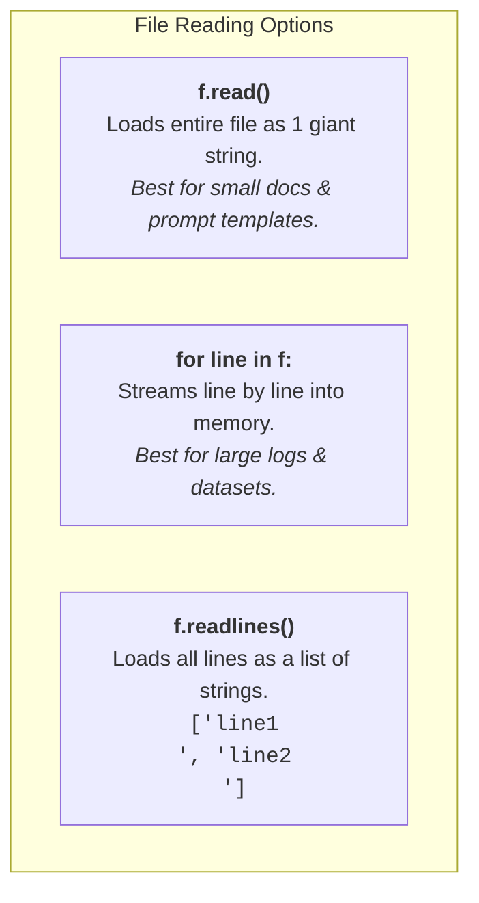

# 10 - File I/O & Document Loading for AI Engineering

> **Mental Model**:  
> Think of File I/O like a **librarian fetching research books from a bookshelf**.  
> An LLM cannot directly read a file sitting on your computer's hard drive.  
> Your Python program must **open the book (open file)**, **read the text into memory (string variable)**, and then pass that text to the LLM.  
> File I/O is the foundation of **RAG (Retrieval-Augmented Generation)**, dataset loading, and logging.

---

## 📑 Table of Contents
1. [Why File I/O Matters in AI](#1-why-file-io-matters-in-ai)
2. [The with open() Context Manager (The Golden Standard)](#2-the-with-open-context-manager-the-golden-standard)
3. [File Modes: Read, Write, and Append (r, w, a)](#3-file-modes-read-write-and-append-r-w-a)
4. [3 Ways to Read Text Files](#4-3-ways-to-read-text-files)
5. [Writing and Appending Content](#5-writing-and-appending-content)
6. [Modern Path Handling with pathlib.Path](#6-modern-path-handling-with-pathlibpath)
7. [Processing Markdown & Filtering Headings](#7-processing-markdown--filtering-headings)
8. [Building a Production RAG Document Loader](#8-building-a-production-rag-document-loader)
9. [Summary & Quick Reference Cheat Sheet](#9-summary--quick-reference-cheat-sheet)

---

## 1. Why File I/O Matters in AI

In AI engineering, files are how you load unstructured knowledge into models:
* **RAG Pipelines**: Reading PDFs, Markdown documentation, and `.txt` files to supply context.
* **Prompt Templates**: Storing system instructions in `.md` files rather than hardcoding them in Python.
* **Conversation History**: Storing chat session transcripts on disk.
* **Evaluation Datasets**: Reading golden question-answer pairs from disk for model benchmarking.


---

## 2. The `with open()` Context Manager (The Golden Standard)

In older Python code, developers opened and closed files manually:
```python
# ❌ OLD / RISKY WAY:
f = open("data.txt", "r")
content = f.read()
f.close()  # If code crashes before this line, the file remains locked in memory!
```

In modern Python, **always use the `with` statement**. It automatically closes the file the exact millisecond execution exits the block—even if an error occurs:



```python
# ✅ MODERN / SAFE WAY:
with open("data.txt", "r", encoding="utf-8") as f:
    content = f.read()

# File is already closed here!
print(content)
```

> ⚠️ **Always specify `encoding="utf-8"`:** This ensures your code works identically on Windows, Linux, and macOS without crashing on emojis or special characters!

---

## 3. File Modes: Read, Write, and Append (`r`, `w`, `a`)

| Mode | Name | What it Does |
| :---: | :--- | :--- |
| **`"r"`** | **Read** (Default) | Opens file for reading. Raises `FileNotFoundError` if file does not exist. |
| **`"w"`** | **Write** | Creates a new file or **completely overwrites** an existing file from scratch. |
| **`"a"`** | **Append** | Adds new text to the **end** of an existing file without erasing previous content. |

---

## 4. 3 Ways to Read Text Files



### 1️⃣ `f.read()` (Whole file at once):
```python
with open("system_prompt.txt", "r", encoding="utf-8") as f:
    full_text = f.read()
```

### 2️⃣ `for line in f:` (Memory-efficient streaming):
```python
with open("access_logs.txt", "r", encoding="utf-8") as f:
    for line_number, line in enumerate(f, start=1):
        print(f"Line {line_number}: {line.strip()}")
```

### 3️⃣ `f.readlines()` (List of lines):
```python
with open("dataset.txt", "r", encoding="utf-8") as f:
    lines = f.readlines()
    print(f"Total lines: {len(lines)}")
```

---

## 5. Writing and Appending Content

### 1️⃣ Writing (`"w"`):
```python
lines_to_write = [
    "Phase 01: Python Core\n",
    "Phase 02: LLM & APIs\n",
    "Phase 06: RAG Systems\n"
]

with open("roadmap.txt", "w", encoding="utf-8") as f:
    f.writelines(lines_to_write)
```

### 2️⃣ Appending (`"a"`):
```python
with open("roadmap.txt", "a", encoding="utf-8") as f:
    f.write("Phase 07: Autonomous Agents\n")
```

---

## 6. Modern Path Handling with `pathlib.Path`

Python 3's built-in **`pathlib`** module replaces clunky `os.path` strings with clean, object-oriented path objects that work across Windows and Linux seamlessly:

```python
from pathlib import Path

# Create a Path object:
file_path = Path("documents/ai_overview.md")

# Fast reading & writing in 1 line:
if file_path.exists():
    text = file_path.read_text(encoding="utf-8")
    print(f"File Name: {file_path.name}")       # 'ai_overview.md'
    print(f"File Suffix: {file_path.suffix}")   # '.md'
    print(f"File Stem: {file_path.stem}")       # 'ai_overview'
```

---

## 7. Processing Markdown & Filtering Headings

In RAG document ingestion, extracting Markdown headings (`#`, `##`, `###`) helps you index document structure:

```python
def extract_markdown_headings(markdown_text: str) -> list[str]:
    headings = []
    for line in markdown_text.splitlines():
        trimmed = line.strip()
        if trimmed.startswith("#"):
            headings.append(trimmed)
    return headings

sample_md = """
# Artificial Intelligence
Introduction to AI concepts.
## Machine Learning
Subfield focusing on learning from data.
### Large Language Models
Transformer-based generative models.
"""

print(extract_markdown_headings(sample_md))
# Output: ['# Artificial Intelligence', '## Machine Learning', '### Large Language Models']
```

---

## 8. Building a Production RAG Document Loader

Here is how you build a standard document loader that extracts text and rich metadata:

```python
from pathlib import Path
from typing import TypedDict

class DocumentMetadata(TypedDict):
    filename: str
    file_extension: str
    character_count: int
    word_count: int
    line_count: int
    content: str

def load_document_for_rag(file_path: str) -> DocumentMetadata:
    path = Path(file_path)
    
    if not path.exists():
        raise FileNotFoundError(f"Document not found at path: {file_path}")
    
    content = path.read_text(encoding="utf-8")
    words = content.split()
    lines = content.splitlines()
    
    return {
        "filename": path.name,
        "file_extension": path.suffix,
        "character_count": len(content),
        "word_count": len(words),
        "line_count": len(lines),
        "content": content,
    }

# Usage:
# doc = load_document_for_rag("sample.md")
# print(f"Loaded '{doc['filename']}' ({doc['word_count']} words)")
```

---

## 9. Summary & Quick Reference Cheat Sheet

| Task | Syntax |
| :--- | :--- |
| **Open to Read** | `with open("f.txt", "r", encoding="utf-8") as f:` |
| **Open to Write** | `with open("f.txt", "w", encoding="utf-8") as f:` |
| **Open to Append** | `with open("f.txt", "a", encoding="utf-8") as f:` |
| **Read all text** | `content = f.read()` |
| **Iterate lines** | `for line in f: process(line.strip())` |
| **Write line** | `f.write("text\n")` |
| **Check file exists** | `Path("file.txt").exists()` |
| **Quick read (pathlib)**| `Path("f.txt").read_text(encoding="utf-8")` |
| **Quick write (pathlib)**| `Path("f.txt").write_text("hello", encoding="utf-8")` |

---

## 🚀 Now You're Ready to Solve `practice.py`!
Open [01-python-core/10-file-io/practice.py](file:///home/user2/PythonProject/Python-for-ai-engineering/01-python-core/10-file-io/practice.py) and build your document loaders and file readers!
