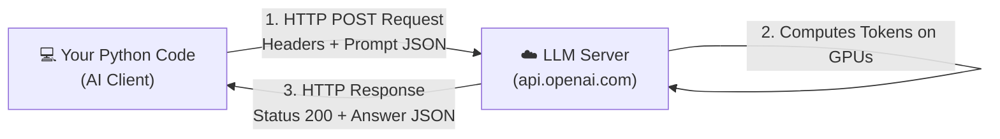
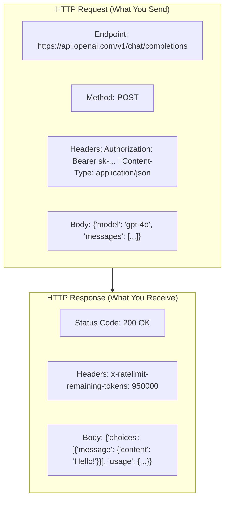

# 11 - HTTP & API Calls: Communicating with AI Providers

> **Mental Model**:  
> Think of an HTTP API call like **ordering food at a restaurant**.  
> * The **API Documentation** is the menu.  
> * Your **HTTP Request** is the order ticket you hand to the waiter (containing the endpoint URL, your API key in the headers, and the prompt in the JSON body).  
> * The **HTTP Response** is the meal delivered to your table (status code `200 OK`, plus the AI's generated answer in the JSON body).

---

## 📑 Table of Contents
1. [The Client-Server Architecture](#1-the-client-server-architecture)
2. [Anatomy of an HTTP Request & Response](#2-anatomy-of-an-http-request--response)
3. [GET vs. POST: The Two Main HTTP Methods](#3-get-vs-post-the-two-main-http-methods)
4. [Modern Python Tools: requests vs. httpx](#4-modern-python-tools-requests-vs-httpx)
5. [Sending Requests, Headers, & Auth with httpx](#5-sending-requests-headers--auth-with-httpx)
6. [Why Timeouts are Mandatory in AI](#6-why-timeouts-are-mandatory-in-ai)
7. [HTTP Status Codes (200, 401, 429, 500)](#7-http-status-codes-200-401-429-500)
8. [Building a Production LLMClient Class](#8-building-a-production-llmclient-class)
9. [Summary & Quick Reference Cheat Sheet](#9-summary--quick-reference-cheat-sheet)

---

## 1. The Client-Server Architecture

When building AI applications, your Python code runs as a **Client**. The LLM provider (OpenAI, Anthropic, Gemini, Groq, Ollama) runs as the **Server**.



---

## 2. Anatomy of an HTTP Request & Response

### 📨 1. The HTTP Request:
* **URL / Endpoint**: Where to send the message (e.g. `https://api.openai.com/v1/chat/completions`).
* **Method**: What action you want (`GET` or `POST`).
* **Headers**: Metadata (Authentication token, Content-Type).
* **Body / Payload**: The actual data (your model name, messages array, and temperature).

### 📬 2. The HTTP Response:
* **Status Code**: Number signaling success or failure (`200` = OK, `429` = Rate limited).
* **Headers**: Server info, remaining rate limit quota, latency.
* **Body**: The generated text and token usage JSON.



---

## 3. GET vs. POST: The Two Main HTTP Methods

| Method | Purpose | When Used in AI | Example |
| :---: | :--- | :--- | :--- |
| **`GET`** | **Retrieve** data without modifying anything. | Listing available models; health checks. | `GET /v1/models` |
| **`POST`** | **Send data** for the server to process. | 95% of AI calls! (Generating text, creating embeddings). | `POST /v1/chat/completions` |

---

## 4. Modern Python Tools: `requests` vs. `httpx`

| Feature | `requests` | `httpx` (Recommended for AI) |
| :--- | :---: | :---: |
| **Synchronous API** | ✅ Yes | ✅ Yes |
| **Async / Await (`asyncio`)** | ❌ No | ✅ **Yes** |
| **HTTP/2 Support** | ❌ No | ✅ **Yes** |
| **Server-Sent Events (Streaming)** | Clunky | ⚡ **Native & Fast** |

> 💡 **Best Practice:** `httpx` has the exact same friendly API syntax as `requests`, but is built from the ground up for modern async Python!

---

## 5. Sending Requests, Headers, & Auth with `httpx`

### 1️⃣ Simple GET Request:
```python
import httpx

# Sending a GET request with query parameters:
response = httpx.get("https://httpbin.org/get", params={"topic": "ai", "limit": 5})

print(f"Status Code : {response.status_code}")
data = response.json()  # Automatically converts JSON text into a Python dict!
print(f"Query Params: {data['args']}")
```

### 2️⃣ POST Request with Headers and API Key:
```python
import httpx

api_url = "https://httpbin.org/post"
fake_api_key = "sk-proj-123456789abcdef"

# 1. Headers (Authentication & Content Type)
headers = {
    "Authorization": f"Bearer {fake_api_key}",
    "Content-Type": "application/json"
}

# 2. JSON Request Payload
payload = {
    "model": "gpt-4o",
    "messages": [
        {"role": "user", "content": "Explain HTTP status codes."}
    ],
    "temperature": 0.7
}

# 3. Send POST request with timeout
response = httpx.post(api_url, json=payload, headers=headers, timeout=10.0)

if response.status_code == 200:
    print("✅ Request Successful!")
    print(response.json())
else:
    print(f"⚠️ Request Failed with status {response.status_code}")
```

---

## 6. Why Timeouts are Mandatory in AI

Standard web requests take **50–200 milliseconds**.  
LLM generation requests take **2,000–15,000 milliseconds (2 to 15 seconds)**.

If a network glitch occurs without a timeout, your Python script will **hang forever**, freezing your server. Always specify a timeout:

```python
import httpx

try:
    # Set a 15-second deadline
    response = httpx.post("https://api.openai.com/v1/chat/completions", timeout=15.0)
except httpx.TimeoutException:
    print("⏳ Request timed out! The AI provider took too long to answer.")
except httpx.ConnectError:
    print("🌐 Network connection failed! Check your internet connection.")
```

---

## 7. HTTP Status Codes (200, 401, 429, 500)

| Status Code | Meaning | What It Means for AI Engineers |
| :---: | :--- | :--- |
| **`200 OK`** | Success | Request succeeded; response contains the generated text. |
| **`400 Bad Request`** | Invalid Payload | Malformed JSON schema, negative temperature, or invalid parameter. |
| **`401 Unauthorized`** | Auth Error | Missing, expired, or invalid API key. |
| **`404 Not Found`** | Bad Endpoint | Typo in URL or model name doesn't exist. |
| **`429 Rate Limited`** | Quota Exceeded | Out of account credits or hit TPM (Tokens Per Minute) threshold. |
| **`500 / 503`** | Server Error | AI Provider (OpenAI/Anthropic) is having an outage. |

---

## 8. Building a Production `LLMClient` Class

Here is how you combine OOP, type hints, error handling, and `httpx` into a clean, reusable client:

```python
import httpx
from typing import TypedDict

class LLMUsage(TypedDict):
    prompt_tokens: int
    completion_tokens: int
    total_tokens: int

class LLMResult(TypedDict):
    model: str
    content: str
    usage: LLMUsage
    estimated_cost_usd: float

class LLMClient:
    def __init__(
        self, 
        api_key: str, 
        base_url: str = "https://api.openai.com/v1", 
        timeout: float = 30.0
    ):
        self.api_key = api_key
        self.base_url = base_url
        self.timeout = timeout

    def generate(self, prompt: str, model: str = "gpt-4o") -> LLMResult:
        endpoint = f"{self.base_url}/chat/completions"
        headers = {
            "Authorization": f"Bearer {self.api_key}",
            "Content-Type": "application/json"
        }
        payload = {
            "model": model,
            "messages": [{"role": "user", "content": prompt}],
            "temperature": 0.7
        }

        try:
            response = httpx.post(
                endpoint, 
                json=payload, 
                headers=headers, 
                timeout=self.timeout
            )
            response.raise_for_status() # Raises HTTPStatusError if 4xx or 5xx
            data = response.json()

            content = data["choices"][0]["message"]["content"]
            usage = data.get("usage", {"prompt_tokens": 0, "completion_tokens": 0, "total_tokens": 0})
            
            # Simple cost estimate: $5/M prompt, $15/M completion
            cost = (usage["prompt_tokens"] * 0.000005) + (usage["completion_tokens"] * 0.000015)

            return {
                "model": model,
                "content": content,
                "usage": usage,
                "estimated_cost_usd": cost
            }

        except httpx.HTTPStatusError as e:
            raise RuntimeError(f"HTTP error occurred: {e.response.status_code} - {e.response.text}")
        except httpx.TimeoutException:
            raise TimeoutError("LLM API request timed out.")
```

---

## 9. Summary & Quick Reference Cheat Sheet

| Task | Syntax (`httpx`) |
| :--- | :--- |
| **GET Request** | `res = httpx.get("url", params={"k": "v"})` |
| **POST Request** | `res = httpx.post("url", json=dict_body, headers=headers)` |
| **Bearer Auth Header** | `headers = {"Authorization": f"Bearer {key}"}` |
| **Check Status** | `if res.status_code == 200:` or `res.raise_for_status()` |
| **Parse JSON Body** | `data = res.json()` |
| **Set Timeout** | `httpx.post("url", timeout=15.0)` |
| **Catch Network Drops**| `except httpx.ConnectError:` |
| **Catch Timeouts** | `except httpx.TimeoutException:` |

---

## 🚀 Now You're Ready to Solve `practice.py`!
Open [01-python-core/11-http-api-calls/practice.py](file:///home/user2/PythonProject/Python-for-ai-engineering/01-python-core/11-http-api-calls/practice.py) and build your API callers and client SDKs!
