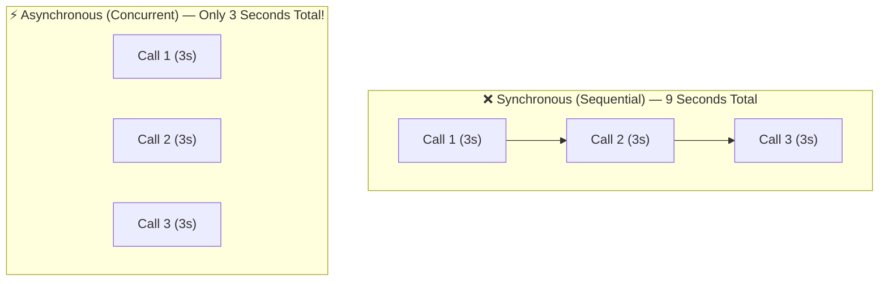
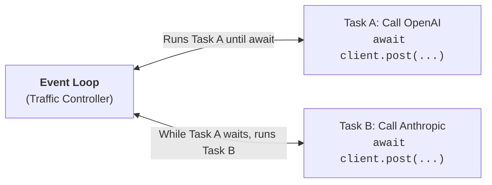

# 12 - Async Python (asyncio & httpx): High-Throughput AI Pipelines

> **Mental Model**:  
> Think of Asynchronous Programming like a **professional chef in a busy kitchen**.  
> * **A Synchronous Chef (Blocking)**: Puts pasta into boiling water and stands completely still staring at the pot for 10 minutes before starting to chop vegetables.  
> * **An Asynchronous Chef (Non-Blocking)**: Puts pasta into boiling water, and *while waiting for the water to boil*, immediately chops onions, preheats the oven, and plates an appetizer.  
> In AI Engineering, LLM API calls take **2 to 10 seconds of pure network waiting**. Async Python allows you to send 50 LLM requests simultaneously on a single thread without waiting for each one to finish one-by-one!

---

## 📑 Table of Contents
1. [Why Async is Mandatory for AI Engineering](#1-why-async-is-mandatory-for-ai-engineering)
2. [The 3 Core Pillars: async def, await, and the Event Loop](#2-the-3-core-pillars-async-def-await-and-the-event-loop)
3. [Sequential vs. Concurrent Execution Benchmark](#3-sequential-vs-concurrent-execution-benchmark)
4. [Concurrent Task Orchestration with asyncio.gather()](#4-concurrent-task-orchestration-with-asynciogather)
5. [The #1 Beginner Trap: time.sleep() vs asyncio.sleep()](#5-the-1-beginner-trap-timesleep-vs-asynciosleep)
6. [Asynchronous HTTP with httpx.AsyncClient](#6-asynchronous-http-with-httpxasyncclient)
7. [Handling Failures in Concurrent Tasks (return_exceptions=True)](#7-handling-failures-in-concurrent-tasks-return_exceptions=true)
8. [Enforcing Deadlines with asyncio.wait_for()](#8-enforcing-deadlines-with-asynciowait_for)
9. [Building a Concurrent Multi-Model Ensemble Service](#9-building-a-concurrent-multi-model-ensemble-service)
10. [Summary & Quick Reference Cheat Sheet](#10-summary--quick-reference-cheat-sheet)

---

## 1. Why Async is Mandatory for AI Engineering

When you call an LLM API:
* **0.01% of the time** is Python preparing the JSON payload.
* **99.99% of the time** is your program sitting idle waiting for the model provider's GPUs across the internet.



---

## 2. The 3 Core Pillars: `async def`, `await`, and the Event Loop



### The 3 Keywords:
1. **`async def`**: Declares a function as a **Coroutine** (a function that can pause and resume).
2. **`await`**: The pause button. Hands CPU control back to the Event Loop while waiting for network I/O.
3. **`asyncio.run(main())`**: The starter motor that boots up the Python **Event Loop**.

```python
import asyncio

# 1. Define coroutine
async def fetch_ai_greeting(user_name: str) -> str:
    print(f"1. Sending request for {user_name}...")
    # Simulate 1 second of network latency
    await asyncio.sleep(1.0)
    return f"Hello, {user_name}! AI Assistant is ready."

# 2. Main async entry point
async def main():
    result = await fetch_ai_greeting("Manish")
    print(f"2. Received: {result}")

# 3. Boot the event loop
if __name__ == "__main__":
    asyncio.run(main())
```

---

## 3. Sequential vs. Concurrent Execution Benchmark

Notice how running tasks sequentially adds up their wait times, while running them concurrently overlaps them:

```python
import asyncio
import time

async def simulated_llm_call(model_name: str, delay: float) -> str:
    await asyncio.sleep(delay)
    return f"[{model_name}] Finished in {delay}s"

async def test_comparison():
    # ❌ Sequential (Takes 1.0 + 1.0 + 1.0 = 3.0 seconds):
    start_seq = time.perf_counter()
    res1 = await simulated_llm_call("GPT-4o", 1.0)
    res2 = await simulated_llm_call("Claude-3.5", 1.0)
    res3 = await simulated_llm_call("Llama-3", 1.0)
    seq_duration = time.perf_counter() - start_seq
    print(f"Sequential Duration: {seq_duration:.2f}s")

    # ⚡ Concurrent with asyncio.gather (Takes only 1.0 second total!):
    start_conc = time.perf_counter()
    results = await asyncio.gather(
        simulated_llm_call("GPT-4o", 1.0),
        simulated_llm_call("Claude-3.5", 1.0),
        simulated_llm_call("Llama-3", 1.0)
    )
    conc_duration = time.perf_counter() - start_conc
    print(f"Concurrent Duration: {conc_duration:.2f}s")
    print(f"Results: {results}")

# asyncio.run(test_comparison())
```

---

## 4. Concurrent Task Orchestration with `asyncio.gather()`

`asyncio.gather(*tasks)` takes multiple coroutines, launches them all concurrently on the event loop, and returns their outputs in a list **in the exact original order**:

```python
import asyncio

async def generate_summary(doc_id: int) -> dict:
    await asyncio.sleep(0.5)
    return {"doc_id": doc_id, "summary": f"Summary of document #{doc_id}"}

async def process_batch():
    # Create 5 concurrent document processing tasks:
    tasks = [generate_summary(i) for i in range(1, 6)]
    
    # Fire all 5 tasks at once!
    all_summaries = await asyncio.gather(*tasks)
    
    for item in all_summaries:
        print(f"• Doc {item['doc_id']}: {item['summary']}")

# asyncio.run(process_batch())
```

---

## 5. The #1 Beginner Trap: `time.sleep()` vs `asyncio.sleep()`

> 🚨 **Critical Rule:** **NEVER use `time.sleep()` inside an `async def` function!**

* `time.sleep(5)` is **synchronous / blocking**. It freezes the entire Python process. No other async tasks can run while it sleeps!
* `await asyncio.sleep(5)` is **non-blocking**. It tells the Event Loop: *"I'm going to wait 5 seconds; please run other tasks while I wait!"*

---

## 6. Asynchronous HTTP with `httpx.AsyncClient`

When calling real APIs in async code, use `httpx.AsyncClient`:

```python
import httpx
import asyncio

async def fetch_model_status():
    # Use async context manager for connection reuse:
    async with httpx.AsyncClient() as client:
        response = await client.get("https://httpbin.org/get", params={"service": "llm-gateway"})
        print(f"Status Code: {response.status_code}")
        print(f"Response: {response.json()['args']}")

# asyncio.run(fetch_model_status())
```

---

## 7. Handling Failures in Concurrent Tasks (`return_exceptions=True`)

If you launch 10 LLM requests and request #3 fails with a rate-limit error, by default `asyncio.gather()` will cancel everything.  
Use **`return_exceptions=True`** so successful tasks finish and errors are captured safely:

```python
import asyncio

async def risky_llm_call(prompt: str) -> str:
    if "error" in prompt:
        raise ValueError("Simulated API rate limit error!")
    await asyncio.sleep(0.5)
    return f"Success for '{prompt}'"

async def main():
    prompts = ["Hello", "trigger error", "What is RAG?"]
    tasks = [risky_llm_call(p) for p in prompts]

    # return_exceptions=True prevents one crash from ruining all tasks!
    results = await asyncio.gather(*tasks, return_exceptions=True)

    for prompt, res in zip(prompts, results):
        if isinstance(res, Exception):
            print(f"❌ Failed: '{prompt}' -> {res}")
        else:
            print(f"✅ Succeeded: '{prompt}' -> {res}")

# asyncio.run(main())
```

---

## 8. Enforcing Deadlines with `asyncio.wait_for()`

If an external LLM takes longer than your acceptable threshold (e.g. 5 seconds), cancel it using `asyncio.wait_for()`:

```python
import asyncio

async def slow_llm_provider():
    await asyncio.sleep(10.0)  # Provider is stuck!
    return "Late response"

async def call_with_deadline():
    try:
        # Enforce 2-second timeout
        res = await asyncio.wait_for(slow_llm_provider(), timeout=2.0)
        print(res)
    except asyncio.TimeoutError:
        print("⏳ Operation timed out after 2 seconds! Switching to fallback model.")

# asyncio.run(call_with_deadline())
```

---

## 9. Building a Concurrent Multi-Model Ensemble Service

In AI architectures, you often query multiple models concurrently to compare answers:

```python
import asyncio
from typing import TypedDict

class ModelResult(TypedDict):
    model: str
    response: str

async def query_model(model_name: str, query: str, delay: float) -> ModelResult:
    await asyncio.sleep(delay)
    return {"model": model_name, "response": f"Analysis of '{query}' from {model_name}"}

async def multi_model_consensus(user_query: str):
    print(f"Routing query: '{user_query}' to 3 models in parallel...")
    
    # Query 3 models concurrently:
    results = await asyncio.gather(
        query_model("GPT-4o", user_query, 1.2),
        query_model("Claude-3.5-Sonnet", user_query, 1.0),
        query_model("Llama-3-70B", user_query, 0.8)
    )

    print("\n--- Consensus Responses ---")
    for r in results:
        print(f"• {r['model']:<20}: {r['response']}")

# asyncio.run(multi_model_consensus("How do we scale vector search?"))
```

---

## 10. Summary & Quick Reference Cheat Sheet

| Synchronous Pattern (Slow) | Asynchronous Pattern (Fast) |
| :--- | :--- |
| `def fetch(): ...` | `async def fetch(): ...` |
| `time.sleep(2)` | `await asyncio.sleep(2)` |
| `httpx.get(url)` | `await client.get(url)` |
| `[fn(x) for x in items]` (1-by-1) | `await asyncio.gather(*[fn(x) for x in items])` |
| `main()` | `asyncio.run(main())` |
| No timeout handling | `await asyncio.wait_for(coroutine, timeout=5.0)` |

---

## 🚀 Now You're Ready to Solve `practice.py`!
Open [01-python-core/12-async-python/practice.py](file:///home/user2/PythonProject/Python-for-ai-engineering/01-python-core/12-async-python/practice.py) and build high-throughput async AI callers!
