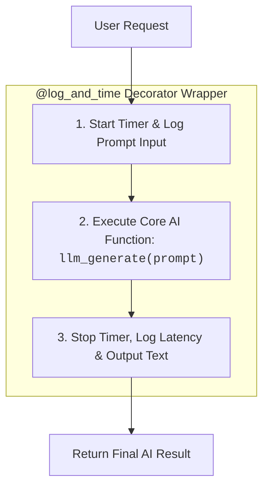
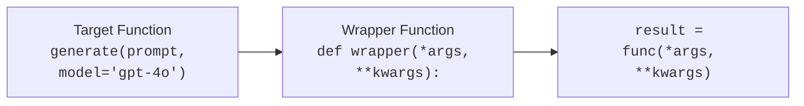
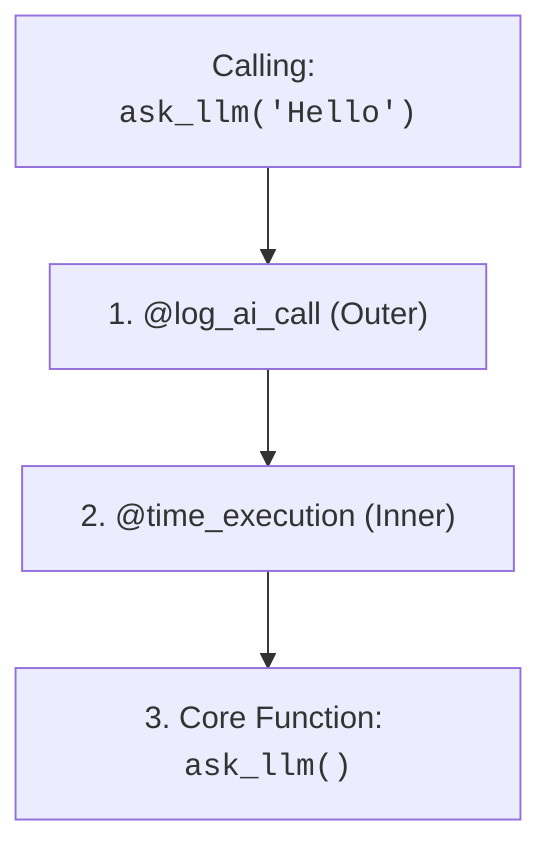

# 13 - Decorators in Python: Enhancing AI Functions Cleanly

> **Mental Model**:  
> Think of a Decorator like **gift-wrapping a box** or **posting a security guard outside an office door**.  
> * The gift inside (your function) remains completely untouched.  
> * The gift wrap (the decorator) adds extra behavior around it—such as measuring latency, logging prompts, catching network errors, or checking API permissions before the door opens.  
> Decorators allow you to add observability, timing, and error retries to your AI functions **without modifying a single line of their core logic**.

---

## 📑 Table of Contents
1. [Why Decorators Matter in AI Engineering](#1-why-decorators-matter-in-ai-engineering)
2. [How Decorators Work Under the Hood](#2-how-decorators-work-under-the-hood)
3. [The Universal Decorator Template (*args & **kwargs)](#3-the-universal-decorator-template-args--kwargs)
4. [Preserving Function Identity with @functools.wraps](#4-preserving-function-identity-with-functoolswraps)
5. [4 Essential Production AI Decorators](#5-4-essential-production-ai-decorators)
   * [1. Latency & Execution Timer](#1-the-execution-timer-decorator)
   * [2. Input/Output Telemetry Logger](#2-the-io-telemetry-logger)
   * [3. Exception & Network Safe-Guard](#3-the-exception-safe-guard)
   * [4. API Call & Usage Counter](#4-the-call-counter-decorator)
6. [Stacking Multiple Decorators (Execution Order)](#6-stacking-multiple-decorators-execution-order)
7. [Summary & Quick Reference Cheat Sheet](#7-summary--quick-reference-cheat-sheet)

---

## 1. Why Decorators Matter in AI Engineering

When building production AI systems, you need cross-cutting features on every single LLM call:
* ⏱️ **Latency Benchmarking**: How many seconds did GPT-4o take to respond?
* 📊 **Observability & Logging**: What prompt was sent and what response was received?
* 🛡️ **Error Recovery & Retries**: Automatically retry if a rate limit or timeout occurs.
* 🔒 **FastAPI Endpoints**: Decorators like `@app.get()` and `@app.post()` route web requests.

Instead of copy-pasting logging and timing code into 50 different functions, you write the logic **once** in a decorator and attach it with `@`.



---

## 2. How Decorators Work Under the Hood

Remember: In Python, **functions are objects**. A decorator is simply a function that takes an existing function, wraps extra code around it, and returns the wrapper.

### The Evolution from Manual Wrapping to `@`:

```python
# 1. A basic function
def generate_text(prompt):
    return f"Response to: {prompt}"

# 2. A decorator function
def my_decorator(original_function):
    def wrapper(prompt):
        print("🔹 Before function runs...")
        result = original_function(prompt)
        print("🔹 After function runs...")
        return result
    return wrapper

# Manual syntax (Old way):
decorated_generate = my_decorator(generate_text)
print(decorated_generate("Hello"))

# The Modern '@' Syntactic Sugar (Identical behavior, cleaner code!):
@my_decorator
def generate_text_modern(prompt):
    return f"Response to: {prompt}"

print(generate_text_modern("Hello"))
```

---

## 3. The Universal Decorator Template (`*args` & `**kwargs`)

To ensure a decorator can wrap **any** function regardless of its parameter list, always accept `*args` and `**kwargs` inside the `wrapper`:



```python
from functools import wraps

def universal_decorator(func):
    @wraps(func)  # Preserves function name and docstring
    def wrapper(*args, **kwargs):
        # Code executed BEFORE the function:
        print(f"Calling function '{func.__name__}'...")
        
        # Execute the original function:
        result = func(*args, **kwargs)
        
        # Code executed AFTER the function:
        print(f"Finished function '{func.__name__}'.")
        
        return result
    return wrapper
```

---

## 4. Preserving Function Identity with `@functools.wraps`

Without `@wraps(func)`, Python forgets the original name of your function and names it `"wrapper"`:

```python
from functools import wraps

def bad_decorator(func):
    def wrapper(*args, **kwargs):
        return func(*args, **kwargs)
    return wrapper

def good_decorator(func):
    @wraps(func)  # ✅ Copies over __name__ and __doc__
    def wrapper(*args, **kwargs):
        return func(*args, **kwargs)
    return wrapper

@bad_decorator
def ask_ai(prompt: str) -> str:
    """Sends a query to the AI."""
    return "Answer"

@good_decorator
def ask_ai_proper(prompt: str) -> str:
    """Sends a query to the AI."""
    return "Answer"

print(ask_ai.__name__)         # ❌ Prints: 'wrapper'
print(ask_ai_proper.__name__)  # ✅ Prints: 'ask_ai_proper'
```

---

## 5. 4 Essential Production AI Decorators

### 1️⃣ The Execution Timer Decorator
Measures the latency of LLM API requests:

```python
import time
from functools import wraps

def time_execution(func):
    @wraps(func)
    def wrapper(*args, **kwargs):
        start_time = time.perf_counter()
        result = func(*args, **kwargs)
        duration = time.perf_counter() - start_time
        print(f"⏱️ [{func.__name__}] Latency: {duration:.4f} seconds")
        return result
    return wrapper

@time_execution
def simulated_llm_inference(prompt: str) -> str:
    time.sleep(0.5)  # Simulate network latency
    return f"Generated answer for: '{prompt}'"

simulated_llm_inference("What is RAG?")
```

---

### 2️⃣ The I/O Telemetry Logger
Logs input prompts and generated responses for debugging:

```python
from functools import wraps

def log_ai_call(func):
    @wraps(func)
    def wrapper(*args, **kwargs):
        print(f"\n📥 [INPUT to {func.__name__}]: args={args}, kwargs={kwargs}")
        result = func(*args, **kwargs)
        print(f"📤 [OUTPUT from {func.__name__}]: {result}")
        return result
    return wrapper

@log_ai_call
def query_model(prompt: str, temperature: float = 0.7) -> str:
    return f"Model output for prompt: '{prompt}'"

query_model("Explain Vector Databases", temperature=0.2)
```

---

### 3️⃣ The Exception Safe-Guard
Catches network crashes and returns a graceful fallback:

```python
from functools import wraps

def safe_guard(func):
    @wraps(func)
    def wrapper(*args, **kwargs):
        try:
            return func(*args, **kwargs)
        except Exception as e:
            print(f"🛡️ Handled exception in '{func.__name__}': {e}")
            return {"status": "error", "message": "Fallback: AI Service unavailable."}
    return wrapper

@safe_guard
def unstable_api_call(endpoint: str):
    raise ConnectionResetError("Connection dropped by remote host.")

response = unstable_api_call("https://api.openai.com/v1")
print(response)
```

---

### 4️⃣ The Call Counter Decorator
Tracks how many times a service has been invoked:

```python
from functools import wraps

def count_calls(func):
    @wraps(func)
    def wrapper(*args, **kwargs):
        wrapper.call_count += 1
        print(f"📊 [{func.__name__}] Total Invocations: {wrapper.call_count}")
        return func(*args, **kwargs)
    
    wrapper.call_count = 0  # Attach counter attribute to function
    return wrapper

@count_calls
def generate_summary(text: str) -> str:
    return f"Summary of {text[:10]}..."

generate_summary("Document A")
generate_summary("Document B")
generate_summary("Document C")
```

---

## 6. Stacking Multiple Decorators (Execution Order)

You can stack multiple decorators on a single function. They execute from **Bottom to Top (Inside-Out)**:



```python
@log_ai_call        # Outer layer (runs first on entry, last on exit)
@time_execution     # Inner layer (runs second on entry, first on exit)
def ask_llm(prompt: str) -> str:
    time.sleep(0.2)
    return f"Answer to '{prompt}'"

ask_llm("What is a decorator?")
```

---

## 7. Summary & Quick Reference Cheat Sheet

| Decorator Goal | Core Code Inside Wrapper |
| :--- | :--- |
| **Basic Wrapper** | `result = func(*args, **kwargs); return result` |
| **Preserve Metadata**| `@functools.wraps(func)` above `def wrapper` |
| **Measure Latency** | `start = time.perf_counter() ... duration = time.perf_counter() - start` |
| **Input / Output Log**| `print(f"In: {args}, Out: {result}")` |
| **Safe Error Fallback**| `try: return func(...) except Exception as e: return fallback` |
| **Track Call Count** | `wrapper.call_count += 1` |

---

## 🚀 Now You're Ready to Solve `practice.py`!
Open [01-python-core/13-decorators/practice.py](file:///home/user2/PythonProject/Python-for-ai-engineering/01-python-core/13-decorators/practice.py) and build your custom AI decorators!
