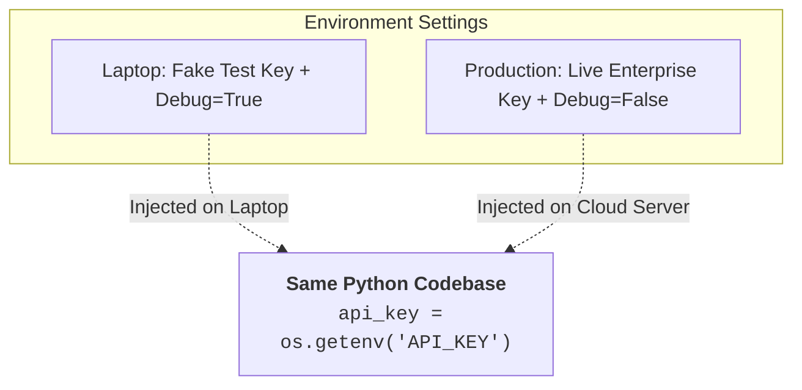

# 14 - Environment Variables & Configuration: Securing Secrets & Settings

> **Mental Model**:  
> Think of Environment Variables like **keeping your house keys in your private pocket instead of writing the combination on your front door**.  
> * **Hardcoding keys in Python (`api_key = "sk-..."`)**: Writing your credit card number directly into the source code. If you commit the code to GitHub, bots will steal your key within 30 seconds!  
> * **Environment Variables**: Storing secrets outside your code. The code reads keys from the operating system memory at runtime, keeping your repository 100% safe.

---

## 📑 Table of Contents
1. [The 12-Factor Rule: Separation of Code and Config](#1-the-12-factor-rule-separation-of-code-and-config)
2. [Reading Variables with os.getenv() vs. os.environ](#2-reading-variables-with-osgetenv-vs-osenviron)
3. [Local Development with .env and python-dotenv](#3-local-development-with-env-and-python-dotenv)
4. [The .env.example Team Pattern](#4-the-envexample-team-pattern)
5. [Type Casting Configs (Integers, Floats, Booleans)](#5-type-casting-configs-integers-floats-booleans)
6. [The "Fail-Fast" Startup Validation Pattern](#6-the-fail-fast-startup-validation-pattern)
7. [Environment Switching (Dev vs. Staging vs. Prod)](#7-environment-switching-dev-vs-staging-vs-prod)
8. [Building a Production AppConfig Class](#8-building-a-production-appconfig-class)
9. [Summary & Quick Reference Cheat Sheet](#9-summary--quick-reference-cheat-sheet)

---

## 1. The 12-Factor Rule: Separation of Code and Config

In production AI software engineering:
* **Code is universal**: The exact same Python files run on your local laptop, your staging server, and your production Kubernetes cluster.
* **Configuration is variable**: Each environment has different API keys, database URLs, and timeouts.



---

## 2. Reading Variables with `os.getenv()` vs. `os.environ`

Python's built-in `os` module gives you two ways to read environment variables:

| Method | Behavior when Key is Missing | Best Use Case |
| :--- | :--- | :--- |
| **`os.getenv("KEY", "default")`** | Returns `None` (or your default fallback value). | **Recommended**: For optional settings with defaults. |
| **`os.environ["KEY"]`** | 💥 Raises fatal **`KeyError`**. | For mandatory keys where missing values must crash immediately. |

```python
import os

# 1. Safe retrieval with default fallback:
model_name = os.getenv("MODEL_NAME", "gpt-4o")
timeout_sec = os.getenv("API_TIMEOUT", "30")

# 2. Key that doesn't exist:
missing_setting = os.getenv("NON_EXISTENT_VAR")
print(missing_setting)  # Output: None
```

---

## 3. Local Development with `.env` and `python-dotenv`

In local development, you don't want to type `export API_KEY=...` in your terminal every time you open a project.  
Instead, store variables in a local **`.env`** file:

### 1️⃣ The `.env` file:
```env
# .env (NEVER commit this file to Git!)
OPENAI_API_KEY=sk-proj-mock123456789abcdef
MODEL_NAME=gpt-4o
API_TIMEOUT=45
DEBUG_MODE=true
```

### 2️⃣ Loading it in Python:
```python
import os
from dotenv import load_dotenv

# Reads the local .env file and injects its contents into os.environ
load_dotenv()

api_key = os.getenv("OPENAI_API_KEY")
print(f"Loaded API Key: {api_key[:8]}...")
```

---

## 4. The `.env.example` Team Pattern

Since your real `.env` file is in `.gitignore`, how do teammates know what configuration keys your project needs?

You commit a **`.env.example`** template file with empty/dummy values:

```env
# .env.example (Safe to commit to Git!)
OPENAI_API_KEY=your_openai_api_key_here
ANTHROPIC_API_KEY=your_anthropic_key_here
MODEL_NAME=gpt-4o
API_TIMEOUT=30
ENVIRONMENT=development
```

---

## 5. Type Casting Configs (Integers, Floats, Booleans)

> 🚨 **Critical Fact:** `os.getenv()` **always returns a string (`str`)**!

If you write `timeout = os.getenv("TIMEOUT", "30")`, `timeout` is `"30"` (text), not the number `30`. You must explicitly cast it:

```python
import os

# 1. Cast to Integer:
timeout: int = int(os.getenv("API_TIMEOUT", "30"))

# 2. Cast to Float:
temperature: float = float(os.getenv("TEMPERATURE", "0.7"))

# 3. Cast to Boolean (Check string equality):
debug_mode: bool = os.getenv("DEBUG_MODE", "false").lower() in ("true", "1", "yes")

print(f"Timeout (int): {timeout} | Temp (float): {temperature} | Debug (bool): {debug_mode}")
```

---

## 6. The "Fail-Fast" Startup Validation Pattern

Never let an application start up if a mandatory secret (like an API key) is missing. Validate on application boot:

```python
import os
from dotenv import load_dotenv

load_dotenv()

def get_required_env(key_name: str) -> str:
    value = os.getenv(key_name)
    if not value:
        raise ValueError(
            f"💥 CRITICAL CONFIGURATION ERROR: Environment variable '{key_name}' is not set!\n"
            f"Please add '{key_name}' to your .env file or environment."
        )
    return value

# Fails instantly with a helpful error message if key is missing:
api_key = get_required_env("OPENAI_API_KEY")
```

---

## 7. Environment Switching (Dev vs. Staging vs. Prod)

You can toggle application behavior based on the `ENVIRONMENT` setting:

```python
import os

env = os.getenv("ENVIRONMENT", "development").lower()

if env == "development":
    BASE_URL = "http://localhost:8000/v1"
    ENABLE_VERBOSE_LOGS = True
elif env == "production":
    BASE_URL = "https://api.openai.com/v1"
    ENABLE_VERBOSE_LOGS = False
```

---

## 8. Building a Production `AppConfig` Class

Combine all configuration logic into a single, clean, typed settings class:

```python
import os
from dotenv import load_dotenv

class AIConfig:
    """Centralized, immutable application configuration."""
    
    def __init__(self):
        # Load local .env if available
        load_dotenv()

        # 1. Mandatory Secrets (Fails if missing)
        self.api_key: str = self._get_required("OPENAI_API_KEY")

        # 2. Optional Model Parameters (With sensible defaults)
        self.model_name: str = os.getenv("MODEL_NAME", "gpt-4o")
        self.temperature: float = float(os.getenv("TEMPERATURE", "0.7"))
        self.max_tokens: int = int(os.getenv("MAX_TOKENS", "2048"))
        self.timeout: float = float(os.getenv("API_TIMEOUT", "30.0"))

        # 3. Environment & Telemetry
        self.environment: str = os.getenv("ENVIRONMENT", "development")
        self.debug: bool = os.getenv("DEBUG", "false").lower() == "true"

    def _get_required(self, key: str) -> str:
        val = os.getenv(key)
        if not val:
            raise ValueError(f"Required configuration '{key}' is missing!")
        return val

# Instantiate once at application start:
# config = AIConfig()
# print(f"Initialized AI Config for [{config.environment}] with model '{config.model_name}'")
```

---

## 9. Summary & Quick Reference Cheat Sheet

| Task | Syntax |
| :--- | :--- |
| **Load `.env` file** | `from dotenv import load_dotenv; load_dotenv()` |
| **Get optional variable**| `val = os.getenv("KEY", "default")` |
| **Get mandatory variable**| `val = os.environ["KEY"]` (Raises `KeyError` if missing) |
| **Cast to Int / Float** | `int(os.getenv("PORT", "8000"))`, `float(os.getenv("TEMP", "0.7"))` |
| **Cast to Boolean** | `os.getenv("DEBUG", "false").lower() == "true"` |
| **Git Safety Rule** | Always add `.env` to `.gitignore`; commit `.env.example` |

---

## 🚀 Now You're Ready to Solve `practice.py`!
Open [01-python-core/14-environment-variables-configuration/practice.py](file:///home/user2/PythonProject/Python-for-ai-engineering/01-python-core/14-environment-variables-configuration/practice.py) and build safe configuration loaders!
