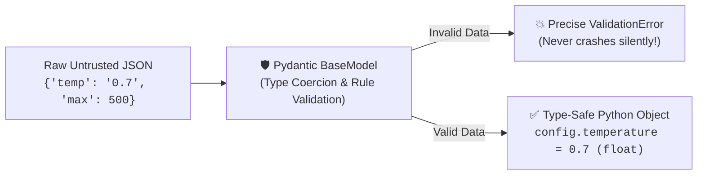
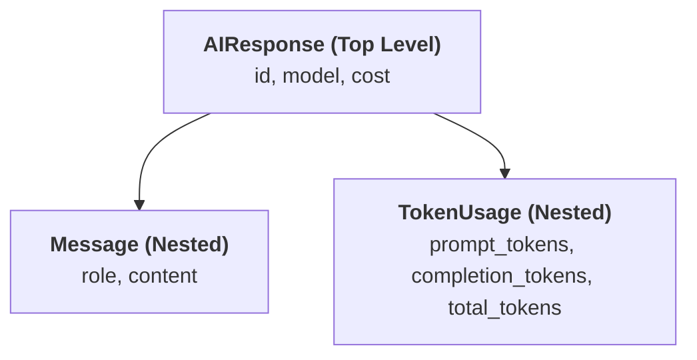

# 15 - Pydantic: Data Validation & Structured Schemas for AI

> **Mental Model**:  
> Think of Pydantic like an **Airport Security & Customs Scanner**.  
> * Plain Python type hints are just labels on a suitcase (they don't physically stop anyone from packing the wrong item).  
> * **Pydantic actively inspects the suitcase at runtime!** If a required field is missing or contains invalid data, Pydantic halts execution immediately and gives you a precise error report. If the data is valid, it guarantees your code works with clean, guaranteed types.  
> Pydantic is the backbone of **FastAPI, OpenAI Structured Outputs, LangChain, and AI Agent Tool Calling**.

---

## 📑 Table of Contents
1. [Why Pydantic is the Gold Standard in AI Engineering](#1-why-pydantic-is-the-gold-standard-in-ai-engineering)
2. [The Core Building Block: BaseModel](#2-the-core-building-block-basemodel)
3. [Runtime Validation & Automatic Type Coercion](#3-runtime-validation--automatic-type-coercion)
4. [Field Constraints with Field()](#4-field-constraints-with-field)
5. [Optional Fields & Defaults](#5-optional-fields--defaults)
6. [Nested Models: Modeling Complex AI Payloads](#6-nested-models-modeling-complex-ai-payloads)
7. [Converting Models: .model_dump() and .model_dump_json()](#7-converting-models-model_dump-and-model_dump_json)
8. [Generating JSON Schemas for LLM Tool Calling](#8-generating-json-schemas-for-llm-tool-calling)
9. [Complete AI Chat & RAG Schemas](#9-complete-ai-chat--rag-schemas)
10. [Summary & Quick Reference Cheat Sheet](#10-summary--quick-reference-cheat-sheet)

---

## 1. Why Pydantic is the Gold Standard in AI Engineering

When working with LLMs:
* LLMs generate unstructured text that can be malformed, missing fields, or contain incorrect types.
* Users send unexpected payloads over HTTP endpoints.

Pydantic acts as the **bulletproof validation layer** between untrusted raw input and your internal business logic:



---

## 2. The Core Building Block: `BaseModel`

To create a Pydantic schema, inherit from `pydantic.BaseModel` and declare your fields with type hints:

```python
from pydantic import BaseModel

# 1. Define the model
class User(BaseModel):
    id: int
    name: str
    is_active: bool = True  # Optional with default value

# 2. Instantiate with keyword arguments or unpacked dictionary:
user_a = User(id=1, name="Manish")

# 3. Access attributes using clean dot notation:
print(user_a.id)         # Output: 1
print(user_a.name)       # Output: Manish
print(user_a.is_active)  # Output: True
```

---

## 3. Runtime Validation & Automatic Type Coercion

Pydantic does two powerful things when creating objects:

### 1️⃣ Type Coercion (Smart Automatic Casting):
If you pass the string `"42"` into an integer field, Pydantic converts it to `42` automatically:
```python
user_b = User(id="42", name="Ranjeet")
print(type(user_b.id))  # <class 'int'> -> Automatically coerced!
```

### 2️⃣ Strict Validation Errors:
If you pass impossible data, Pydantic raises a clear `ValidationError`:
```python
from pydantic import ValidationError

try:
    # 'not_a_number' cannot be converted to int!
    bad_user = User(id="not_a_number", name="Alice")
except ValidationError as e:
    print(f"🛡️ Validation Blocked Invalid Input:\n{e}")
```

---

## 4. Field Constraints with `Field()`

Use `Field()` to enforce business rules and parameter boundaries (e.g. LLM temperature must be between 0.0 and 2.0):

```python
from pydantic import BaseModel, Field

class LLMConfiguration(BaseModel):
    model: str = Field(
        default="gpt-4o", 
        description="The target model identifier."
    )
    temperature: float = Field(
        default=0.7, 
        ge=0.0, 
        le=2.0, 
        description="Sampling temperature between 0.0 and 2.0."
    )
    max_tokens: int = Field(
        default=2048, 
        gt=0, 
        le=128000, 
        description="Maximum tokens to generate."
    )

# Valid config:
cfg = LLMConfiguration(temperature=1.2, max_tokens=4000)
print(cfg)

# Invalid config (Raises ValidationError: temperature > 2.0):
# bad_cfg = LLMConfiguration(temperature=3.5)
```

| Constraint Parameter | Meaning |
| :--- | :--- |
| `gt=0` | **G**reater **T**han 0 ($> 0$) |
| `ge=0.0` | **G**reater than or **E**qual to 0 ($\ge 0.0$) |
| `lt=100` | **L**ess **T**han 100 ($< 100$) |
| `le=2.0` | **L**ess than or **E**qual to 2.0 ($\le 2.0$) |
| `min_length=1` | Minimum string or list length |
| `max_length=500`| Maximum string or list length |

---

## 5. Optional Fields & Defaults

Use `Type | None = None` for fields that are optional:

```python
class AIRequest(BaseModel):
    prompt: str
    model: str = "gpt-4o"                    # Default value
    system_prompt: str | None = None         # Optional field (defaults to None)
    stop_sequences: list[str] = Field(default_factory=list) # Default empty list

req1 = AIRequest(prompt="What is Pydantic?")
print(req1.system_prompt)   # None
print(req1.stop_sequences)  # []
```

---

## 6. Nested Models: Modeling Complex AI Payloads

Real-world AI API schemas are nested hierarchies of models:



```python
from pydantic import BaseModel

class TokenUsage(BaseModel):
    prompt_tokens: int
    completion_tokens: int
    total_tokens: int

class ChatMessage(BaseModel):
    role: str
    content: str

class AIResponse(BaseModel):
    id: str
    model: str
    message: ChatMessage      # Nested Model!
    usage: TokenUsage         # Nested Model!

# Creating nested instance from a dictionary:
payload = {
    "id": "chatcmpl-9901",
    "model": "gpt-4o",
    "message": {"role": "assistant", "content": "Pydantic ensures clean schemas."},
    "usage": {"prompt_tokens": 12, "completion_tokens": 8, "total_tokens": 20}
}

response_obj = AIResponse(**payload)

# Dot-notation deep access:
print(response_obj.message.content)       # 'Pydantic ensures clean schemas.'
print(response_obj.usage.total_tokens)    # 20
```

---

## 7. Converting Models: `.model_dump()` and `.model_dump_json()`

In Pydantic V2, easily convert validated objects back into dictionaries or JSON strings:

```python
# 1. Convert to Python Dictionary:
dict_data = response_obj.model_dump()
print(type(dict_data))  # <class 'dict'>

# 2. Convert to JSON String:
json_text = response_obj.model_dump_json(indent=2)
print(type(json_text))  # <class 'str'>
print(json_text)
```

---

## 8. Generating JSON Schemas for LLM Tool Calling

When building autonomous agents or using OpenAI / Anthropic **Tool Calling**, the LLM provider requires an exact JSON Schema describing your function inputs.

Pydantic creates this automatically with one method call:

```python
class SearchToolParams(BaseModel):
    query: str = Field(description="The search query text.")
    max_results: int = Field(default=5, ge=1, le=20, description="Max documents to retrieve.")

# Automatically generate JSON Schema for OpenAI / Anthropic:
tool_schema = SearchToolParams.model_json_schema()
print(tool_schema)
```

---

## 9. Complete AI Chat & RAG Schemas

Here is the complete production schema blueprint for an enterprise AI service:

```python
from pydantic import BaseModel, Field
from typing import Literal

class RAGQueryRequest(BaseModel):
    query: str = Field(min_length=1, max_length=1000, description="The user search query.")
    top_k: int = Field(default=3, ge=1, le=20, description="Number of context chunks to fetch.")
    similarity_threshold: float = Field(default=0.75, ge=0.0, le=1.0)
    filters: dict[str, str] = Field(default_factory=dict)

class AIChatMessage(BaseModel):
    role: Literal["system", "user", "assistant"]
    content: str = Field(min_length=1)

class FullChatRequest(BaseModel):
    model: str = "gpt-4o"
    messages: list[AIChatMessage]
    temperature: float = Field(default=0.7, ge=0.0, le=2.0)
    stream: bool = False
```

---

## 10. Summary & Quick Reference Cheat Sheet

| Task | Pydantic Syntax |
| :--- | :--- |
| **Define Model** | `class MyModel(BaseModel): name: str` |
| **Default Value** | `model: str = "gpt-4o"` |
| **Optional Field**| `system: str \| None = None` |
| **Field Rule** | `temp: float = Field(default=0.7, ge=0.0, le=2.0)` |
| **Nested Model** | `usage: TokenUsage` |
| **To Python Dict** | `model_obj.model_dump()` |
| **To JSON String** | `model_obj.model_dump_json(indent=2)` |
| **To JSON Schema** | `MyModel.model_json_schema()` |

---

## 🏁 Phase 1 Complete! Now Solve `practice.py`!
Open [01-python-core/15-pydantic/practice.py](file:///home/user2/PythonProject/Python-for-ai-engineering/01-python-core/15-pydantic/practice.py) and build your validated AI schemas!
