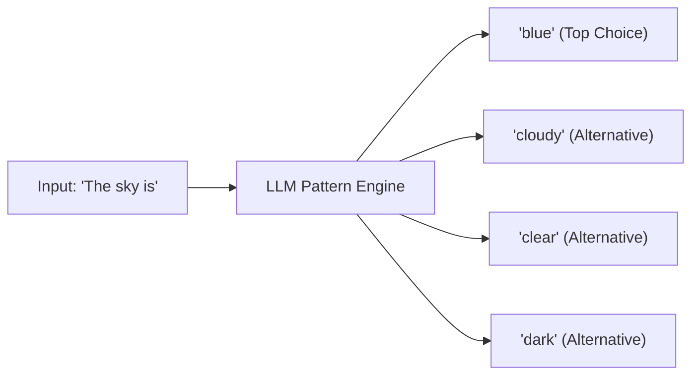
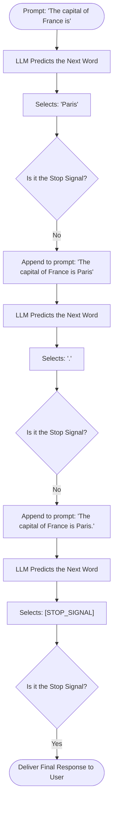
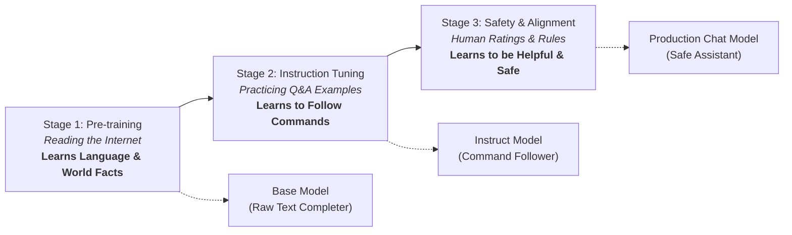
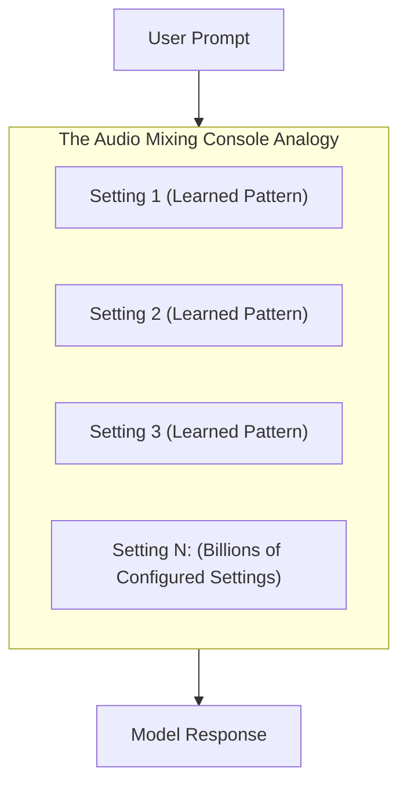
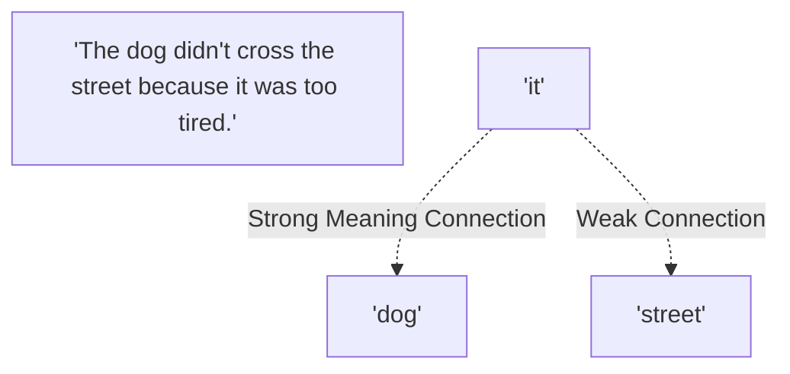
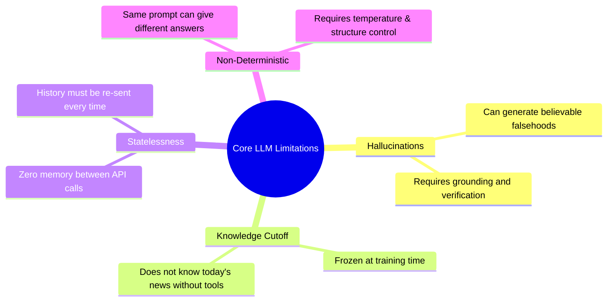

# 01 - LLM Fundamentals: Core Principles & Mental Models

> **Welcome to Phase 2!**  
> As a software engineer building AI systems, **you do not need a math or machine learning degree**. You do not need to calculate gradients, write calculus formulas, or do matrix math.  
> Your job as an **AI Engineer** is to understand the *mental model*, *behaviors*, *capabilities*, and *failure modes* of LLMs so you can build reliable software around them.

---

## 📑 Table of Contents
1. [What is an LLM? (The Autocomplete Mental Model)](#1-what-is-an-llm-the-autocomplete-mental-model)
2. [The Core Mechanism: The Text-Prediction Loop](#2-the-core-mechanism-the-text-prediction-loop)
3. [How LLMs are Created: The 3 Stages of Training](#3-how-llms-are-created-the-3-stages-of-training)
4. [Base Models vs. Instruction-Tuned (Chat) Models](#4-base-models-vs-instruction-tuned-chat-models)
5. [What are Parameters (7B, 70B, 405B)?](#5-what-are-parameters-7b-70b-405b)
6. [Why Transformers are Special: Context & Attention](#6-why-transformers-are-special-context--attention)
7. [The 4 Core Limitations Every Software Engineer Must Know](#7-the-4-core-limitations-every-software-engineer-must-know)
8. [Mental Model Summary & Cheat Sheet](#8-mental-model-summary--cheat-sheet)

---

## 1. What is an LLM? (The Autocomplete Mental Model)

At its simplest and most practical level:

> 🧠 **An LLM is a super-advanced pattern-matching engine that predicts the most natural continuation for any given text.**

### 💡 The Smartphone Autocomplete Analogy
Think about typing a message on your smartphone. When you type:
`"I am on my..."`

Your phone suggests three choices:
* `way` (most likely)
* `phone` (possible)
* `bed` (less likely)

An LLM works on the **exact same principle**, but scaled up massively:
* Your phone's keyboard only looks at the last 1 or 2 words.
* An LLM reads and understands **thousands of words of context at once**.
* Your phone only knows basic language patterns. An LLM has read vast libraries of code, literature, science, documentation, and discussions, allowing it to understand complex reasoning, logic, and formatting.

---

## 2. The Core Mechanism: The Text-Prediction Loop

When you send a prompt to an AI model, the model does not write out an entire paragraph all at once. Instead, it runs an **autoregressive loop** (a step-by-step feedback loop):

1. It takes your prompt.
2. It predicts **one single next piece of text**.
3. It appends that new piece to the end of the text.
4. It feeds the updated text back into itself to predict the next piece.
5. It keeps repeating this loop until it produces an invisible **"Stop Signal"** indicating it has finished the answer.

### 🔄 The Step-by-Step Generation Loop

### 💡 Software Engineering Takeaway:
> The LLM **does not plan its full response in advance**. It generates word by word in real-time. Every word it chooses shapes what words can come after it!

---

## 3. How LLMs are Created: The 3 Stages of Training

How does a blank model become a helpful AI assistant like ChatGPT, Claude, or Gemini? It goes through three distinct stages:

### 1️⃣ Stage 1: Pre-training (Creating the "Base Model")
* **What happens**: The model is fed trillions of words from books, articles, code repositories, and web pages.
* **Goal**: Learn grammar, reasoning patterns, coding languages, and world knowledge simply by guessing missing words repeatedly.
* **Outcome**: A **Base Model**. It is extremely knowledgeable, but it **does not know how to hold a conversation**. If you ask it a question, it might just write more questions because it thinks it is completing an exam paper!

### 2️⃣ Stage 2: Supervised Fine-Tuning (Instruction Tuning)
* **What happens**: The model is trained on hundreds of thousands of high-quality examples of `(Question -> Helpful Answer)`.
* **Goal**: Teach the model that when a human gives a command or asks a question, it should provide a direct, helpful solution instead of just autocompleting.
* **Outcome**: An **Instruct Model** that follows tasks and responds like an assistant.

### 3️⃣ Stage 3: Alignment (Safety & Human Preference)
* **What happens**: Human reviewers rate different model responses, teaching the model which responses are helpful and which are harmful or incorrect.
* **Goal**: Guide the model to follow the **3 H's**:
  1. **Helpful**: Solve user problems clearly and thoroughly.
  2. **Honest**: Refrain from making things up when unsure.
  3. **Harmless**: Reject requests to generate malware, hate speech, or dangerous instructions.

---

## 4. Base Models vs. Instruction-Tuned (Chat) Models

In AI engineering, picking the right model type for your application is critical:

| Feature | 📄 Base Model (e.g. `Llama-3-8B`) | 💬 Instruct / Chat Model (e.g. `Llama-3-8B-Instruct`) |
| :--- | :--- | :--- |
| **What it is** | Raw text completer | Conversational task solver |
| **How it treats a prompt** | The beginning of a document | A request from a human user |
| **When to use it** | When fine-tuning custom models on proprietary data | For 99% of apps (chatbots, agents, APIs, RAG pipelines) |

### 🔍 Concrete Example

Imagine you submit this prompt:
> **Prompt:** `"What is the capital of Italy?"`

* **Base Model response:**
  > `"What is the capital of Spain? What is the capital of Germany? Answer Key: 1. Rome, 2. Madrid..."`  
  *(It assumes this is a geography quiz document and continues creating questions!)*

* **Instruct Model response:**
  > `"The capital of Italy is Rome."`  
  *(It understands you asked a direct question and gives the direct answer.)*

---

## 5. What are Parameters (7B, 70B, 405B)?

When you see model names like **Llama-3-8B** or **Qwen-70B**, the **"B" stands for Billions of Parameters**.

### What is a Parameter in Plain English?
* Think of parameters as **billions of internal settings or memory dials** inside the model.
* During **training**, these settings are tuned until the model understands language patterns and facts.
* During **inference (when you call the API)**, these settings are **locked and frozen** (read-only).

### ⚖️ Model Size Comparison for Developers

| Model Tier | Common Examples | Speed / Latency | Memory Needed | Best Use Case |
| :---: | :---: | :---: | :---: | :---: |
| **Small (1B – 8B)** | Llama-3-8B, Gemma-2-9B | ⚡ Ultra-fast | Low (~8 GB RAM) | Fast categorization, summarization, local offline tools |
| **Medium (14B – 70B)** | Llama-3-70B, Qwen-2.5-72B | ⏱️ Balanced | Moderate (~40 GB+ RAM) | General production backend, code generation, RAG, agents |
| **Large / Frontier (400B+)** | GPT-4o, Claude 3.5 Sonnet, Llama-3-405B | ⏳ Slower | Requires large GPU clusters | Complex architectural planning, hard reasoning, code review |

---

## 6. Why Transformers are Special: Context & Attention

Before modern LLMs, older text processing tools read text **one word at a time, left-to-right**. By the time they reached the end of a long paragraph, they had already "forgotten" the beginning.

In 2017, the **Transformer architecture** changed everything by introducing **Attention**:

* Instead of reading sequentially, the model looks at **all words in the prompt simultaneously**.
* It connects related words across sentences to understand the true meaning.

### 💡 Example: Resolving Ambiguity
Look at this sentence:
> *"The dog didn't cross the street because **it** was too tired."*

What does **"it"** refer to? The dog or the street?
* Humans know that streets don't get tired—dogs do.
* Through the Attention mechanism, the model connects **"it"** directly to **"dog"**, allowing it to understand the sentence with human-like comprehension.

---

## 7. The 4 Core Limitations Every Software Engineer Must Know

As an AI engineer, your primary value is building systems that **handle the weaknesses of LLMs gracefully**:

### 1. Hallucinations (Confidently Wrong)
* LLMs generate text that sounds convincing, even if it is factually incorrect.
* If an LLM doesn't know a fact, it might make up a plausible-sounding name or library.
* *How engineers solve this:* Provide verified source documents via **RAG (Retrieval-Augmented Generation)**.

### 2. Knowledge Cutoff (Frozen in Time)
* An LLM only knows what existed before its training date.
* It does not have live internet access unless your code connects it to an external search tool.

### 3. Statelessness (Zero Memory Between Calls)
* Every single API request is completely isolated and independent.
* If you tell the model your name in Request 1, and in Request 2 ask *"What is my name?"*, it will not know unless your application code sends Request 1 along with Request 2.

### 4. Non-Determinism (Variability)
* Unlike standard code where `add(2, 2)` always returns `4`, an LLM can phrase its answer differently each time you run it unless you configure it for strict consistency.

---

## 8. Mental Model Summary & Cheat Sheet

| Concept | What It Is | What It Is NOT |
| :--- | :--- | :--- |
| **LLM** | An advanced pattern-recognition and text-generation engine | A sentient brain or searchable SQL database |
| **Pre-training** | Reading web text to learn language, coding, and concepts | Teaching the model how to be a chatbot |
| **Instruction Tuning** | Teaching the model to answer questions and follow tasks | Feeding new real-time news into the model |
| **Parameters** | The frozen internal configuration settings that store learned patterns | Hardcoded lookup tables or database rows |
| **Attention** | Looking at all words simultaneously to connect related ideas | Reading one word at a time sequentially |
| **Inference** | Running the model in read-only mode to generate text | The model learning or updating itself while you chat |

---

## 🎯 You Are Ready for Topic 02!
You now have the complete foundational intuition for how LLMs work without any unnecessary math. Next up is **Topic 02: Tokens & Tokenization**, where we will explore how words are prepared and passed into the model!
