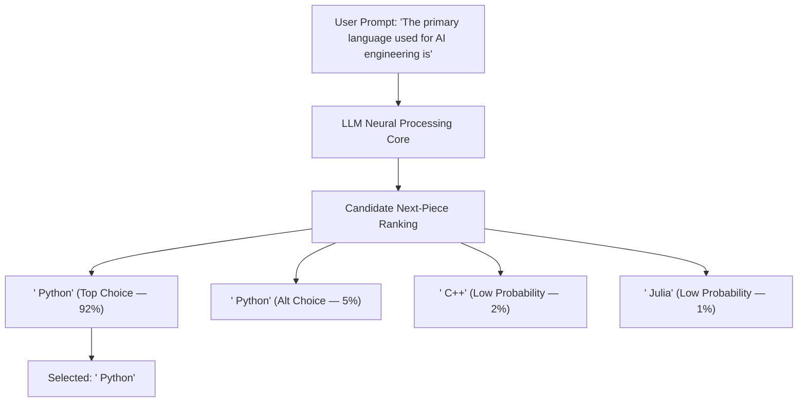
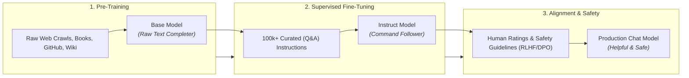
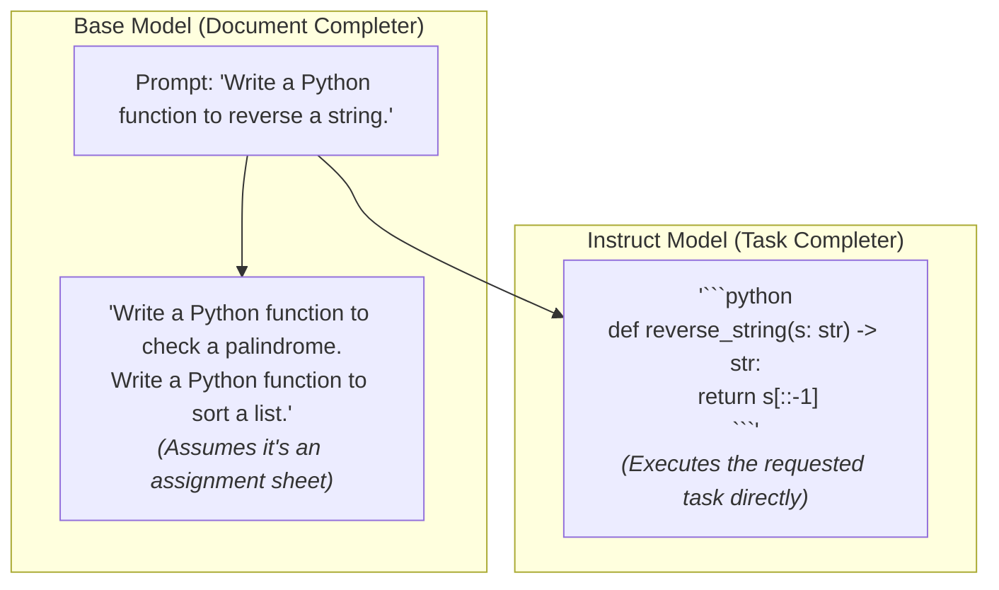
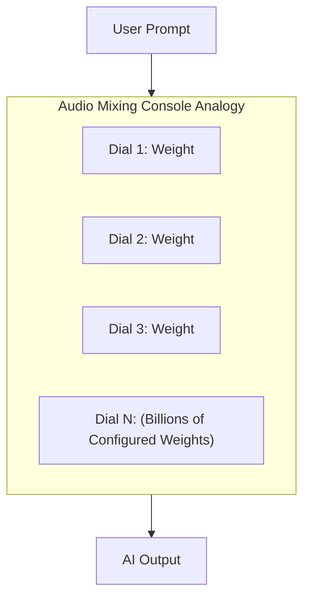
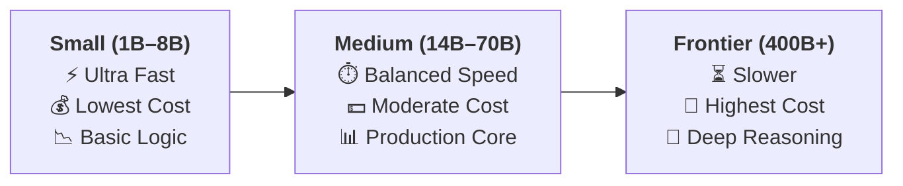
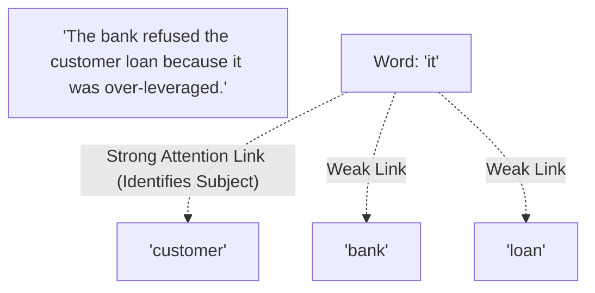
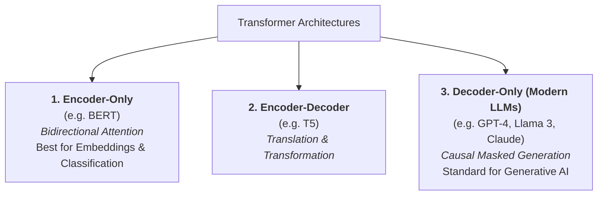
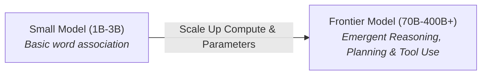
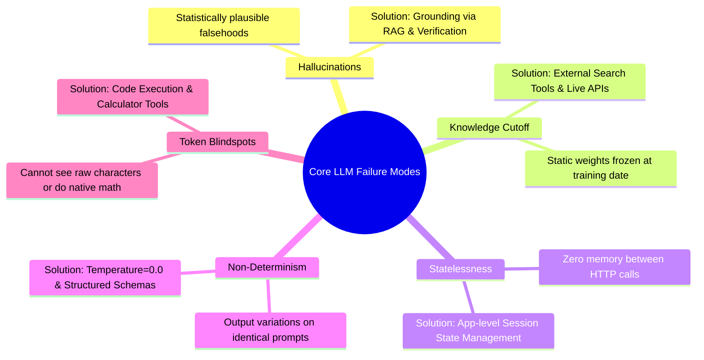
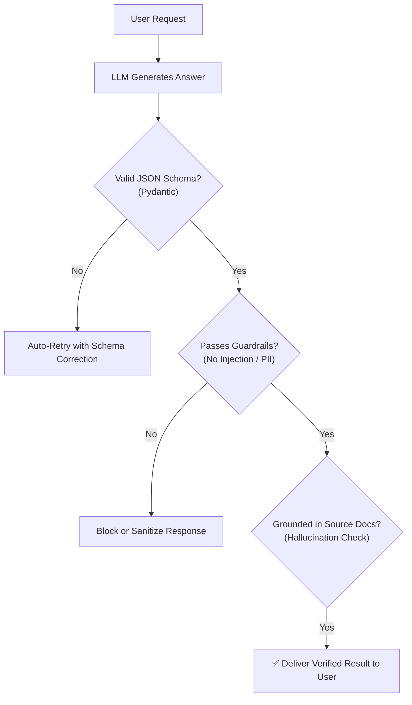

# 01 - LLM Fundamentals: The Comprehensive Architecture & Mental Model Masterclass

> **Welcome to Phase 2: LLM & API Fundamentals!**  
> As a software engineer entering AI engineering, **you do not need a machine learning degree or advanced math**. You do not need to calculate gradients or write tensor calculus.  
> However, to build robust, production-grade AI systems, you must possess an **exact, deep mental model** of how Large Language Models (LLMs) operate under the hood: how they generate text, how they are trained, why they behave differently than traditional software, and where their operational boundaries lie.

---

## 📑 Table of Contents
1. [What is an LLM? (The Core Mental Model)](#1-what-is-an-llm-the-core-mental-model)
2. [The Autoregressive Generation Engine](#2-the-autoregressive-generation-engine)
3. [The 3-Stage Training Pipeline (Web Data to Assistant)](#3-the-3-stage-training-pipeline-web-data-to-assistant)
4. [Base Models vs. Instruction-Tuned (Chat) Models](#4-base-models-vs-instruction-tuned-chat-models)
5. [Understanding Parameters (7B, 70B, 405B) & Model Sizing](#5-understanding-parameters-7b-70b-405b--model-sizing)
6. [The Transformer Architecture & Self-Attention](#6-the-transformer-architecture--self-attention)
7. [Emergent Abilities & In-Context Learning](#7-emergent-abilities--in-context-learning)
8. [The 5 Core Limitations & Failure Modes](#8-the-5-core-limitations--failure-modes)
9. [The AI Engineer's Production Mindset](#9-the-ai-engineers-production-mindset)
10. [Master Cheat Sheet & Reference Table](#10-master-cheat-sheet--reference-table)

---

## 1. What is an LLM? (The Core Mental Model)

At its absolute architectural foundation:

> 🧠 **A Large Language Model (LLM) is a pattern-recognition and probability-ranking engine that calculates the most statistically natural continuation for any given text prompt.**

### 💡 The Autocomplete Analogy Scaled by $10^9$
Think of the predictive keyboard on your smartphone. When you type:
`"I am running late because of..."`

Your phone suggests three words:
* `traffic` (Highest probability)
* `work` (Moderate probability)
* `weather` (Lower probability)

An LLM operates on this **exact same core principle**, but scaled up to an unprecedented degree:
1. **Context Depth**: Your phone looks at the last 1 or 2 words. An LLM reads and correlates **hundreds of thousands of words** across a prompt simultaneously.
2. **Knowledge Representation**: Instead of simple grammar dictionaries, the LLM has absorbed millions of books, entire codebases, scientific papers, encyclopedias, and discussions, allowing it to predict continuations that simulate multi-step reasoning, programming logic, translation, and structured data generation.



---

## 2. The Autoregressive Generation Engine

The technical term for how modern LLMs generate text is **Autoregressive Generation**.
* **Auto** = *Self*
* **Regressive** = *Feeding past outputs back into the inputs*

### 🔄 The Step-by-Step Generation Lifecycle:
1. The model takes your initial prompt.
2. It scores and selects **one single next piece of text**.
3. It appends that new piece to the original prompt.
4. It feeds the expanded text back into itself as the new input.
5. It repeats steps 2–4 in an automated loop.
6. The loop terminates ONLY when the model outputs a special invisible **Stop Signal** (often called `[EOS]` or `<|eot_id|>`).

```mermaid
sequenceDiagram
    autonumber
    actor User as User / Client App
    participant Loop as Generation Loop
    participant LLM as LLM Engine
    
    User->>Loop: Prompt: "Write a haiku about code"
    Loop->>LLM: Input: "Write a haiku about code"
    LLM-->>Loop: Predicts: "Silent"
    Loop->>LLM: Input: "Write a haiku about code Silent"
    LLM-->>Loop: Predicts: " keys"
    Loop->>LLM: Input: "Write a haiku about code Silent keys"
    LLM-->>Loop: Predicts: " tap"
    Loop->>LLM: ... (Continues word by word) ...
    LLM-->>Loop: Predicts: [STOP_SIGNAL]
    Loop-->>User: Complete Output Delivered
```

### 🔑 Critical Architectural Insight for Engineers:
> **An LLM does not plan its entire answer before writing.**  
> It generates sequentially. The word it chooses at Step 1 strictly limits and shapes the possible words it can choose at Step 100. This is why **Chain-of-Thought (CoT)** prompting (asking the model to *"think step-by-step"*) works so well—it forces the model to generate reasoning words first, which steer subsequent conclusion words toward higher accuracy!

---

## 3. The 3-Stage Training Pipeline (Web Data to Assistant)

How does an uninitialized, blank neural network transform into an intelligent assistant like Claude, GPT-4, or Llama 3? It undergoes **three distinct manufacturing stages**:



---

### 1️⃣ Stage 1: Pre-Training (Creating the "Base Model")
* **The Training Data**: Trillions of words extracted from web scrapes (Common Crawl), Wikipedia, books, scientific arXiv papers, and public code repositories.
* **The Data Curation Process**:
  * *Deduplication*: Removing duplicate web pages and spam.
  * *Heuristic Filtering*: Stripping out machine-generated junk, HTML boilerplate, and corrupted text.
  * *Toxicity Filtering*: Removing extreme hate speech and sensitive personal information (PII).
* **The Training Goal**: **Self-Supervised Next-Word Guessing**. The model reads text, masks the next word, guesses it, and adjusts its internal connections when wrong.
* **The Outcome**: A **Base Model** (e.g., `Llama-3-8B-Base`).
  * *Capabilities*: Speaks fluent grammar, understands 50+ programming languages, knows broad world history and science.
  * *Limitations*: **It does not act like an assistant.** It has no concept of answering a question; it only knows how to continue a document.

---

### 2️⃣ Stage 2: Supervised Fine-Tuning (SFT / Instruction Tuning)
* **The Problem with Base Models**: If you send the prompt `"What is the capital of France?"`, a Base Model might output:
  `"What is the capital of Germany? What is the capital of Spain?"` (because it thinks it is continuing a geography quiz sheet).
* **The SFT Solution**: The model is trained on hundreds of thousands of carefully written dialogues formatted as:
  ```text
  User: What is the capital of France?
  Assistant: The capital of France is Paris.
  ```
* **The Outcome**: An **Instruct Model** that understands user commands, questions, and formatting requests.

---

### 3️⃣ Stage 3: Alignment & Safety (RLHF & DPO)
* **The Goal**: Align the model with the **3 H's**:
  1. **Helpful**: Solve user queries thoroughly and accurately.
  2. **Honest**: Avoid inventing facts (hallucinations) when uncertain.
  3. **Harmless**: Refuse to generate malicious software, weapons instructions, or hate speech.
* **How It Works**:
  * **RLHF (Reinforcement Learning from Human Feedback)**: Human evaluators compare two generated responses ($A$ vs $B$) and rank which is better. A scoring model teaches the LLM to favor the higher-ranked behavior.
  * **DPO (Direct Preference Optimization)**: A modern, streamlined technique that directly trains the model on winning vs losing response pairs without needing a separate reward model.
* **The Outcome**: The finished **Production Chat Model** ready for commercial APIs.

---

## 4. Base Models vs. Instruction-Tuned (Chat) Models

Choosing between a Base model and an Instruct model is an essential design decision:



### Comprehensive Comparison Matrix:

| Dimension | 📄 Base Model (`Llama-3-70B`) | 💬 Instruct / Chat Model (`Llama-3-70B-Instruct`) |
| :--- | :--- | :--- |
| **Primary Function** | Raw text completion | Task execution & interactive dialogue |
| **Prompt Interpretation** | The start of an uncompleted document | A direct instruction from a human user |
| **Response Tone** | Variable (mimics training documents) | Professional, helpful, objective assistant |
| **Safety Guardrails** | Minimal / Unaligned | Filtered against dangerous & harmful outputs |
| **When AI Engineers Use It** | Custom foundational domain fine-tuning (e.g. specialized medical/legal base) | **99% of AI Engineering applications** (APIs, RAG, Chatbots, Agents, Tool Calling) |

---

## 5. Understanding Parameters (7B, 70B, 405B) & Model Sizing

When models are labeled **8B**, **70B**, or **405B**, the **"B" stands for Billions of Parameters**.



### What is a Parameter in Plain English?
* Parameters are the **billions of internal numerical settings and connections** inside the model network.
* During **Training**, these dials are turned billions of times until the model learns language patterns, facts, and logic.
* During **Inference (API runtime)**, these dials are **completely frozen (read-only)**.

---

### ⚖️ The Engineering Sizing Matrix:



| Tier | Representative Models | VRAM / RAM Needed | Latency | Reasoning Capability | Best Production Use Case |
| :---: | :---: | :---: | :---: | :---: | :---: |
| **Small Tier<br>(1B – 8B)** | Llama-3-8B<br>Gemma-2-9B<br>Mistral-7B | 6 GB – 16 GB | ⚡ **Ultra-Fast**<br>(< 200ms TTFT) | Good for classification, summarization, extraction | Edge devices, offline mobile apps, high-throughput routing & filtering |
| **Medium Tier<br>(14B – 70B)** | Llama-3-70B<br>Qwen-2.5-72B | 40 GB – 140 GB | ⏱️ **Balanced**<br>(~500ms TTFT) | Strong reasoning, coding, tool-calling, multi-step flows | Production backend core, RAG synthesizers, autonomous agent workers |
| **Frontier Tier<br>(400B+)** | GPT-4o<br>Claude 3.5 Sonnet<br>Llama-3-405B | Distributed GPU Clusters | ⏳ **Slower**<br>(~1–2s TTFT) | State-of-the-art architecture, complex math, code refactoring | Automated code generation, complex planning agents, LLM-as-a-judge evaluators |

---

## 6. The Transformer Architecture & Self-Attention

Prior to 2017, natural language processing relied on **RNNs (Recurrent Neural Networks)** and **LSTMs**.

### The Flaw of Older RNNs:
* RNNs processed text sequentially: Word 1 $\rightarrow$ Word 2 $\rightarrow$ Word 3.
* By the time an RNN reached Word 50, it had already suffered from memory decay and "forgot" Word 1.
* They could not scale across large GPU clusters because Word 2 could not start until Word 1 finished.

### The Breakthrough (2017): Self-Attention
In 2017, the seminal paper *"Attention Is All You Need"* introduced the **Transformer**. Instead of reading sequentially:
* The Transformer ingests **all words in the prompt simultaneously**.
* It calculates **Attention Links** between every word and every other word in the prompt.



### 💡 Why Attention is Magic:
Consider the word **"bank"**:
* Sentence A: *"The boat floated near the river **bank**."*
* Sentence B: *"I deposited my paycheck into the **bank**."*

In Sentence A, the attention mechanism connects `"bank"` to `"river"` and `"boat"`, understanding it means land near water. In Sentence B, it connects `"bank"` to `"paycheck"` and `"deposited"`, understanding it means a financial institution.

---

### The 3 Transformer Architectural Families:



> 💡 **Key Takeaway:** Virtually all modern generative LLMs (GPT-4o, Claude 3.5, Llama 3, Gemini) are **Decoder-Only** architectures. They use "Causal Masking" to ensure that when generating word $N$, the model can only look at past words and cannot peek into the future.

---

## 7. Emergent Abilities & In-Context Learning

Two phenomena make modern LLMs behave like intelligent software platforms:

### 1️⃣ Emergent Abilities
When models cross certain parameter thresholds (e.g. scaling from 7B to 70B+), capabilities that were non-existent in smaller models suddenly **emerge**:
* Multi-step symbolic reasoning
* Translating obscure programming dialects
* Reading and fixing complex logic bugs
* Following nuanced negative constraints (*"Do NOT include the letter 'e'"*)



### 2️⃣ In-Context Learning (Few-Shot Prompting)
Traditional machine learning requires retraining models with new datasets to teach them a new task.  
LLMs possess **In-Context Learning**: you can provide 2–3 examples inside your prompt, and the model instantly learns the pattern **on-the-fly without changing its internal weights**:

```text
Prompt:
Classify user sentiment into [POSITIVE, NEGATIVE, NEUTRAL]:
"The product arrived broken." -> NEGATIVE
"Fast delivery, works great!" -> POSITIVE
"It is blue." -> 

LLM Instantly Predicts: NEUTRAL
```

---

## 8. The 5 Core Limitations & Failure Modes

As an AI engineer, your primary engineering value comes from **protecting your system against LLM weaknesses**:



---

### 1. Hallucinations (Confidently Incorrect)
* **Why it happens**: The LLM optimizes for *linguistic fluency and statistical likelihood*, not factual truth. If it lacks data, it generates whatever sounds grammatically and contextually convincing.
* **Engineering Solution**: Use **RAG (Retrieval-Augmented Generation)** to feed verified reference documents directly into the prompt context (covered in Phase 06).

### 2. Knowledge Cutoff (Frozen Snapshots)
* **Why it happens**: Training takes months. The day training finishes, the model's knowledge stops.
* **Engineering Solution**: Connect the LLM to live internet search tools or database retrieval pipelines (covered in Phase 07).

### 3. Statelessness (Zero Inherent Memory)
* **Why it happens**: LLMs are stateless HTTP functions. Each request is 100% isolated.
* **Engineering Solution**: Your application backend must maintain message history lists and pass previous turns back to the model with every new request.

### 4. Non-Determinism (Sampling Variability)
* **Why it happens**: At runtime, models sample from probability distributions rather than always picking the top word.
* **Engineering Solution**: Set `temperature = 0.0` for deterministic tasks, and enforce rigid JSON schemas using Pydantic (covered in Phase 05 & Topic 10).

### 5. Token Blindspots (Character & Math Limits)
* **Why it happens**: Because LLMs process text in token chunks rather than individual letters or digits, they struggle with letter counting (*"How many 'r's in strawberry?"*) or multiplying large numbers.
* **Engineering Solution**: Equip the model with Python code execution tools or calculators (covered in Phase 07).

---

## 9. The AI Engineer's Production Mindset

In traditional software:
* `200 OK` means the system executed successfully and returned the right result.

In AI engineering:
* **A `200 OK` only means the LLM returned text.** It does NOT mean the answer is accurate, safe, or correctly formatted.



---

## 10. Master Cheat Sheet & Reference Table

| Concept | What It Actually Is | What It Is NOT |
| :--- | :--- | :--- |
| **LLM** | A probabilistic next-token generator trained on language patterns | A sentient mind or searchable SQL database |
| **Autoregressive** | A generation loop where each new word is fed back into the prompt | Pre-generating entire paragraphs in advance |
| **Base Model** | A raw text completer trained on unlabeled web corpora | An interactive, safe conversational assistant |
| **Instruct Model** | A fine-tuned model trained to follow user instructions & Q&A | A model containing real-time news updates |
| **Parameters** | The frozen numerical weights that store learned patterns | Database rows or cached files |
| **Self-Attention** | Ingesting all words at once and calculating contextual links | Reading one word at a time sequentially |
| **Decoder-Only** | The modern architecture family used by GPT, Claude, and Llama | An image classification or translation-only pipeline |
| **Inference** | Read-only execution of the frozen model weights | Active learning or self-updating during conversation |

---

## 🎯 Next Step in Phase 2
You now have the complete foundational architecture and mental models of LLMs!  
When you are ready, we will proceed to **[02 - Tokens & Tokenization](file:///home/user2/PythonProject/Python-for-ai-engineering/02-llm-api-fundamentals/02-tokens)** to inspect how text is translated into numbers before the neural network ever touches it!
