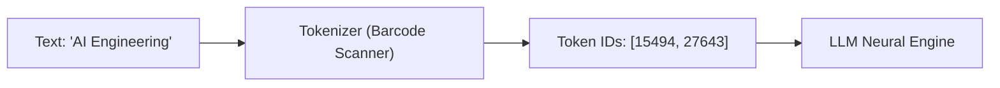
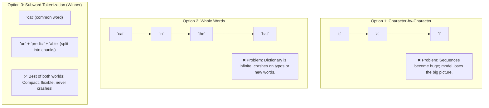
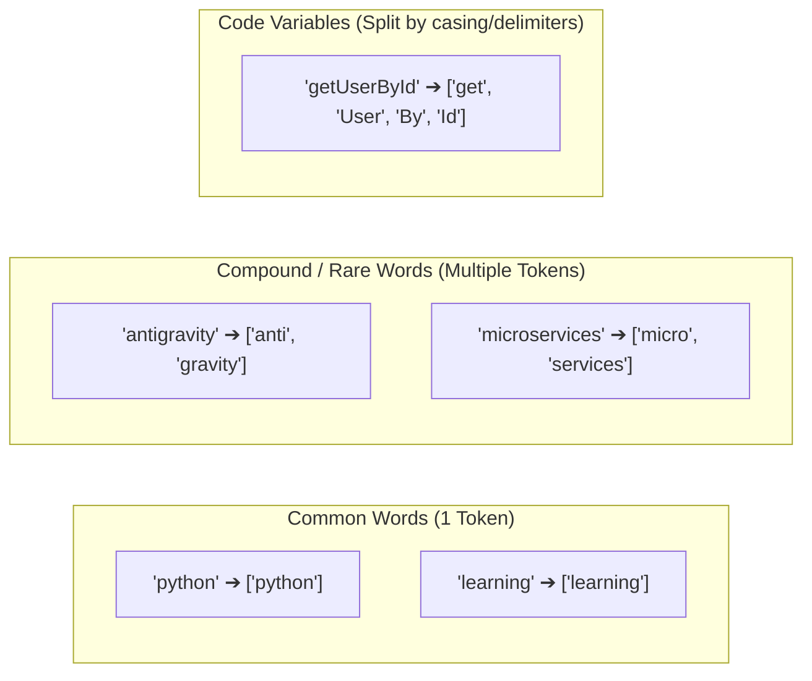
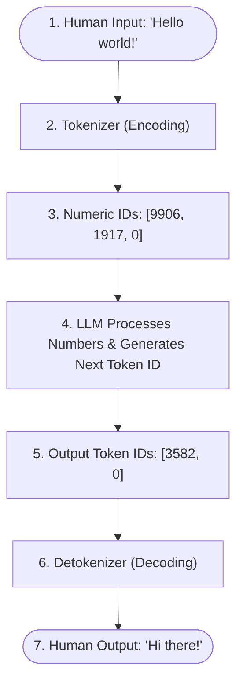
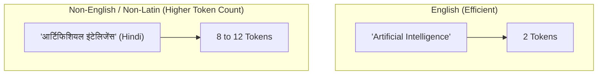
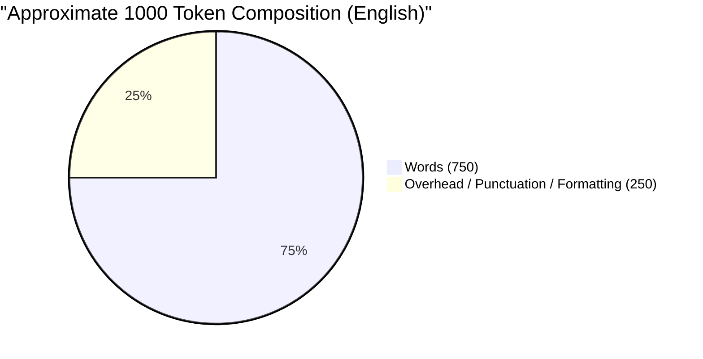

# 02 - Tokens & Tokenization: The Language of AI

> **Mental Model Shift**:  
> Humans read sentences word-by-word. Computers read binary ($0$s and $1$s).  
> **LLMs do neither!** LLMs read and process text in chunks called **Tokens**.  
> Understanding tokens is the single most important prerequisite for managing context limits, calculating API costs, and debugging model behavior.

---

## 📑 Table of Contents
1. [What is a Token? (The Supermarket Barcode Analogy)](#1-what-is-a-token-the-supermarket-barcode-analogy)
2. [Why Not Just Use Whole Words or Letters?](#2-why-not-just-use-whole-words-or-letters)
3. [The Subword Solution: Byte-Pair Encoding (BPE)](#3-the-subword-solution-byte-pair-encoding-bpe)
4. [The Tokenizer Pipeline (Encoding & Decoding)](#4-the-tokenizer-pipeline-encoding--decoding)
5. [The Hidden Rules of Tokens Every Developer Must Know](#5-the-hidden-rules-of-tokens-every-developer-must-know)
6. [Why Tokens Explain Famous AI Quirks](#6-why-tokens-explain-famous-ai-quirks)
7. [The Developer's Golden Rule of Thumb (Estimating Tokens)](#7-the-developers-golden-rule-of-thumb-estimating-tokens)
8. [Developer Cheat Sheet & Summary](#8-developer-cheat-sheet--summary)

---

## 1. What is a Token? (The Supermarket Barcode Analogy)

An LLM cannot directly read raw English letters like `"c-a-t"`. It only knows how to process numbers.

### 💡 The Supermarket Barcode Analogy
When you buy an apple at a supermarket checkout:
* The cash register does not read the word `"Apple"`.
* The scanner reads a **numeric barcode** (e.g. `4011`).
* The system looks up `4011` in its product database to know what item it is.

A **Token** is simply a chunk of characters that has been assigned a permanent unique identification number (**Token ID**) in the model's vocabulary dictionary.

* A token can be a **single character**: `"a"`, `"!"`, `"\n"`
* A token can be a **whole word**: `"apple"`, `"developer"`, `"the"`
* A token can be a **part of a word (subword)**: `"un"`, `"believ"`, `"able"`

---

## 2. Why Not Just Use Whole Words or Letters?

When building modern AI, researchers had three options for reading text. Understanding why two of them failed makes the modern approach crystal clear:

### Breakdown of the 3 Options:

| Approach | How it works | Why it was rejected / chosen |
| :--- | :--- | :--- |
| **1. Characters** | Breaks every word into individual letters (`c-o-d-i-n-g`) | **Rejected**: Sentences become thousands of characters long. The model wastes immense compute just figuring out what word is being spelled. |
| **2. Whole Words** | Stores every single word as its own ID (`"coding"`, `"developer"`) | **Rejected**: Human languages have millions of words, plus slang, URLs, typos, and code variables (`getUserDataById`). An unseen word causes an `Unknown Word` crash. |
| **3. Subwords (BPE)** | Common words stay whole; rare words split into reusable pieces | **CHOSEN**: Common words take 1 token, while rare or complex words break cleanly into pieces (`micro` + `service`). It can handle **any** text without crashing! |

---

## 3. The Subword Solution: Byte-Pair Encoding (BPE)

Modern models (like GPT-4, Llama 3, Claude, Gemini) use an algorithm called **Byte-Pair Encoding (BPE)** to build their vocabulary.

### How BPE Splits Words in Practice:

---

## 4. The Tokenizer Pipeline (Encoding & Decoding)

Every time you talk to an LLM, the text goes through a two-step round-trip pipeline:

### The Two Core Operations:
1. **Encoding (Tokenizing)**: Turns a human string into a list of numbers:  
   `"Hello world"` $\rightarrow$ `[9906, 1917]`
2. **Decoding (Detokenizing)**: Turns a list of numbers back into human text:  
   `[9906, 1917]` $\rightarrow$ `"Hello world"`

---

## 5. The Hidden Rules of Tokens Every Developer Must Know

These rules will save you hours of debugging when writing prompts and building AI applications:

### 1️⃣ Leading Spaces are Part of the Token!
In tokenizers, a space before a word is attached to the word itself.

* `"apple"` (no leading space) $\rightarrow$ Token ID `1234`
* `" apple"` (with leading space) $\rightarrow$ Token ID `5678`

> ⚠️ **Developer Note:** Because `"apple"` and `" apple"` are completely different numbers to the LLM, extra or missing whitespace in your prompt can slightly alter how the model processes your text.

---

### 2️⃣ Numbers & Math are Fragmented
Unlike human words, long numbers are not stored as single units. They get chopped up into arbitrary numeric chunks.

* `"100"` $\rightarrow$ `["100"]` (1 token)
* `"123456789"` $\rightarrow$ `["123", "456", "789"]` (3 separate tokens)

> 💡 **Why this matters:** The model sees separate pieces (`123`, `456`, `789`) rather than a single continuous number. This is why LLMs often struggle with multi-digit multiplication or counting digits!

---

### 3️⃣ Code Indentation & Casing
* **Tabs vs Spaces**: Four spaces `"    "` might be compressed into 1 token, but weird indentation or mixed spaces/tabs can consume multiple tokens.
* **Variable Naming Styles**:
  * `snake_case` (`calculate_tax_amount`): `["calculate", "_tax", "_amount"]` (3 tokens)
  * `camelCase` (`calculateTaxAmount`): `["calculate", "Tax", "Amount"]` (3 tokens)

---

### 4️⃣ The "Multilingual Token Tax"
Because tokenizers are mostly trained on English text from the internet:
* English words are very common $\rightarrow$ usually **1 token per word**.
* Non-Latin scripts (Hindi, Arabic, Japanese, Korean, Cyrillic) $\rightarrow$ often **2 to 6 tokens per word**!

> 💰 **Cost & Context Impact:** Because you pay LLM providers per token (and context windows are measured in tokens), non-English queries consume more of your budget and context space for the exact same sentence!

---

## 6. Why Tokens Explain Famous AI Quirks

Understanding tokens solves the biggest mysteries developers encounter with LLMs:

### 🍓 Quirk 1: "Why can't an LLM count the letters in 'strawberry'?"
If you ask an LLM: *"How many 'r's are in the word strawberry?"*, older models often answer *"2"*. Why?

* **The Reason**: The LLM **never sees the individual letters `s-t-r-a-w-b-e-r-r-y`**.
* The tokenizer immediately converts the entire word into a single token chunk: `["strawberry"]` (Token ID `49615`).
* The model only sees the ID `49615`. It has to "remember" from training data how many letters are inside that ID, which is why it often miscounts!

---

### 🔤 Quirk 2: "Why do LLMs struggle to spell words backwards?"
If you ask: *"Write 'hello' backwards letter by letter"*:
* The model receives `["hello"]` as a single unit. It cannot simply slice an array backwards like Python `s[::-1]`; it has to guess the sequence of reverse characters one token at a time.

---

## 7. The Developer's Golden Rule of Thumb (Estimating Tokens)

You don't always need to run a tokenizer to get a rough estimate. Use these industry rules of thumb for English text:

$$\text{1 Token} \approx 4\text{ Characters of English Text}$$

$$\text{100 Tokens} \approx 75\text{ English Words}$$

$$\text{1,000 Tokens} \approx 750\text{ English Words (about 1.5 pages of single-spaced text)}$$

---

## 8. Developer Cheat Sheet & Summary

| Question | Answer |
| :--- | :--- |
| **What is a token?** | A numeric ID representing a character, subword, or full word in the model's vocabulary. |
| **What tool do we use in Python?** | OpenAI's open-source library **`tiktoken`** (or HuggingFace `tokenizers`). |
| **Why is token counting important?** | 1. LLM API billing is charged per 1,000 or 1,000,000 tokens. 2. Context windows have strict maximum token limits. 3. Rate limits are measured in **TPM** (Tokens Per Minute). |
| **Does whitespace matter?** | Yes! Leading spaces create different token IDs than words without spaces. |
| **Do all models use the same tokens?** | No. Different models (GPT-4o, Claude 3.5, Llama 3) have different vocabularies and tokenizers. |

---

## 💻 Ready for Hands-On Code!
Now that the concepts and mental models are clear, open:
1. **`practice.py`**: Hands-on Python exercises using `tiktoken` to inspect, encode, decode, and count tokens.
2. **`experiments.py`**: Real-world benchmarks comparing whitespace, code variable casing, and multilingual token efficiency!
