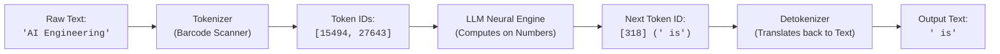
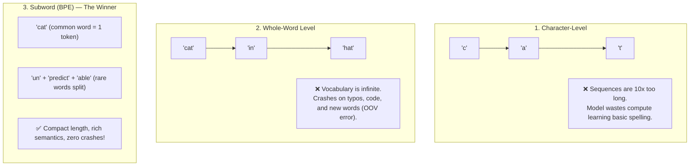
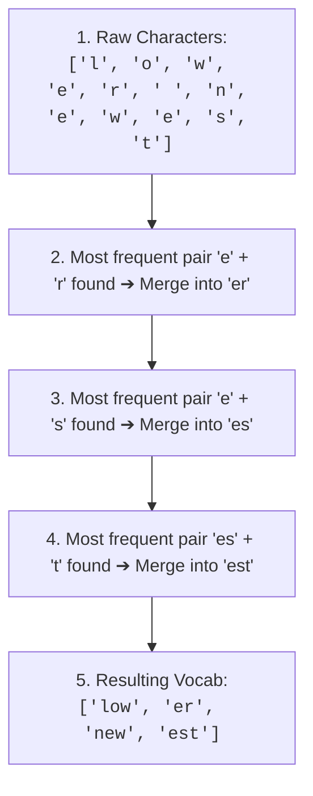
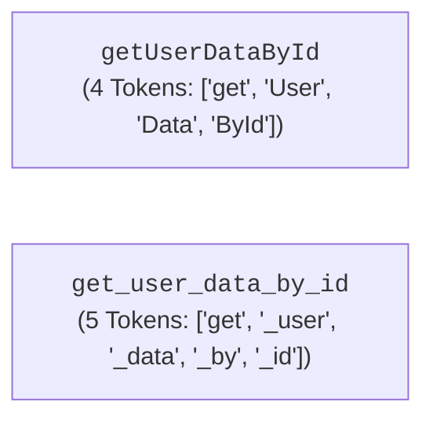
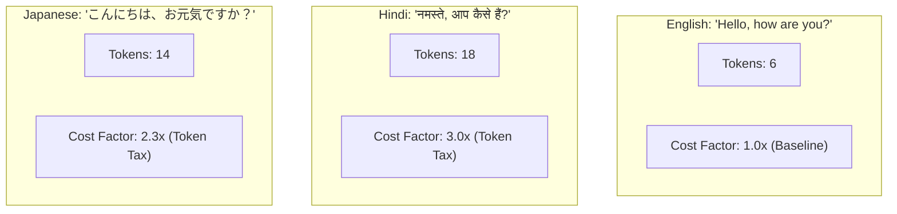
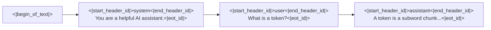
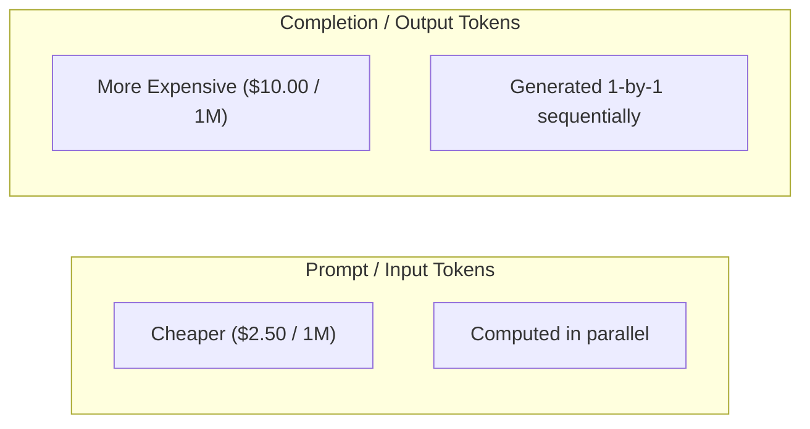
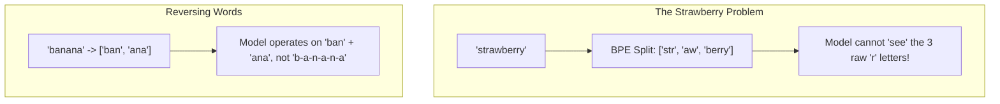
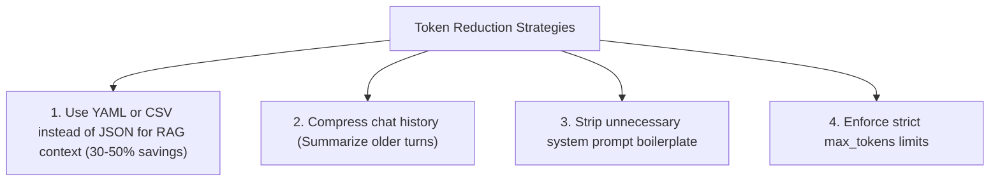

# 02 - Tokens & Tokenization: The Language & Economics of AI

> **Mental Model Shift**:  
> Humans read sentences word-by-word. Computers read binary ($0$s and $1$s).  
> **LLMs do neither!** LLMs read, reason, and generate text in chunks called **Tokens**.  
> Understanding tokens is the single most important prerequisite for managing context limits, calculating API costs, designing prompts, and debugging model cognitive blindspots.

---

## 📑 Table of Contents
1. [What is a Token? (The Supermarket Barcode Analogy)](#1-what-is-a-token-the-supermarket-barcode-analogy)
2. [Why Characters & Whole Words Failed](#2-why-characters--whole-words-failed)
3. [How Byte-Pair Encoding (BPE) Works](#3-how-byte-pair-encoding-bpe-works)
4. [The 5 Hidden Tokenization Rules Every Engineer Must Know](#4-the-5-hidden-tokenization-rules-every-engineer-must-know)
5. [Special Tokens & Structural Protocol Markers](#5-special-tokens--structural-protocol-markers)
6. [Counting & Inspecting Tokens with Python (tiktoken)](#6-counting--inspecting-tokens-with-python-tiktoken)
7. [Token Economics: Pricing & Cost Estimation Formulas](#7-token-economics-pricing--cost-estimation-formulas)
8. [Why Tokens Explain Famous AI Quirks](#8-why-tokens-explain-famous-ai-quirks)
9. [The Token Efficiency & Cost Reduction Playbook](#9-the-token-efficiency--cost-reduction-playbook)
10. [Master Cheat Sheet & Reference Table](#10-master-cheat-sheet--reference-table)

---

## 1. What is a Token? (The Supermarket Barcode Analogy)

An LLM cannot directly read raw English letters or characters. Neural networks operate exclusively on numeric vectors.

### 💡 The Supermarket Barcode Analogy
When you buy an apple at a supermarket checkout:
* The scanner does not read the English word `"Honeycrisp Apple"`.
* The scanner reads the **numeric barcode** `4011`.
* The checkout computer looks up `4011` in its central database.



A **Token** is a subword chunk of characters assigned a permanent, unique identification number (**Token ID**) in the model's vocabulary dictionary.

* A token can be a **single character**: `"a"`, `"!"`, `"\n"`
* A token can be a **whole word**: `"apple"`, `"developer"`, `"the"`
* A token can be a **subword fragment**: `"un"`, `"believ"`, `"able"`

---

## 2. Why Characters & Whole Words Failed

When designing natural language processing models, computer scientists had three architectural choices. Understanding why characters and whole words failed explains why subwords dominate modern AI:



### The 3 Paradigms Compared:

| Paradigm | How It Works | Vocabulary Size | Why It Succeeded / Failed |
| :--- | :--- | :---: | :--- |
| **Character-Level** | Breaks text into individual letters (`c-o-d-i-n-g`) | Small (~256) | **Failed**: Sentences become thousands of steps long. Attention memory explodes, and models struggle to capture long-range semantics. |
| **Whole-Word Level** | Every single distinct word has its own ID (`"coding"`, `"developer"`) | Infinite (Millions+) | **Failed**: Out-Of-Vocabulary (OOV) crash when encountering typos, new slang, or code variables like `getUserById`. |
| **Subword Level (BPE)** | Common words stay whole; rare words break into reusable syllables | Optimal (32k – 200k) | **Standard for all modern LLMs**: Fixed vocabulary size, short sequence lengths, and handles any arbitrary text without crashing. |

---

## 3. How Byte-Pair Encoding (BPE) Works

**Byte-Pair Encoding (BPE)** is the standard algorithm used by GPT-4, Llama 3, Claude, and Gemini to construct their vocabulary.

### 🔍 The BPE Training Process in 4 Intuitive Steps:
1. **Start with Base Bytes**: Start with raw characters/bytes ($a, b, c, ...$).
2. **Count Pair Frequencies**: Scan millions of documents and find the two adjacent tokens that appear together most frequently.
3. **Merge the Pair**: Combine that frequent pair into a brand new, single token (e.g., `'t'` + `'h'` $\rightarrow$ `'th'`).
4. **Repeat**: Repeat this merge process tens of thousands of times until the vocabulary reaches the desired size (e.g. 100,000 tokens for GPT-4).



### 📊 Real-World BPE Vocabulary Sizes:
* **GPT-2 / GPT-3**: ~50,257 tokens
* **Llama 2**: 32,000 tokens
* **GPT-4 (`cl100k_base`)**: 100,277 tokens
* **GPT-4o (`o200k_base`)**: 200,000 tokens (Massive multi-lingual compression!)
* **Llama 3**: 128,256 tokens

---

## 4. The 5 Hidden Tokenization Rules Every Engineer Must Know

### 1️⃣ Rule 1: Leading Whitespace is Part of the Token
In BPE tokenizers, spaces are **not** separate tokens. A space is attached to the **beginning** of the following word!

```text
"apple"   -> Token ID: 17180  (No space)
" apple"  -> Token ID: 21976  (With leading space)
```
> ⚠️ **Engineering Trap:** `"apple"` and `" apple"` are completely different tokens in the model's vocabulary! Extra spaces change token IDs.

---

### 2️⃣ Rule 2: Strict Case Sensitivity
Because capitalization changes frequencies in training data, uppercase and lowercase words are distinct tokens:

```text
"python"  -> Token ID: 31081
"Python"  -> Token ID: 18585
"PYTHON"  -> Split into: ['PY', 'THON'] (2 tokens!)
```

---

### 3️⃣ Rule 3: CamelCase vs. snake_case in Code
Code variable naming conventions directly impact token efficiency:



---

### 4️⃣ Rule 4: Number Chunking (Why LLMs Struggle with Math)
Tokenizers do not group numbers by mathematical value. They group numbers based on web frequencies:

```text
" 1234"      -> [' 12', '34']     (2 tokens)
" 12345678"  -> [' 12', '345', '678'] (3 tokens)
```
> 💡 **Why this matters:** The model never sees the digit `"1"` in the thousands place. It sees the atomic token ID for `" 12"`. This is why raw LLMs struggle with multi-digit arithmetic!

---

### 5️⃣ Rule 5: The Multilingual "Token Tax"
BPE vocabularies are heavily trained on English web pages. Non-Latin scripts take significantly more tokens to express the exact same meaning:



> 💡 **Cost & Latency Impact:** A Hindi or Japanese user will consume 2x–3x more tokens (and cost 2x–3x more money) than an English user for the exact same message!

---

## 5. Special Tokens & Structural Protocol Markers

In addition to standard words, tokenizers contain **Special Control Tokens** that act as invisible boundary markers for the model:



### Common Special Tokens:
| Special Token | Function |
| :--- | :--- |
| **`<|endoftext|>` / `[EOS]`** | Signals the model to stop generating text. |
| **`<|start_header_id|>`** | (Llama 3) Marks the beginning of a message role (system, user, assistant). |
| **`<|eot_id|>`** | (Llama 3) End Of Turn: marks the end of a single chat turn. |
| **`[PAD]`** | Padding token used to align batches of inputs to equal length. |

---

## 6. Counting & Inspecting Tokens with Python (`tiktoken`)

OpenAI provides **`tiktoken`**, an ultra-fast BPE tokenization library written in Rust with Python bindings.

### 1️⃣ Basic Encoding and Decoding:
```python
import tiktoken

# Load tokenizer for GPT-4o / GPT-4
encoding = tiktoken.get_encoding("cl100k_base")

text = "AI Engineering with Python is awesome!"

# 1. Encode text to Token IDs (List of integers)
token_ids = encoding.encode(text)
print(f"Token IDs   : {token_ids}")
print(f"Total Tokens: {len(token_ids)}")

# 2. Decode Token IDs back to original text
decoded_text = encoding.decode(token_ids)
print(f"Decoded Text: {decoded_text}")
```

### 2️⃣ Inspecting Individual Subword Pieces:
```python
import tiktoken

encoding = tiktoken.get_encoding("cl100k_base")
text = "Antigravity microservices"

# Inspect exact byte slices
tokens = encoding.encode(text)
subword_pieces = [encoding.decode_single_token_bytes(t).decode("utf-8") for t in tokens]

print(f"Token Splits: {subword_pieces}")
# Output: ['Ant', 'ig', 'ravity', ' micro', 'services']
```

---

## 7. Token Economics: Pricing & Cost Estimation Formulas

In LLM APIs, **you are billed per 1 Million Tokens**.  
Furthermore, **Output Tokens are 3x to 4x more expensive than Input Tokens** because generating output sequentially requires significantly more GPU compute!



### 💵 The Cost Estimation Formula:
$$\text{Cost (\USD)} = \left( \frac{\text{Input Tokens}}{1,000,000} \times \text{Input Price} \right) + \left( \frac{\text{Output Tokens}}{1,000,000} \times \text{Output Price} \right)$$

### Python Calculation Utility:
```python
def estimate_cost_usd(
    prompt_tokens: int, 
    completion_tokens: int, 
    model: str = "gpt-4o"
) -> float:
    # Rates per 1M tokens (Sample standard rates):
    PRICING = {
        "gpt-4o": {"input": 2.50, "output": 10.00},
        "gpt-4o-mini": {"input": 0.15, "output": 0.60},
        "claude-3-5-sonnet": {"input": 3.00, "output": 15.00},
    }
    
    rates = PRICING.get(model, PRICING["gpt-4o"])
    input_cost = (prompt_tokens / 1_000_000) * rates["input"]
    output_cost = (completion_tokens / 1_000_000) * rates["output"]
    
    return input_cost + output_cost

# Example: 1,500 prompt tokens and 350 output tokens on GPT-4o:
cost = estimate_cost_usd(1500, 350, model="gpt-4o")
print(f"Estimated Cost: ${cost:.6f} USD")
# Output: $0.007250 USD
```

---

## 8. Why Tokens Explain Famous AI Quirks

Understanding tokens demystifies several confusing behaviors of LLMs:



1. **"How many 'r's in strawberry?"**: The model does not receive the letters `s-t-r-a-w-b-e-r-r-y`. It receives three tokens: `[str, aw, berry]`. To count letters, it has to guess from subword probabilities!
2. **Reverse Spelling**: Asking a model to reverse `"developer"` often produces gibberish because the model thinks in syllables, not characters.
3. **Leading Whitespace Formatting in Code**: A single space before a Python `def` indentation can alter tokenization and degrade code generation quality.

---

## 9. The Token Efficiency & Cost Reduction Playbook

In production AI systems, reducing token count improves latency and directly reduces API bills:



### JSON vs. YAML for RAG Context:
When injecting 20 database rows into a prompt:
* **JSON**: Repeatedly prints `"customer_id"`, `"status"`, `"order_date"` for every single item $\rightarrow$ **High Token Bloat!**
* **YAML / CSV**: Prints column headers once and lists row values $\rightarrow$ **Saves up to 40% of input tokens!**

---

## 10. Master Cheat Sheet & Reference Table

| Rule / Concept | Practical Guideline |
| :--- | :--- |
| **English Rule of Thumb** | $1 \text{ token} \approx 0.75 \text{ words}$ (or $100 \text{ words} \approx 133 \text{ tokens}$) |
| **Leading Spaces** | `" text"` and `"text"` have different Token IDs. Always be consistent with spacing. |
| **Case Sensitivity** | `"AI"`, `"ai"`, and `"Ai"` are separate tokens. |
| **Output Token Cost** | Output tokens cost $3\times$ to $4\times$ more than input tokens. |
| **Tokenizer Library** | Use `tiktoken` in Python for fast offline OpenAI token counting. |
| **Stop Signals** | Special tokens (`<|endoftext|>`, `<|eot_id|>`) tell the inference engine to stop generation. |
| **Non-English Tax** | Hindi, Arabic, Japanese, and Cyrillic cost $2\times$ to $3\times$ more tokens than English. |

---

## 🎯 Next Step in Phase 2
Now that you have mastered tokens and BPE, you are ready to advance to **[03 - Context Windows](file:///home/user2/PythonProject/Python-for-ai-engineering/02-llm-api-fundamentals/03-context-windows)** to learn how model memory limits, context budgets, and "Lost-in-the-Middle" dynamics work!
