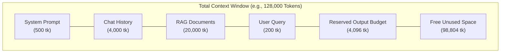
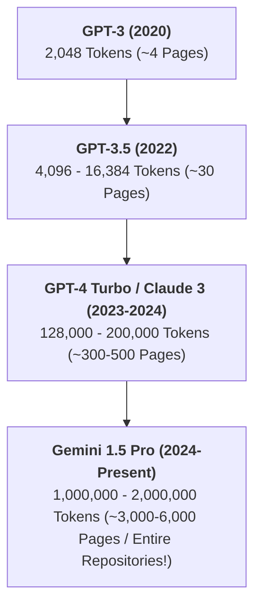
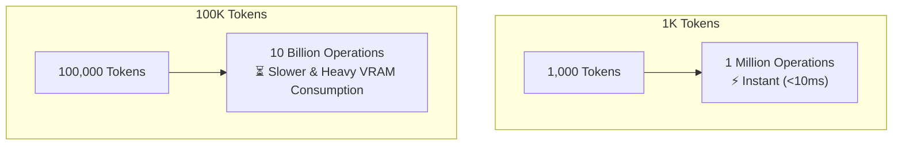
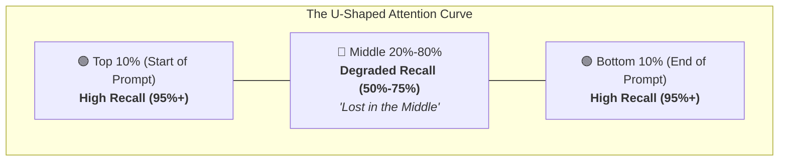
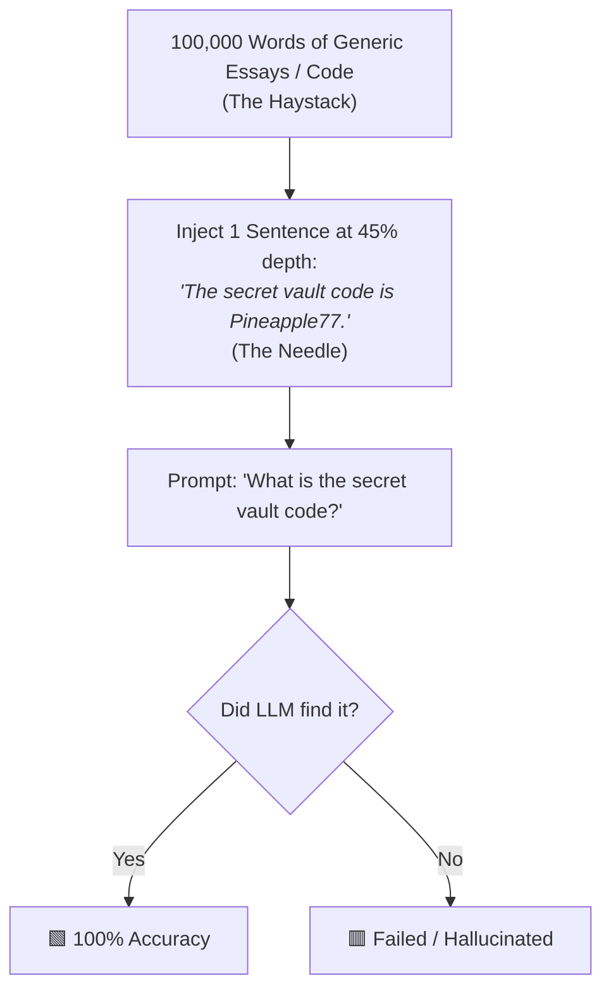
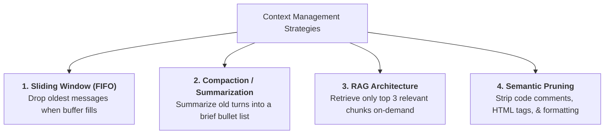
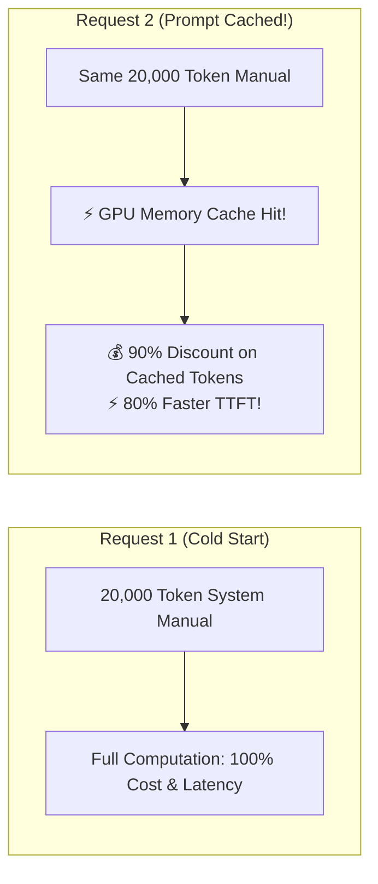

# 03 - Context Windows & Memory Dynamics: Managing LLM Attention

> **Mental Model**:  
> Think of the Context Window like the **physical surface area of a researcher's desk**.  
> * A **4K desk** (older GPT-3) only holds 3–4 pages. To read a new document, you must push the old one off the desk.  
> * A **128K desk** (GPT-4o / Claude 3.5) holds an entire 300-page book at once.  
> * A **2M desk** (Gemini 1.5 Pro) holds an entire library shelf.  
> However, having a giant desk doesn't guarantee the researcher won't misplace a note buried in the middle of a messy pile!  
> Managing context limits, retrieval degradation, and cost budgets is a fundamental duty of the AI Engineer.

---

## 📑 Table of Contents
1. [What is a Context Window? (The Total Token Budget)](#1-what-is-a-context-window-the-total-token-budget)
2. [Context Window Evolution (From 4K to 2M Tokens)](#2-context-window-evolution-from-4k-to-2m-tokens)
3. [The Cost of Attention (Why Huge Contexts are Computationally Expensive)](#3-the-cost-of-attention-why-huge-contexts-are-computationally-expensive)
4. [The "Lost in the Middle" Phenomenon (U-Shaped Attention)](#4-the-lost-in-the-middle-phenomenon-u-shaped-attention)
5. [Needle In A Haystack (NIAH) Benchmarking](#5-needle-in-a-haystack-niah-benchmarking)
6. [Context Budgeting & Overflow Prevention](#6-context-budgeting--overflow-prevention)
7. [4 Production Context Management Architectures](#7-4-production-context-management-architectures)
8. [Prompt Caching: Slashing Latency and Bills by 90%](#8-prompt-caching-slashing-latency-and-bills-by-90)
9. [Master Cheat Sheet & Reference Table](#9-master-cheat-sheet--reference-table)

---

## 1. What is a Context Window? (The Total Token Budget)

The **Context Window** is the maximum number of tokens an LLM can hold in active memory at one single point in time.

> 🚨 **The Golden Budget Law:**  
> The Context Window is **NOT** just your prompt size. It is the **shared total** of both your Input and the Model's Output!

$$\text{System Prompt} + \text{Chat History} + \text{Retrieved RAG Docs} + \text{User Query} + \mathbf{Model\ Generated\ Answer} \le \mathbf{Total\ Context\ Window}$$



If your input prompt fills 127,500 tokens of a 128,000-token model, the model will only be able to generate **500 tokens of output** before cutting off mid-sentence!

---

## 2. Context Window Evolution (From 4K to 2M Tokens)

Context sizes have grown by over $500\times$ in just a few years:



### 📚 Visualizing Context Sizing in Real-World Objects:

| Model | Context Window | Max Output Limit | Equivalent Real-World Volume |
| :--- | :---: | :---: | :--- |
| **GPT-3.5** | 16,384 tokens | 4,096 tokens | 1 long research paper or 1 chapter of a book |
| **GPT-4o** | 128,000 tokens | 4,096 / 16,384 tokens | A 300-page textbook or medium codebase |
| **Claude 3.5 Sonnet**| 200,000 tokens | 8,192 tokens | *Harry Potter and the Goblet of Fire* (~500 pages) |
| **Llama 3.1 (70B/405B)**| 128,000 tokens | 8,192 tokens | Full technical documentation manual |
| **Gemini 1.5 Pro** | **2,097,152 tokens** | 8,192 tokens | 1 hour of video, 60,000 lines of code, or 10 full novels! |

---

## 3. The Cost of Attention (Why Huge Contexts are Computationally Expensive)

Why couldn't AI researchers just make the context window 10 million tokens from day one?

### 🧠 The Attention Matrix (Zero-Math Intuition):
In a Transformer, **every single token must calculate an attention connection to every other token in the prompt**:
* If you have **1,000 tokens**, the model computes $1,000 \times 1,000 = \mathbf{1,000,000}$ connections.
* If you have **100,000 tokens**, the model computes $100,000 \times 100,000 = \mathbf{10,000,000,000}$ connections ($10$ Billion calculations!).



### ⚡ The KV Cache (Key-Value Cache)
When generating text word-by-word, recomputing the attention matrix for the entire 50,000-word prompt on every single word would make generation impossibly slow.  
Servers use a **KV Cache**: they calculate the prompt's attention state **once**, store it in GPU memory (VRAM), and only compute attention for the newest generated word.

---

## 4. The "Lost in the Middle" Phenomenon (U-Shaped Attention)

Stanford University researchers (Liu et al., 2023) discovered a critical flaw in human and machine attention:

> 📉 **The Primacy & Recency Bias:**  
> LLMs have exceptional recall for information at the **very beginning** (Primacy) and the **very end** (Recency) of a prompt.  
> However, information placed right in the **middle** of a long context is frequently overlooked or forgotten!



### 💡 The Prompt Positioning Rule for AI Engineers:
1. **Place System Instructions & Rules at the VERY TOP**: (e.g. *"You are a senior code reviewer..."*).
2. **Place Long Background Documents in the MIDDLE**: (e.g. raw PDF extracts, reference articles).
3. **Place the Specific User Question & Extraction Target at the VERY BOTTOM**: (e.g. *"Based on the documents above, what was the net revenue in Q3?"*).

---

## 5. Needle In A Haystack (NIAH) Benchmarking

To measure how well an LLM handles long context without suffering from the "Lost in the Middle" syndrome, engineers run the **Needle In A Haystack (NIAH)** test.



Frontier models like **GPT-4o, Claude 3.5 Sonnet, and Gemini 1.5 Pro** achieve near-perfect (green) scores across 128k+ tokens. Smaller open models (8B–14B) often start failing once context exceeds 32k tokens.

---

## 6. Context Budgeting & Overflow Prevention

When an API request exceeds the model's context window, the provider throws a fatal error:  
`400 InvalidRequestError: This model's maximum context length is 128000 tokens...`

### 🛡️ Building a Context Budgeter in Python:
```python
import tiktoken

def validate_context_budget(
    system_prompt: str,
    chat_history: list[dict],
    user_query: str,
    max_output_tokens: int = 2048,
    model_context_limit: int = 128000
) -> dict:
    enc = tiktoken.get_encoding("cl100k_base")
    
    # 1. Calculate token counts
    system_tokens = len(enc.encode(system_prompt))
    user_tokens = len(enc.encode(user_query))
    history_tokens = sum(len(enc.encode(msg["content"])) for msg in chat_history)
    
    total_input = system_tokens + history_tokens + user_tokens
    total_required = total_input + max_output_tokens
    
    if total_required > model_context_limit:
        overflow = total_required - model_context_limit
        return {
            "valid": False,
            "error": f"Context overflow by {overflow} tokens! Trim history or reduce max_output.",
            "total_tokens": total_required
        }
        
    return {
        "valid": True,
        "input_tokens": total_input,
        "remaining_headroom": model_context_limit - total_required
    }
```

---

## 7. 4 Production Context Management Architectures

In multi-turn chat applications and autonomous agents, conversation history grows indefinitely. You must manage context growth with one of these 4 strategies:



### Comparison Matrix:

| Strategy | How It Works | Pros | Cons |
| :--- | :--- | :--- | :--- |
| **1. Sliding Window** | Keep System Prompt + last $N$ turns. Discard older turns. | Simple to build; low latency. | Total amnesia of topics discussed earlier in the chat. |
| **2. Summarization** | A small fast model compresses turns 1–10 into a 100-word summary. | Retains long-term context memory in minimal tokens. | Adds an extra background LLM call. |
| **3. RAG** | Index all past turns in a vector store; pull only relevant turns. | Scales to millions of tokens of knowledge. | Requires vector database setup. |
| **4. Pruning** | Strip extra whitespaces, markdown tables, and code comments. | 100% lossless facts; saves 15–25% tokens. | Limited reduction ceiling. |

---

## 8. Prompt Caching: Slashing Latency and Bills by 90%

In 2024, providers like **Anthropic, OpenAI, and DeepSeek** introduced **Prompt Caching**.

### How Prompt Caching Works:
If multiple API calls share the exact same beginning prefix (such as a 20,000-word System Instruction or API documentation manual), the server **caches the precomputed KV attention states in GPU memory**.



### 💡 Engineering Rule for Prompt Caching:
* Keep static, unchanging text (system instructions, tool definitions, reference docs) at the **very beginning of the prompt**.
* Keep dynamic text (current user query, timestamp) at the **very end**.
* Never insert dynamic variables (like `Current time: 14:02:51`) at the top of your prompt, as that invalidates the cache on every call!

---

## 9. Master Cheat Sheet & Reference Table

| Concept | Golden Rule / Guideline |
| :--- | :--- |
| **Context Formula** | $\text{Input Tokens} + \text{Output Tokens} \le \text{Context Window Limit}$ |
| **Lost in the Middle** | Put critical instructions at the Top, user question at the Bottom, and documents in the Middle. |
| **Output Headroom** | Always reserve at least 2,000–4,000 tokens for generation output. |
| **Needle in a Haystack** | Benchmark testing a model's ability to recall specific facts hidden deep in long context. |
| **Prompt Caching** | Put static docs at the top to save up to 90% cost on Anthropic and OpenAI. |
| **KV Cache** | GPU memory caching mechanism that avoids recomputing prompt attention on every generated word. |

---

## 🎯 Next Step in Phase 2
Now that you understand context windows and attention dynamics, we will move to **[04 - Temperature & Sampling](file:///home/user2/PythonProject/Python-for-ai-engineering/02-llm-api-fundamentals/04-temperature-sampling)** to explore Top-P, Top-K, and controlling creativity vs determinism!
