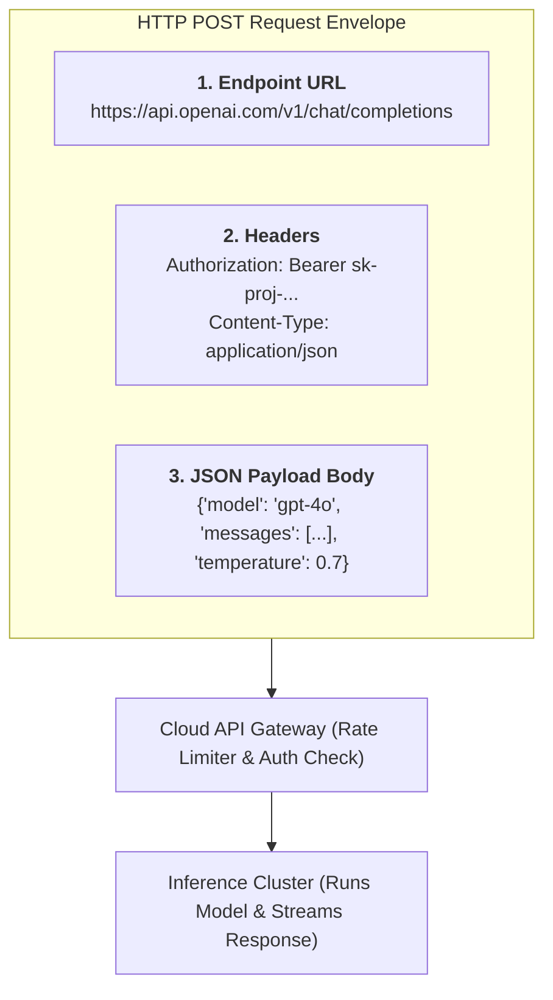
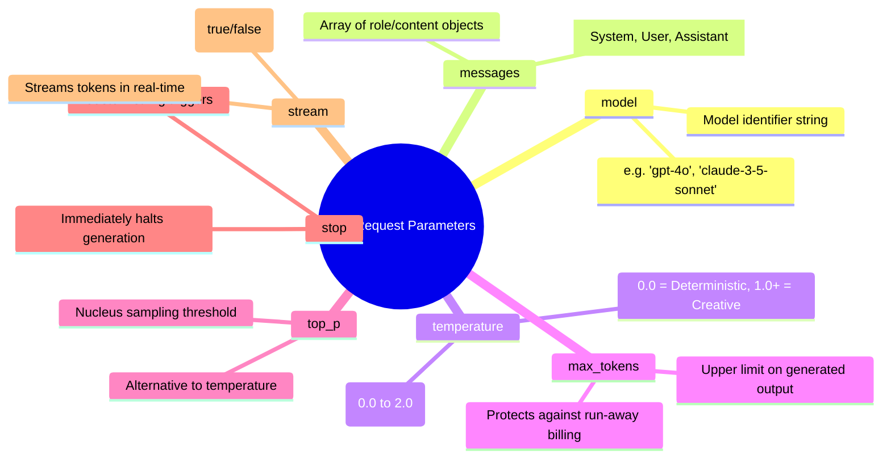
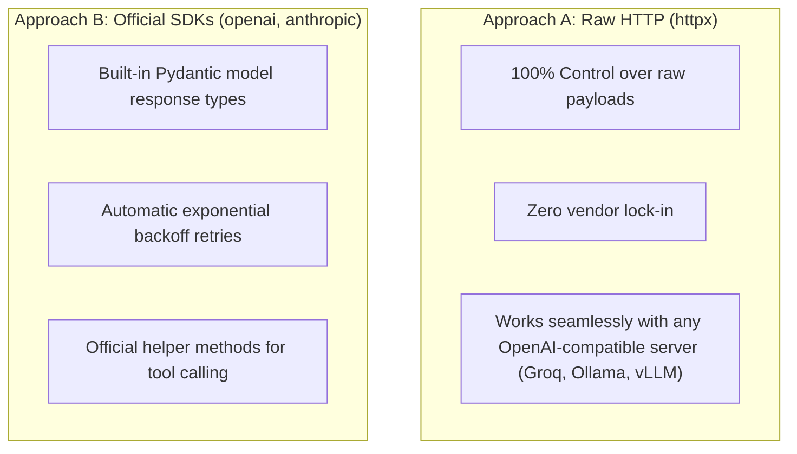
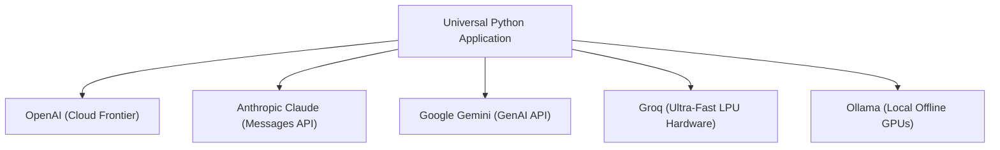
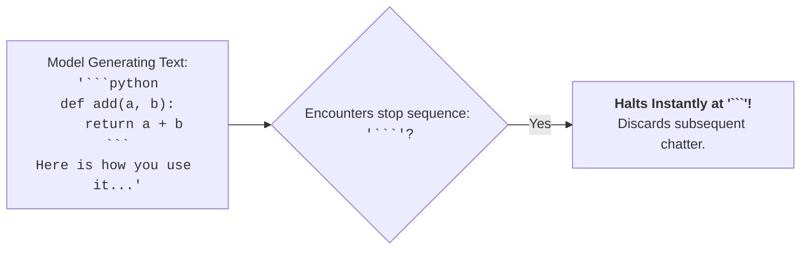
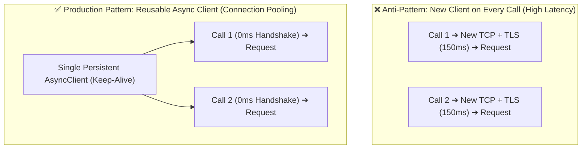

# 05 - LLM API Requests: Mastering Endpoints, Payloads & Providers

> **Mental Model**:  
> Think of an LLM API Request like **mailing a certified international package**.  
> * The **Destination Address**: The Provider's Base URL and Endpoint (e.g. `https://api.openai.com/v1/chat/completions`).  
> * The **Security Seal (Headers)**: Your private API Key (`Authorization: Bearer sk-...`) proving you have account permissions and credit balance.  
> * The **Package Contents (JSON Payload)**: The model name, prompt messages, temperature, and generation limits.  
> Understanding how to structure requests via both **Official SDKs** and **Raw HTTP (`httpx`)** allows you to connect to OpenAI, Anthropic, Gemini, Groq, and local Ollama instances seamlessly.

---

## 📑 Table of Contents
1. [The Anatomy of an LLM API Request](#1-the-anatomy-of-an-llm-api-request)
2. [The 7 Universal Request Parameters](#2-the-7-universal-request-parameters)
3. [SDK vs. Raw HTTP (httpx): The Architectural Choice](#3-sdk-vs-raw-http-httpx-the-architectural-choice)
4. [The Canonical OpenAI Chat Completion Standard](#4-the-canonical-openai-chat-completion-standard)
5. [The Multi-Provider Matrix (OpenAI, Anthropic, Gemini, Groq, Ollama)](#5-the-multi-provider-matrix-openai-anthropic-gemini-groq-ollama)
6. [Building a Universal Multi-Provider Client in Python](#6-building-a-universal-multi-provider-client-in-python)
7. [Stop Sequences: Precision Output Truncation](#7-stop-sequences-precision-output-truncation)
8. [Connection Pooling & Performance Optimization](#8-connection-pooling--performance-optimization)
9. [Master Cheat Sheet & Reference Table](#9-master-cheat-sheet--reference-table)

---

## 1. The Anatomy of an LLM API Request

Every LLM generation call is fundamentally a standard **HTTP `POST` request** carrying a JSON body:



---

## 2. The 7 Universal Request Parameters

Regardless of which AI provider you use, these 7 parameters appear across almost every API:



### Parameter Reference Matrix:

| Parameter | Type | Default | Description |
| :--- | :---: | :---: | :--- |
| **`model`** | `str` | *Required* | The model name (e.g. `"gpt-4o"`, `"llama-3.1-70b-versatile"`). |
| **`messages`** | `list[dict]` | *Required* | The ordered list of `{"role": "...", "content": "..."}` objects. |
| **`temperature`**| `float` | `0.7` – `1.0` | Sampling randomness. `0.0` for code/data, `0.7` for general tasks, `1.2+` for creative writing. |
| **`max_tokens`** | `int` | Model Limit | Maximum tokens the model is allowed to generate in its output. |
| **`top_p`** | `float` | `1.0` | Probability mass cutoff (Nucleus sampling). (Keep at `1.0` if tuning temperature). |
| **`stop`** | `str \| list[str]` | `None` | Up to 4 strings that will force the model to stop generating when encountered. |
| **`stream`** | `bool` | `False` | When `True`, returns tokens as Server-Sent Events (SSE) as they are produced. |

---

## 3. SDK vs. Raw HTTP (`httpx`): The Architectural Choice



> 💡 **Best Practice for AI Engineers:**  
> Master **both**! Use official SDKs for rapid application development, and understand raw `httpx` requests so you can connect to local inference engines (Ollama, vLLM) and debug network traffic effortlessly.

---

## 4. The Canonical OpenAI Chat Completion Standard

The OpenAI request format is the undisputed industry standard. Groq, Mistral, Together AI, Perplexity, and Ollama all adhere to this identical schema:

### 1️⃣ Raw `httpx` Implementation:
```python
import httpx
import os

url = "https://api.openai.com/v1/chat/completions"
headers = {
    "Authorization": f"Bearer {os.getenv('OPENAI_API_KEY')}",
    "Content-Type": "application/json"
}
payload = {
    "model": "gpt-4o",
    "messages": [
        {"role": "system", "content": "You are a concise engineering assistant."},
        {"role": "user", "content": "What is connection pooling?"}
    ],
    "temperature": 0.2,
    "max_tokens": 300
}

response = httpx.post(url, json=payload, headers=headers, timeout=30.0)
data = response.json()
print(data["choices"][0]["message"]["content"])
```

### 2️⃣ Official `openai` SDK Implementation:
```python
from openai import OpenAI
import os

client = OpenAI(api_key=os.getenv("OPENAI_API_KEY"))

response = client.chat.completions.create(
    model="gpt-4o",
    messages=[
        {"role": "system", "content": "You are a concise engineering assistant."},
        {"role": "user", "content": "What is connection pooling?"}
    ],
    temperature=0.2,
    max_tokens=300
)

print(response.choices[0].message.content)
```

---

## 5. The Multi-Provider Matrix (OpenAI, Anthropic, Gemini, Groq, Ollama)



### Provider Differences:

| Provider | Base URL | Auth Header | Unique Quirk / Difference |
| :--- | :--- | :--- | :--- |
| **OpenAI** | `https://api.openai.com/v1` | `Authorization: Bearer <KEY>` | Industry benchmark standard format. |
| **Anthropic** | `https://api.anthropic.com/v1` | `x-api-key: <KEY>` | `max_tokens` is **mandatory**; `system` prompt is passed as a top-level string parameter, not inside the `messages` array! |
| **Groq** | `https://api.groq.com/openai/v1` | `Authorization: Bearer <KEY>` | 100% OpenAI compatible; runs open models (Llama 3, Mixtral) at 500+ tokens/sec. |
| **Ollama** | `http://localhost:11434/v1` | None required | 100% OpenAI compatible local inference. No API key needed! |

---

## 6. Building a Universal Multi-Provider Client in Python

Because modern providers support the OpenAI standard, you can switch providers simply by swapping the `base_url` and `api_key`:

```python
from openai import OpenAI

class UniversalLLMClient:
    def __init__(self, provider: str = "openai", api_key: str | None = None):
        if provider == "groq":
            self.client = OpenAI(
                base_url="https://api.groq.com/openai/v1",
                api_key=api_key
            )
            self.default_model = "llama-3.1-70b-versatile"
        elif provider == "ollama":
            self.client = OpenAI(
                base_url="http://localhost:11434/v1",
                api_key="ollama" # Dummy key for local server
            )
            self.default_model = "llama3:latest"
        else: # OpenAI Default
            self.client = OpenAI(api_key=api_key)
            self.default_model = "gpt-4o"

    def ask(self, prompt: str, model: str | None = None) -> str:
        target_model = model or self.default_model
        response = self.client.chat.completions.create(
            model=target_model,
            messages=[{"role": "user", "content": prompt}],
            temperature=0.5
        )
        return response.choices[0].message.content

# Usage:
# gpt_client = UniversalLLMClient(provider="openai", api_key="sk-...")
# groq_client = UniversalLLMClient(provider="groq", api_key="gsk-...")
# local_client = UniversalLLMClient(provider="ollama")
```

---

## 7. Stop Sequences: Precision Output Truncation

A **Stop Sequence** tells the model: *"If you are about to output this exact phrase, stop generating immediately."*



### Top Engineering Use Cases:
1. **Agents**: Stop when the model outputs `"Observation:"` so your Python runtime can execute the tool.
2. **Code Generation**: Stop at `"```"` to avoid conversational sign-offs like *"Hope this helps!"*.
3. **Structured Q&A**: Stop at `"\n\nQuestion:"` to avoid the model generating fake subsequent questions.

```python
# Stopping code generation precisely:
response = client.chat.completions.create(
    model="gpt-4o",
    messages=[{"role": "user", "content": "Write a python function to add two numbers. Output only the code block."}],
    stop=["```\n\n", "User:", "Question:"]
)
```

---

## 8. Connection Pooling & Performance Optimization

Creating a new HTTP connection for every single prompt introduces unnecessary latency (DNS lookup, TCP 3-way handshake, TLS negotiation).



### Reusable Async Client Pattern:
```python
import httpx
import asyncio

class HighThroughputLLMGateway:
    def __init__(self, api_key: str):
        # Create persistent connection pool
        self.client = httpx.AsyncClient(
            base_url="https://api.openai.com/v1",
            headers={"Authorization": f"Bearer {api_key}"},
            timeout=httpx.Timeout(connect=5.0, read=60.0, write=5.0, pool=10.0),
            limits=httpx.Limits(max_keepalive_connections=20, max_connections=50)
        )

    async def send_prompt(self, prompt: str) -> str:
        payload = {
            "model": "gpt-4o",
            "messages": [{"role": "user", "content": prompt}]
        }
        res = await self.client.post("/chat/completions", json=payload)
        res.raise_for_status()
        return res.json()["choices"][0]["message"]["content"]

    async def close(self):
        await self.client.aclose()
```

---

## 9. Master Cheat Sheet & Reference Table

| Provider | Endpoint Format | Auth Header |
| :--- | :--- | :--- |
| **OpenAI** | `https://api.openai.com/v1/chat/completions` | `Authorization: Bearer <OPENAI_API_KEY>` |
| **Anthropic** | `https://api.anthropic.com/v1/messages` | `x-api-key: <ANTHROPIC_API_KEY>` |
| **Google Gemini**| `https://generativelanguage.googleapis.com/v1beta/...` | `x-goog-api-key: <GEMINI_API_KEY>` |
| **Groq** | `https://api.groq.com/openai/v1/chat/completions` | `Authorization: Bearer <GROQ_API_KEY>` |
| **Ollama (Local)**| `http://localhost:11434/v1/chat/completions` | None required |

---

## 🎯 Next Step in Phase 2
Now that you can construct and send API requests to any provider, we will advance to **[06 - LLM API Responses](file:///home/user2/PythonProject/Python-for-ai-engineering/02-llm-api-fundamentals/06-llm-api-responses)** to master parsing responses, choice indices, finish reasons, and token usage objects!
