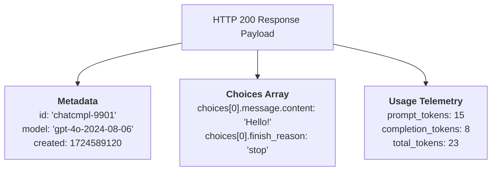
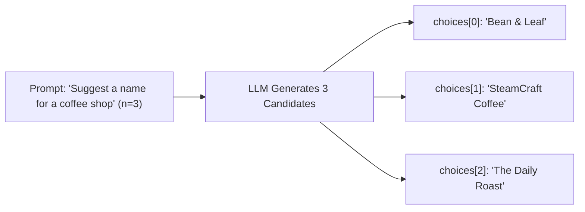
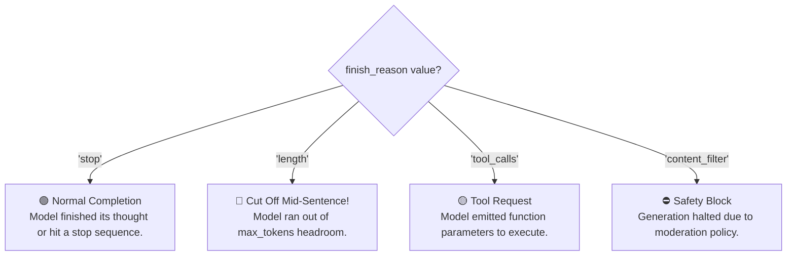
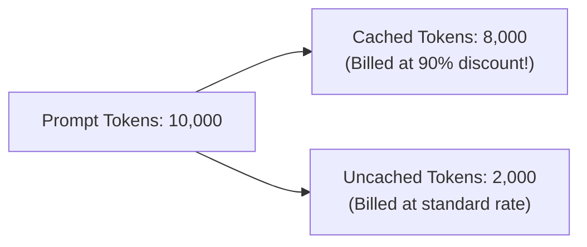
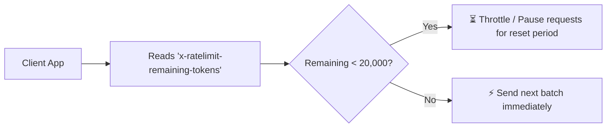

# 06 - LLM API Responses: Parsing Choices, Finish Reasons & Telemetry

> **Mental Model**:  
> Think of an LLM API Response like an **itemized cargo shipping receipt**.  
> When the package arrives, it contains far more than just the product:  
> * **The Cargo (`choices[0].message.content`)**: The actual generated text from the model.  
> * **The Delivery Status (`finish_reason`)**: Tells you *why* generation stopped (did it finish naturally, hit a token limit, or call a tool?).  
> * **The Invoice (`usage`)**: The exact number of input, output, and cached tokens billed to your account.  
> * **The Tracking Stamp (`id` & `headers`)**: Unique trace IDs and remaining rate-limit quotas.  
> Correctly extracting and validating this telemetry is essential for building production-grade AI systems.

---

## 📑 Table of Contents
1. [The Anatomy of a Response Payload](#1-the-anatomy-of-a-response-payload)
2. [Dissecting the Canonical Response Object](#2-dissecting-the-canonical-response-object)
3. [The choices Array & Multiple Completions (n > 1)](#3-the-choices-array--multiple-completions-n--1)
4. [The 4 Critical finish_reason Codes](#4-the-4-critical-finish_reason-codes)
5. [Token usage Accounting & Cached Tokens](#5-token-usage-accounting--cached-tokens)
6. [Rate-Limit Tracking via Response Headers](#6-rate-limit-tracking-via-response-headers)
7. [Safe Python Extraction Patterns (Zero KeyError/IndexError)](#7-safe-python-extraction-patterns-zero-keyerrorindexerror)
8. [Building a Production Telemetry Logger](#8-building-a-production-telemetry-logger)
9. [Master Cheat Sheet & Reference Table](#9-master-cheat-sheet--reference-table)

---

## 1. The Anatomy of a Response Payload

When you call an LLM API, the server returns a rich JSON object:



---

## 2. Dissecting the Canonical Response Object

Here is a standard, complete response payload from the OpenAI / Groq / Ollama chat completion API:

```json
{
  "id": "chatcmpl-A1b2C3d4E5f6",
  "object": "chat.completion",
  "created": 1724589120,
  "model": "gpt-4o-2024-08-06",
  "system_fingerprint": "fp_c703f8a028",
  "choices": [
    {
      "index": 0,
      "message": {
        "role": "assistant",
        "content": "An API Gateway handles rate limiting, authentication, and routing."
      },
      "logprobs": null,
      "finish_reason": "stop"
    }
  ],
  "usage": {
    "prompt_tokens": 24,
    "completion_tokens": 14,
    "total_tokens": 38,
    "prompt_tokens_details": {
      "cached_tokens": 0
    }
  }
}
```

### Key Field Breakdown:
* **`id`**: Unique transaction ID. Always log this to Datadog / OpenTelemetry for debugging.
* **`model`**: The exact model snapshot version that served the request (e.g. `gpt-4o-2024-08-06`).
* **`system_fingerprint`**: Represents the backend hardware configuration serving the model weights.
* **`choices`**: A list containing one or more generated responses.
* **`usage`**: The exact token consumption used for billing.

---

## 3. The `choices` Array & Multiple Completions (`n > 1`)

Why is `choices` an array? By default, APIs set `n=1`, returning a list with a single item (`choices[0]`).  
If you set `n=3` in your request, the model generates **3 distinct candidate answers** in parallel:



```python
# Extracting when n > 1:
for choice in response.choices:
    print(f"Candidate #{choice.index}: {choice.message.content}")
```
> ⚠️ **Cost Warning:** Setting `n=3` will triple your output token generation and triple your cost!

---

## 4. The 4 Critical `finish_reason` Codes

The **`finish_reason`** string is the most important control signal in the response. It tells your software **why the model stopped writing**:



### How Your Code Must Handle Each Reason:

| `finish_reason` | What Happened | Software Action Required |
| :--- | :--- | :--- |
| **`"stop"`** | Model completed its answer naturally. | Deliver output to user or next pipeline step. |
| **`"length"`** | Generation hit the `max_tokens` ceiling and was **cut off mid-sentence**! | Trigger automatic continuation prompt (*"Continue from..."*) or increase `max_tokens`. |
| **`"tool_calls"`** | The model did not output text; it returned a tool name and JSON arguments. | Extract tool arguments, run your Python function, and send the result back via `tool` role. |
| **`"content_filter"`** | Triggered safety / policy violation filters. | Catch gracefully and return a friendly error message to the user. |

---

## 5. Token `usage` Accounting & Cached Tokens

Accurate token tracking prevents surprise cloud bills:

```python
usage = response.usage

prompt_tokens = usage.prompt_tokens
completion_tokens = usage.completion_tokens
total_tokens = usage.total_tokens

# Check for Prompt Caching discounts (supported on newer models):
cached_tokens = getattr(usage.prompt_tokens_details, "cached_tokens", 0) if hasattr(usage, "prompt_tokens_details") else 0

print(f"Prompt Tokens: {prompt_tokens} (Cached: {cached_tokens})")
print(f"Output Tokens: {completion_tokens}")
```



---

## 6. Rate-Limit Tracking via Response Headers

Every HTTP response from an AI provider includes **rate-limit telemetry in the HTTP headers**:

```text
x-ratelimit-limit-requests: 5000
x-ratelimit-remaining-requests: 4998
x-ratelimit-limit-tokens: 800000
x-ratelimit-remaining-tokens: 794200
x-ratelimit-reset-tokens: 450ms
```



---

## 7. Safe Python Extraction Patterns (Zero `KeyError`/`IndexError`)

In production, `content` can sometimes be `None` (for example, when the model generates a tool call instead of text). Always parse safely:

```python
def extract_clean_content(response_dict: dict) -> str:
    """Safely extracts assistant text with complete fallback safety."""
    choices = response_dict.get("choices", [])
    if not choices:
        return "ERROR: Empty choices array returned by provider."
    
    first_choice = choices[0]
    finish_reason = first_choice.get("finish_reason", "unknown")
    
    if finish_reason == "length":
        print("⚠️ WARNING: Response was truncated due to max_tokens limit!")
        
    message = first_choice.get("message", {})
    content = message.get("content")
    
    # If model emitted tool_calls instead of content, content will be None!
    if content is None:
        if "tool_calls" in message:
            return f"[Tool Call Requested: {message['tool_calls'][0]['function']['name']}]"
        return "ERROR: Received None content."
        
    return content
```

---

## 8. Building a Production Telemetry Logger

Here is how you package response parsing, cost calculation, and logging into a reusable production helper:

```python
from typing import TypedDict
import time

class TelemetryRecord(TypedDict):
    request_id: str
    model: str
    content: str
    finish_reason: str
    prompt_tokens: int
    completion_tokens: int
    total_tokens: int
    estimated_cost_usd: float
    latency_ms: float

def parse_and_log_response(
    raw_response: dict, 
    start_time: float, 
    cost_per_m_in: float = 2.50, 
    cost_per_m_out: float = 10.00
) -> TelemetryRecord:
    latency = (time.perf_counter() - start_time) * 1000
    
    req_id = raw_response.get("id", "unknown_id")
    model = raw_response.get("model", "unknown_model")
    
    choice = raw_response.get("choices", [{}])[0]
    content = choice.get("message", {}).get("content", "")
    finish_reason = choice.get("finish_reason", "unknown")
    
    usage = raw_response.get("usage", {})
    p_tokens = usage.get("prompt_tokens", 0)
    c_tokens = usage.get("completion_tokens", 0)
    t_tokens = usage.get("total_tokens", 0)
    
    cost = (p_tokens / 1_000_000 * cost_per_m_in) + (c_tokens / 1_000_000 * cost_per_m_out)
    
    return {
        "request_id": req_id,
        "model": model,
        "content": content,
        "finish_reason": finish_reason,
        "prompt_tokens": p_tokens,
        "completion_tokens": c_tokens,
        "total_tokens": t_tokens,
        "estimated_cost_usd": cost,
        "latency_ms": latency
    }
```

---

## 9. Master Cheat Sheet & Reference Table

| Response Field | Purpose |
| :--- | :--- |
| **`choices[0].message.content`** | The generated text from the model. |
| **`finish_reason == "stop"`** | Generation completed naturally. |
| **`finish_reason == "length"`** | Truncated! Output hit `max_tokens` limit. |
| **`finish_reason == "tool_calls"`** | Model requested external tool execution. |
| **`usage.prompt_tokens`** | Input tokens billed. |
| **`usage.completion_tokens`**| Output tokens billed. |
| **`x-ratelimit-remaining-tokens`**| Header showing remaining quota before HTTP 429 error. |

---

## 🎯 Next Step in Phase 2
Now that you can parse full response objects and inspect finish reasons, we will advance to **[07 - Temperature](file:///home/user2/PythonProject/Python-for-ai-engineering/02-llm-api-fundamentals/07-temperature)** to master probability distribution flattening and controlling randomness!
