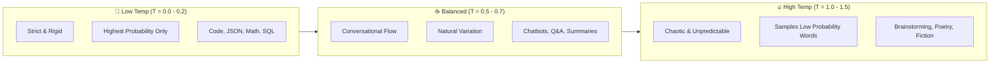
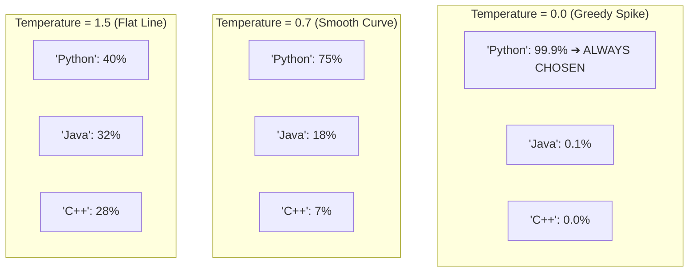
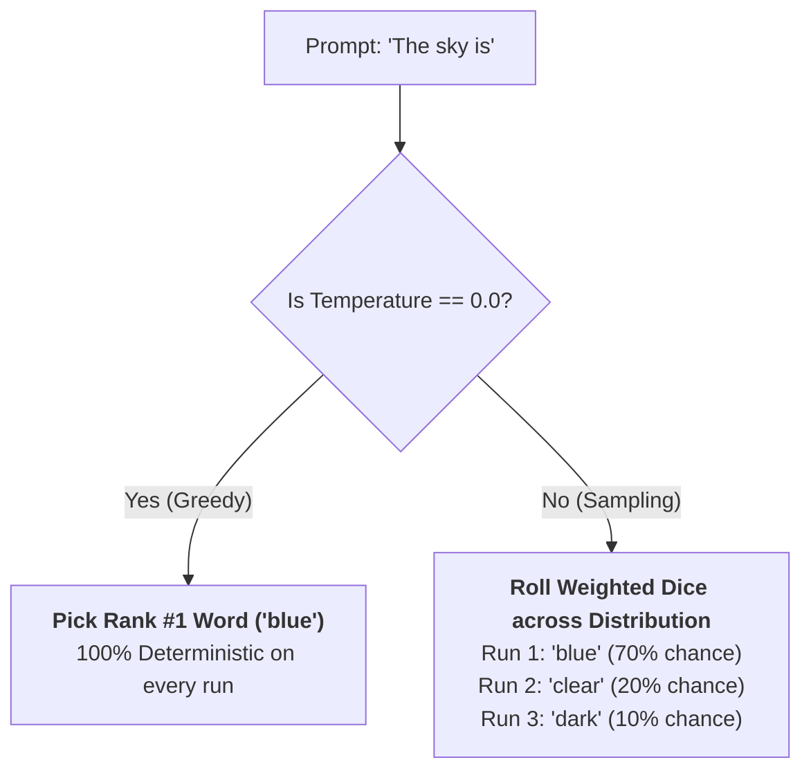
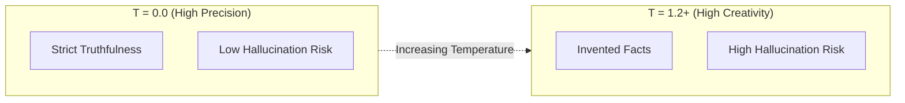

# 07 - Temperature: Controlling Randomness, Determinism & Creativity

> **Mental Model**:  
> Think of Temperature like **heating water molecules in physics**:  
> * **Freezing Cold ($T = 0.0$)**: Molecules lock into rigid, crystalline ice. The model becomes **100% deterministic**—it strictly and greedily picks the single highest-probability next word every time.  
> * **Room Temperature ($T = 0.7$)**: Molecules flow as smooth liquid. The model balances accuracy with natural, conversational variety.  
> * **Boiling Steam ($T = 1.5 - 2.0$)**: Molecules bounce erratically in chaotic gas. The model samples rare, obscure tokens, leading to wild creativity or incoherent gibberish.  
> Choosing the right temperature is your primary tool for balancing **strict precision** against **creative diversity**.

---

## 📑 Table of Contents
1. [The Thermodynamics of Language Models](#1-the-thermodynamics-of-language-models)
2. [Under the Hood: Probability Distribution Flattening](#2-under-the-hood-probability-distribution-flattening)
3. [Greedy Search (T = 0.0) vs. Stochastic Sampling (T > 0)](#3-greedy-search-t--00-vs-stochastic-sampling-t--0)
4. [The Production Temperature Selection Matrix](#4-the-production-temperature-selection-matrix)
5. [The Myth of Absolute Determinism at T = 0.0](#5-the-myth-of-absolute-determinism-at-t--00)
6. [Temperature vs. Hallucination Risk](#6-temperature-vs-hallucination-risk)
7. [Python Temperature Sweep Benchmark](#7-python-temperature-sweep-benchmark)
8. [Master Cheat Sheet & Reference Table](#8-master-cheat-sheet--reference-table)

---

## 1. The Thermodynamics of Language Models

When an LLM prepares to generate the next word, it assigns a statistical score to every word in its vocabulary:



---

## 2. Under the Hood: Probability Distribution Flattening

To understand temperature without any complex calculus formulas, look at how temperature changes the **sharpness of the probability hill**:



### What Happens Internally:
* At **$T = 0.0$**, the model divides logits by near-zero, turning the highest score into an insurmountable spike. The top choice wins $100\%$ of the time.
* At **$T = 1.0$**, the model samples directly from the raw training distribution.
* At **$T > 1.0$**, the differences between likely words and unlikely words get squashed flat. Rare, weird tokens suddenly become almost as likely as common tokens!

---

## 3. Greedy Search ($T = 0.0$) vs. Stochastic Sampling ($T > 0$)



### Trade-offs:
* **Greedy Search ($T = 0.0$)**:
  * *Pros*: Maximum logical consistency, reproducible answers, best for structured code and JSON.
  * *Cons*: Can occasionally get stuck in repetitive token loops (*"and then... and then..."*).
* **Stochastic Sampling ($T > 0$)**:
  * *Pros*: Avoids repetitive loops; sounds more creative and human.
  * *Cons*: Every API call returns a different variation.

---

## 4. The Production Temperature Selection Matrix

In production AI software, **never leave temperature at the default `1.0` without a specific reason**. Use this decision table:

| Task / Domain | Recommended Temperature | Rationale |
| :--- | :---: | :--- |
| **JSON & Structured Outputs** | **`0.0`** | Schema syntax must be rigid; zero tolerance for creative formatting typos. |
| **Code Generation & SQL** | **`0.0` – `0.1`** | Variable names and API methods must be exact; hallucinated methods crash code. |
| **RAG Fact Extraction & Q&A** | **`0.0` – `0.2`** | Answers must strictly mirror retrieved context documents without embellishment. |
| **Summarization & Translation** | **`0.3` – `0.5`** | Requires grammatical fluency while preserving original document meaning. |
| **Conversational Chatbots** | **`0.7`** | Natural human tone with varied vocabulary across multi-turn chats. |
| **Creative Writing & Poetry** | **`1.0` – `1.2`** | Diverse metaphorical choices and novel phrasing. |
| **Extreme Ideation (Name Generators)** | **`1.2` – `1.4`** | Unconventional combinations and out-of-the-box suggestions. |
| **Anything $> 1.5$** | ⛔ *Danger Zone* | High risk of spelling errors, hallucinated facts, and broken syntax. |

---

## 5. The Myth of Absolute Determinism at $T = 0.0$

> 💡 **Engineering Reality Check:**  
> Setting `temperature = 0.0` makes the model *practically* deterministic, but **NOT 100% bit-for-bit identical across all cloud API calls**.

### Why Small Variations Happen Even at $T = 0.0$:
1. **Parallel GPU Floating-Point Math**: Modern GPUs execute tensor additions in parallel. Because floating-point addition is non-associative ($(A + B) + C \ne A + (B + C)$), tiny rounding differences in the 8th decimal place can occasionally flip the top token.
2. **Mixture of Experts (MoE) Routing**: In models like GPT-4o or Mixtral, requests are dynamically routed across different GPU worker clusters with slight timing differences.

### 🛡️ Maximizing Reproducibility with `seed`:
Most modern APIs allow you to pass a **`seed`** integer to enforce deterministic system fingerprints:

```python
response = client.chat.completions.create(
    model="gpt-4o",
    messages=[{"role": "user", "content": "Extract customer name: 'John Doe'"}],
    temperature=0.0,
    seed=42  # Locks RNG state for maximum consistency
)
```

---

## 6. Temperature vs. Hallucination Risk

As temperature increases, the probability of the model selecting **statistically ungrounded tokens** escalates dramatically:



When building enterprise applications (finance, legal, healthcare), **always pin temperature to `0.0` or `0.1`** to minimize hallucination rates.

---

## 7. Python Temperature Sweep Benchmark

Here is a practical script to observe how temperature changes output diversity across 5 test runs:

```python
from openai import OpenAI
import os

client = OpenAI(api_key=os.getenv("OPENAI_API_KEY"))

prompt = "Complete this sentence in 5 words: 'The future of AI is'"
test_temperatures = [0.0, 0.5, 1.0, 1.4]

for temp in test_temperatures:
    print(f"\n--- Testing Temperature: {temp} ---")
    for run in range(1, 4):
        res = client.chat.completions.create(
            model="gpt-4o",
            messages=[{"role": "user", "content": prompt}],
            temperature=temp,
            max_tokens=30
        )
        print(f"Run #{run}: {res.choices[0].message.content.strip()}")
```

### Typical Output Pattern:
* At **`T = 0.0`**: Runs 1, 2, and 3 produce the **exact identical 5 words**.
* At **`T = 1.4`**: Every run produces completely wild, unexpected phrasing.

---

## 8. Master Cheat Sheet & Reference Table

| Temperature Value | Category | Best Production Use Case |
| :---: | :--- | :--- |
| **`0.0`** | **Greedy / Deterministic** | Code generation, SQL queries, JSON schemas, classification, RAG. |
| **`0.2`** | **Focused** | Technical documentation, customer support, fact extraction. |
| **`0.7`** | **Balanced (Standard)** | General chat assistants, conversational bots, email drafting. |
| **`1.0`** | **Creative** | Story writing, marketing slogans, creative ideation. |
| **`> 1.5`** | **Unstable / Chaotic** | Experimental only (high risk of broken syntax and hallucinations). |

---

## 🎯 Next Step in Phase 2
Now that you have mastered Temperature, we will advance to **[08 - Top-P (Nucleus Sampling)](file:///home/user2/PythonProject/Python-for-ai-engineering/02-llm-api-fundamentals/08-top-p)** to see how probability mass thresholds compare to temperature scaling!
