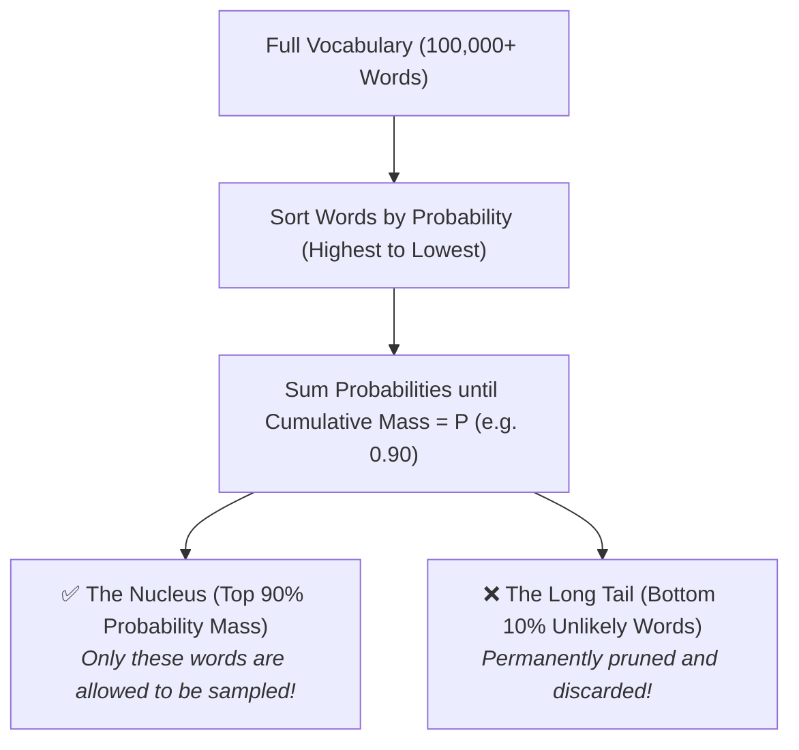
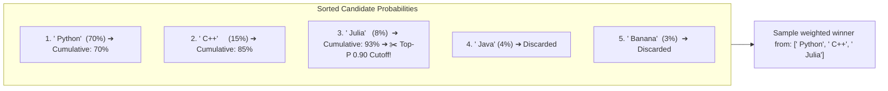
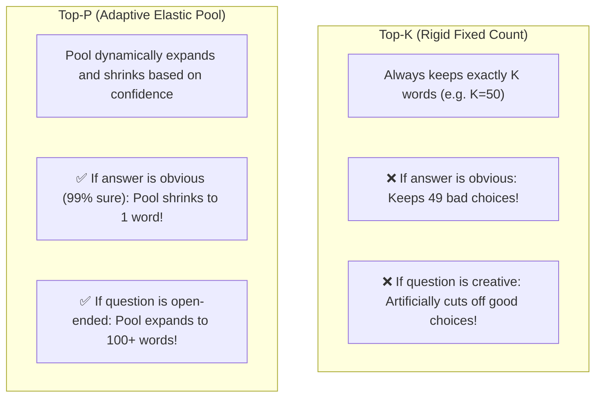
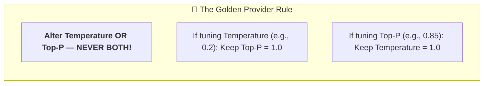

# 08 - Top-P (Nucleus Sampling): Dynamic Probability Filtering

> **Mental Model**:  
> Think of Top-P like a **nightclub bouncer with a VIP capacity limit**:  
> * The bouncer lines up all 100,000 words in order of fame (probability).  
> * With **Top-P = 0.90 (90%)**, the bouncer admits the most famous words until their combined popularity fills 90% of the room.  
> * The door is then **slammed shut**, instantly locking out the long tail of 99,950 weird, unlikely words!  
> Top-P (Nucleus Sampling) dynamically trims low-probability hallucinations while adapting its candidate pool size based on context.

---

## 📑 Table of Contents
1. [What is Nucleus Sampling (Top-P)?](#1-what-is-nucleus-sampling-top-p)
2. [Step-by-Step: How the Nucleus is Calculated](#2-step-by-step-how-the-nucleus-is-calculated)
3. [Top-P (Dynamic Pool) vs. Top-K (Fixed Pool)](#3-top-p-dynamic-pool-vs-top-k-fixed-pool)
4. [Temperature vs. Top-P: The Golden Engineering Rule](#4-temperature-vs-top-p-the-golden-engineering-rule)
5. [The Production Top-P Selection Matrix](#5-the-production-top-p-selection-matrix)
6. [Simulating Nucleus Filtering in Python](#6-simulating-nucleus-filtering-in-python)
7. [Master Cheat Sheet & Reference Table](#7-master-cheat-sheet--reference-table)

---

## 1. What is Nucleus Sampling (Top-P)?

In an LLM, the model calculates probability scores for every single token in its 100,000+ word vocabulary.  
Most of those words have tiny probabilities like $0.000001\%$, but occasionally, an unlikely token gets picked during random sampling, producing a hallucination or bizarre output.

**Top-P (Nucleus Sampling)** solves this by setting a **cumulative probability threshold $P$ (between $0.0$ and $1.0$)**:



---

## 2. Step-by-Step: How the Nucleus is Calculated

Imagine the model is predicting the next word for:  
`"The primary language for AI is..."`



1. **Top-P = 0.70**: The nucleus contains **only 1 word** (`' Python'`).
2. **Top-P = 0.90**: The nucleus includes `' Python'`, `' C++'`, and `' Julia'` (cumulative $93\%$).
3. **Words 4 and 5** are discarded. There is **0% chance** the model picks `' Banana'`, even on a random dice roll!

---

## 3. Top-P (Dynamic Pool) vs. Top-K (Fixed Pool)

Before Top-P was invented, researchers used **Top-K**. Understanding the difference shows why Top-P is superior:



### Elastic Pool Adaptation Example:
* **Scenario A (Obvious Fact)**: `"The capital of France is [___]"`  
  * Probability: `' Paris'` = $98\%$.  
  * With `top_p = 0.90`, the pool shrinks to **just 1 token** (`' Paris'`). The model cannot make a mistake.
* **Scenario B (Creative Writing)**: `"The old wizard walked through the [___]"`  
  * Probabilities: `' forest'` ($25\%$), `' dark'` ($20\%$), `' castle'` ($18\%$), `' valley'` ($15\%$), `' mist'` ($14\%$).  
  * With `top_p = 0.90`, the pool expands to **5 tokens**, giving rich, creative variety!

---

## 4. Temperature vs. Top-P: The Golden Engineering Rule

Both parameters control output variety, but they operate on different mechanics:
* **Temperature**: Smooths or sharpens the **slope** of the entire probability curve.
* **Top-P**: Slices a **hard vertical cutoff** through the tail of the distribution.



> ⚠️ **Why not change both?**  
> If you set `temperature = 0.2` and `top_p = 0.5`, you are double-filtering the probability space in conflicting, unpredictable ways, making debugging nearly impossible.

---

## 5. The Production Top-P Selection Matrix

When you choose to control randomness via Top-P (keeping Temperature at `1.0`):

| Top-P Value | Behavior | Best Production Use Case |
| :---: | :--- | :--- |
| **`0.1`** | **Ultra-Strict** | JSON schema extraction, math problem solving, SQL generation. |
| **`0.5`** | **Focused** | Technical documentation, structured classification, Q&A summaries. |
| **`0.90` – `0.95`** | **Balanced (Standard)** | General chat assistants, conversational bots (eliminates rare garbage tokens). |
| **`1.0`** | **Unfiltered (Default)** | Standard raw distribution (used when tuning Temperature instead). |

---

## 6. Simulating Nucleus Filtering in Python

Here is a pure Python script demonstrating how the nucleus dynamically filters out the long tail of tokens:

```python
def simulate_nucleus_sampling(
    candidates: list[tuple[str, float]], 
    top_p: float = 0.90
) -> list[tuple[str, float]]:
    """Simulates Top-P nucleus extraction given (token, probability) pairs."""
    # 1. Sort by probability descending
    sorted_tokens = sorted(candidates, key=lambda x: x[1], reverse=True)
    
    nucleus = []
    cumulative_prob = 0.0
    
    for token, prob in sorted_tokens:
        nucleus.append((token, prob))
        cumulative_prob += prob
        if cumulative_prob >= top_p:
            break
            
    return nucleus

# Sample candidate predictions:
predictions = [
    (" Python", 0.65),
    (" C++", 0.15),
    (" Julia", 0.12),
    (" Java", 0.05),
    (" Rust", 0.02),
    (" Banana", 0.01)
]

print("--- Top-P = 0.70 (Strict) ---")
print(simulate_nucleus_sampling(predictions, top_p=0.70))

print("\n--- Top-P = 0.90 (Balanced) ---")
print(simulate_nucleus_sampling(predictions, top_p=0.90))
```

---

## 7. Master Cheat Sheet & Reference Table

| Concept | Definition / Rule |
| :--- | :--- |
| **Top-P (Nucleus)** | Keeps the smallest set of top tokens whose cumulative probability sum $\ge P$. |
| **Dynamic Sizing** | Pool shrinks when confident (1 word) and grows when uncertain (50+ words). |
| **Top-K vs Top-P** | Top-K uses fixed number of words; Top-P uses dynamic percentage threshold. |
| **Tuning Rule** | Tune **Temperature OR Top-P**, never both simultaneously. |
| **Default Setting** | If adjusting `temperature`, keep `top_p = 1.0`. |

---

## 🎯 Next Step in Phase 2
Now that you understand sampling parameters (Temperature and Top-P), we will advance to **[09 - Streaming](file:///home/user2/PythonProject/Python-for-ai-engineering/02-llm-api-fundamentals/09-streaming)** to master real-time token delivery via Server-Sent Events (SSE)!
