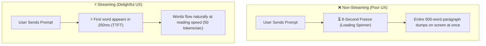
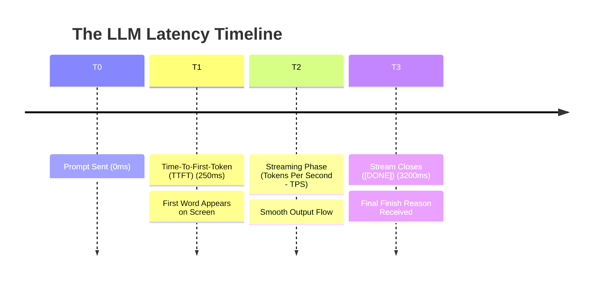
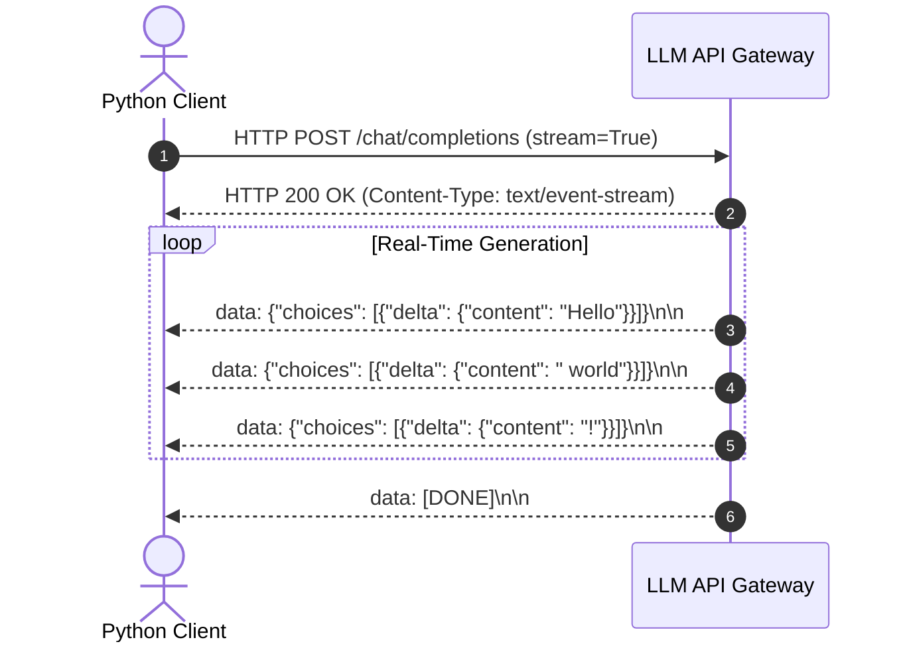

# 09 - Streaming Responses: Server-Sent Events & Real-Time UX

> **Mental Model**:  
> Think of Streaming like **turning on a water tap instead of filling a bucket**:  
> * **Non-Streaming (The Bucket)**: You wait 10 seconds while the server fills a 5-gallon bucket, and only then hands it to you. The user stares at a dead loading spinner for 10 seconds.  
> * **Streaming (The Tap)**: The exact millisecond the first drop of water is produced, it flows down the pipe to the user's screen. The user starts reading in **200 milliseconds** while the rest of the text continues to flow smoothly in real time.  
> Streaming turns sluggish AI applications into snappy, interactive user experiences.

---

## 📑 Table of Contents
1. [The UX Imperative: Why Streaming is Mandatory](#1-the-ux-imperative-why-streaming-is-mandatory)
2. [The Core Performance Metrics: TTFT vs. TPS](#2-the-core-performance-metrics-ttft-vs-tps)
3. [Under the Hood: Server-Sent Events (SSE)](#3-under-the-hood-server-sent-events-sse)
4. [Anatomy of a Streaming Delta Chunk](#4-anatomy-of-a-streaming-delta-chunk)
5. [Synchronous vs. Asynchronous Streaming in Python](#5-synchronous-vs-asynchronous-streaming-in-python)
6. [Real-Time Printing & Full Message Assembly](#6-real-time-printing--full-message-assembly)
7. [Tracking Token Usage During Streams (stream_options)](#7-tracking-token-usage-during-streams-stream_options)
8. [Handling Mid-Stream Network Drops](#8-handling-mid-stream-network-drops)
9. [Master Cheat Sheet & Reference Table](#9-master-cheat-sheet--reference-table)

---

## 1. The UX Imperative: Why Streaming is Mandatory

Generating a 500-word response takes an LLM approximately **6 to 12 seconds**.



Because humans read at roughly **5 to 8 words per second**, streaming text at 30+ tokens per second makes the generation feel **instantaneous**, completely masking model latency.

---

## 2. The Core Performance Metrics: TTFT vs. TPS

In production AI systems, latency is measured by two separate numbers:



1. **TTFT (Time-To-First-Token)**: The duration from sending the HTTP request until the first chunk arrives at the client.
   * *Target for production*: **$< 400\text{ms}$** (Excellent) | **$> 1.5\text{s}$** (Sluggish).
2. **TPS (Tokens-Per-Second)**: The velocity at which subsequent tokens are generated and transmitted.
   * *Target for production*: **$> 30\text{ tokens/sec}$** (Faster than human reading speed).

---

## 3. Under the Hood: Server-Sent Events (SSE)

Streaming in modern AI APIs does not use complex WebSockets. It uses standard **Server-Sent Events (SSE)** over regular HTTP:



### SSE Protocol Rules:
* The HTTP response header is set to `Content-Type: text/event-stream`.
* Each message chunk begins with `data: ` and ends with a **double newline `\n\n`**.
* The server sends a final termination signal: `data: [DONE]`.

---

## 4. Anatomy of a Streaming Delta Chunk

Unlike non-streaming responses where the field is `message.content`, streaming responses use the **`delta`** object:

```json
{
  "id": "chatcmpl-9901",
  "object": "chat.completion.chunk",
  "created": 1724589120,
  "model": "gpt-4o",
  "choices": [
    {
      "index": 0,
      "delta": {
        "content": " intelligence"
      },
      "finish_reason": null
    }
  ]
}
```

* In the **first few chunks**, `delta` contains subword text pieces.
* In the **final chunk**, `delta` is empty `{}` and `finish_reason` changes from `null` to `"stop"`.

---

## 5. Synchronous vs. Asynchronous Streaming in Python

### 1️⃣ Synchronous Streaming:
```python
from openai import OpenAI
import os

client = OpenAI(api_key=os.getenv("OPENAI_API_KEY"))

stream = client.chat.completions.create(
    model="gpt-4o",
    messages=[{"role": "user", "content": "Explain Server-Sent Events in 2 sentences."}],
    stream=True  # Enables SSE streaming!
)

# Iterate through chunks as they arrive over the wire
for chunk in stream:
    delta_text = chunk.choices[0].delta.content or ""
    print(delta_text, end="", flush=True)

print()
```

### 2️⃣ Asynchronous Streaming (`async for`):
```python
from openai import AsyncOpenAI
import asyncio
import os

async def stream_response(prompt: str):
    client = AsyncOpenAI(api_key=os.getenv("OPENAI_API_KEY"))

    response = await client.chat.completions.create(
        model="gpt-4o",
        messages=[{"role": "user", "content": prompt}],
        stream=True
    )

    async for chunk in response:
        delta = chunk.choices[0].delta.content or ""
        print(delta, end="", flush=True)
    print()

# asyncio.run(stream_response("What is an async generator?"))
```

---

## 6. Real-Time Printing & Full Message Assembly

In production apps, you must do two things simultaneously:
1. **Stream words in real-time** to the frontend/terminal.
2. **Collect and concatenate all chunks** into a single string to save in your database or chat history!

```python
from openai import OpenAI
import os

client = OpenAI(api_key=os.getenv("OPENAI_API_KEY"))

stream = client.chat.completions.create(
    model="gpt-4o",
    messages=[{"role": "user", "content": "Tell me a 1-sentence joke."}],
    stream=True
)

accumulated_chunks = []

for chunk in stream:
    content = chunk.choices[0].delta.content
    if content is not None:
        print(content, end="", flush=True) # 1. Real-time UI output
        accumulated_chunks.append(content)  # 2. Collect for database

# 3. Assemble full text
full_response_text = "".join(accumulated_chunks)

print(f"\n\n[Database Record Saved: '{full_response_text}']")
```

---

## 7. Tracking Token Usage During Streams (`stream_options`)

Historically, streaming responses did not return token usage objects.  
In modern APIs, pass **`stream_options={"include_usage": True}`** to receive usage telemetry in the final chunk:

```python
stream = client.chat.completions.create(
    model="gpt-4o",
    messages=[{"role": "user", "content": "Say hello!"}],
    stream=True,
    stream_options={"include_usage": True} # Requests usage in final chunk!
)

for chunk in stream:
    # Text deltas:
    if chunk.choices and chunk.choices[0].delta.content:
        print(chunk.choices[0].delta.content, end="", flush=True)
    
    # Final usage chunk:
    if chunk.usage is not None:
        print(f"\n\n📊 Total Tokens Used: {chunk.usage.total_tokens}")
```

---

## 8. Handling Mid-Stream Network Drops

If a user closes their browser or the mobile connection drops mid-stream, your Python backend must handle cleanup gracefully:

```python
import httpx

try:
    # Streaming with explicit timeouts:
    # ... stream logic ...
    pass
except httpx.ReadTimeout:
    print("⏳ Stream stalled: No token received for >10 seconds.")
except httpx.RemoteProtocolError:
    print("🌐 Remote server abruptly closed connection.")
```

---

## 9. Master Cheat Sheet & Reference Table

| Streaming Concept | Code / Parameter |
| :--- | :--- |
| **Enable Streaming** | `stream=True` in request payload |
| **Extract Content** | `chunk.choices[0].delta.content or ""` |
| **Terminal Flush** | `print(text, end="", flush=True)` |
| **Request Usage Object** | `stream_options={"include_usage": True}` |
| **Async Loop Syntax**| `async for chunk in stream:` |
| **SSE Protocol Header** | `Content-Type: text/event-stream` |
| **Stream Terminator**| `data: [DONE]` |

---

## 🎯 Next Step in Phase 2
Now that you have mastered real-time streaming, we will advance to **[10 - Structured Outputs](file:///home/user2/PythonProject/Python-for-ai-engineering/02-llm-api-fundamentals/10-structured-outputs)** to enforce 100% rigid JSON schemas and Pydantic validation!
