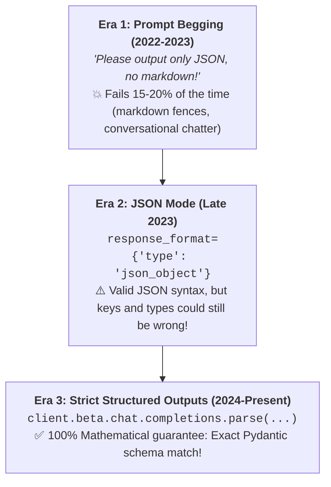
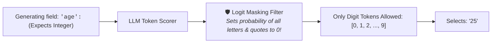

# 10 - Structured Outputs: Enforcing 100% Guaranteed JSON Schemas

> **Mental Model**:  
> Think of Structured Outputs like a **metal cookie cutter**:  
> * **Unconstrained LLM generation**: Pouring soft cookie dough freely onto a baking tray. It spreads unpredictably into random shapes (adds markdown commentary, misses keys, mixes up types).  
> * **Structured Outputs (Constrained Decoding)**: Pressing a rigid metal cookie cutter into the dough. The output **physically cannot take any shape other than your exact Pydantic schema**!  
> Structured outputs eliminate parsing errors and convert non-deterministic text into deterministic, type-safe software objects.

---

## 📑 Table of Contents
1. [The Evolution of Structured Extraction](#1-the-evolution-of-structured-extraction)
2. [Under the Hood: Constrained Decoding & Logit Masking](#2-under-the-hood-constrained-decoding--logit-masking)
3. [Native OpenAI Structured Outputs with Pydantic](#3-native-openai-structured-outputs-with-pydantic)
4. [JSON Mode vs. Strict Structured Outputs](#4-json-mode-vs-strict-structured-outputs)
5. [Field Descriptions as Prompt Guidance](#5-field-descriptions-as-prompt-guidance)
6. [Complex Nested Schemas & Strict Enums](#6-complex-nested-schemas--strict-enums)
7. [The instructor Library (Universal Multi-Provider Support)](#7-the-instructor-library-universal-multi-provider-support)
8. [Handling Refusals & Edge Cases](#8-handling-refusals--edge-cases)
9. [Master Cheat Sheet & Reference Table](#9-master-cheat-sheet--reference-table)

---

## 1. The Evolution of Structured Extraction

In the early days of AI engineering, getting clean JSON was a nightmare:



---

## 2. Under the Hood: Constrained Decoding & Logit Masking

How does an AI server mathematically guarantee that output matches a schema without retrying?

During generation, the server converts your Pydantic schema into a **Context-Free Grammar (CFG)**. At each step, it applies **Logit Masking**:



Because invalid tokens are actively masked out before sampling, the model **cannot physically output invalid syntax**!

---

## 3. Native OpenAI Structured Outputs with Pydantic

Using OpenAI SDK's `client.beta.chat.completions.parse()`, you pass a Pydantic model directly. The API returns a fully instantiated, typed Python object:

```python
from pydantic import BaseModel, Field
from openai import OpenAI
import os

client = OpenAI(api_key=os.getenv("OPENAI_API_KEY"))

# 1. Define the target schema:
class CustomerExtraction(BaseModel):
    name: str = Field(description="The customer's full name.")
    email: str = Field(description="The extracted email address.")
    sentiment: str = Field(description="Customer sentiment: positive, negative, neutral.")
    is_urgent: bool = Field(description="True if customer needs immediate assistance.")

# 2. Call the API with response_format=Schema:
raw_email = "Hi, I am Manish (manish@example.com). My service has been down for 3 hours! Fix it now!"

completion = client.beta.chat.completions.parse(
    model="gpt-4o-2024-08-06",
    messages=[
        {"role": "system", "content": "Extract customer data from the email."},
        {"role": "user", "content": raw_email}
    ],
    response_format=CustomerExtraction # Enforces strict schema!
)

# 3. Access verified, typed object directly with dot notation:
record: CustomerExtraction = completion.choices[0].message.parsed

print(f"Name      : {record.name}")
print(f"Email     : {record.email}")
print(f"Sentiment : {record.sentiment}")
print(f"Urgent?   : {record.is_urgent}")
```

---

## 4. JSON Mode vs. Strict Structured Outputs

| Feature | 🟡 JSON Mode (`json_object`) | 🟢 Structured Outputs (`json_schema`) |
| :--- | :---: | :---: |
| **Valid JSON Syntax Guaranteed?** | ✅ Yes | ✅ Yes |
| **Specific Schema Keys Guaranteed?** | ❌ No (Can hallucinate key names) | ✅ **100% Guaranteed** |
| **Exact Data Types Guaranteed?** | ❌ No (Can return `"12"` instead of `12`) | ✅ **100% Guaranteed** |
| **Pydantic Model Direct Return?** | ❌ No (Must manually `json.loads`) | ✅ **Yes (`.parsed` attribute)** |
| **Zero Markdown Fences?** | ✅ Yes | ✅ Yes |

---

## 5. Field Descriptions as Prompt Guidance

In Pydantic, the `description` string inside `Field(...)` is automatically exported into the JSON schema sent to the model.  
Use descriptions to give the model **micro-prompts** for specific attributes:

```python
from pydantic import BaseModel, Field

class BugReport(BaseModel):
    title: str = Field(
        max_length=80, 
        description="A concise, 1-line summary of the bug."
    )
    severity: str = Field(
        description="Must be one of: ['LOW', 'MEDIUM', 'HIGH', 'CRITICAL']."
    )
    line_number: int | None = Field(
        default=None, 
        description="The line number where the bug occurs, or null if unknown."
    )
```

---

## 6. Complex Nested Schemas & Strict Enums

You can nest models and restrict categorical choices using Python's `Literal` or `Enum`:

```python
from pydantic import BaseModel, Field
from typing import Literal

class LineItem(BaseModel):
    item_name: str
    quantity: int = Field(gt=0)
    unit_price_usd: float = Field(ge=0.0)

class InvoiceExtraction(BaseModel):
    invoice_number: str
    vendor_name: str
    status: Literal["PAID", "PENDING", "OVERDUE"] # Strict Enum choices!
    items: list[LineItem]                         # Nested array of sub-models!
    total_amount_usd: float

# The model is mathematically constrained to only output PAID, PENDING, or OVERDUE for status!
```

---

## 7. The `instructor` Library (Universal Multi-Provider Support)

If you are working with Anthropic Claude, Google Gemini, Groq, or local Ollama instances, the open-source **`instructor`** library patches clients to give them the exact same Pydantic structured output capabilities:

```python
# pip install instructor
import instructor
from openai import OpenAI
from pydantic import BaseModel

# Patch the client:
client = instructor.from_openai(OpenAI())

class UserDetail(BaseModel):
    name: str
    age: int

# Instructor handles validation and automatic retry if schema fails:
user = client.chat.completions.create(
    model="gpt-4o-mini",
    response_model=UserDetail,
    messages=[{"role": "user", "content": "Extract: Jason is 25 years old."}]
)

print(user.name) # 'Jason'
print(user.age)  # 25
```

---

## 8. Handling Refusals & Edge Cases

When you enforce a strict schema, what happens if a user asks a safety-violating question (*"How to hack a server?"*)?

Instead of generating invalid JSON, the model emits a **Refusal**:

```python
completion = client.beta.chat.completions.parse(
    model="gpt-4o-2024-08-06",
    messages=[{"role": "user", "content": "Unsafe request"}],
    response_format=CustomerExtraction
)

message = completion.choices[0].message

if message.refusal:
    print(f"🛡️ Safety Refusal: {message.refusal}")
else:
    print(f"✅ Success: {message.parsed}")
```

---

## 9. Master Cheat Sheet & Reference Table

| Goal | Syntax / Method |
| :--- | :--- |
| **Native Structured Call** | `client.beta.chat.completions.parse(model=..., response_format=MySchema)` |
| **Access Parsed Object** | `res.choices[0].message.parsed` |
| **Check for Refusal** | `if res.choices[0].message.refusal:` |
| **Restrict Categories** | `role: Literal["admin", "member", "guest"]` |
| **Enforce Bounds** | `Field(ge=0.0, le=1.0, description="...")` |
| **Multi-Provider Tool** | `import instructor; client = instructor.from_openai(...)` |

---

## 🎯 Next Step in Phase 2
Now that you can enforce guaranteed structured outputs, we will advance to **[11 - API Errors & Reliability](file:///home/user2/PythonProject/Python-for-ai-engineering/02-llm-api-fundamentals/11-api-errors-reliability)** to master exponential backoff, rate limit handling, and multi-provider fallbacks!
