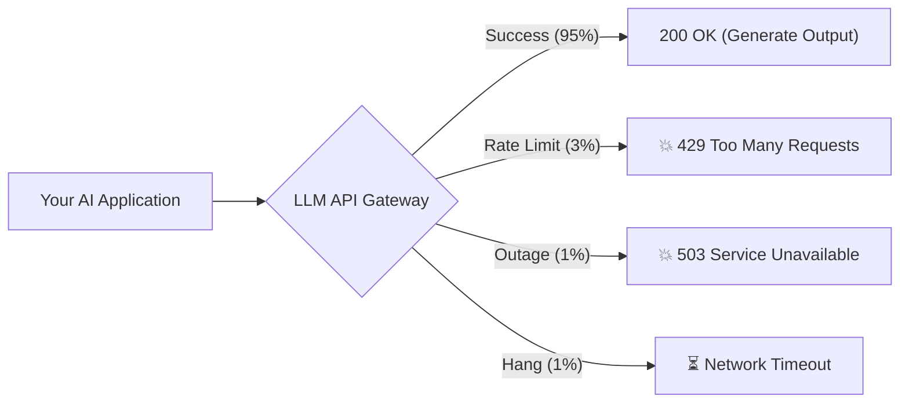
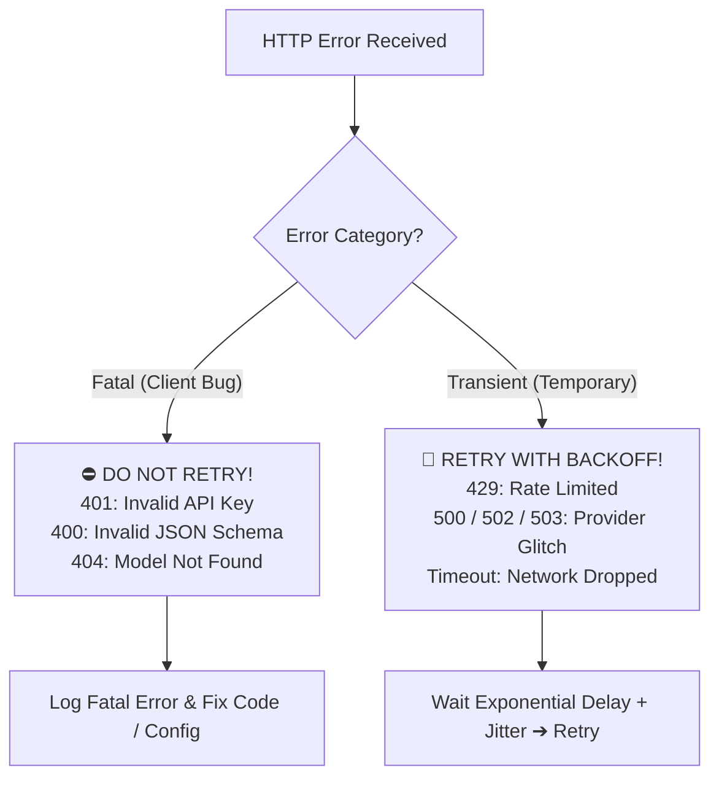
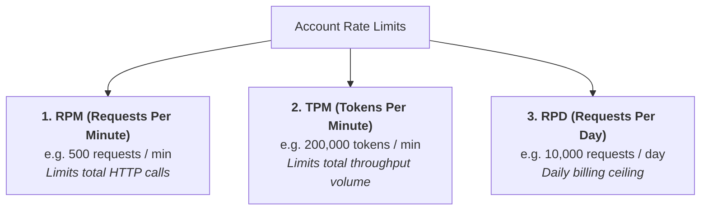
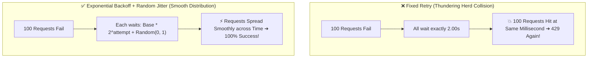
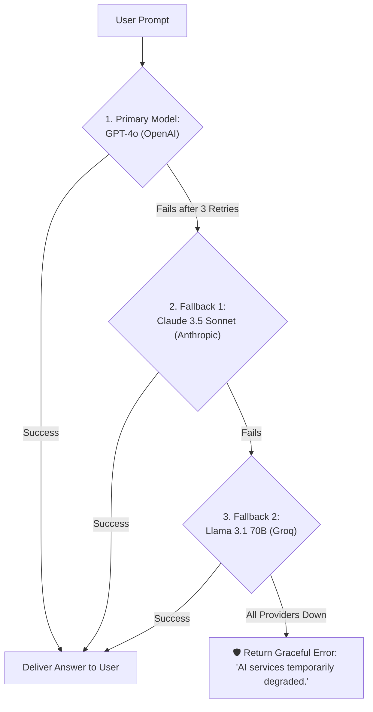

# 11 - API Errors & Reliability: Building Fault-Tolerant AI Services

> **Mental Model**:  
> Think of an AI API connection like a **busy toll booth on an interstate highway**:  
> * **Rate Limits (`429`)**: The toll gate drops when too many cars (requests/tokens) arrive at once.  
> * **Timeouts & Outages (`500/503`)**: A sudden thunderstorm temporarily knocks out power to the toll plaza.  
> * **The Thundering Herd**: If 1,000 drivers all slam their gas pedals the exact second the gate reopens, they crash into each other.  
> * **Exponential Backoff with Jitter**: Drivers wait exponentially longer ($1\text{s}, 2\text{s}, 4\text{s}$) with randomized pauses so traffic flows smoothly without crashing.  
> In AI engineering, **failure is not an anomaly; it is a guaranteed daily event**. Building resilient retry and fallback architectures is what separates demo toys from production systems.

---

## 📑 Table of Contents
1. [The Production Reliability Reality](#1-the-production-reliability-reality)
2. [Fatal vs. Transient Errors: The Retry Decision Tree](#2-fatal-vs-transient-errors-the-retry-decision-tree)
3. [The 3 Rate Limit Dimensions (RPM, TPM, RPD)](#3-the-3-rate-limit-dimensions-rpm-tpm-rpd)
4. [Exponential Backoff with Full Jitter](#4-exponential-backoff-with-full-jitter)
5. [Production Retries with the tenacity Library](#5-production-retries-with-the-tenacity-library)
6. [Multi-Provider Fallback Cascades (Circuit Breakers)](#6-multi-provider-fallback-cascades-circuit-breakers)
7. [Building an Enterprise Resilient LLM Router](#7-building-an-enterprise-resilient-llm-router)
8. [Master Cheat Sheet & Reference Table](#8-master-cheat-sheet--reference-table)

---

## 1. The Production Reliability Reality

Unlike traditional SQL databases with $99.999\%$ uptime, third-party LLM APIs suffer from frequent network micro-outages, rate throttling, and sudden capacity surges:



Without automated resilience, a single `429` or `503` will crash your user's session.

---

## 2. Fatal vs. Transient Errors: The Retry Decision Tree

Never retry an error blindly! Some errors will **never succeed no matter how many times you retry them**:



### The Error Action Matrix:

| Status Code | Error Type | Should You Retry? | Action Required |
| :---: | :--- | :---: | :--- |
| **`401`** | **Unauthorized** | ❌ **NEVER** | Check API key in `.env`. |
| **`400`** | **Bad Request** | ❌ **NEVER** | Fix invalid payload parameter or malformed prompt. |
| **`404`** | **Not Found** | ❌ **NEVER** | Check for typos in model name or URL endpoint. |
| **`429`** | **Rate Limit / Quota** | ✅ **YES** | Wait for rate reset header or back off exponentially. |
| **`500 / 503`** | **Internal Server Error**| ✅ **YES** | Provider has a temporary glitch. Retry up to 3–5 times. |
| **Timeout** | **Network Hang** | ✅ **YES** | Retry or switch to secondary fallback provider. |

---

## 3. The 3 Rate Limit Dimensions (RPM, TPM, RPD)

AI providers throttle your account across three distinct metrics:



> ⚠️ **The TPM Trap:**  
> If you have a TPM limit of 200,000, and you inject a massive 150,000-token document into a prompt, **a second concurrent user will instantly trigger a `429 Rate Limit`** even though your RPM is only 2!

---

## 4. Exponential Backoff with Full Jitter

If 100 concurrent requests fail with a `429` and all 100 retry after exactly 2 seconds, they hit the API at the exact same millisecond, causing another immediate `429` (the **Thundering Herd Problem**).



### The Formula (Zero Math):
* **Attempt 1**: Wait $1\text{s} + \text{random}(0, 1\text{s}) \rightarrow \mathbf{1.4\text{s}}$
* **Attempt 2**: Wait $2\text{s} + \text{random}(0, 1\text{s}) \rightarrow \mathbf{2.8\text{s}}$
* **Attempt 3**: Wait $4\text{s} + \text{random}(0, 1\text{s}) \rightarrow \mathbf{4.2\text{s}}$
* **Attempt 4**: Wait $8\text{s} + \text{random}(0, 1\text{s}) \rightarrow \mathbf{8.6\text{s}}$

---

## 5. Production Retries with the `tenacity` Library

In Python, the industry gold standard for retrying API calls is **`tenacity`**:

```python
# pip install tenacity openai
from tenacity import (
    retry,
    stop_after_attempt,
    wait_random_exponential,
    retry_if_exception_type
)
from openai import OpenAI, RateLimitError, APIConnectionError, InternalServerError
import os

client = OpenAI(api_key=os.getenv("OPENAI_API_KEY"))

# Production retry decorator:
@retry(
    retry=retry_if_exception_type((RateLimitError, APIConnectionError, InternalServerError)),
    wait=wait_random_exponential(multiplier=1, min=2, max=30), # Backoff 2s to 30s with jitter
    stop=stop_after_attempt(4),                                # Try up to 4 times
    reraise=True                                               # Re-raise error if all 4 fail
)
def resilient_chat_call(prompt: str) -> str:
    print("🚀 Attempting LLM generation...")
    response = client.chat.completions.create(
        model="gpt-4o",
        messages=[{"role": "user", "content": prompt}],
        timeout=15.0
    )
    return response.choices[0].message.content

# Usage:
# answer = resilient_chat_call("What is exponential backoff?")
```

---

## 6. Multi-Provider Fallback Cascades (Circuit Breakers)

What happens if OpenAI has a complete global outage lasting 30 minutes? No amount of retries will help.  
Production AI architectures implement a **Fallback Cascade**:



---

## 7. Building an Enterprise Resilient LLM Router

Here is a complete, production-grade Python router that combines retries, fallbacks, and circuit-breaking:

```python
import time
from openai import OpenAI

class ResilientLLMRouter:
    def __init__(self, openai_key: str, groq_key: str):
        self.openai_client = OpenAI(api_key=openai_key)
        self.groq_client = OpenAI(
            base_url="https://api.groq.com/openai/v1",
            api_key=groq_key
        )

    def generate(self, prompt: str) -> dict:
        # Step 1: Try Primary Provider (OpenAI GPT-4o)
        try:
            print("🔹 Trying Primary Provider: OpenAI (GPT-4o)...")
            res = self.openai_client.chat.completions.create(
                model="gpt-4o",
                messages=[{"role": "user", "content": prompt}],
                timeout=10.0
            )
            return {"provider": "openai", "content": res.choices[0].message.content}
        except Exception as e:
            print(f"⚠️ Primary Provider Failed: {e}. Activating Fallback...")

        # Step 2: Fallback to Secondary Provider (Groq Llama-3.1-70B)
        try:
            print("🔸 Trying Fallback Provider: Groq (Llama-3.1-70B)...")
            res = self.groq_client.chat.completions.create(
                model="llama-3.1-70b-versatile",
                messages=[{"role": "user", "content": prompt}],
                timeout=10.0
            )
            return {"provider": "groq", "content": res.choices[0].message.content}
        except Exception as e:
            print(f"🚨 Secondary Provider Failed: {e}.")

        # Step 3: Graceful Degradation
        return {
            "provider": "none",
            "content": "Our AI service is temporarily experiencing high traffic. Please try again in 1 minute."
        }
```

---

## 8. Master Cheat Sheet & Reference Table

| Error / Pattern | Category | Action |
| :--- | :--- | :--- |
| **`401` Unauthorized** | Fatal | Check API key in `.env`. Never retry! |
| **`400` Bad Request** | Fatal | Check schema parameters and token counts. Never retry! |
| **`429` Rate Limit** | Transient | Exponential backoff ($1\text{s}, 2\text{s}, 4\text{s}$) with random jitter. |
| **`500/503` Server Error**| Transient | Retry up to 3 times or trigger secondary model fallback. |
| **`tenacity`** | Library | Standard Python library for declarative exponential backoff decorators. |
| **Fallback Cascade** | Architecture | Switching from OpenAI $\rightarrow$ Anthropic $\rightarrow$ Groq on provider failure. |

---

## 🎯 Next Step in Phase 2
Now that you can build resilient, self-healing API clients, we will advance to the final topic in Phase 2: **[12 - Token Cost Awareness](file:///home/user2/PythonProject/Python-for-ai-engineering/02-llm-api-fundamentals/12-token-cost-awareness)** to master financial forecasting, token budgeting, and cloud ROI optimization!
