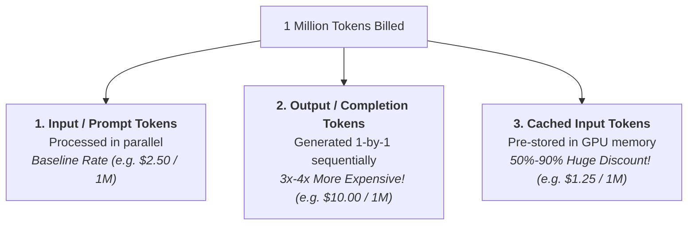
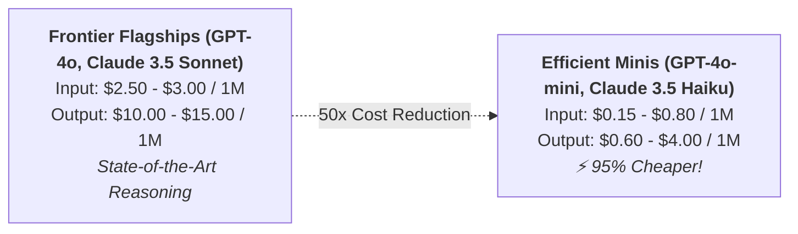
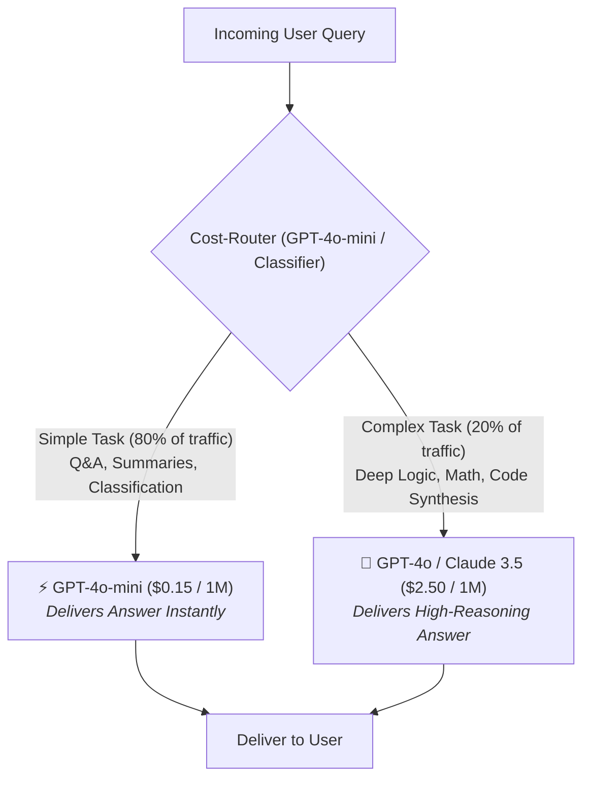
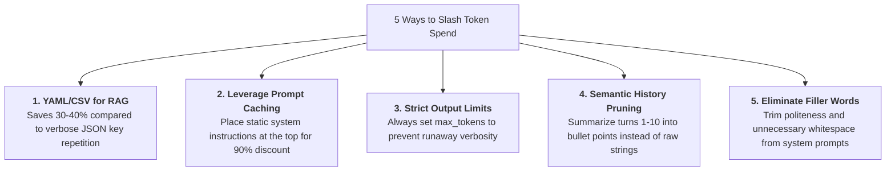
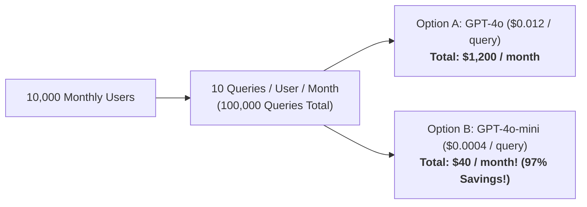

# 12 - Token Cost Awareness: Financial Engineering & Model Economics

> **Mental Model**:  
> Think of Token Consumption like an **industrial electricity meter**:  
> * In traditional web development, a server costs a flat \$20/month regardless of how many if-statements run.  
> * In AI Engineering, **every single token is metered electricity billed directly to your credit card**.  
> * An unoptimized prompt sent by 50,000 daily users can generate a **\$30,000 surprise cloud bill** at the end of the month!  
> Financial engineering, prompt compression, prompt caching, and intelligent model routing are what make AI applications commercially viable.

---

## 📑 Table of Contents
1. [The 3 Pillars of Token Pricing](#1-the-3-pillars-of-token-pricing)
2. [Frontier vs. Mini vs. Open Model Economics (The 50x Gap)](#2-frontier-vs-mini-vs-open-model-economics-the-50x-gap)
3. [The Intelligent Model Cascading Architecture](#3-the-intelligent-model-cascading-architecture)
4. [5 Practical Token Optimization Strategies](#4-5-practical-token-optimization-strategies)
5. [The Production Cost Calculation Formula](#5-the-production-cost-calculation-formula)
6. [Building an In-Memory Cost Tracker & Budget Guardrail in Python](#6-building-an-in-memory-cost-tracker--budget-guardrail-in-python)
7. [Enterprise Unit Economics & Monthly Forecasting](#7-enterprise-unit-economics--monthly-forecasting)
8. [Master Cheat Sheet & Reference Table](#8-master-cheat-sheet--reference-table)

---

## 1. The 3 Pillars of Token Pricing

AI providers do not charge a single flat rate. They bill across **three distinct token categories**:



> 💡 **The Output Disparity:**  
> Output tokens cost **$3\times$ to $4\times$ more** than input tokens because generating new text sequentially requires significantly more GPU compute cycles than reading existing text in parallel!

---

## 2. Frontier vs. Mini vs. Open Model Economics (The 50x Gap)

There is a massive **$50\times$ pricing gap** between flagship frontier models and efficient small models:



### Industry Pricing Reference Matrix (Per 1 Million Tokens):

| Model | Input Price / 1M | Output Price / 1M | Cached Input / 1M | Best Value Role |
| :--- | :---: | :---: | :---: | :--- |
| **GPT-4o-mini** | **\$0.15** | **\$0.60** | \$0.075 | 🏆 Best overall budget model for classification, summarization, routing. |
| **Claude 3.5 Haiku** | **\$0.80** | **\$4.00** | \$0.08 | Ultra-fast, high-quality reasoning on small budgets. |
| **GPT-4o** | **\$2.50** | **\$10.00** | \$1.25 | Complex multi-modal reasoning, structured outputs, code refactoring. |
| **Claude 3.5 Sonnet** | **\$3.00** | **\$15.00** | \$0.30 | State-of-the-art coding and nuanced system design. |
| **Llama 3.1 70B (Groq)** | **\$0.59** | **\$0.79** | — | Ultra-fast inference (>500 tok/sec) at low open-source cost. |
| **Ollama (Self-Hosted)** | **\$0.00** | **\$0.00** | — | Free API costs (Paid via your own hardware/electricity). |

---

## 3. The Intelligent Model Cascading Architecture

In real-world applications, **80% of user queries are simple** (e.g. *"What are your store hours?"*, *"Summarize this email"*). Only 20% require complex multi-step reasoning.

Instead of sending 100% of queries to expensive flagship models, use **Model Cascading**:



> 💰 **Financial Impact:** Cascading saves **70% to 85% of total monthly AI spend** without any noticeable drop in perceived intelligence!

---

## 4. 5 Practical Token Optimization Strategies



---

## 5. The Production Cost Calculation Formula

$$\text{Total Cost (\USD)} = \left( \frac{\text{Uncached Input}}{1,000,000} \times P_{\text{in}} \right) + \left( \frac{\text{Cached Input}}{1,000,000} \times P_{\text{cache}} \right) + \left( \frac{\text{Output Tokens}}{1,000,000} \times P_{\text{out}} \right)$$

---

## 6. Building an In-Memory Cost Tracker & Budget Guardrail in Python

Never run an autonomous agent or production service without an **automated budget circuit-breaker**:

```python
from typing import TypedDict
from openai import OpenAI
import os

class ModelRates(TypedDict):
    input: float
    output: float
    cached: float

PRICING_TABLE: dict[str, ModelRates] = {
    "gpt-4o": {"input": 2.50, "output": 10.00, "cached": 1.25},
    "gpt-4o-mini": {"input": 0.15, "output": 0.60, "cached": 0.075},
}

class BudgetGuardrail:
    """Tracks cumulative spend and halts execution if budget is exceeded."""
    
    def __init__(self, max_budget_usd: float = 10.00):
        self.max_budget_usd = max_budget_usd
        self.total_spent_usd = 0.0
        self.total_tokens_used = 0

    def record_transaction(self, model: str, usage_object) -> float:
        rates = PRICING_TABLE.get(model, PRICING_TABLE["gpt-4o-mini"])
        
        prompt_tokens = usage_object.prompt_tokens
        completion_tokens = usage_object.completion_tokens
        cached_tokens = getattr(usage_object.prompt_tokens_details, "cached_tokens", 0) if hasattr(usage_object, "prompt_tokens_details") else 0
        
        uncached_prompt = prompt_tokens - cached_tokens
        
        # Calculate cost
        cost = (
            (uncached_prompt / 1_000_000 * rates["input"]) +
            (cached_tokens / 1_000_000 * rates["cached"]) +
            (completion_tokens / 1_000_000 * rates["output"])
        )
        
        self.total_spent_usd += cost
        self.total_tokens_used += usage_object.total_tokens
        
        print(f"💵 Transaction Cost: ${cost:.6f} | Total Spent: ${self.total_spent_usd:.4f} / ${self.max_budget_usd:.2f}")
        
        # Enforce Hard Budget Stop
        if self.total_spent_usd >= self.max_budget_usd:
            raise RuntimeError(
                f"🚨 HARD BUDGET LIMIT REACHED: Spent ${self.total_spent_usd:.2f} of ${self.max_budget_usd:.2f} limit! Halting API requests."
            )
            
        return cost
```

---

## 7. Enterprise Unit Economics & Monthly Forecasting

How do you estimate your AWS / OpenAI bill before launching an AI feature?

### 📊 The Unit Economics Equation:
$$\text{Monthly Cost} = \text{Monthly Active Users} \times \text{Queries / User / Month} \times \text{Avg Cost per Query}$$



---

## 8. Master Cheat Sheet & Reference Table

| Rule | Golden Best Practice |
| :--- | :--- |
| **Output Token Cost** | Output tokens cost $\approx 4\times$ more than input tokens. Keep outputs concise. |
| **Model Selection** | Default to **GPT-4o-mini** or **Claude 3.5 Haiku** for 80% of tasks. Escalate only when needed. |
| **Prompt Caching** | Keep static system instructions and documentation at the very top of the prompt. |
| **Data Format in RAG** | Use YAML or CSV instead of repeated JSON key-value pairs to save 35% tokens. |
| **Hard Budget Stop** | Always implement an automated budget guardrail in software to prevent runaway billing loops. |

---

## 🏁 Phase 2 Complete!
Congratulations! You have mastered all 12 core topics of **LLM & API Fundamentals**:
1. [01 - LLM Fundamentals](file:///home/user2/PythonProject/Python-for-ai-engineering/02-llm-api-fundamentals/01-llm-fundamentals/README.md)
2. [02 - Tokens & Tokenization](file:///home/user2/PythonProject/Python-for-ai-engineering/02-llm-api-fundamentals/02-tokens/README.md)
3. [03 - Context Windows](file:///home/user2/PythonProject/Python-for-ai-engineering/02-llm-api-fundamentals/03-context-windows/README.md)
4. [04 - Messages & Roles](file:///home/user2/PythonProject/Python-for-ai-engineering/02-llm-api-fundamentals/04-messages-roles/README.md)
5. [05 - LLM API Requests](file:///home/user2/PythonProject/Python-for-ai-engineering/02-llm-api-fundamentals/05-llm-api-requests/README.md)
6. [06 - LLM API Responses](file:///home/user2/PythonProject/Python-for-ai-engineering/02-llm-api-fundamentals/06-llm-api-responses/README.md)
7. [07 - Temperature](file:///home/user2/PythonProject/Python-for-ai-engineering/02-llm-api-fundamentals/07-temperature/README.md)
8. [08 - Top-P (Nucleus Sampling)](file:///home/user2/PythonProject/Python-for-ai-engineering/02-llm-api-fundamentals/08-top-p/README.md)
9. [09 - Streaming](file:///home/user2/PythonProject/Python-for-ai-engineering/02-llm-api-fundamentals/09-streaming/README.md)
10. [10 - Structured Outputs](file:///home/user2/PythonProject/Python-for-ai-engineering/02-llm-api-fundamentals/10-structured-outputs/README.md)
11. [11 - API Errors & Reliability](file:///home/user2/PythonProject/Python-for-ai-engineering/02-llm-api-fundamentals/11-api-errors-reliability/README.md)
12. [12 - Token Cost Awareness](file:///home/user2/PythonProject/Python-for-ai-engineering/02-llm-api-fundamentals/12-token-cost-awareness/README.md)
