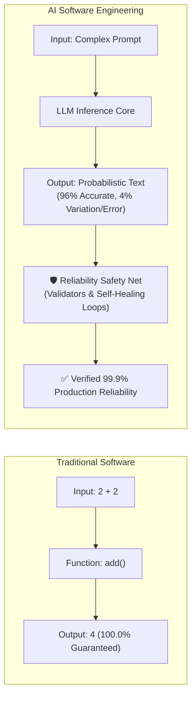
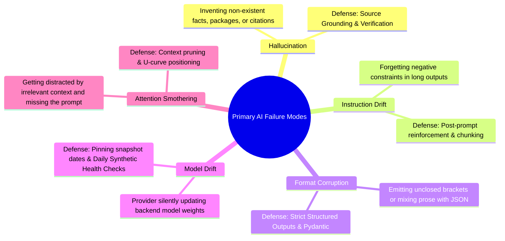
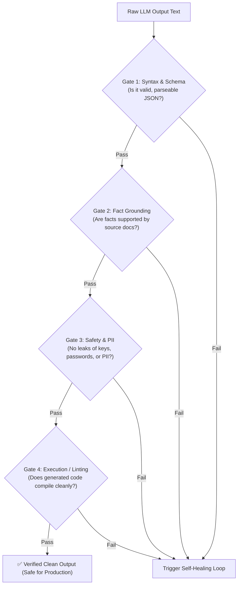
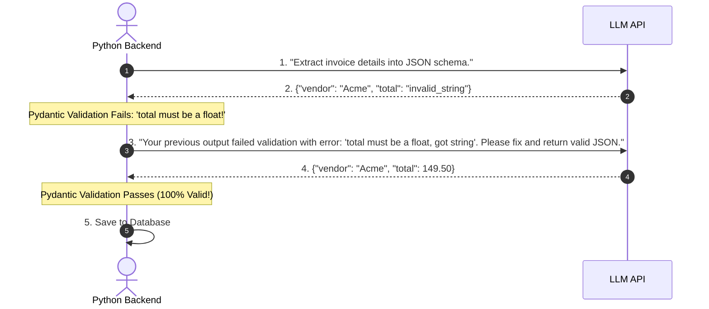
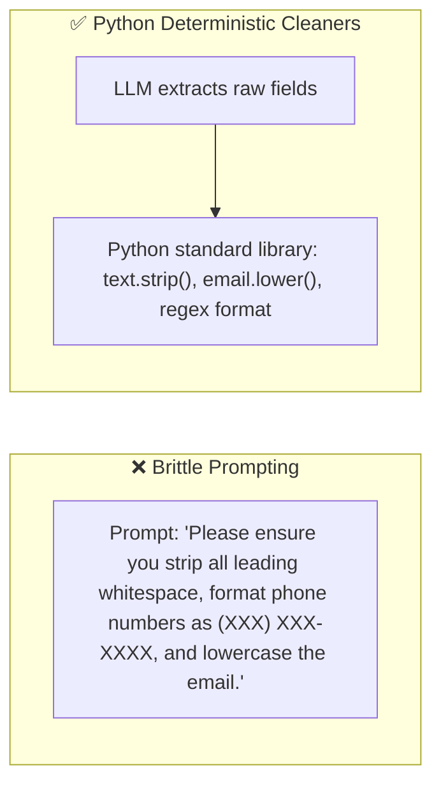

# 02 - Reliability Mindset: Building Fault-Tolerant, Self-Healing AI Systems

> **Mental Model**:  
> Think of an LLM like a **world-class circus acrobat performing on a high wire**:  
> * The acrobat is extraordinarily talented, but even the best acrobat in the world **can and will slip occasionally**.  
> * A naive software developer stands below hoping the acrobat never slips.  
> * An **AI Engineer builds a triple-layered safety net beneath the wire**: Verification Gates, Automated Self-Correction Loops, and Fallback Defenses so that when a slip occurs, the audience never even notices!

---

## 📑 Table of Contents
1. [The Determinism Gap in AI Software](#1-the-determinism-gap-in-ai-software)
2. [The 5 Primary LLM Failure Modes](#2-the-5-primary-llm-failure-modes)
3. [The 4-Gate Verification Funnel](#3-the-4-gate-verification-funnel)
4. [The Self-Correction (Reflection) Loop](#4-the-self-correction-reflection-loop)
5. [Detecting & Defending Against Silent Model Drift](#5-detecting--defending-against-silent-model-drift)
6. [Deterministic Post-Processing & Sanitization](#6-deterministic-post-processing--sanitization)
7. [Building a Self-Healing AI Pipeline in Python](#7-building-a-self-healing-ai-pipeline-in-python)
8. [Master Cheat Sheet & Reference Table](#8-master-cheat-sheet--reference-table)

---

## 1. The Determinism Gap in AI Software

Traditional software architecture relies on 100% deterministic code paths. AI architecture operates on **probabilistic outputs**:



---

## 2. The 5 Primary LLM Failure Modes

To build reliability, you must anticipate every way an LLM can fail:



---

## 3. The 4-Gate Verification Funnel

Never pass raw LLM text directly to your database or frontend. Always pass it through a **4-Gate Verification Funnel**:



---

## 4. The Self-Correction (Reflection) Loop

When a verification gate fails, **do not crash the application**.  
Instead, feed the compiler or schema error message directly back to the LLM and ask it to fix its own mistake:



---

## 5. Detecting & Defending Against Silent Model Drift

Cloud providers frequently update quantization, inference hardware, and safety filters under existing model names (e.g. updating `gpt-4o` behavior without changing the base name).

### 🛡️ 3 Production Defenses Against Model Drift:
1. **Pin Exact Snapshot Dates**:  
   Use `gpt-4o-2024-08-06` or `claude-3-5-sonnet-20240620` instead of rolling aliases like `gpt-4o` or `claude-3-5-sonnet-latest`.
2. **Automated Daily Synthetic Health Probes**:  
   Run a scheduled cron job (every morning at 6:00 AM) that sends 20 standard benchmark prompts to verify that output format, latency, and tone remain within baseline limits.
3. **Rigid Schema Contracts**:  
   Always use Pydantic Structured Outputs so that even if the model's internal phrasing shifts, the output data types remain identical.

---

## 6. Deterministic Post-Processing & Sanitization

Do not waste expensive LLM tokens or prompt instructions on tasks that Python can do **instantly and 100% deterministically**:



### Clean Extraction Pattern:
```python
import re

def clean_extracted_contact(raw_email: str, raw_phone: str) -> dict:
    """Deterministic Python post-processing."""
    # 1. Clean email
    clean_email = raw_email.strip().lower()
    
    # 2. Format phone to standard digits only
    clean_phone = re.sub(r"\D", "", raw_phone)
    
    return {
        "email": clean_email,
        "phone": clean_phone
    }
```

---

## 7. Building a Self-Healing AI Pipeline in Python

Here is a complete, production-grade self-healing pipeline that validates outputs against a Pydantic schema and automatically retries with corrective feedback:

```python
from pydantic import BaseModel, Field, ValidationError
from openai import OpenAI
import os
import json

client = OpenAI(api_key=os.getenv("OPENAI_API_KEY"))

class UserProfile(BaseModel):
    user_id: int = Field(gt=0, description="Positive integer ID.")
    username: str = Field(min_length=3, description="Username at least 3 chars.")
    role: str = Field(description="Role: admin, editor, viewer.")

def generate_with_self_healing(prompt: str, max_retries: int = 3) -> UserProfile:
    messages = [
        {"role": "system", "content": "Extract user profile data into a valid JSON object."},
        {"role": "user", "content": prompt}
    ]

    for attempt in range(1, max_retries + 1):
        print(f"🔄 Generation Attempt #{attempt}...")
        
        # 1. Generate text from model
        response = client.chat.completions.create(
            model="gpt-4o",
            messages=messages,
            temperature=0.0
        )
        raw_text = response.choices[0].message.content
        
        # 2. Attempt Pydantic Validation
        try:
            parsed_dict = json.loads(raw_text)
            profile = UserProfile(**parsed_dict)
            print("✅ Verification Gate Passed!")
            return profile
            
        except (json.JSONDecodeError, ValidationError) as err:
            print(f"⚠️ Validation Failed on Attempt #{attempt}: {err}")
            
            # 3. Add assistant's flawed response and error feedback to history
            messages.append({"role": "assistant", "content": raw_text})
            messages.append({
                "role": "user", 
                "content": f"Your previous response failed validation with error:\n{err}\nPlease correct the errors and output ONLY the fixed JSON."
            })
            
    raise RuntimeError(f"🚨 Self-healing failed after {max_retries} attempts.")
```

---

## 8. Master Cheat Sheet & Reference Table

| Reliability Technique | Production Implementation |
| :--- | :--- |
| **Verification Gate** | Validate syntax, grounding, PII, and code compilation before trusting outputs. |
| **Self-Healing Loop** | Feed compiler / Pydantic validation errors back to the model to auto-fix. |
| **Pin Model Snapshots** | Always use dated model strings (e.g. `gpt-4o-2024-08-06`) to prevent silent drift. |
| **Daily Synthetic Health Check**| Automated cron running 20 benchmark prompts daily to detect provider changes. |
| **Deterministic Cleaners** | Use Python regex and string methods for formatting rather than burning prompt tokens. |

---

## 🎯 Next Step in Phase 3
Now that you have mastered reliability and self-healing pipelines, we will advance to **[03 - Security Mindset](file:///home/user2/PythonProject/Python-for-ai-engineering/03-evaluation-security-mindset/03-security-mindset)** to master Prompt Injection, Jailbreaking, Data Exfiltration, and Defense-in-Depth!
