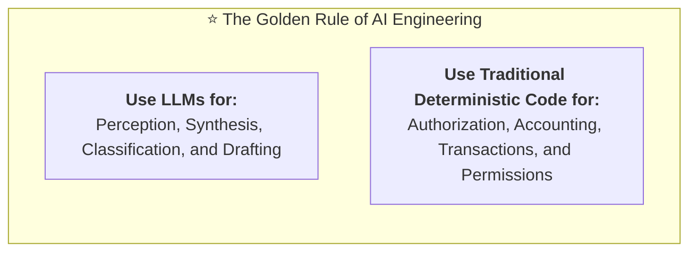
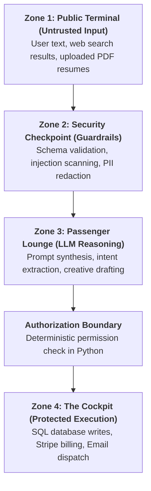
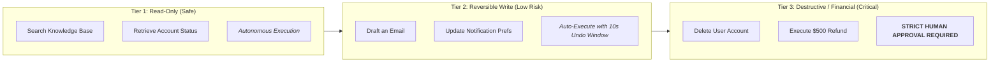
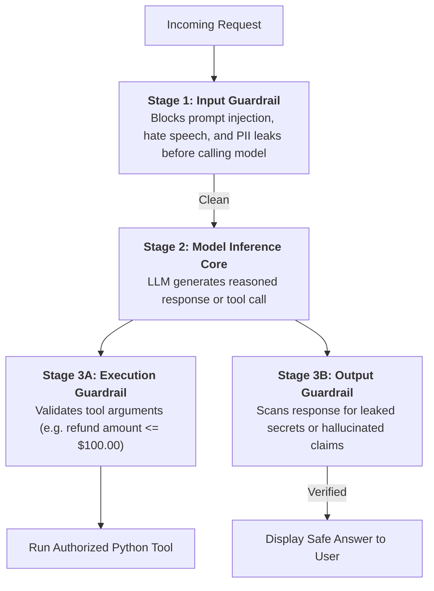

# 04 - AI Application Boundaries: Trust Zones & System Architecture

> **Mental Model**:  
> Think of an AI Application like an **international airport security system**:  
> * **Zone 1: Public Terminal (Untrusted)**: Anyone can walk in off the street (Raw user queries, external web pages, scraped PDFs).  
> * **Zone 2: TSA Security Checkpoint (Guardrails)**: Luggage is scanned, identity is verified (Regex validation, injection detection, schema checks).  
> * **Zone 3: Passenger Lounge (LLM Reasoning Area)**: Ticketed passengers freely converse and draft plans (Natural language processing, RAG synthesis).  
> * **Zone 4: The Cockpit (Critical Execution Core)**: Only licensed human pilots with manual keys can touch the throttle (Database writes, bank transfers, account deletions).  
> Defining strict **Trust Zones** ensures that even if an AI is tricked or confused, it **physically lacks the authority to crash the plane**.

---

## 📑 Table of Contents
1. [The Cardinal Rule of AI Boundaries](#1-the-cardinal-rule-of-ai-boundaries)
2. [What AI Should Decide vs. What Code Must Decide](#2-what-ai-should-decide-vs-what-code-must-decide)
3. [The 4 Airport Trust Zones in Software](#3-the-4-airport-trust-zones-in-software)
4. [Human-in-the-Loop (HITL) Action Tiers](#4-human-in-the-loop-hitl-action-tiers)
5. [The 3-Stage Guardrail Ensemble](#5-the-3-stage-guardrail-ensemble)
6. [Building a Secure Trust-Zone Router in Python](#6-building-a-secure-trust-zone-router-in-python)
7. [Master Cheat Sheet & Reference Table](#7-master-cheat-sheet--reference-table)

---

## 1. The Cardinal Rule of AI Boundaries



> ⚠️ **The Fatal Mistake:**  
> Never ask an LLM: *"Is user Manish authorized to delete this database row?"*  
> An LLM can easily be tricked by a prompt injection into answering *"Yes, Manish is the admin."*  
> **Authorization must ALWAYS be verified by deterministic Python/SQL code, never by a probabilistic model!**

---

## 2. What AI Should Decide vs. What Code Must Decide

| Capability | 🤖 Assigned to LLM | 💻 Assigned to Deterministic Python/SQL |
| :--- | :---: | :---: |
| **Understanding User Intent** | ✅ **YES** (Classify message as 'Refund Request') | ❌ No (Too rigid for natural language) |
| **Drafting Customer Reply** | ✅ **YES** (Polite, personalized summary) | ❌ No (Hardcoded templates feel robotic) |
| **Checking User Account Balance** | ❌ **NEVER** (Risk of hallucinated balance) | ✅ **YES** (`SELECT balance FROM users WHERE id = ?`) |
| **Calculating Sales Tax & Math** | ❌ **NEVER** (Models can make arithmetic errors) | ✅ **YES** (`total = price * 1.0825`) |
| **Authorizing Money Transfer** | ❌ **NEVER** (Vulnerable to prompt override) | ✅ **YES** (JWT Token verification & Role-Based ACL) |
| **Executing Database Deletes** | ❌ **NEVER** | ✅ **YES** (Strict API endpoint with Human Approval) |

---

## 3. The 4 Airport Trust Zones in Software



* **Data crosses boundaries only through sanitization filters.**
* **The LLM in Zone 3 can NEVER directly execute Zone 4 operations without passing through a deterministic authorization gate.**

---

## 4. Human-in-the-Loop (HITL) Action Tiers

Categorize every external tool action into one of 3 tiers based on impact:



---

## 5. The 3-Stage Guardrail Ensemble

Do not treat guardrails as an afterthought. Build a 3-stage sandwich around the model:



---

## 6. Building a Secure Trust-Zone Router in Python

Here is a production-ready Python architecture that strictly isolates LLM reasoning from unauthorized system execution:

```python
from enum import Enum
from pydantic import BaseModel, Field

class ActionTier(Enum):
    READ_ONLY = "read_only"             # Autonomous
    MODERATE = "moderate"               # Reversible
    CRITICAL_SECURITY = "critical"      # Requires Human Approval

class ToolCallRequest(BaseModel):
    tool_name: str
    arguments: dict
    user_id: int
    user_role: str = Field(description="Deterministic role from JWT: 'admin' or 'customer'")

class SecureExecutionGate:
    """Deterministic authorization gate protecting critical system actions."""

    # Map tools to impact tiers
    TOOL_PERMISSIONS = {
        "search_knowledge_base": ActionTier.READ_ONLY,
        "draft_support_ticket": ActionTier.MODERATE,
        "process_refund_payment": ActionTier.CRITICAL_SECURITY,
        "delete_user_account": ActionTier.CRITICAL_SECURITY,
    }

    @classmethod
    def authorize_and_execute(cls, request: ToolCallRequest) -> str:
        tier = cls.TOOL_PERMISSIONS.get(request.tool_name)
        
        if tier is None:
            return f"⛔ Error: Unknown tool '{request.tool_name}' rejected."

        # 1. Tier 1: Read-Only ➔ Auto Execute
        if tier == ActionTier.READ_ONLY:
            print(f"⚡ Auto-executing read-only tool: {request.tool_name}")
            return f"Data retrieved successfully from {request.tool_name}."

        # 2. Tier 2: Moderate ➔ Check Role
        if tier == ActionTier.MODERATE:
            print(f"📝 Executing moderate action: {request.tool_name}")
            return f"Action {request.tool_name} completed."

        # 3. Tier 3: Critical Security ➔ Strict Deterministic Authorization & Human Approval Gate
        if tier == ActionTier.CRITICAL_SECURITY:
            if request.user_role != "admin":
                return f"🚨 Access Denied: User {request.user_id} does not have admin permissions to execute {request.tool_name}!"
            
            # Request Human Confirmation
            print(f"🔒 CRITICAL ACTION PAUSED: Waiting for human admin confirmation to run {request.tool_name}...")
            return "[PAUSED_FOR_HUMAN_APPROVAL]"

# Example Usage:
# request = ToolCallRequest(tool_name="process_refund_payment", arguments={"amount": 50}, user_id=101, user_role="customer")
# result = SecureExecutionGate.authorize_and_execute(request)
# print(result) # Output: 🚨 Access Denied!
```

---

## 7. Master Cheat Sheet & Reference Table

| Principle | Implementation Rule |
| :--- | :--- |
| **Zero-Trust Input** | Treat all user messages, PDFs, and web search results as untrusted Zone 1 data. |
| **Separation of Concerns** | LLM handles natural language synthesis; Python/SQL code handles authorization & math. |
| **Deterministic Permissions** | Verify user roles from verified JWT tokens in Python, never ask the LLM. |
| **HITL Gates** | Require explicit human confirmation for destructive and financial operations. |
| **3-Stage Guardrails** | Place input filters before the model, and execution/output scrubbers after the model. |

---

## 🏁 Phase 3 Complete!
Congratulations! You have completed all 4 foundational topics of **Phase 3: Evaluation & Security Mindset**:
1. [01 - Evaluation Mindset](file:///home/user2/PythonProject/Python-for-ai-engineering/03-evaluation-security-mindset/01-evaluation-mindset/README.md)
2. [02 - Reliability Mindset](file:///home/user2/PythonProject/Python-for-ai-engineering/03-evaluation-security-mindset/02-reliability-mindset/README.md)
3. [03 - Security Mindset](file:///home/user2/PythonProject/Python-for-ai-engineering/03-evaluation-security-mindset/03-security-mindset/README.md)
4. [04 - AI Application Boundaries](file:///home/user2/PythonProject/Python-for-ai-engineering/03-evaluation-security-mindset/04-ai-application-boundaries/README.md)
