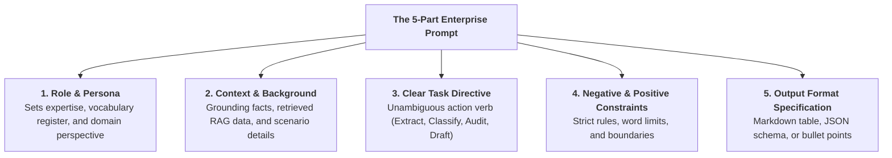
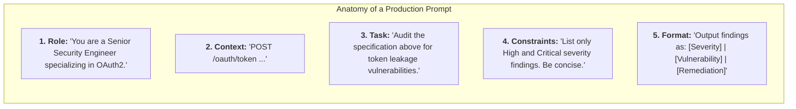
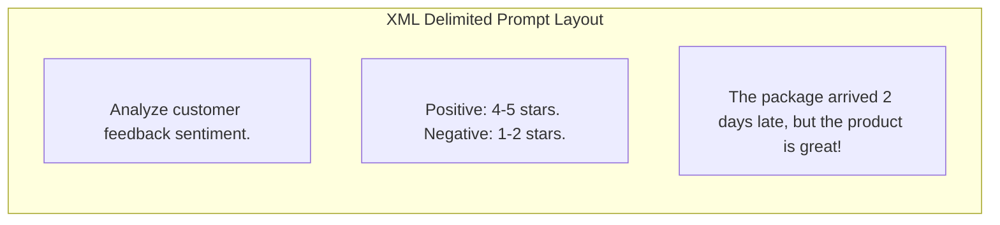
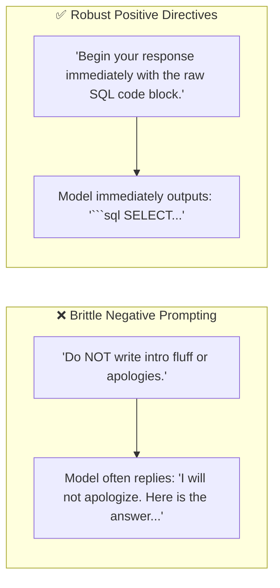
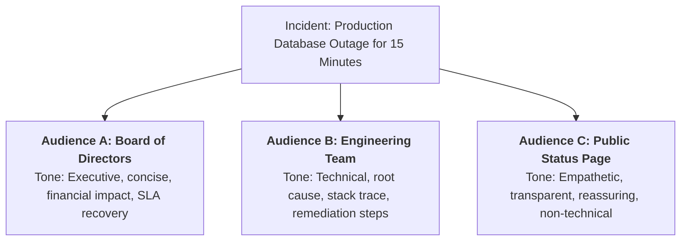

# 01 - Prompt Fundamentals: The 5-Part Prompt Architecture

> **Welcome to Phase 4: Prompt Engineering & Reasoning Workflows!**  
> **Mental Model**:  
> Think of Prompt Engineering like **directing a world-class Hollywood actor**:  
> * An LLM possesses vast knowledge, but if the director simply yells *"Act!"*, the actor will do something generic, unpredictable, and vague.  
> * A master director provides crystal-clear direction:  
>   1. **The Persona**: *"You are a seasoned senior forensic accountant."*  
>   2. **The Context**: *"You are auditing an irregular Q3 revenue ledger."*  
>   3. **The Task**: *"Identify the top 3 tax compliance violations."*  
>   4. **The Constraints**: *"Do NOT use legal jargon. Keep it under 150 words."*  
>   5. **The Output Format**: *"Output as a 3-column markdown table."*  
> Prompt engineering is not "magic words"—it is **rigorous specification engineering**.

---

## 📑 Table of Contents
1. [The 5-Part Prompt Architecture](#1-the-5-part-prompt-architecture)
2. [Dissecting the 5 Core Components](#2-dissecting-the-5-core-components)
3. [The Power of Structural Delimiters (XML Tags)](#3-the-power-of-structural-delimiters-xml-tags)
4. [Positive vs. Negative Constraints (The Pink Elephant Rule)](#4-positive-vs-negative-constraints-the-pink-elephant-rule)
5. [Audience, Tone & Style Calibration](#5-audience-tone--style-calibration)
6. [Dynamic Python Prompt Builders](#6-dynamic-python-prompt-builders)
7. [Master Cheat Sheet & Reference Table](#7-master-cheat-sheet--reference-table)

---

## 1. The 5-Part Prompt Architecture

Every high-performing enterprise prompt is constructed from **5 modular building blocks**:



---

## 2. Dissecting the 5 Core Components



### The 5 Components Reference Matrix:

| Component | Purpose | Example |
| :--- | :--- | :--- |
| **1. Role / Persona** | Primes the LLM's attention weights to relevant technical domains. | *"You are an expert PostgreSQL DBA."* |
| **2. Context** | Supplies the specific data the model must reason over. | *"Here is the slow-query EXPLAIN plan: `...`"* |
| **3. Task Directive** | Tells the model exactly what action to execute. | *"Analyze the index scans and suggest 2 indexing optimizations."* |
| **4. Constraints** | Prevents unwanted hallucination, verbosity, or off-topic drift. | *"Do NOT suggest sharding. Focus only on B-Tree indexes."* |
| **5. Output Format** | Specifies the exact layout of the final answer. | *"Return valid SQL `CREATE INDEX` statements followed by a 1-sentence rationale."* |

---

## 3. The Power of Structural Delimiters (XML Tags)

When prompts contain documents, instructions, and examples all mixed together, the model can get confused about where instructions end and data begins.

**Structural Delimiters (especially XML tags)** create clean walls between data blocks:



### Why Anthropic Claude & OpenAI Love XML Delimiters:
1. **Zero Ambiguity**: The model knows with 100% certainty that text inside `<review>...</review>` is user data.
2. **Injection Defense**: Delimiters prevent user data from breaking out into system instructions.
3. **Targeted Referencing**: You can tell the model: *"Refer strictly to the facts inside `<document>`."*

---

## 4. Positive vs. Negative Constraints (The Pink Elephant Rule)

> 🐘 **The Psychological LLM Quirk:**  
> If you tell a human *"Do NOT think of a pink elephant"*, the first thing they picture is a pink elephant.  
> LLMs behave similarly! If you write *"Do NOT apologize and do NOT say 'Sure, I can help with that!'"*, the probability of those very tokens increases because they are present in the context.



### Prompt Transformation Table:

| ❌ Weak Negative Prompt | ✅ Strong Positive Directive |
| :--- | :--- |
| *"Don't make the explanation too long."* | *"Explain this in exactly 2 concise sentences."* |
| *"Don't include introductory pleasantries."* | *"Begin immediately with the bulleted list."* |
| *"Don't hallucinate or guess."* | *"Rely strictly on the text inside `<context>`. If unknown, respond with 'DATA_NOT_FOUND'."* |
| *"Don't use complicated words."* | *"Explain this using vocabulary suitable for an 8th-grade student."* |

---

## 5. Audience, Tone & Style Calibration

A single prompt can be tailored to completely different audiences simply by shifting the persona and tone:



---

## 6. Dynamic Python Prompt Builders

In production, never build prompts using messy string concatenation (`+`). Use typed Python functions or Jinja templates:

```python
def build_expert_prompt(
    role: str,
    context_data: str,
    task: str,
    output_format: str,
    constraints: list[str]
) -> str:
    """Assembles a clean, XML-delimited production prompt."""
    
    formatted_constraints = "\n".join(f"- {c}" for c in constraints)
    
    return f"""<role>
You are a {role}.
</role>

<context>
{context_data}
</context>

<task>
{task}
</task>

<constraints>
{formatted_constraints}
</constraints>

<output_format>
{output_format}
</output_format>"""

# Example Usage:
prompt = build_expert_prompt(
    role="Senior Staff Python Engineer",
    context_data="def sum(a,b): return a+b",
    task="Review the code for type annotations and docstrings.",
    output_format="Return the refactored code block followed by a 1-line explanation.",
    constraints=[
        "Use Python 3.12 modern type hints.",
        "Begin immediately with the python code fence."
    ]
)

print(prompt)
```

---

## 7. Master Cheat Sheet & Reference Table

| Pillar | Principle | Production Best Practice |
| :--- | :--- | :--- |
| **The 5-Part Formula** | Role + Context + Task + Constraints + Format | Include all 5 components in every core production prompt. |
| **Structural Delimiters**| XML Tags (`<context>`, `<task>`) | Use tags to clearly separate untrusted data from system instructions. |
| **Directive Framing** | Positive Directives > Negative Begging | Tell the model *what to do first* rather than *what not to do*. |
| **Grounding Anchor** | Fallback string for missing info | Instruct the model to say `"NOT_IN_CONTEXT"` if facts are missing. |

---

## 🎯 Next Step in Phase 4
Now that you have mastered Prompt Fundamentals, we will advance to **[02 - Zero-Shot Prompting](file:///home/user2/PythonProject/Python-for-ai-engineering/04-prompt-engineering/02-zero-shot)** to master direct instruction execution and task decomposition!
