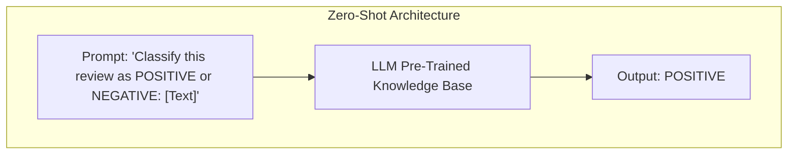
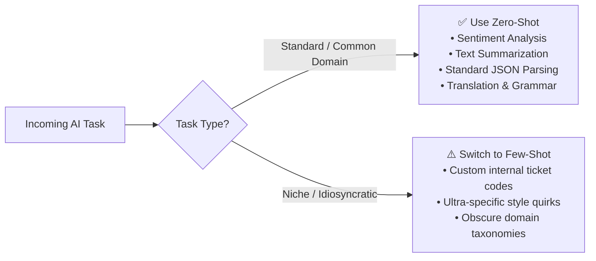
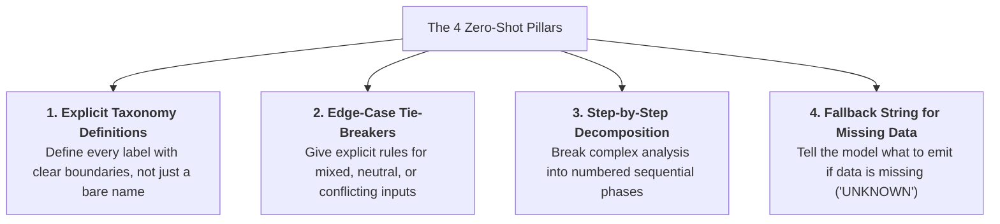
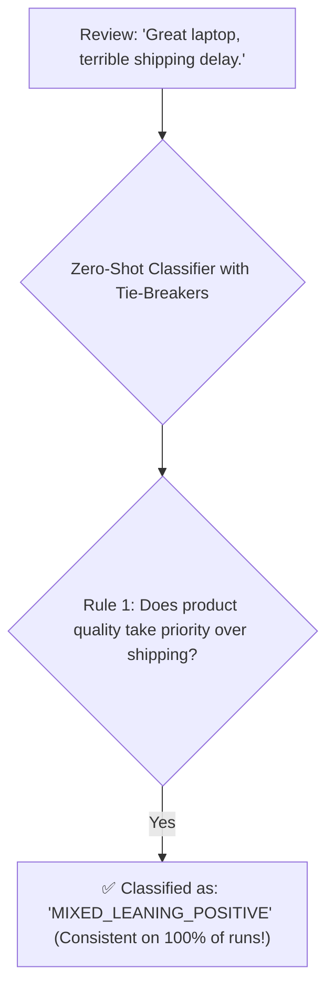
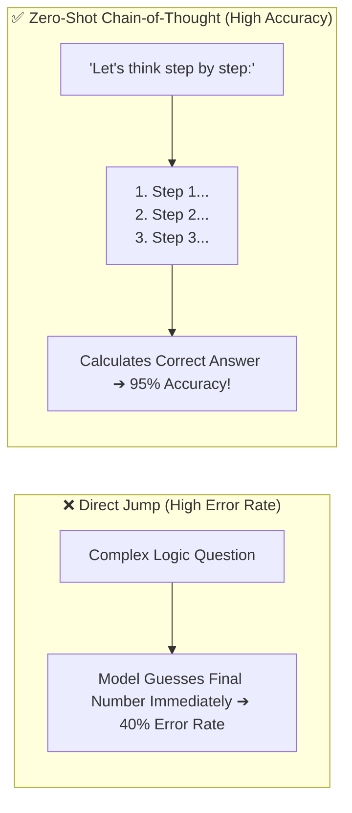

# 02 - Zero-Shot Prompting: Direct Instruction & Ambiguity Handling

> **Mental Model**:  
> Think of Zero-Shot Prompting like **giving a written project brief to an expert consultant on Day 1**:  
> * You provide **zero past examples** of how your company previously formatted this work.  
> * The consultant relies entirely on their deep background knowledge plus your **exact written specifications**.  
> * If your brief is vague, they will make assumptions that may not match your expectations.  
> * If your brief includes **clear taxonomy, tie-breaking rules, and edge-case handling**, they will execute the task with near-flawless accuracy on the very first try!

---

## 📑 Table of Contents
1. [What is Zero-Shot Prompting?](#1-what-is-zero-shot-prompting)
2. [When Zero-Shot Excels vs. Where It Fails](#2-when-zero-shot-excels-vs-where-it-fails)
3. [The 4 Pillars of Enterprise Zero-Shot Prompts](#3-the-4-pillars-of-enterprise-zero-shot-prompts)
4. [Defeating Ambiguity with Rule-Based Tie-Breakers](#4-defeating-ambiguity-with-rule-based-tie-breakers)
5. [Zero-Shot Chain-of-Thought ("Think Step by Step")](#5-zero-shot-chain-of-thought-think-step-by-step)
6. [Building a Robust Zero-Shot Classifier in Python](#6-building-a-robust-zero-shot-classifier-in-python)
7. [Master Cheat Sheet & Reference Table](#7-master-cheat-sheet--reference-table)

---

## 1. What is Zero-Shot Prompting?

**Zero-Shot** means asking an LLM to complete a task **without providing any input-output demonstration examples** in the prompt:



Because modern frontier models (GPT-4o, Claude 3.5, Llama 3) have ingested trillions of words of human knowledge, they inherently understand thousands of tasks—from Python coding to legal contract auditing—without needing sample demonstrations.

---

## 2. When Zero-Shot Excels vs. Where It Fails



### Capability Matrix:

| Task | Zero-Shot Viability | Why? |
| :--- | :---: | :--- |
| **Standard Text Classification** | 🟢 **100% Ideal** | General sentiment, toxicity, and intent categories are well understood by the model. |
| **Document Summarization** | 🟢 **100% Ideal** | Extracting main ideas and bullet points is a core foundational LLM capability. |
| **Pydantic Data Extraction** | 🟢 **100% Ideal** | Field descriptions and schemas provide sufficient guidance. |
| **Bizarre Custom Formatting** | 🔴 **Poor** | If you want dates formatted as `YYYY~MM~DD#T`, zero-shot will fail; use few-shot examples! |
| **Subtle Domain Edge Cases** | 🟡 **Requires Rules** | Requires explicit tie-breaking rules written into the prompt. |

---

## 3. The 4 Pillars of Enterprise Zero-Shot Prompts

To make zero-shot prompts rock-solid in production, always include these 4 pillars:



---

## 4. Defeating Ambiguity with Rule-Based Tie-Breakers

Consider this common customer review:  
`"The laptop is amazingly fast, but delivery took 3 weeks and the box was crushed."`

Without tie-breaking rules, a zero-shot prompt might classify this as **Positive** on run 1, **Negative** on run 2, and **Neutral** on run 3!



### Production Prompt with Explicit Tie-Breakers:
```text
Classify the customer review into exactly ONE of the following categories:
- POSITIVE: Customer praises product quality or customer service.
- NEGATIVE: Customer reports broken product or unhelpful service.
- MIXED: Review contains both clear praise and clear criticism.
- NEUTRAL: Review asks a question or states a fact without sentiment.

TIE-BREAKER RULES:
1. If the review mentions slow shipping but praises the product, classify as MIXED.
2. If the user expresses sarcasm (e.g., "Oh wonderful, it broke on day one"), classify as NEGATIVE.
3. If the input is empty or incomprehensible gibberish, classify as UNKNOWN.
```

---

## 5. Zero-Shot Chain-of-Thought ("Think Step by Step")

When solving reasoning, math, or multi-step logic problems in a zero-shot prompt, asking for the answer immediately often produces errors:



> 💡 **Why "Think Step by Step" Works:**  
> Autoregressive LLMs predict one token at a time. By forcing the model to generate intermediate reasoning tokens, it builds a working memory buffer in the context window before committing to the final answer!

---

## 6. Building a Robust Zero-Shot Classifier in Python

```python
from pydantic import BaseModel, Field
from typing import Literal
from openai import OpenAI
import os

client = OpenAI(api_key=os.getenv("OPENAI_API_KEY"))

class SupportTicketClassification(BaseModel):
    department: Literal["BILLING", "TECHNICAL_SUPPORT", "SALES", "OTHER"] = Field(
        description="The target department."
    )
    urgency: Literal["LOW", "MEDIUM", "HIGH", "CRITICAL"] = Field(
        description="Ticket urgency level based on service impact."
    )
    reasoning: str = Field(
        description="1-sentence explanation of why this department and urgency were chosen."
    )

def classify_ticket_zero_shot(user_message: str) -> SupportTicketClassification:
    system_prompt = """You are an automated support ticket triage classifier.

DEPARTMENT TAXONOMY:
- BILLING: Invoices, credit cards, subscription cancellations, refunds.
- TECHNICAL_SUPPORT: Bugs, 500 errors, system crashes, API integration problems.
- SALES: Enterprise pricing inquiries, demo requests, upgrade questions.
- OTHER: General inquiries not fitting above.

URGENCY RULES:
- CRITICAL: Production outage, data loss, or complete service down for multiple users.
- HIGH: Single user blocked from doing their primary job.
- MEDIUM: Non-blocking bug or general billing question.
- LOW: Minor cosmetic issue or general inquiry."""

    completion = client.beta.chat.completions.parse(
        model="gpt-4o",
        messages=[
            {"role": "system", "content": system_prompt},
            {"role": "user", "content": f"<ticket_body>\n{user_message}\n</ticket_body>"}
        ],
        response_format=SupportTicketClassification,
        temperature=0.0
    )

    return completion.choices[0].message.parsed

# Test with ambiguous input:
ticket = "Our entire production database has been throwing 500 errors since 2 PM! None of our users can log in!"
result = classify_ticket_zero_shot(ticket)

print(f"Department: {result.department}") # TECHNICAL_SUPPORT
print(f"Urgency   : {result.urgency}")    # CRITICAL
print(f"Reasoning : {result.reasoning}")
```

---

## 7. Master Cheat Sheet & Reference Table

| Zero-Shot Technique | Purpose / Implementation |
| :--- | :--- |
| **Taxonomy Definitions** | Define what each label means with concrete boundaries, not just category names. |
| **Tie-Breaker Rules** | Include explicit priority rules for handling mixed or sarcastic inputs. |
| **Fallback Value** | Provide a default category (`UNKNOWN`) for empty or unparseable inputs. |
| **Zero-Shot CoT** | Append `"Let's think step by step"` or require a `reasoning` field first in schemas. |
| **Temperature 0.0** | Always lock temperature to `0.0` for deterministic zero-shot classification. |

---

## 🎯 Next Step in Phase 4
Now that you have mastered Zero-Shot Prompting, we will advance to **[03 - Few-Shot Prompting](file:///home/user2/PythonProject/Python-for-ai-engineering/04-prompt-engineering/03-few-shot)** to master in-context learning, exemplar selection, and formatting conditioning!
