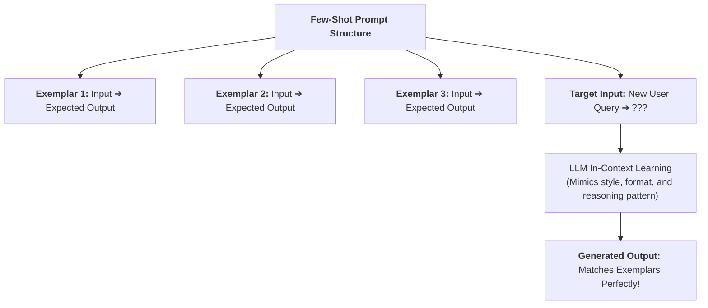
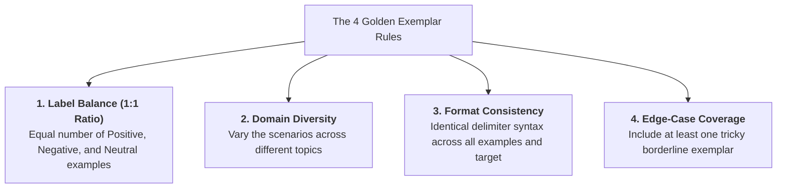
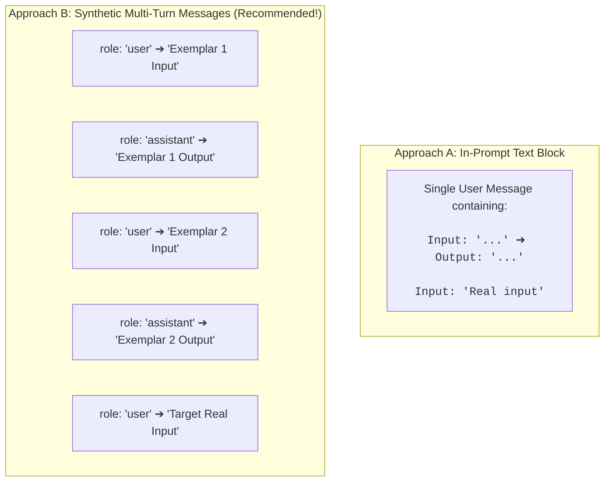
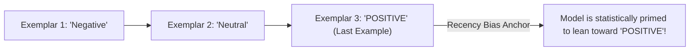
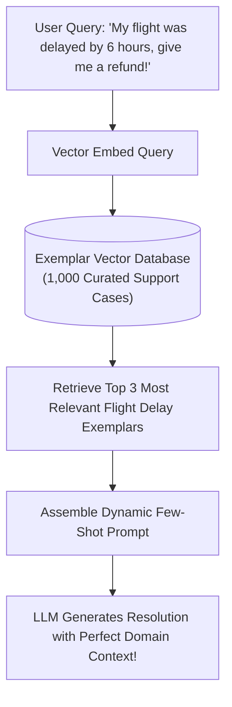

# 03 - Few-Shot Prompting: In-Context Learning & Exemplar Engineering

> **Mental Model**:  
> Think of Few-Shot Prompting like **teaching an apprentice woodcarver**:  
> * **Zero-Shot (Telling)**: Handing the apprentice a 10-page text manual describing how to carve a wooden knight. They might still misjudge the curves.  
> * **Few-Shot (Showing)**: Placing **3 perfectly finished wooden knights on their workbench**. The apprentice instantly observes the proportions, texture, and style, replicating the craftsmanship flawlessly!  
> Few-Shot Prompting (*"Show, Don't Just Tell"*) uses **In-Context Learning (ICL)** to condition model attention without retraining or fine-tuning weights.

---

## 📑 Table of Contents
1. [What is Few-Shot Prompting & In-Context Learning?](#1-what-is-few-shot-prompting--in-context-learning)
2. [The 3 Core Superpowers of Few-Shot Learning](#2-the-3-core-superpowers-of-few-shot-learning)
3. [The 4 Golden Rules of Exemplar Engineering](#3-the-4-golden-rules-of-exemplar-engineering)
4. [In-Prompt Text vs. Synthetic Multi-Turn Messages](#4-in-prompt-text-vs-synthetic-multi-turn-messages)
5. [Recency & Ordering Bias (The Last Example Effect)](#5-recency--ordering-bias-the-last-example-effect)
6. [Dynamic Few-Shot: RAG for Exemplars](#6-dynamic-few-shot-rag-for-exemplars)
7. [Building a Dynamic Few-Shot Pipeline in Python](#7-building-a-dynamic-few-shot-pipeline-in-python)
8. [Master Cheat Sheet & Reference Table](#8-master-cheat-sheet--reference-table)

---

## 1. What is Few-Shot Prompting & In-Context Learning?

**Few-Shot Prompting** means providing **2 to 5 high-quality input-output demonstration pairs (exemplars)** directly inside the prompt before asking the model to process the target input:



---

## 2. The 3 Core Superpowers of Few-Shot Learning

```mermaid
mindmap
  root((Few-Shot Superpowers))
    Exact Formatting Conditioning
      Enforces bespoke delimiter patterns
      e.g. '[CODE: 104] :: [ACTION: REJECT]'
    Brand Voice & Tone Mimicry
      Transfers subtle nuances
      e.g. Witty, professional, or academic
    Borderline Disambiguation
      Shows where the line is drawn
      on controversial or complex edge cases
```

---

## 3. The 4 Golden Rules of Exemplar Engineering

Bad exemplars will actively degrade model performance. Follow these 4 engineering rules:



> ⚠️ **The Majority Label Trap:**  
> If you supply 4 Positive examples and 1 Negative example, the model will develop an overwhelming bias toward predicting Positive on ambiguous test cases! **Always balance your label counts equally.**

---

## 4. In-Prompt Text vs. Synthetic Multi-Turn Messages

There are two primary ways to inject exemplars into an LLM API:



### Why Method B (Synthetic Turns) Performs Better:
Modern instruction-tuned chat models (OpenAI, Anthropic) are specifically trained on multi-turn conversations. Passing examples as synthetic `user`/`assistant` turns takes advantage of the model's native training alignment!

---

## 5. Recency & Ordering Bias (The Last Example Effect)

LLMs suffer from a known cognitive quirk: **they are heavily influenced by the final exemplar in the prompt**.



### 🛡️ Mitigation:
* Randomize exemplar order across requests, or place your most neutral/standard example last.

---

## 6. Dynamic Few-Shot: RAG for Exemplars

If your company has a library of 1,000 edge cases, you cannot fit all 1,000 into a single prompt without blowing up token costs.

**Dynamic Few-Shot** uses vector embeddings to retrieve the **top 3 most semantically similar exemplars** on the fly:



---

## 7. Building a Dynamic Few-Shot Pipeline in Python

Here is a production implementation demonstrating synthetic multi-turn few-shot formatting:

```python
from openai import OpenAI
import os

client = OpenAI(api_key=os.getenv("OPENAI_API_KEY"))

# 1. Curated, balanced exemplar library:
EXEMPLARS = [
    {
        "input": "The UI looks slick and clean, but the export button crashes every time.",
        "output": "CATEGORY: BUG | SEVERITY: HIGH | RATIONALE: Feature is non-functional."
    },
    {
        "input": "Could you add support for dark mode in the next release?",
        "output": "CATEGORY: FEATURE_REQUEST | SEVERITY: LOW | RATIONALE: Cosmetic enhancement suggestion."
    },
    {
        "input": "I was charged twice on my credit card for invoice #9021.",
        "output": "CATEGORY: BILLING | SEVERITY: HIGH | RATIONALE: Duplicate financial transaction."
    }
]

def classify_with_few_shot(target_text: str) -> str:
    # 2. Build multi-turn synthetic conversation
    messages = [
        {"role": "system", "content": "You are a software feedback classifier. Output strictly in the format: CATEGORY: ... | SEVERITY: ... | RATIONALE: ..."}
    ]

    # 3. Inject synthetic exemplar turns
    for ex in EXEMPLARS:
        messages.append({"role": "user", "content": ex["input"]})
        messages.append({"role": "assistant", "content": ex["output"]})

    # 4. Inject target user query
    messages.append({"role": "user", "content": target_text})

    response = client.chat.completions.create(
        model="gpt-4o-mini",
        messages=messages,
        temperature=0.0
    )

    return response.choices[0].message.content

# Run classifier on target input:
new_feedback = "The search bar is very slow and takes 8 seconds to load results."
print(classify_with_few_shot(new_feedback))
# Output: CATEGORY: PERFORMANCE | SEVERITY: MEDIUM | RATIONALE: Latency issue impacting usability.
```

---

## 8. Master Cheat Sheet & Reference Table

| Few-Shot Best Practice | Implementation Rule |
| :--- | :--- |
| **Exemplar Count** | **3 to 5 exemplars** is the universal sweet spot. $>10$ yields diminishing returns. |
| **Label Balance** | Always provide an equal distribution of output categories (e.g. 1 Pos, 1 Neg, 1 Neutral). |
| **Delivery Method** | Use synthetic `user`/`assistant` message turns for superior chat model alignment. |
| **Dynamic Selection** | Use vector embeddings to retrieve the most relevant exemplars from large databases. |
| **Format Mirroring** | Ensure every exemplar uses the exact same spacing, keys, and delimiters as the target prompt. |

---

## 🎯 Next Step in Phase 4
Now that you have mastered Few-Shot Prompting, we will advance to **[04 - System Prompt Design](file:///home/user2/PythonProject/Python-for-ai-engineering/04-prompt-engineering/04-system-prompt-design)** to build enterprise system prompts that never break character!
