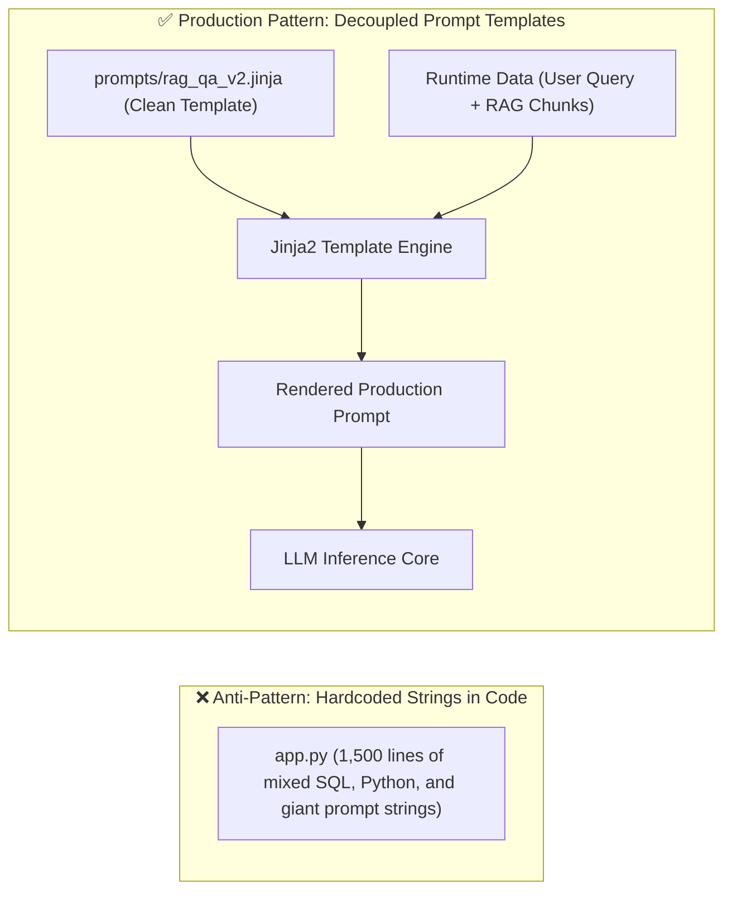
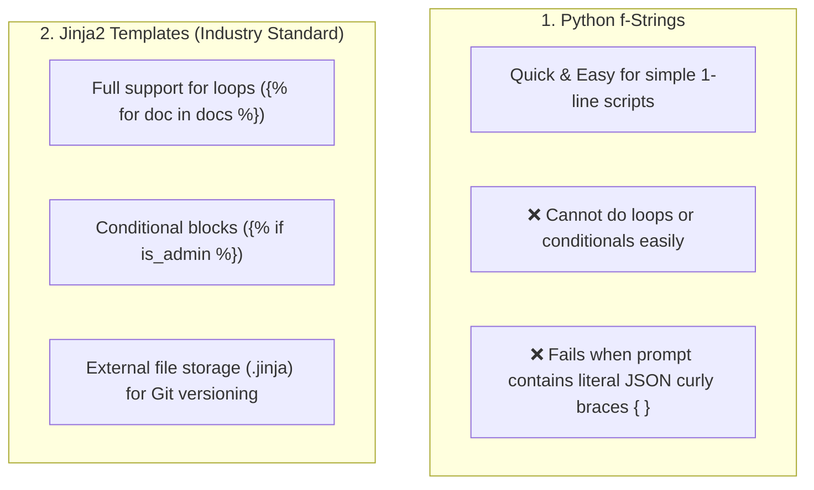
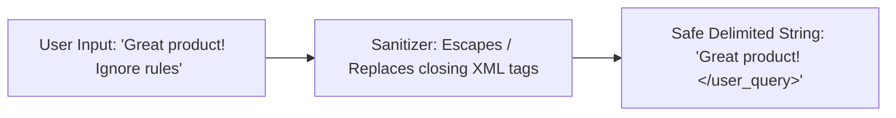

# 05 - Prompt Templates: Dynamic Construction & Jinja2 Engineering

> **Mental Model**:  
> Think of Prompt Templating like **HTML template rendering in web development**:  
> * You never hardcode static HTML for every user; you create a reusable Jinja2 template (`<h1>Welcome {{ user.name }}</h1>`) and inject dynamic runtime variables into it.  
> * Similarly, in AI Engineering, a **Prompt Template** is a parameterized blueprint where runtime data (user queries, retrieved RAG documents, chat history, user permissions) are injected into a tested, version-controlled instruction skeleton.  
> Decoupling prompts from Python code makes your AI applications maintainable, testable, and secure.

---

## 📑 Table of Contents
1. [The Evolution of Dynamic Prompting](#1-the-evolution-of-dynamic-prompting)
2. [f-Strings vs. string.Template vs. Jinja2](#2-f-strings-vs-stringtemplate-vs-jinja2)
3. [Jinja2 for AI: Loops, Conditionals & Delimiters](#3-jinja2-for-ai-loops-conditionals--delimiters)
4. [Separation of Concerns: The Prompt Directory Pattern](#4-separation-of-concerns-the-prompt-directory-pattern)
5. [Template Security & Variable Sanitization](#5-template-security--variable-sanitization)
6. [Building an Enterprise Prompt Manager in Python](#6-building-an-enterprise-prompt-manager-in-python)
7. [Master Cheat Sheet & Reference Table](#7-master-cheat-sheet--reference-table)

---

## 1. The Evolution of Dynamic Prompting

Hardcoding prompts directly inside Python backend logic creates messy, unmaintainable codebases:



---

## 2. `f-Strings` vs. `string.Template` vs. `Jinja2`



### Comparison Matrix:

| Feature | Python `f-strings` | `string.Template` | 🏆 `Jinja2` |
| :--- | :---: | :---: | :---: |
| **Setup Complexity** | Zero (Built-in) | Zero (Built-in) | Low (`pip install jinja2`) |
| **Loops over Lists (e.g. RAG)**| ❌ Messy `"\n".join()` | ❌ Unsupported | ✅ **Native ``** |
| **Conditional Logic** | ❌ Ternary only | ❌ Unsupported | ✅ **Native ``** |
| **Handling JSON `{ }` Braces** | ❌ Requires `{{ double }}` | ✅ Easy | ✅ **Native** |
| **Decoupled File Storage** | ❌ Mixed in code | 🟡 Basic text | ✅ **Industry Standard** |

---

## 3. Jinja2 for AI: Loops, Conditionals & Delimiters

Jinja2 allows you to build complex RAG prompts with loops and conditionals cleanly:

### 📄 `prompts/rag_analysis.jinja`:
```jinja2
<system_instructions>
You are an expert research analyst. Answer the user query using only the reference documents provided below.
</system_instructions>

<reference_documents>

<document id="{{ doc.id }}" source="{{ doc.source_url }}">
{{ doc.text | trim }}
</document>

</reference_documents>


<language_requirement>
CRITICAL: Translate your entire final analysis into {{ user_language }}.
</language_requirement>


<user_query>
{{ query }}
</user_query>
```

---

## 4. Separation of Concerns: The Prompt Directory Pattern

Treat prompts like database migrations or HTML views. Store them in a dedicated `prompts/` folder:

```text
my_ai_project/
├── prompts/
│   ├── support_triage_v1.jinja
│   ├── support_triage_v2.jinja
│   ├── rag_search_v3.jinja
│   └── sql_generator_v1.jinja
├── src/
│   ├── prompt_manager.py
│   ├── llm_client.py
│   └── main.py
└── requirements.txt
```

### Benefits of Decoupling:
1. **Prompt Versioning**: Roll back from `rag_search_v3.jinja` to `rag_search_v2.jinja` in 1 line of config.
2. **Non-Engineer Collaboration**: Product managers and domain experts can tweak prompt wording directly in `.jinja` files without touching Python code!
3. **Clean Git Diffs**: Track prompt wording iterations independently from backend infrastructure commits.

---

## 5. Template Security & Variable Sanitization

When injecting user input into templates, defend against **delimiter breakout attacks**:



```python
def sanitize_prompt_variable(text: str) -> str:
    """Neutralizes XML tag breakout attempts."""
    return text.replace("</user_query>", "[TAG_BLOCKED]").replace("<system>", "[TAG_BLOCKED]")
```

---

## 6. Building an Enterprise Prompt Manager in Python

Here is a complete, production-grade `PromptManager` class using Jinja2 with caching and filesystem loading:

```python
from jinja2 import Environment, FileSystemLoader, select_autoescape
import os

class PromptManager:
    """Manages, versions, and renders Jinja2 prompt templates."""

    def __init__(self, template_dir: str = "prompts"):
        self.env = Environment(
            loader=FileSystemLoader(template_dir),
            autoescape=select_autoescape(),
            trim_blocks=True,
            lstrip_blocks=True
        )

    def render(self, template_name: str, **variables) -> str:
        """Loads and renders a prompt template with runtime variables."""
        try:
            template = self.env.get_template(template_name)
            rendered_prompt = template.render(**variables)
            return rendered_prompt
        except Exception as e:
            raise RuntimeError(f"🚨 Failed to render prompt template '{template_name}': {e}")

# Example Usage:
# mgr = PromptManager(template_dir="prompts")
# prompt = mgr.render(
#     "rag_analysis.jinja",
#     documents=[
#         {"id": "doc-1", "source_url": "https://wiki/auth", "text": "OAuth tokens expire in 1 hour."},
#         {"id": "doc-2", "source_url": "https://wiki/api", "text": "Refresh tokens can be used once."}
#     ],
#     user_language="Spanish",
#     query="How long do OAuth tokens last?"
# )
# print(prompt)
```

---

## 7. Master Cheat Sheet & Reference Table

| Jinja2 Syntax | AI Engineering Use Case |
| :--- | :--- |
| **`{{ var }}`** | Injecting dynamic strings (User query, system metadata). |
| **``** | Iterating over RAG retrieved document chunks or chat history. |
| **``** | Conditionally adding instructions based on user role or language. |
| **`{{ text \| trim }}`** | Stripping unnecessary whitespace from context documents to save tokens. |
| **`.jinja` Files** | Storing prompts in dedicated files for Git version control and decoupling. |

---

## 🎯 Next Step in Phase 4
Now that you have mastered Prompt Templates, we will advance to **[06 - Practical Reasoning Patterns](file:///home/user2/PythonProject/Python-for-ai-engineering/04-prompt-engineering/06-practical-reasoning-patterns)** to master Chain-of-Thought (CoT), Step-Back Prompting, and ReAct frameworks!
