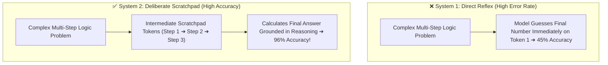
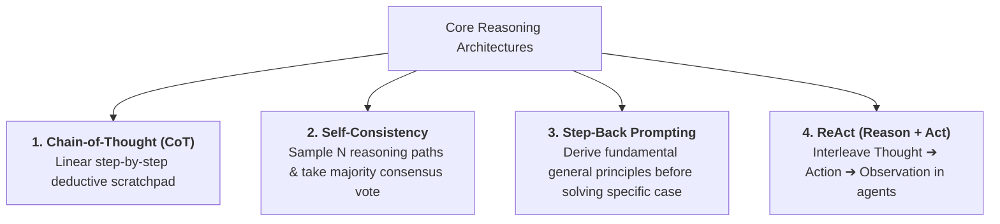
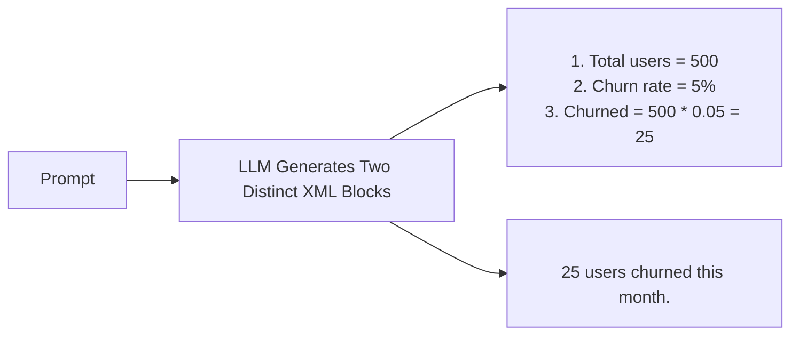
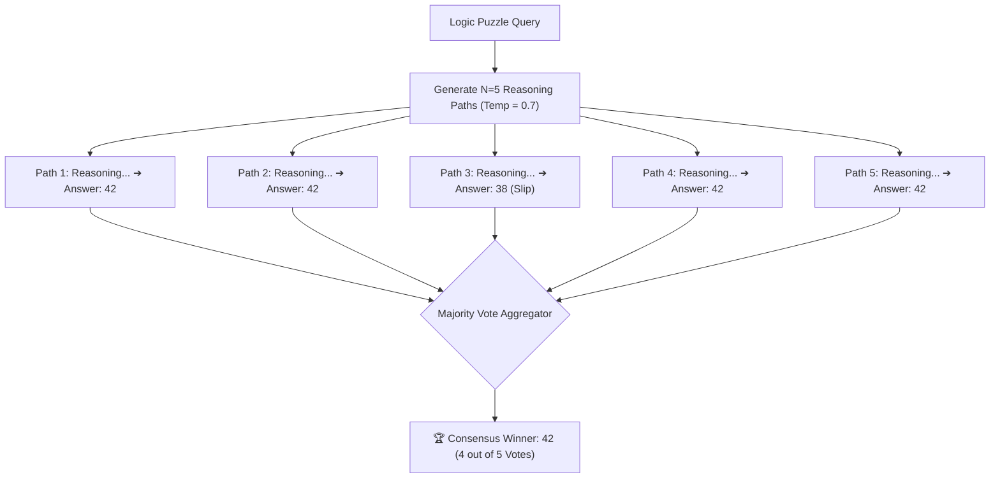
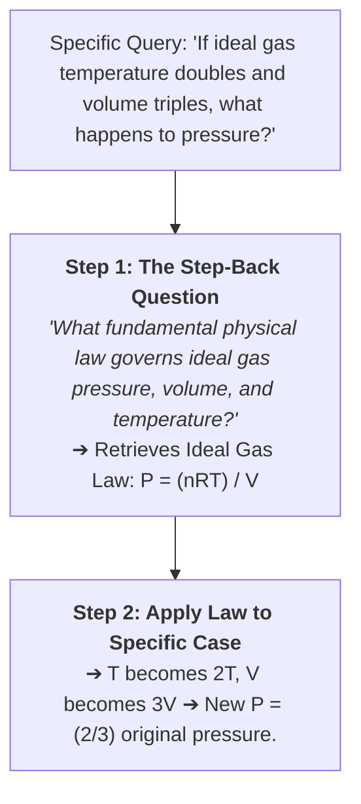
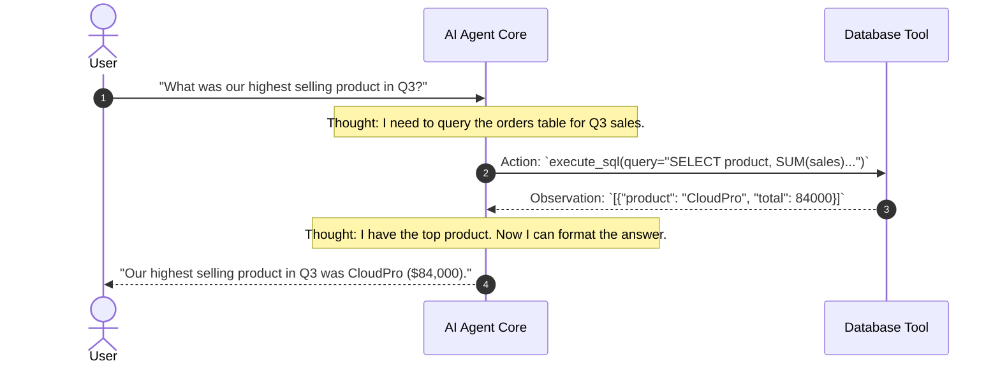

# 06 - Practical Reasoning Patterns: CoT, Self-Consistency & ReAct

> **Mental Model**:  
> Think of Reasoning Patterns like **Daniel Kahneman's System 1 vs. System 2 Thinking**:  
> * **System 1 (Fast & Reflexive)**: Standard zero-shot generation. The model blurts out an answer in one shot without thinking (high error rate on multi-step math and logic).  
> * **System 2 (Slow & Analytical)**: **Chain-of-Thought (CoT)**. The model writes out its intermediate scratchpad deductions token-by-token before committing to the final answer.  
> Reasoning patterns turn probabilistic language models into rigorous, step-by-step problem solvers.

---

## 📑 Table of Contents
1. [The System 1 vs. System 2 Paradigm](#1-the-system-1-vs-system-2-paradigm)
2. [The 4 Major Reasoning Architectures](#2-the-4-major-reasoning-architectures)
3. [Chain-of-Thought (CoT) & The Scratchpad Pattern](#3-chain-of-thought-cot--the-scratchpad-pattern)
4. [Self-Consistency: Ensemble Majority Voting](#4-self-consistency-ensemble-majority-voting)
5. [Step-Back Prompting: Abstract Principles First](#5-step-back-prompting-abstract-principles-first)
6. [The ReAct Pattern (Reason + Act for Agents)](#6-the-react-pattern-reason--act-for-agents)
7. [Building a Self-Consistency Engine in Python](#7-building-a-self-consistency-engine-in-python)
8. [Master Cheat Sheet & Reference Table](#8-master-cheat-sheet--reference-table)

---

## 1. The System 1 vs. System 2 Paradigm

Why do LLMs fail when asked complex logic questions directly?  
Because transformer models have **fixed computation per token**. If you ask for the final answer on token #1, the model only gets one forward pass to compute a 5-step problem!



By forcing the model to emit reasoning tokens, you give it **extra computational cycles** to solve the problem step-by-step.

---

## 2. The 4 Major Reasoning Architectures



### Comparison Matrix:

| Pattern | Best Use Case | Latency / Cost | How It Works |
| :--- | :--- | :---: | :--- |
| **Chain-of-Thought (CoT)** | Math, coding logic, multi-clause contract analysis | Baseline | Generates `<thinking>` steps before final output. |
| **Self-Consistency** | Mission-critical calculations, medical/financial logic | $3\times$ – $5\times$ Cost | Samples 5 parallel paths and picks majority vote. |
| **Step-Back Prompting** | Science, history, complex domain reasoning | $2\times$ Cost | Asks high-level conceptual questions first. |
| **ReAct** | Autonomous agents with external tools/APIs | Variable | Loops through Thought $\rightarrow$ Tool Call $\rightarrow$ Observation. |

---

## 3. Chain-of-Thought (CoT) & The Scratchpad Pattern

To prevent reasoning steps from polluting clean user UI outputs, enforce the **XML Scratchpad Pattern**:



### Production Prompt Template:
```text
Solve the problem below. 
First, explain your step-by-step reasoning inside <thinking>...</thinking> tags.
Then, provide your final concise answer inside <answer>...</answer> tags.

<problem>
A software company has 400 servers. 15% are running Ubuntu, 60% are running Debian, and the rest run RedHat. How many servers run RedHat?
</problem>
```

---

## 4. Self-Consistency: Ensemble Majority Voting

Even with Chain-of-Thought, an LLM might make a single arithmetic slip on 1 out of 5 runs.  
**Self-Consistency** eliminates randomness by generating **multiple diverse reasoning paths** at `temperature = 0.7` and voting on the winner:



---

## 5. Step-Back Prompting: Abstract Principles First

When models are asked highly specific questions, they often get lost in superficial details.  
**Step-Back Prompting** forces the model to take a step back and retrieve the **foundational principle first**:



---

## 6. The ReAct Pattern (Reason + Act for Agents)

When an AI agent needs to interact with databases and search engines, it uses the **ReAct (Reason + Act)** loop:



---

## 7. Building a Self-Consistency Engine in Python

Here is a production Python implementation that samples 5 reasoning paths, parses answers, and returns the consensus winner:

```python
from collections import Counter
from openai import OpenAI
import re
import os

client = OpenAI(api_key=os.getenv("OPENAI_API_KEY"))

def solve_with_self_consistency(problem: str, num_samples: int = 5) -> dict:
    prompt = f"""Solve this problem.
Show your reasoning inside <thinking>...</thinking>.
State your final numerical answer inside <answer>...</answer>.

Problem: {problem}"""

    # Generate 5 candidate reasoning paths in parallel
    response = client.chat.completions.create(
        model="gpt-4o",
        messages=[{"role": "user", "content": prompt}],
        temperature=0.7,  # Moderate temperature produces diverse reasoning paths
        n=num_samples
    )

    extracted_answers = []

    for idx, choice in enumerate(response.choices):
        text = choice.message.content
        match = re.search(r"<answer>(.*?)</answer>", text, re.DOTALL | re.IGNORECASE)
        ans = match.group(1).strip() if match else text.strip()
        extracted_answers.append(ans)
        print(f"Path #{idx + 1} deduced: {ans}")

    # Perform majority vote
    vote_counts = Counter(extracted_answers)
    consensus_answer, highest_votes = vote_counts.most_common(1)[0]
    confidence_pct = (highest_votes / num_samples) * 100

    print(f"\n🏆 Final Consensus: '{consensus_answer}' ({highest_votes}/{num_samples} votes - {confidence_pct:.0f}% Confidence)")
    return {
        "answer": consensus_answer,
        "confidence": confidence_pct,
        "all_answers": extracted_answers
    }

# Run test problem:
# res = solve_with_self_consistency("A farmer has 17 sheep and all but 9 run away. How many sheep are left?")
```

---

## 8. Master Cheat Sheet & Reference Table

| Pattern | Key Prompt Trigger / Architecture | Best When |
| :--- | :--- | :--- |
| **Chain-of-Thought** | `"Show your step-by-step reasoning inside <thinking>"` | Solving multi-step logic, code, or math. |
| **Self-Consistency** | `n=5, temperature=0.7` + Python `Counter.most_common()` | Accuracy is critical and worth $3\times$ token budget. |
| **Step-Back** | `"First, state the general rule/law governing this scenario"` | Navigating complex domain rules & physics. |
| **ReAct** | `Thought ➔ Action ➔ Observation` loop | Building tool-using autonomous AI agents. |

---

## 🎯 Next Step in Phase 4
Now that you have mastered reasoning patterns, we will advance to the final topic in Phase 4: **[07 - Prompt Iteration & Testing](file:///home/user2/PythonProject/Python-for-ai-engineering/04-prompt-engineering/07-prompt-iteration-testing)** to master prompt versioning, A/B testing, and red-teaming!
