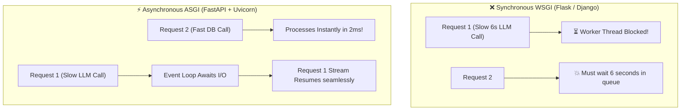
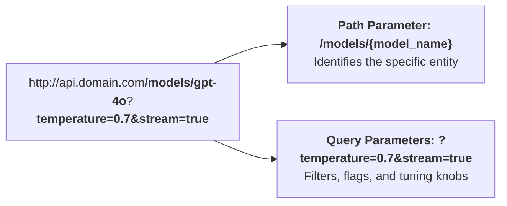
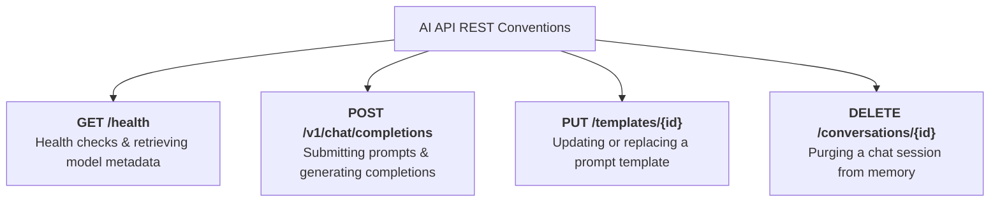
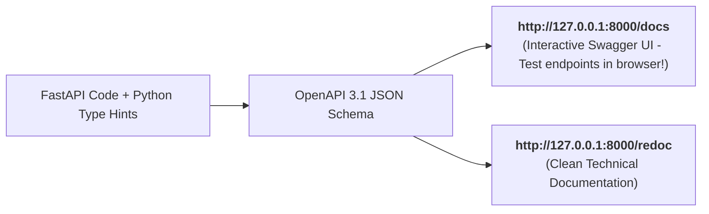

# 01 - FastAPI Fundamentals: The ASGI Engine, Routing & Swagger UI

> **Welcome to Phase 5: FastAPI for Production AI Services!**  
> **Mental Model**:  
> Think of FastAPI like a **modern high-speed bullet train station**:  
> * **Old Frameworks (Flask/Django WSGI)**: Traditional single-track trains. If one train stops for 8 seconds waiting for an LLM to generate text, all subsequent trains behind it are blocked!  
> * **FastAPI (ASGI + Uvicorn)**: A multi-track magnetic levitation network. While Train 1 is waiting on a slow OpenAI API stream, the track effortlessly handles 5,000 other passenger requests concurrently without breaking a sweat!  
> * **Automatic Conductor (`/docs`)**: Every route, parameter, and data type is automatically verified and documented into an interactive Swagger UI dashboard in real time.

---

## 📑 Table of Contents
1. [Why FastAPI is the Standard for AI Microservices](#1-why-fastapi-is-the-standard-for-ai-microservices)
2. [The Minimal FastAPI App & Uvicorn Server](#2-the-minimal-fastapi-app--uvicorn-server)
3. [Path Parameters vs. Query Parameters](#3-path-parameters-vs-query-parameters)
4. [HTTP Methods & AI REST Routing Conventions](#4-http-methods--ai-rest-routing-conventions)
5. [Automatic Interactive Documentation (/docs & /redoc)](#5-automatic-interactive-documentation-docs--redoc)
6. [Building a Complete Multi-Route AI Gateway](#6-building-a-complete-multi-route-ai-gateway)
7. [Master Cheat Sheet & Reference Table](#7-master-cheat-sheet--reference-table)

---

## 1. Why FastAPI is the Standard for AI Microservices

LLM calls are **I/O bound and slow** (taking 1 to 10 seconds per response).  
FastAPI is built natively on **ASGI (Asynchronous Server Gateway Interface)**, allowing Python to pause and resume thousands of concurrent LLM requests simultaneously:



---

## 2. The Minimal FastAPI App & Uvicorn Server

Creating a web API in FastAPI requires just 5 lines of code:

### 📄 `main.py`:
```python
from fastapi import FastAPI

# 1. Instantiate the ASGI application
app = FastAPI(
    title="AI Core Microservice",
    description="Production API Gateway for LLM Inference & RAG Search",
    version="1.0.0"
)

# 2. Define route with decorator
@app.get("/")
def read_root():
    return {"service": "AI Gateway", "status": "healthy", "version": "1.0.0"}
```

### 🚀 Running the Server with Uvicorn:
```bash
uvicorn main:app --reload --port 8000
```
* **`main`**: The Python file (`main.py`).
* **`app`**: The `FastAPI()` instance object inside `main.py`.
* **`--reload`**: Automatically restarts the server whenever code is saved (Development mode).

---

## 3. Path Parameters vs. Query Parameters



### 1️⃣ Path Parameters (`/items/{item_id}`):
Used for **identifying specific resources**. FastAPI automatically casts data types:

```python
@app.get("/models/{model_id}")
def get_model_details(model_id: str):
    # FastAPI automatically validates model_id as a string
    return {"model_id": model_id, "provider": "OpenAI", "context_window": 128000}
```

### 2️⃣ Query Parameters (`/search?q=ai&limit=10`):
Function arguments that are **not in the path** automatically become query parameters:

```python
@app.get("/prompts")
def search_prompts(
    category: str,                  # Required query param
    limit: int = 10,                 # Optional query param with default 10
    include_drafts: bool = False     # Optional boolean flag
):
    return {
        "category": category,
        "limit": limit,
        "include_drafts": include_drafts,
        "results": []
    }
```

---

## 4. HTTP Methods & AI REST Routing Conventions

In AI microservices, follow standard REST semantics:



| HTTP Method | FastAPI Decorator | AI Engineering Use Case |
| :--- | :--- | :--- |
| **`GET`** | `@app.get("/models")` | Retrieve list of available LLMs or health metrics. |
| **`POST`** | `@app.post("/generate")` | Generate text, calculate embeddings, or run RAG searches. |
| **`PUT`** | `@app.put("/prompts/{id}")` | Update prompt template definitions. |
| **`DELETE`** | `@app.delete("/history/{id}")`| Purge user conversation history from cache. |

---

## 5. Automatic Interactive Documentation (`/docs` & `/redoc`)

One of FastAPI's greatest superpowers is **automatic OpenAPI schema generation**. Without writing any configuration files, visiting your server URL provides:



You can execute live HTTP requests directly inside your browser by clicking **"Try it out"** on the `/docs` page!

---

## 6. Building a Complete Multi-Route AI Gateway

Here is a complete, runnable FastAPI application implementing health probes, model lookups, and query filtering:

```python
from fastapi import FastAPI, HTTPException

app = FastAPI(title="Enterprise AI Gateway", version="1.0.0")

# In-memory mock database of models
SUPPORTED_MODELS = {
    "gpt-4o": {"provider": "OpenAI", "cost_per_m_in": 2.50, "context": 128000},
    "claude-3-5-sonnet": {"provider": "Anthropic", "cost_per_m_in": 3.00, "context": 200000},
    "llama-3.1-70b": {"provider": "Groq", "cost_per_m_in": 0.59, "context": 128000},
}

# 1. Health Check
@app.get("/health", tags=["System"])
def health_check():
    return {"status": "ok", "uptime": "99.99%"}

# 2. Path Parameter: Specific Model Lookup
@app.get("/models/{model_name}", tags=["Models"])
def get_model_info(model_name: str):
    if model_name not in SUPPORTED_MODELS:
        raise HTTPException(status_code=404, detail=f"Model '{model_name}' not supported.")
    return {"model": model_name, "specs": SUPPORTED_MODELS[model_name]}

# 3. Query Parameters: Model Filter
@app.get("/models", tags=["Models"])
def list_models(max_price: float | None = None, provider: str | None = None):
    results = {}
    for name, data in SUPPORTED_MODELS.items():
        if max_price is not None and data["cost_per_m_in"] > max_price:
            continue
        if provider is not None and data["provider"].lower() != provider.lower():
            continue
        results[name] = data
    return {"count": len(results), "models": results}
```

---

## 7. Master Cheat Sheet & Reference Table

| Command / Syntax | Purpose |
| :--- | :--- |
| **`app = FastAPI()`** | Creates the ASGI web application instance. |
| **`uvicorn main:app --reload`**| Starts local development server with hot-reloading. |
| **`@app.get("/items/{id}")`** | Route with a required Path Parameter. |
| **`def read(limit: int = 10)`**| Query Parameter with a default fallback value. |
| **`http://localhost:8000/docs`**| Interactive Swagger UI browser sandbox. |
| **`raise HTTPException(404, ...)`**| Returns clean JSON error responses to client. |

---

## 🎯 Next Step in Phase 5
Now that you understand FastAPI routing and parameters, we will advance to **[02 - Pydantic in FastAPI](file:///home/user2/PythonProject/Python-for-ai-engineering/05-fastapi/02-pydantic-fastapi)** to master request body parsing, payload validation, and response model filtering!
