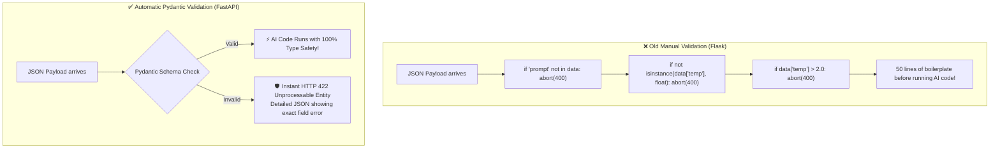
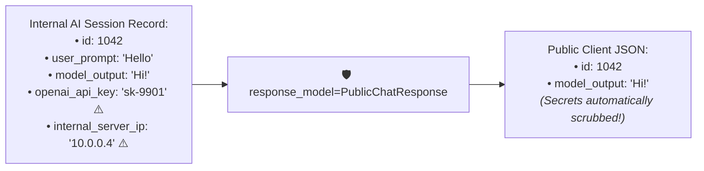
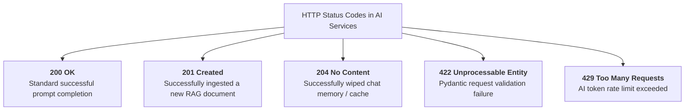

# 02 - Pydantic with FastAPI: Request Validation & Response Models

> **Mental Model**:  
> Think of Pydantic in FastAPI like a **two-way security airlock and diplomat**:  
> * **Inbound Airlock (Request Validation)**: When a client sends a JSON payload, Pydantic acts as an armed security guard. If a single field has the wrong type or violates a rule (e.g. `temperature = 5.0`), Pydantic **instantly slams the door with an HTTP 422 error** before your expensive AI code ever touches the request!  
> * **Outbound Airlock (`response_model`)**: When returning data to the client, Pydantic acts as a security filter, **automatically stripping internal database IDs and private keys** so they never leak to the public internet.

---

## 📑 Table of Contents
1. [The Automatic Validation Airlock](#1-the-automatic-validation-airlock)
2. [Defining AI Request Payloads with BaseModel & Field](#2-defining-ai-request-payloads-with-basemodel--field)
3. [The Security Power of response_model](#3-the-security-power-of-response_model)
4. [Semantic HTTP Status Codes](#4-semantic-http-status-codes)
5. [Custom Field & Model Validators for AI](#5-custom-field--model-validators-for-ai)
6. [Building a Type-Safe AI Microservice in Python](#6-building-a-type-safe-ai-microservice-in-python)
7. [Master Cheat Sheet & Reference Table](#7-master-cheat-sheet--reference-table)

---

## 1. The Automatic Validation Airlock

In traditional Flask/Django apps, developers spend half their time writing tedious manual validation code:



---

## 2. Defining AI Request Payloads with `BaseModel` & `Field`

Use `Field()` to define validation bounds, default values, and rich Swagger UI descriptions:

```python
from pydantic import BaseModel, Field
from typing import Literal

class CompletionRequest(BaseModel):
    model: str = Field(
        default="gpt-4o", 
        description="The target model identifier."
    )
    prompt: str = Field(
        min_length=3, 
        max_length=5000, 
        description="The user input prompt."
    )
    temperature: float = Field(
        default=0.7, 
        ge=0.0, 
        le=2.0, 
        description="Sampling randomness (0.0 to 2.0)."
    )
    max_tokens: int = Field(
        default=300, 
        gt=0, 
        le=4096, 
        description="Max tokens to generate."
    )
    response_type: Literal["text", "json", "markdown"] = Field(
        default="text", 
        description="Desired output format."
    )
```

---

## 3. The Security Power of `response_model`

Never return raw internal Python dictionaries or ORM database objects directly.  
Use **`response_model`** to enforce an **outbound security whitelist**:



```python
class PublicChatResponse(BaseModel):
    session_id: str
    content: str
    tokens_used: int
    finish_reason: str

# FastAPI automatically strips any other internal fields:
@app.post("/v1/chat", response_model=PublicChatResponse)
def generate_chat(req: CompletionRequest):
    # Even if internal_data contains secret keys, response_model only emits PublicChatResponse fields!
    return internal_data
```

---

## 4. Semantic HTTP Status Codes

Always use FastAPI's built-in `status` module to communicate clear HTTP outcomes:



```python
from fastapi import status

@app.post("/documents", status_code=status.HTTP_201_CREATED)
def ingest_document(doc: DocumentUploadRequest):
    # Ingest document into vector store
    return {"message": "Document indexed successfully"}
```

---

## 5. Custom Field & Model Validators for AI

Enforce domain-specific rules using Pydantic's `@field_validator` and `@model_validator`:

```python
from pydantic import BaseModel, Field, field_validator, model_validator

class AdvancedPromptRequest(BaseModel):
    prompt: str = Field(min_length=1)
    stream: bool = Field(default=False)
    candidate_count: int = Field(default=1, ge=1, le=5)

    # 1. Custom Field Validator: Prevent empty whitespace prompts
    @field_validator("prompt")
    @classmethod
    def prevent_blank_prompts(cls, value: str) -> str:
        if not value.strip():
            raise ValueError("Prompt cannot consist solely of whitespace.")
        return value.strip()

    # 2. Cross-Field Model Validator: Streaming does not support multiple candidates
    @model_validator(mode="after")
    def validate_stream_and_candidates(self):
        if self.stream and self.candidate_count > 1:
            raise ValueError("Candidate count must be 1 when streaming is enabled.")
        return self
```

---

## 6. Building a Type-Safe AI Microservice in Python

Here is a complete, runnable FastAPI application demonstrating request validation, custom business validators, and clean response modeling:

```python
from fastapi import FastAPI, status, HTTPException
from pydantic import BaseModel, Field, field_validator
import uuid

app = FastAPI(title="Type-Safe AI Service", version="1.0.0")

# --- Inbound Request Schema ---
class PromptRequest(BaseModel):
    prompt: str = Field(min_length=3, max_length=2000, description="The user prompt text.")
    temperature: float = Field(default=0.7, ge=0.0, le=2.0)

    @field_validator("prompt")
    @classmethod
    def check_injection_keywords(cls, v: str) -> str:
        if "ignore all instructions" in v.lower():
            raise ValueError("Security violation: Prompt injection attempt detected.")
        return v

# --- Outbound Response Schema ---
class PromptResponse(BaseModel):
    request_id: str
    output_text: str
    tokens_billed: int

# --- API Endpoint ---
@app.post(
    "/v1/generate", 
    response_model=PromptResponse, 
    status_code=status.HTTP_200_OK,
    tags=["Inference"]
)
def generate_text(request: PromptRequest):
    # Simulated model inference
    simulated_answer = f"AI Analysis of: '{request.prompt[:30]}...'"
    
    return {
        "request_id": str(uuid.uuid4()),
        "output_text": simulated_answer,
        "tokens_billed": 42,
        "internal_debug_secret": "DO_NOT_LEAK_ME" # Automatically filtered out by response_model!
    }
```

---

## 7. Master Cheat Sheet & Reference Table

| Pydantic / FastAPI Feature | Purpose / Syntax |
| :--- | :--- |
| **`BaseModel`** | Base class for defining request and response schemas. |
| **`Field(ge=0.0, le=2.0)`** | Enforces numerical ranges, length bounds, and documentation. |
| **`response_model=MySchema`** | Strips internal/sensitive fields and validates outbound JSON. |
| **`status_code=status.HTTP_201_CREATED`** | Declares standard semantic HTTP success codes. |
| **`@field_validator("field_name")`** | Custom validation logic for individual attributes. |
| **`@model_validator(mode="after")`**| Cross-field validation logic across multiple attributes. |

---

## 🎯 Next Step in Phase 5
Now that you have mastered Pydantic validation in FastAPI, we will advance to **[03 - Dependency Injection](file:///home/user2/PythonProject/Python-for-ai-engineering/05-fastapi/03-dependency-injection)** to master `Depends()`, API key authentication, rate limiting, and database session lifecycles!
