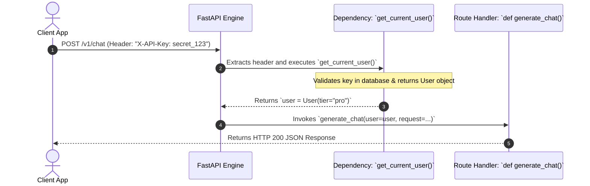
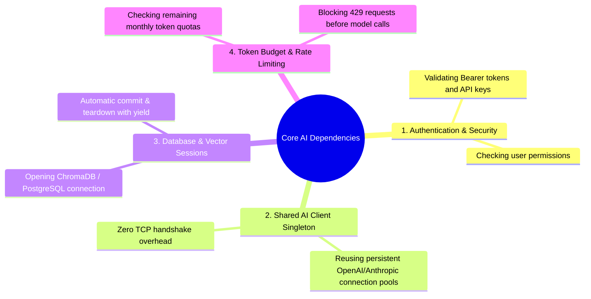
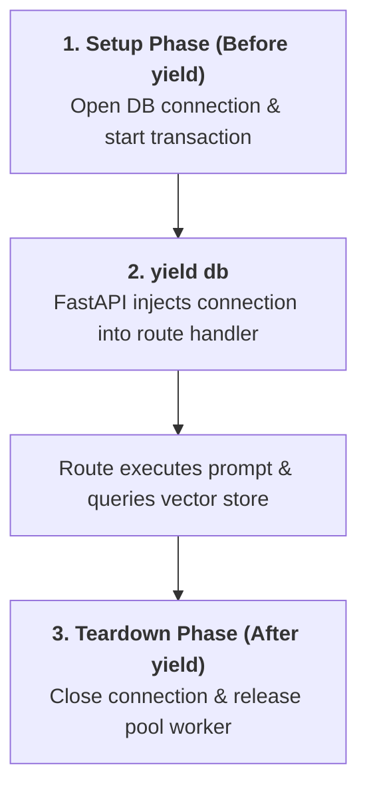
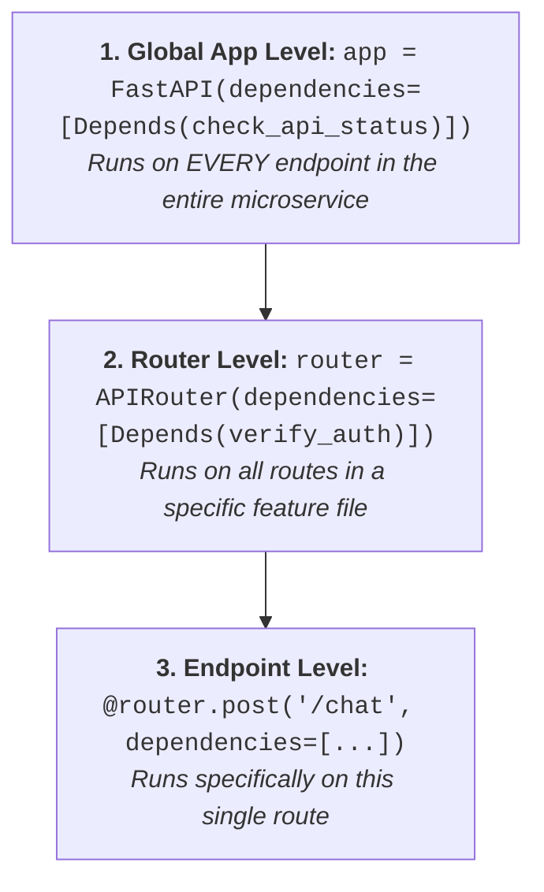

# 03 - Dependency Injection: Mastering Depends() & Security Gates

> **Mental Model**:  
> Think of Dependency Injection like a **surgical team assisting a chief surgeon**:  
> * The chief surgeon (your route handler function) does not leave the operating room to sterilize tools, mix anesthesia, or verify the patient's insurance.  
> * The surgical assistants (**FastAPI's `Depends()`**) prepare the sterile tools, verify the patient's identity, and hand the exact required instrument directly into the surgeon's hand the moment they begin.  
> * When the surgery is over, the assistant handles cleanup and disposes of medical waste (**`yield` cleanup**).  
> In FastAPI, `Depends()` decouples authentication, database connections, rate limits, and shared AI clients from your core business logic.

---

## 📑 Table of Contents
1. [What is Dependency Injection?](#1-what-is-dependency-injection)
2. [How Depends() Executes Under the Hood](#2-how-depends-executes-under-the-hood)
3. [The 4 Core AI Microservice Dependencies](#3-the-4-core-ai-microservice-dependencies)
4. [Dependencies with yield (Database & Session Cleanup)](#4-dependencies-with-yield-database--session-cleanup)
5. [Hierarchical & Global Dependencies](#5-hierarchical--global-dependencies)
6. [Building a Production AI Gateway with Auth & Rate Limiting](#6-building-a-production-ai-gateway-with-auth--rate-limiting)
7. [Master Cheat Sheet & Reference Table](#7-master-cheat-sheet--reference-table)

---

## 1. What is Dependency Injection?

Without Dependency Injection, your endpoint functions become bloated with repeated setup and authentication code:


---

## 2. How `Depends()` Executes Under the Hood

When a client hits an endpoint, FastAPI automatically traces the dependency tree, resolves arguments, and injects the return value into your function:



---

## 3. The 4 Core AI Microservice Dependencies

In modern AI architectures, `Depends()` is commonly used for these 4 tasks:



---

## 4. Dependencies with `yield` (Database & Session Cleanup)

When managing database connections, vector stores, or temporary file uploads, use **`yield`** to guarantee cleanup even if an exception occurs:



### The `yield` Pattern:
```python
def get_vector_db():
    print("🔌 Opening Vector Store connection...")
    db_session = VectorDatabaseSession()
    try:
        yield db_session # Injected into route!
    finally:
        print("🔒 Safely closing Vector Store connection...")
        db_session.close()
```

---

## 5. Hierarchical & Global Dependencies

FastAPI allows you to apply dependencies at 3 distinct levels:



---

## 6. Building a Production AI Gateway with Auth & Rate Limiting

Here is a complete, runnable FastAPI application demonstrating API key authentication, user tier rate-limiting, and shared client injection:

```python
from fastapi import FastAPI, Depends, HTTPException, Security, status
from fastapi.security import APIKeyHeader
from pydantic import BaseModel
from openai import OpenAI
import os

app = FastAPI(title="Enterprise AI Auth Gateway", version="1.0.0")

# 1. Define Security Scheme
api_key_header = APIKeyHeader(name="X-API-Key", auto_error=False)

# Mock User Database
USER_TIERS = {
    "key_free_123": {"user_id": 101, "tier": "free", "tokens_left": 1000},
    "key_pro_999": {"user_id": 202, "tier": "pro", "tokens_left": 1000000},
}

# --- Dependency 1: Verify API Key & Identity ---
def get_current_user(api_key: str = Security(api_key_header)) -> dict:
    if not api_key or api_key not in USER_TIERS:
        raise HTTPException(
            status_code=status.HTTP_401_UNAUTHORIZED,
            detail="Invalid or missing X-API-Key header."
        )
    return USER_TIERS[api_key]

# --- Dependency 2: Enforce Token Rate Limit ---
def verify_token_balance(user: dict = Depends(get_current_user)) -> dict:
    if user["tokens_left"] <= 0:
        raise HTTPException(
            status_code=status.HTTP_429_TOO_MANY_REQUESTS,
            detail="Monthly token budget exhausted. Please upgrade to Pro."
        )
    return user

# --- Dependency 3: Shared Persistent AI Client ---
def get_ai_client() -> OpenAI:
    # Reuses persistent connection pool
    return OpenAI(api_key=os.getenv("OPENAI_API_KEY", "mock-key"))

# --- Protected Endpoint ---
class ChatRequest(BaseModel):
    prompt: str

@app.post("/v1/chat", tags=["Inference"])
def chat_endpoint(
    request: ChatRequest,
    user: dict = Depends(verify_token_balance),
    ai_client: OpenAI = Depends(get_ai_client)
):
    # Route only runs if API key is valid AND token balance > 0!
    user["tokens_left"] -= 50
    
    return {
        "user_id": user["user_id"],
        "tier": user["tier"],
        "remaining_tokens": user["tokens_left"],
        "response": f"AI Response to: '{request.prompt}'"
    }
```

---

## 7. Master Cheat Sheet & Reference Table

| Syntax / Pattern | Purpose |
| :--- | :--- |
| **`Depends(func)`** | Injects the return value of `func()` into route parameters. |
| **`Security(api_key_header)`** | Enforces security schemes and displays lock icons in `/docs`. |
| **`yield resource`** | Provides context-manager style setup and teardown for DB/sessions. |
| **`app.dependency_overrides`** | Allows mocking dependencies during `pytest` unit testing without modifying code. |
| **`APIRouter(dependencies=[...])`** | Applies authentication to all routes inside a sub-module. |

---

## 🎯 Next Step in Phase 5
Now that you have mastered Dependency Injection, we will advance to **[04 - Async Endpoints](file:///home/user2/PythonProject/Python-for-ai-engineering/05-fastapi/04-async-endpoints)** to master `async def` vs `def`, event loop starvation, and thread pool offloading!
