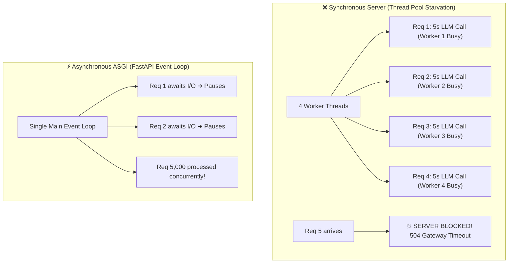
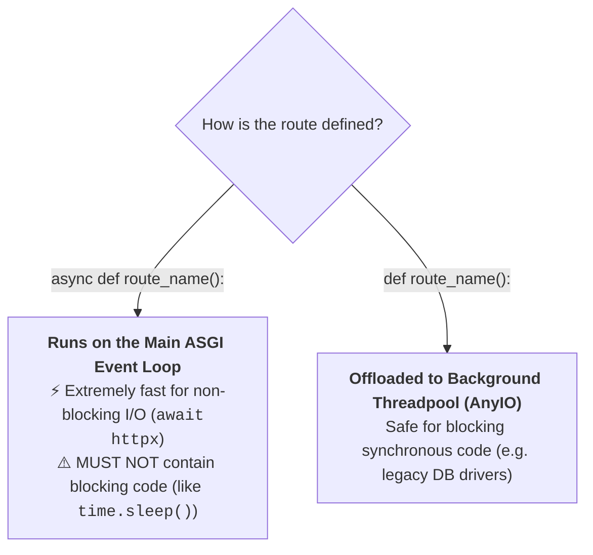
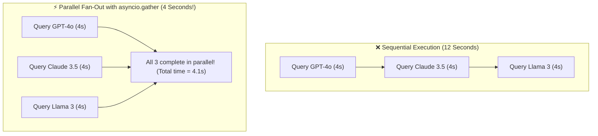
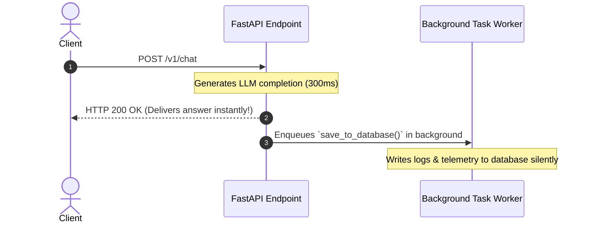

# 04 - Async Endpoints & Concurrency: Event Loops & Background Tasks

> **Mental Model**:  
> Think of Asynchronous Programming like a **master restaurant chef using a microwave**:  
> * **Blocking Synchronous (`def` + `requests.post`)**: The chef puts a dish in the microwave for 5 minutes and stands completely frozen, refusing to take orders, chop vegetables, or speak to customers until the timer beeps. The entire kitchen grinds to a halt!  
> * **Non-Blocking Asynchronous (`async def` + `await httpx.post`)**: The chef sets the microwave timer, walks away, takes 15 new customer orders, and plates 4 salads. The exact millisecond the microwave beeps, the chef plates the hot dish and hands it to the waiter.  
> Asynchronous endpoints allow a single FastAPI server to handle **thousands of slow AI requests concurrently**.

---

## 📑 Table of Contents
1. [The Concurrency Revolution in AI Services](#1-the-concurrency-revolution-in-ai-services)
2. [The Cardinal Rule: async def vs. def in FastAPI](#2-the-cardinal-rule-async-def-vs-def-in-fastapi)
3. [Event Loop Starvation: The #1 AI Backend Trap](#3-event-loop-starvation-the-1-ai-backend-trap)
4. [Parallel Multi-Model Fan-Out with asyncio.gather](#4-parallel-multi-model-fan-out-with-asynciogather)
5. [Fire-and-Forget Workflows with BackgroundTasks](#5-fire-and-forget-workflows-with-backgroundtasks)
6. [Building a High-Throughput Async AI Gateway in Python](#6-building-a-high-throughput-async-ai-gateway-in-python)
7. [Master Cheat Sheet & Reference Table](#7-master-cheat-sheet--reference-table)

---

## 1. The Concurrency Revolution in AI Services

Because LLM generation takes **2 to 8 seconds per request**, synchronous web servers quickly run out of worker threads:



---

## 2. The Cardinal Rule: `async def` vs. `def` in FastAPI

FastAPI handles `async def` and regular `def` completely differently under the hood:



### The Golden Rule:
* Use **`async def`** when calling asynchronous libraries (`AsyncOpenAI`, `httpx.AsyncClient`, `asyncpg`).
* Use **`def`** if you are forced to use synchronous blocking libraries (`requests`, standard `boto3`, heavy local CPU tokenization).

---

## 3. Event Loop Starvation: The #1 AI Backend Trap

> 🚨 **The Disaster Anti-Pattern:**  
> Declaring a function as `async def`, but calling a **blocking synchronous library** inside it!

```python
# ❌ CATASTROPHIC BUG: Freezes the entire server for ALL users!
@app.post("/bad_generate")
async def bad_generate(prompt: str):
    import requests, time
    # This synchronous call blocks the single main event loop for 5 seconds!
    response = requests.post("https://api.openai.com/v1/...", json={"prompt": prompt})
    return response.json()
```

```python
# ✅ CORRECT ASYNC PATTERN: Non-blocking await
@app.post("/good_generate")
async def good_generate(prompt: str):
    # The event loop yields control during the 5s network wait!
    response = await async_client.chat.completions.create(
        model="gpt-4o",
        messages=[{"role": "user", "content": prompt}]
    )
    return {"content": response.choices[0].message.content}
```

---

## 4. Parallel Multi-Model Fan-Out with `asyncio.gather`

In production, you often want to query multiple models in parallel (e.g., comparing GPT-4o vs Claude 3.5 vs Groq Llama 3):



### Parallel Python Implementation:
```python
import asyncio
from openai import AsyncOpenAI

async def query_model(client: AsyncOpenAI, model_name: str, prompt: str) -> dict:
    res = await client.chat.completions.create(
        model=model_name,
        messages=[{"role": "user", "content": prompt}]
    )
    return {"model": model_name, "content": res.choices[0].message.content}

@app.post("/v1/compare")
async def compare_models(prompt: str):
    client = AsyncOpenAI()
    
    # Run 3 LLM calls simultaneously in parallel
    results = await asyncio.gather(
        query_model(client, "gpt-4o", prompt),
        query_model(client, "gpt-4o-mini", prompt),
    )
    return {"comparisons": results}
```

---

## 5. Fire-and-Forget Workflows with `BackgroundTasks`

When a user submits a prompt, you want to return the answer **immediately**, but you also need to:
1. Log telemetry to your database.
2. Calculate embedding vectors for chat search.
3. Send usage metrics to Datadog.

Use **`BackgroundTasks`** to return the HTTP 200 response instantly while running telemetry in the background:



```python
from fastapi import FastAPI, BackgroundTasks
from openai import AsyncOpenAI

app = FastAPI()

def persist_audit_log(user_id: int, prompt: str, cost: float):
    """Slow database write executed in the background."""
    print(f"📝 [Background Task] Saving audit log for user {user_id} (${cost:.4f})")

@app.post("/v1/chat")
async def chat_with_audit(
    prompt: str, 
    user_id: int, 
    background_tasks: BackgroundTasks
):
    client = AsyncOpenAI()
    res = await client.chat.completions.create(
        model="gpt-4o-mini",
        messages=[{"role": "user", "content": prompt}]
    )
    answer = res.choices[0].message.content

    # Schedule background task (Executed AFTER response is delivered to user)
    background_tasks.add_task(persist_audit_log, user_id=user_id, prompt=prompt, cost=0.0012)

    return {"answer": answer}
```

---

## 6. Building a High-Throughput Async AI Gateway in Python

```python
from fastapi import FastAPI, BackgroundTasks, status
from pydantic import BaseModel
from openai import AsyncOpenAI
import asyncio
import os

app = FastAPI(title="High-Throughput Async AI Gateway", version="1.0.0")

client = AsyncOpenAI(api_key=os.getenv("OPENAI_API_KEY", "mock-key"))

class PromptPayload(BaseModel):
    prompt: str
    user_id: int

def background_analytics(prompt: str, user_id: int):
    # Simulated remote telemetry write
    print(f"📊 Telemetry logged for user {user_id}: {len(prompt)} chars.")

@app.post("/v1/generate", status_code=status.HTTP_200_OK)
async def generate_endpoint(
    payload: PromptPayload, 
    bg_tasks: BackgroundTasks
):
    # Non-blocking async API call
    response = await client.chat.completions.create(
        model="gpt-4o",
        messages=[{"role": "user", "content": payload.prompt}],
        timeout=15.0
    )
    
    output_text = response.choices[0].message.content
    
    # Fire-and-forget telemetry logging
    bg_tasks.add_task(background_analytics, payload.prompt, payload.user_id)
    
    return {
        "user_id": payload.user_id,
        "content": output_text,
        "finish_reason": response.choices[0].finish_reason
    }
```

---

## 7. Master Cheat Sheet & Reference Table

| Pattern | Rule / Syntax |
| :--- | :--- |
| **`async def`** | Use when awaiting non-blocking I/O (`await async_client.create()`). |
| **`def`** | Use for blocking synchronous functions; FastAPI automatically offloads to AnyIO threads. |
| **Event Loop Blocking** | ❌ Never put `requests.post()` or `time.sleep()` inside `async def`! |
| **Parallel Fan-Out** | `await asyncio.gather(task1, task2)` executes multiple model calls in parallel. |
| **`BackgroundTasks`** | Schedules post-response tasks (analytics, database persistence) without delaying the user. |

---

## 🎯 Next Step in Phase 5
Now that you have mastered Async Endpoints and Concurrency, we will advance to **[05 - Application Structure](file:///home/user2/PythonProject/Python-for-ai-engineering/05-fastapi/05-application-structure)** to master enterprise modular directory layouts, `APIRouter`, and lifespan events!
