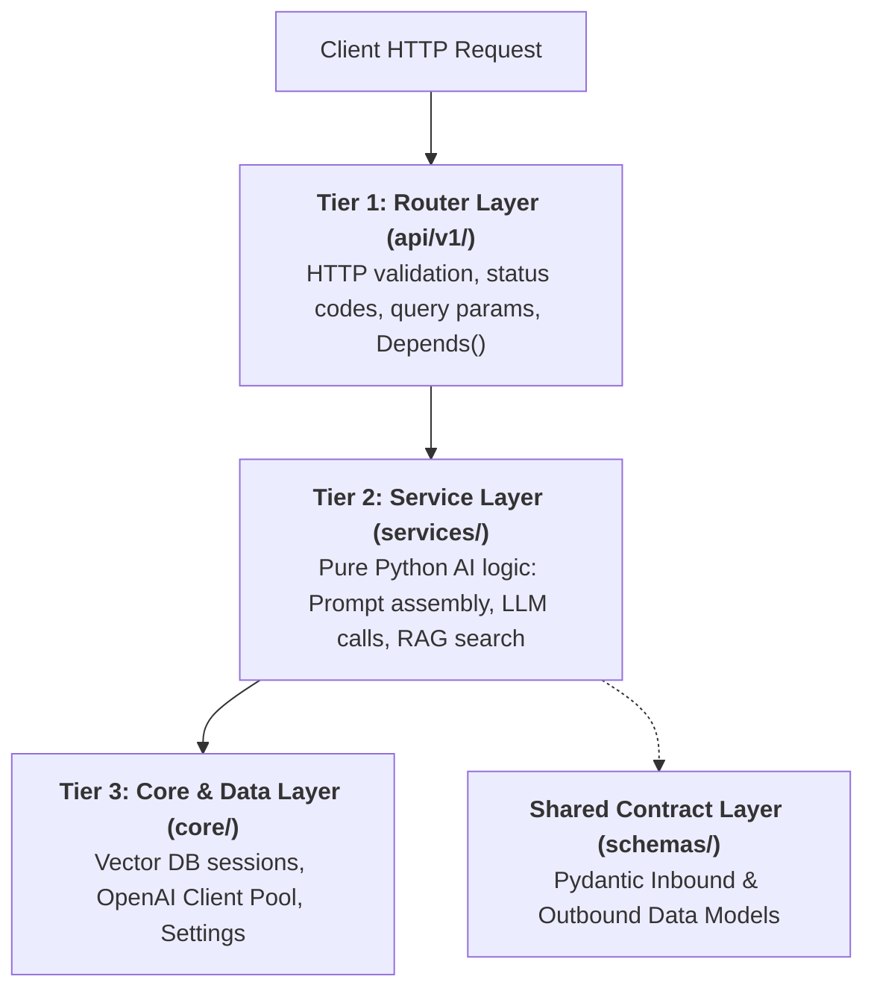
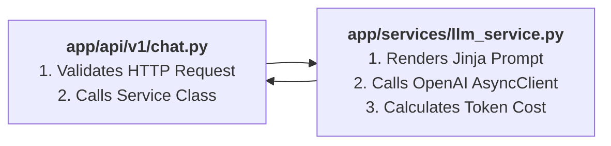
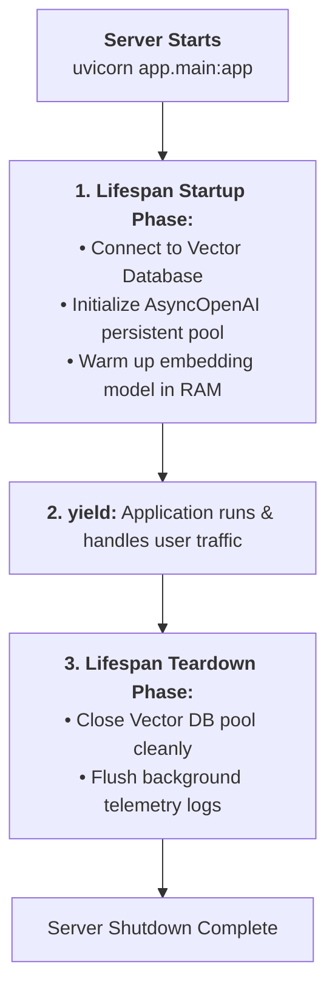

# 05 - Application Structure: Modular APIRouter & Enterprise Architecture

> **Mental Model**:  
> Think of Application Structure like **building an enterprise corporate campus vs. a single crowded shed**:  
> * **The Crowded Shed (Single `main.py` Anti-Pattern)**: Cramming 2,000 lines of SQL, prompt strings, FastAPI routes, and LLM clients into a single file. A single merge conflict destroys the entire codebase!  
> * **The Enterprise Campus (Modular Layered Architecture)**:  
>   * **The Reception Desks (`routers/`)**: Handle incoming HTTP requests and status codes.  
>   * **The Research Laboratories (`services/`)**: Contain pure AI logic, prompt rendering, and LLM calls.  
>   * **The Legal Contracts (`schemas/`)**: Pydantic data models defining request and response shapes.  
>   * **The Utility Grid (`core/`)**: Environment settings, database pools, and security gates.  
>   * **The Facilities Manager (`lifespan`)**: Automatically warms up model weights at startup and closes connections at shutdown.

---

## 📑 Table of Contents
1. [The 3-Tier Enterprise AI Architecture](#1-the-3-tier-enterprise-ai-architecture)
2. [Production Directory Layout Blueprint](#2-production-directory-layout-blueprint)
3. [Modular Routing with APIRouter](#3-modular-routing-with-apirouter)
4. [The Service Layer Pattern (Decoupling HTTP from AI)](#4-the-service-layer-pattern-decoupling-http-from-ai)
5. [Modern Lifespan Management (Startup & Shutdown)](#5-modern-lifespan-management-startup--shutdown)
6. [Type-Safe Configuration with pydantic-settings](#6-type-safe-configuration-with-pydantic-settings)
7. [Master Cheat Sheet & Reference Table](#7-master-cheat-sheet--reference-table)

---

## 1. The 3-Tier Enterprise AI Architecture

In production AI microservices, clean separation of concerns is mandatory:



---

## 2. Production Directory Layout Blueprint

Here is the industry-standard directory structure for production FastAPI AI services:

```text
my_ai_service/
├── app/
│   ├── api/
│   │   └── v1/
│   │       ├── endpoints/
│   │       │   ├── chat.py         # /api/v1/chat endpoints
│   │       │   ├── rag.py          # /api/v1/rag endpoints
│   │       │   └── models.py       # /api/v1/models endpoints
│   │       └── router.py           # Aggregates all v1 endpoint routers
│   ├── core/
│   │   ├── config.py               # Pydantic BaseSettings & .env loader
│   │   ├── security.py             # API Key & JWT token verification
│   │   └── database.py             # Vector store & SQL pool management
│   ├── schemas/
│   │   ├── chat.py                 # ChatRequest, ChatResponse
│   │   └── rag.py                  # DocumentChunk, QueryPayload
│   ├── services/
│   │   ├── llm_service.py          # Pure OpenAI / Anthropic logic
│   │   └── vector_service.py       # Embedding generation & ChromaDB search
│   └── main.py                     # Root FastAPI instance & Lifespan manager
├── tests/
├── .env
├── requirements.txt
└── README.md
```

---

## 3. Modular Routing with `APIRouter`

Instead of attaching every route directly to `app`, use **`APIRouter`** to group related endpoints into modular files:

### 📄 `app/api/v1/endpoints/chat.py`:
```python
from fastapi import APIRouter, Depends, status
from app.schemas.chat import ChatRequest, ChatResponse
from app.services.llm_service import LLMService

router = APIRouter(prefix="/chat", tags=["Chat & Inference"])

@router.post("/generate", response_model=ChatResponse, status_code=status.HTTP_200_OK)
async def generate_chat(
    request: ChatRequest,
    llm_service: LLMService = Depends()
):
    result = await llm_service.generate(prompt=request.prompt, model=request.model)
    return result
```

### 📄 `app/api/v1/router.py` (The Router Hub):
```python
from fastapi import APIRouter
from app.api.v1.endpoints import chat, rag, models

api_v1_router = APIRouter(prefix="/api/v1")

# Mount sub-routers with clean prefixes
api_v1_router.include_router(chat.router)
api_v1_router.include_router(rag.router, prefix="/rag", tags=["RAG Search"])
api_v1_router.include_router(models.router, prefix="/models", tags=["Models"])
```

---

## 4. The Service Layer Pattern (Decoupling HTTP from AI)

> 💡 **The Architectural Golden Rule:**  
> **Never write OpenAI / Anthropic API calls directly inside your route functions!**  
> If you put LLM logic inside a route, you cannot test it without spinning up a full HTTP server, and you cannot reuse it in background tasks or CLI scripts.



### 📄 `app/services/llm_service.py`:
```python
from openai import AsyncOpenAI
import os

class LLMService:
    """Pure business logic service for LLM generation."""
    
    def __init__(self):
        self.client = AsyncOpenAI(api_key=os.getenv("OPENAI_API_KEY"))

    async def generate(self, prompt: str, model: str = "gpt-4o") -> dict:
        response = await self.client.chat.completions.create(
            model=model,
            messages=[{"role": "user", "content": prompt}],
            temperature=0.7
        )
        return {
            "content": response.choices[0].message.content,
            "tokens_used": response.usage.total_tokens,
            "model_used": model
        }
```

---

## 5. Modern Lifespan Management (Startup & Shutdown)

In modern FastAPI, the old `@app.on_event("startup")` syntax has been superseded by the standard **`lifespan` async context manager**:



### 📄 `app/main.py`:
```python
from fastapi import FastAPI
from contextlib import asynccontextmanager
from app.api.v1.router import api_v1_router
from app.core.config import settings

@asynccontextmanager
async def lifespan(app: FastAPI):
    # --- Startup: Initialize resources ---
    print(f"🚀 Initializing {settings.PROJECT_NAME} in {settings.ENVIRONMENT} mode...")
    # e.g. await vector_db.connect()
    
    yield  # Application serves requests here!
    
    # --- Shutdown: Cleanup resources ---
    print("🛑 Shutting down AI Gateway & closing connection pools...")
    # e.g. await vector_db.disconnect()

app = FastAPI(
    title=settings.PROJECT_NAME,
    version="1.0.0",
    lifespan=lifespan
)

# Mount the Master Router
app.include_router(api_v1_router)
```

---

## 6. Type-Safe Configuration with `pydantic-settings`

Store and validate environment variables with full type safety:

```python
# pip install pydantic-settings
from pydantic_settings import BaseSettings, SettingsConfigDict
from functools import lru_cache

class Settings(BaseSettings):
    PROJECT_NAME: str = "Enterprise AI Gateway"
    ENVIRONMENT: str = "production"
    OPENAI_API_KEY: str
    ANTHROPIC_API_KEY: str | None = None
    MAX_CONCURRENT_REQUESTS: int = 100
    
    model_config = SettingsConfigDict(env_file=".env", extra="ignore")

# Cache settings singleton so .env is only read once from disk:
@lru_cache()
def get_settings() -> Settings:
    return Settings()

settings = get_settings()
```

---

## 7. Master Cheat Sheet & Reference Table

| Pattern / Component | Purpose |
| :--- | :--- |
| **`APIRouter(prefix="/...", tags=["..."])`** | Modular sub-router grouping related endpoints. |
| **`app.include_router(sub_router)`** | Attaches a sub-router to the main application hub. |
| **`services/` Layer** | Houses pure AI/LLM logic independent of HTTP request objects. |
| **`lifespan(app: FastAPI)`** | Handles startup resource warming and shutdown cleanup safely. |
| **`pydantic-settings`** | Type-safe `.env` validation with automatic environment loading. |
| **`@lru_cache()`** | Caches settings object in memory to prevent repeated disk reads. |

---

## 🎯 Next Step in Phase 5
Now that you have mastered Application Structure and Architecture, we will advance to **[06 - Error Handling](file:///home/user2/PythonProject/Python-for-ai-engineering/05-fastapi/06-error-handling)** to master custom exception handlers, standard JSON error envelopes, and rate-limit trapping!
