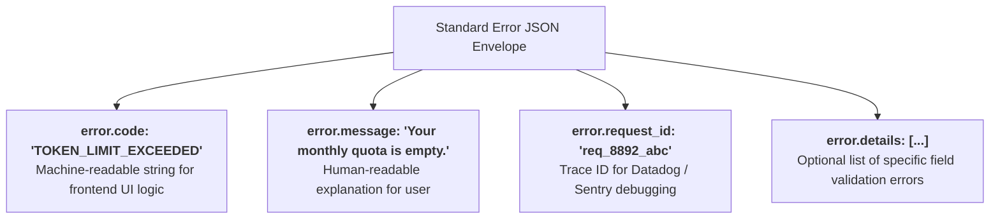
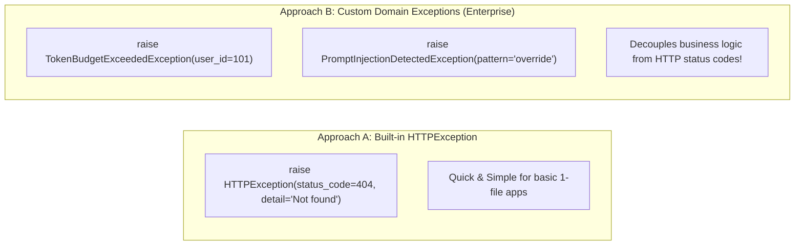
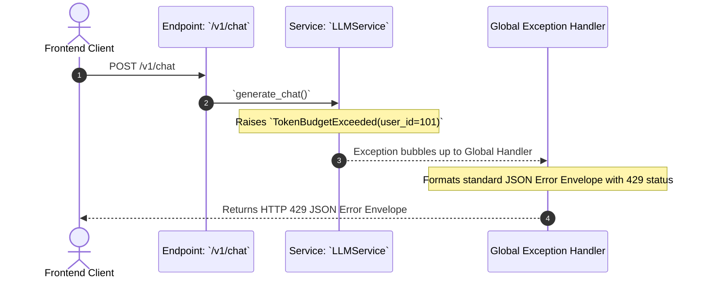
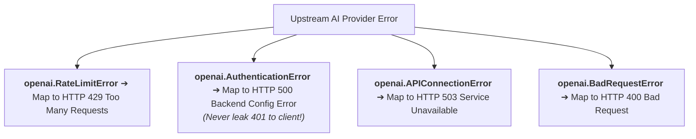

# 06 - Error Handling in FastAPI: Custom Handlers & Exception Envelopes

> **Mental Model**:  
> Think of Global Error Handling like an **emergency hospital triage department**:  
> * **Without Triage (Unhandled Crashes)**: A patient faints, alarms blare, and the hospital collapses in panic, vomiting a raw Python stack trace onto the user's screen (exposing internal database paths and secret API keys!).  
> * **With Triage (`@app.exception_handler`)**: The doctor calmly intercepts the patient, diagnoses the root cause (Rate limit? Bad token? Model outage?), and delivers a standardized, polite **JSON Error Envelope** to the user with actionable next steps.  
> Bulletproof error handling prevents server crashes, protects sensitive internal stack traces, and provides clean contracts for frontend developers.

---

## 📑 Table of Contents
1. [The Anatomy of an Enterprise Error Envelope](#1-the-anatomy-of-an-enterprise-error-envelope)
2. [Built-in HTTPException vs. Custom Domain Exceptions](#2-built-in-httpexception-vs-custom-domain-exceptions)
3. [Global Exception Handlers (@app.exception_handler)](#3-global-exception-handlers-appexception_handler)
4. [Trapping Third-Party AI Provider Errors (OpenAI / Anthropic)](#4-trapping-third-party-ai-provider-errors-openai--anthropic)
5. [Customizing Pydantic 422 Validation Errors](#5-customizing-pydantic-422-validation-errors)
6. [Building a Production Fault-Tolerant Application in Python](#6-building-a-production-fault-tolerant-application-in-python)
7. [Master Cheat Sheet & Reference Table](#7-master-cheat-sheet--reference-table)

---

## 1. The Anatomy of an Enterprise Error Envelope

Never return inconsistent error formats across different routes. Enforce a **Standard Error JSON Envelope**:



### The Standard Error JSON Contract:
```json
{
  "error": {
    "code": "MODEL_RATE_LIMITED",
    "message": "AI generation service is experiencing heavy traffic. Please retry in 3 seconds.",
    "request_id": "req-9901-abcd",
    "timestamp": 1724589120,
    "details": null
  }
}
```

---

## 2. Built-in `HTTPException` vs. Custom Domain Exceptions



### Defining Clean Custom Exceptions:
```python
class AIException(Exception):
    """Base exception for all AI microservice errors."""
    pass

class TokenBudgetExceeded(AIException):
    def __init__(self, user_id: int, tokens_left: int):
        self.user_id = user_id
        self.tokens_left = tokens_left

class PromptInjectionDetected(AIException):
    def __init__(self, detected_pattern: str):
        self.detected_pattern = detected_pattern
```

---

## 3. Global Exception Handlers (`@app.exception_handler`)

Instead of cluttering routes with `try/except` blocks, write centralized **Global Exception Handlers**:



---

## 4. Trapping Third-Party AI Provider Errors (OpenAI / Anthropic)

When OpenAI throws an exception, never let it bubble up as an unhandled `500` server crash. Map it to clean HTTP codes:



```python
from openai import RateLimitError, APIConnectionError
from fastapi.responses import JSONResponse
from fastapi import Request

@app.exception_handler(RateLimitError)
async def openai_rate_limit_handler(request: Request, exc: RateLimitError):
    return JSONResponse(
        status_code=429,
        content={
            "error": {
                "code": "PROVIDER_RATE_LIMITED",
                "message": "Upstream AI inference cluster is currently saturated. Back off and retry.",
                "details": str(exc)
            }
        }
    )
```

---

## 5. Customizing Pydantic `422` Validation Errors

By default, FastAPI returns a raw, complex array for validation errors.  
You can intercept **`RequestValidationError`** to return your standardized error envelope:

```python
from fastapi.exceptions import RequestValidationError
from fastapi.responses import JSONResponse
from fastapi import Request

@app.exception_handler(RequestValidationError)
async def custom_validation_handler(request: Request, exc: RequestValidationError):
    # Flatten field errors into clean readable messages
    errors = []
    for err in exc.errors():
        field = " -> ".join(str(loc) for loc in err["loc"])
        errors.append({"field": field, "issue": err["msg"]})

    return JSONResponse(
        status_code=422,
        content={
            "error": {
                "code": "INVALID_REQUEST_PAYLOAD",
                "message": "The JSON request payload contains validation errors.",
                "details": errors
            }
        }
    )
```

---

## 6. Building a Production Fault-Tolerant Application in Python

Here is a complete, runnable FastAPI application demonstrating custom domain exceptions, OpenAI error mapping, and standardized JSON error responses:

```python
from fastapi import FastAPI, Request, status
from fastapi.responses import JSONResponse
from fastapi.exceptions import RequestValidationError
from pydantic import BaseModel, Field
import uuid
import time

app = FastAPI(title="Resilient AI Gateway", version="1.0.0")

# --- Custom Domain Exceptions ---
class TokenQuotaExceeded(Exception):
    def __init__(self, user_id: int):
        self.user_id = user_id

# --- Global Exception Handlers ---
@app.exception_handler(TokenQuotaExceeded)
async def handle_quota_exceeded(request: Request, exc: TokenQuotaExceeded):
    return JSONResponse(
        status_code=status.HTTP_429_TOO_MANY_REQUESTS,
        content={
            "error": {
                "code": "TOKEN_QUOTA_EXHAUSTED",
                "message": f"User {exc.user_id} has exceeded their monthly token allowance.",
                "request_id": str(uuid.uuid4()),
                "timestamp": int(time.time())
            }
        }
    )

@app.exception_handler(RequestValidationError)
async def handle_pydantic_validation(request: Request, exc: RequestValidationError):
    formatted_errors = [{"field": ".".join(str(l) for l in e["loc"]), "msg": e["msg"]} for e in exc.errors()]
    return JSONResponse(
        status_code=status.HTTP_422_UNPROCESSABLE_ENTITY,
        content={
            "error": {
                "code": "VALIDATION_FAILED",
                "message": "Invalid request fields provided.",
                "details": formatted_errors
            }
        }
    )

# --- Endpoint ---
class ChatInput(BaseModel):
    user_id: int = Field(gt=0)
    prompt: str = Field(min_length=3)

@app.post("/v1/chat")
async def chat_endpoint(payload: ChatInput):
    # Simulated quota check
    if payload.user_id == 999: # Test trigger for quota exception
        raise TokenQuotaExceeded(user_id=payload.user_id)
        
    return {"message": "Success", "reply": f"Analysis of '{payload.prompt}'"}
```

---

## 7. Master Cheat Sheet & Reference Table

| Error Category | HTTP Code | Handler Pattern |
| :--- | :---: | :--- |
| **Pydantic Schema Failure** | `422` | `@app.exception_handler(RequestValidationError)` |
| **Token Budget Empty** | `429` | Custom `TokenQuotaExceeded` domain exception. |
| **OpenAI Rate Limit** | `429` | `@app.exception_handler(openai.RateLimitError)` |
| **OpenAI Auth Issue** | `500` | Log internally; never return raw 401 to end user. |
| **Unknown Python Bug** | `500` | `@app.exception_handler(Exception)` catch-all to prevent stack trace leak. |

---

## 🎯 Next Step in Phase 5
Now that you have mastered error handling, we will advance to **[07 - AI API Integration](file:///home/user2/PythonProject/Python-for-ai-engineering/05-fastapi/07-ai-api-integration)** to master integrating OpenAI, Anthropic, and Groq clients into production FastAPI services!
