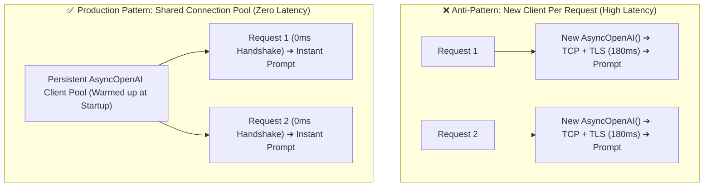
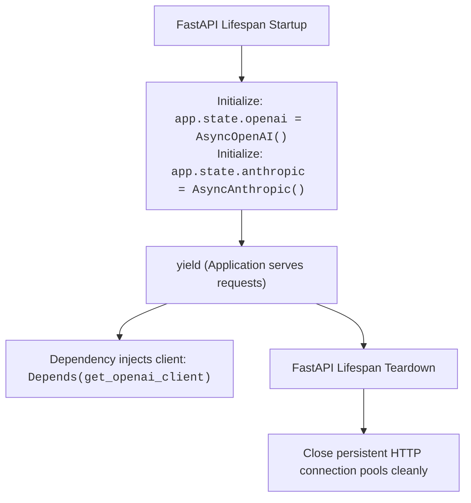
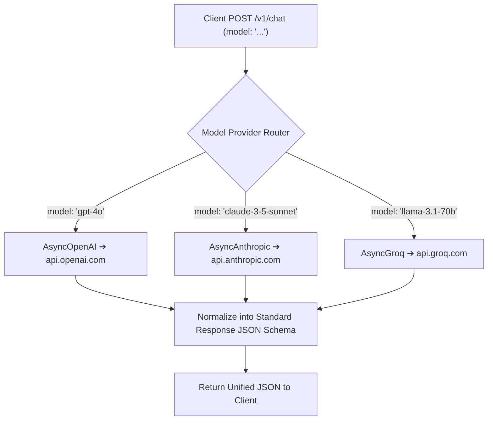
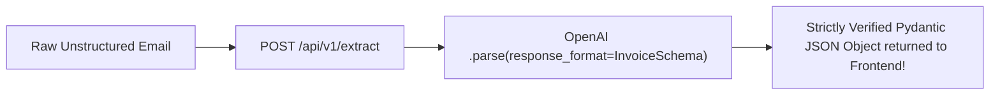

# 07 - AI API Integration: Multi-Provider Gateways in FastAPI

> **Mental Model**:  
> Think of AI Client Integration like a **centralized fiber-optic switchboard**:  
> * **The Anti-Pattern (New Client on Every Call)**: Creating a new `OpenAI()` instance inside every route handler function. Every single prompt must establish a new TCP connection, renegotiate TLS encryption, and allocate memory, adding 200ms of useless latency!  
> * **The Production Pattern (Persistent Singleton Pool)**: Initializing your `AsyncOpenAI` and `AsyncAnthropic` clients **once** during application startup (`lifespan`). The persistent connection pool stays warm, routing prompts to OpenAI, Anthropic, and Groq instantly with zero overhead.

---

## 📑 Table of Contents
1. [The Singleton Client Architecture](#1-the-singleton-client-architecture)
2. [Managing Async Client Lifecycles via app.state](#2-managing-async-client-lifecycles-via-appstate)
3. [The Multi-Provider Gateway Router Pattern](#3-the-multi-provider-gateway-router-pattern)
4. [Structured Pydantic Extraction Endpoints](#4-structured-pydantic-extraction-endpoints)
5. [High-Throughput Vector Embedding Endpoints](#5-high-throughput-vector-embedding-endpoints)
6. [Building a Complete Multi-Provider AI Microservice in Python](#6-building-a-complete-multi-provider-ai-microservice-in-python)
7. [Master Cheat Sheet & Reference Table](#7-master-cheat-sheet--reference-table)

---

## 1. The Singleton Client Architecture



---

## 2. Managing Async Client Lifecycles via `app.state`

Store persistent client singletons on **`app.state`** during the `lifespan` startup phase:



### Dependency Injector Pattern:
```python
from fastapi import Request
from openai import AsyncOpenAI
from anthropic import AsyncAnthropic

def get_openai_client(request: Request) -> AsyncOpenAI:
    """Injects the persistent OpenAI client singleton from app.state."""
    return request.app.state.openai_client

def get_anthropic_client(request: Request) -> AsyncAnthropic:
    """Injects the persistent Anthropic client singleton from app.state."""
    return request.app.state.anthropic_client
```

---

## 3. The Multi-Provider Gateway Router Pattern

Clients shouldn't need to know the specific syntax of OpenAI vs. Anthropic vs. Groq. Your FastAPI service acts as a **unified gateway**:



---

## 4. Structured Pydantic Extraction Endpoints

FastAPI endpoints can enforce strict Pydantic schemas on the LLM using native **Structured Outputs (`.parse()`)**:



```python
from pydantic import BaseModel, Field

class ContactExtraction(BaseModel):
    full_name: str = Field(description="Extracted full name.")
    email: str = Field(description="Extracted email address.")
    company: str | None = Field(default=None, description="Company name if mentioned.")

@app.post("/v1/extract-contact", response_model=ContactExtraction)
async def extract_contact(
    text: str,
    client: AsyncOpenAI = Depends(get_openai_client)
):
    completion = await client.beta.chat.completions.parse(
        model="gpt-4o-mini",
        messages=[
            {"role": "system", "content": "Extract contact information from text."},
            {"role": "user", "content": text}
        ],
        response_format=ContactExtraction
    )
    return completion.choices[0].message.parsed
```

---

## 5. High-Throughput Vector Embedding Endpoints

Expose a batch embedding generation route for RAG vector databases:

```python
class EmbeddingRequest(BaseModel):
    texts: list[str] = Field(min_length=1, max_length=100)
    model: str = "text-embedding-3-small"

class EmbeddingResponse(BaseModel):
    embeddings: list[list[float]]
    tokens_used: int

@app.post("/v1/embeddings", response_model=EmbeddingResponse)
async def create_embeddings(
    req: EmbeddingRequest,
    client: AsyncOpenAI = Depends(get_openai_client)
):
    res = await client.embeddings.create(
        input=req.texts,
        model=req.model
    )
    vectors = [item.embedding for item in res.data]
    return {"embeddings": vectors, "tokens_used": res.usage.total_tokens}
```

---

## 6. Building a Complete Multi-Provider AI Microservice in Python

Here is a complete, runnable FastAPI application implementing persistent client lifecycle management, provider routing, and structured parsing:

```python
from fastapi import FastAPI, Depends, Request, status, HTTPException
from contextlib import asynccontextmanager
from pydantic import BaseModel, Field
from openai import AsyncOpenAI
import os

# --- Lifespan Context Manager ---
@asynccontextmanager
async def lifespan(app: FastAPI):
    # Initialize persistent connection pool at startup
    app.state.openai = AsyncOpenAI(api_key=os.getenv("OPENAI_API_KEY", "mock-key"))
    print("⚡ Persistent OpenAI connection pool initialized.")
    
    yield
    
    # Teardown connection pool at shutdown
    await app.state.openai.close()
    print("🛑 OpenAI connection pool closed.")

app = FastAPI(title="Multi-Provider AI Service", version="1.0.0", lifespan=lifespan)

# --- Dependency ---
def get_ai_client(request: Request) -> AsyncOpenAI:
    return request.app.state.openai

# --- Schemas ---
class ChatPrompt(BaseModel):
    prompt: str = Field(min_length=1)
    model: str = Field(default="gpt-4o-mini")
    temperature: float = Field(default=0.7, ge=0.0, le=2.0)

class ChatOutput(BaseModel):
    model: str
    reply: str
    total_tokens: int

# --- Endpoint ---
@app.post("/v1/chat", response_model=ChatOutput, status_code=status.HTTP_200_OK)
async def chat_endpoint(
    payload: ChatPrompt,
    client: AsyncOpenAI = Depends(get_ai_client)
):
    try:
        response = await client.chat.completions.create(
            model=payload.model,
            messages=[{"role": "user", "content": payload.prompt}],
            temperature=payload.temperature
        )
        return {
            "model": payload.model,
            "reply": response.choices[0].message.content,
            "total_tokens": response.usage.total_tokens
        }
    except Exception as err:
        raise HTTPException(status_code=500, detail=f"LLM Provider Error: {err}")
```

---

## 7. Master Cheat Sheet & Reference Table

| Pattern | Best Practice |
| :--- | :--- |
| **Client Initialization** | Initialize once inside `lifespan(app)` and attach to `app.state`. |
| **Client Injection** | Use `Depends(get_ai_client)` to pass persistent clients into endpoints. |
| **Structured Output** | Use `client.beta.chat.completions.parse(response_format=Schema)` for guaranteed JSON. |
| **Batch Embeddings** | Pass `list[str]` to `client.embeddings.create()` for vector DB indexing. |
| **Connection Teardown** | Always call `await client.close()` in the lifespan teardown phase. |

---

## 🎯 Next Step in Phase 5
Now that you have mastered AI API Integration, we will advance to **[08 - Streaming Responses](file:///home/user2/PythonProject/Python-for-ai-engineering/05-fastapi/08-streaming-responses)** to master real-time Server-Sent Events (SSE) and `StreamingResponse` in FastAPI!
