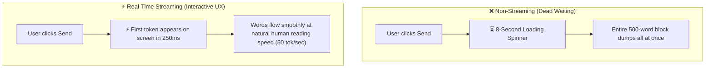
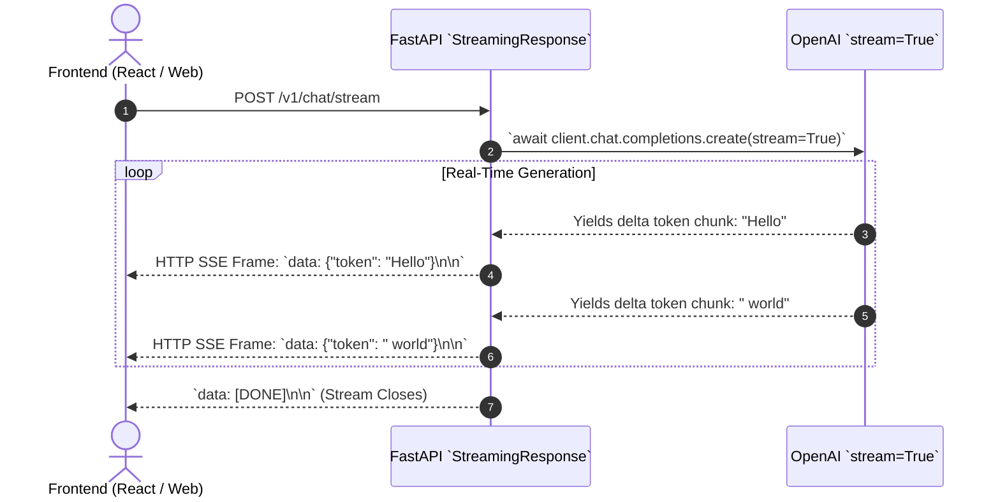
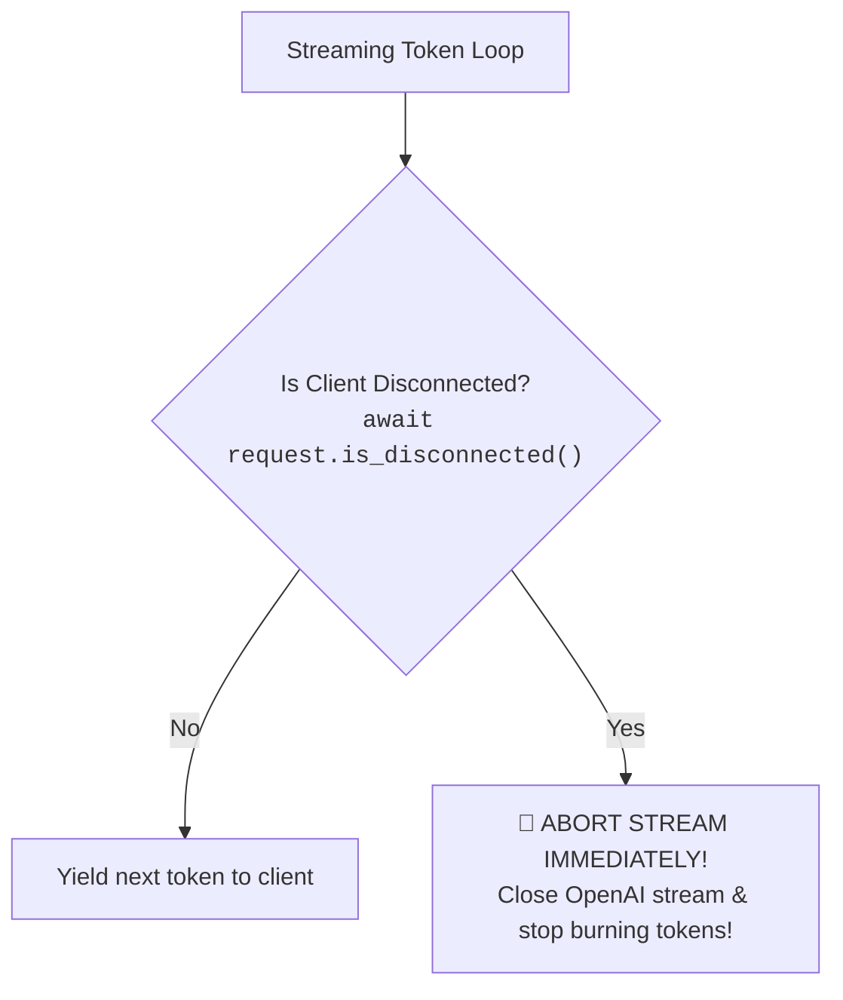

# 08 - Streaming Responses in FastAPI: Server-Sent Events (SSE) & Async Generators

> **Mental Model**:  
> Think of FastAPI Streaming like a **live television broadcast**:  
> * **Non-Streaming (The DVD Mail Service)**: Recording a full 2-hour movie, burning it onto a physical DVD, and mailing it to the customer. The customer waits days before watching a single second!  
> * **Streaming (`StreamingResponse` + SSE)**: A live satellite TV broadcast. The exact millisecond the camera records a 1-second video frame, it beams through the airwaves onto the viewer's TV.  
> In FastAPI, `StreamingResponse` combined with **Async Generators (`yield`)** delivers tokens to the user's browser in real time with sub-300ms latency.

---

## 📑 Table of Contents
1. [Why Streaming is Mandatory for AI UX](#1-why-streaming-is-mandatory-for-ai-ux)
2. [How StreamingResponse & Async Generators Work](#2-how-streamingresponse--async-generators-work)
3. [The Server-Sent Events (SSE) Wire Format](#3-the-server-sent-events-sse-wire-format)
4. [Detecting Client Disconnects (Killing Zombie GPU Compute)](#4-detecting-client-disconnects-killing-zombie-gpu-compute)
5. [Real-Time Streaming + Post-Stream Database Persistence](#5-real-time-streaming--post-stream-database-persistence)
6. [Building a Production SSE Streaming Endpoint in Python](#6-building-a-production-sse-streaming-endpoint-in-python)
7. [Master Cheat Sheet & Reference Table](#7-master-cheat-sheet--reference-table)

---

## 1. Why Streaming is Mandatory for AI UX

Generating a 500-word response takes an LLM **6 to 10 seconds**:



---

## 2. How `StreamingResponse` & Async Generators Work

Instead of returning a static dictionary with `return`, a streaming endpoint returns a **`StreamingResponse`** powered by an **Async Generator function (`yield`)**:



---

## 3. The Server-Sent Events (SSE) Wire Format

To stream tokens to a web browser frontend (React, Vue, Next.js), you must format data according to the **Server-Sent Events (SSE) standard**:

```mermaid
flowchart LR
    Token["Raw Chunk: ' Artificial'"] --> Format["Format as SSE String:<br><code>'data: {\"text\": \" Artificial\"}\\n\\n'</code>"]
    Format --> Wire["Sent over HTTP with header: <code>Content-Type: text/event-stream</code>"]
```

### SSE Formatting Rules:
* Every data packet **must begin with `data: `**.
* Every data packet **must end with a double newline `\n\n`**.
* The final termination signal is standard: `data: [DONE]\n\n`.

---

## 4. Detecting Client Disconnects (Killing Zombie GPU Compute)

What happens if a user clicks **"Stop Generating"** or abruptly closes their browser tab mid-stream?

> ⚠️ **The Zombie Token Bleed:**  
> If your server doesn't detect the disconnect, it will **continue consuming and paying for OpenAI tokens in the background** for the next 10 seconds!



### Defensive Disconnect Check:
```python
async for chunk in response_stream:
    # Check if user closed browser / cancelled request
    if await request.is_disconnected():
        print("🔌 Client disconnected mid-stream. Aborting LLM generation!")
        break
        
    delta = chunk.choices[0].delta.content or ""
    yield f"data: {delta}\n\n"
```

---

## 5. Real-Time Streaming + Post-Stream Database Persistence

In production apps, you must stream tokens to the user **and** save the complete generated message into your database once finished:

```python
async def stream_and_record_chat(prompt: str, user_id: int):
    full_response = []
    
    stream = await async_client.chat.completions.create(
        model="gpt-4o-mini",
        messages=[{"role": "user", "content": prompt}],
        stream=True
    )
    
    async for chunk in stream:
        delta = chunk.choices[0].delta.content or ""
        if delta:
            full_response.append(delta) # Collect in memory
            yield f"data: {json.dumps({'text': delta})}\n\n" # Stream to user
            
    # Stream is complete: Save full text to database!
    completed_message = "".join(full_response)
    await save_chat_to_database(user_id=user_id, message=completed_message)
    
    yield "data: [DONE]\n\n"
```

---

## 6. Building a Production SSE Streaming Endpoint in Python

Here is a complete, runnable FastAPI application implementing SSE streaming, client disconnect detection, and proper HTTP headers:

```python
from fastapi import FastAPI, Request
from fastapi.responses import StreamingResponse
from pydantic import BaseModel
from openai import AsyncOpenAI
import json
import os

app = FastAPI(title="SSE Streaming AI Service", version="1.0.0")

client = AsyncOpenAI(api_key=os.getenv("OPENAI_API_KEY", "mock-key"))

class StreamRequest(BaseModel):
    prompt: str
    model: str = "gpt-4o-mini"

async def generate_sse_stream(prompt: str, model: str, request: Request):
    """Async generator streaming SSE frames to the frontend."""
    try:
        response_stream = await client.chat.completions.create(
            model=model,
            messages=[{"role": "user", "content": prompt}],
            stream=True
        )

        async for chunk in response_stream:
            # 1. Guard against zombie compute on client disconnect
            if await request.is_disconnected():
                print("⚠️ Client disconnected. Closing stream.")
                break

            # 2. Extract delta text
            if chunk.choices and chunk.choices[0].delta.content:
                delta_text = chunk.choices[0].delta.content
                # 3. Format as SSE data frame
                payload = json.dumps({"content": delta_text})
                yield f"data: {payload}\n\n"

        # 4. Emit standard SSE termination signal
        yield "data: [DONE]\n\n"

    except Exception as err:
        error_payload = json.dumps({"error": str(err)})
        yield f"data: {error_payload}\n\n"

@app.post("/v1/chat/stream")
async def stream_chat_endpoint(payload: StreamRequest, request: Request):
    return StreamingResponse(
        generate_sse_stream(payload.prompt, payload.model, request),
        media_type="text/event-stream",
        headers={
            "Cache-Control": "no-cache",
            "Connection": "keep-alive",
            "X-Accel-Buffering": "no" # Disables Nginx buffering for instant streaming!
        }
    )
```

---

## 7. Master Cheat Sheet & Reference Table

| Streaming Component | Purpose / Syntax |
| :--- | :--- |
| **`StreamingResponse(gen)`** | Wraps an async generator into an HTTP stream. |
| **`media_type="text/event-stream"`**| Declares the SSE protocol to browsers. |
| **SSE Format** | `data: <JSON_STRING>\n\n` (Double newline required!). |
| **Stream Terminator** | `data: [DONE]\n\n` signal. |
| **`request.is_disconnected()`**| Detects user cancellation to stop paying for wasted tokens. |
| **`X-Accel-Buffering: no`** | Critical header to prevent reverse proxies (Nginx) from buffering tokens. |

---

## 🎯 Next Step in Phase 5
Now that you have mastered Streaming Responses, we will advance to the final section of Phase 5: **[09 - Basic Production Concerns](file:///home/user2/PythonProject/Python-for-ai-engineering/05-fastapi/09-basic-production-concerns)** to master CORS, Gunicorn process managers, rate limiting, and Docker deployment!
