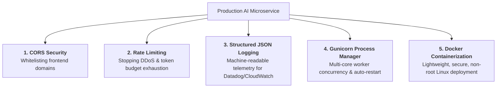
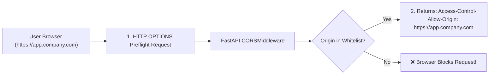
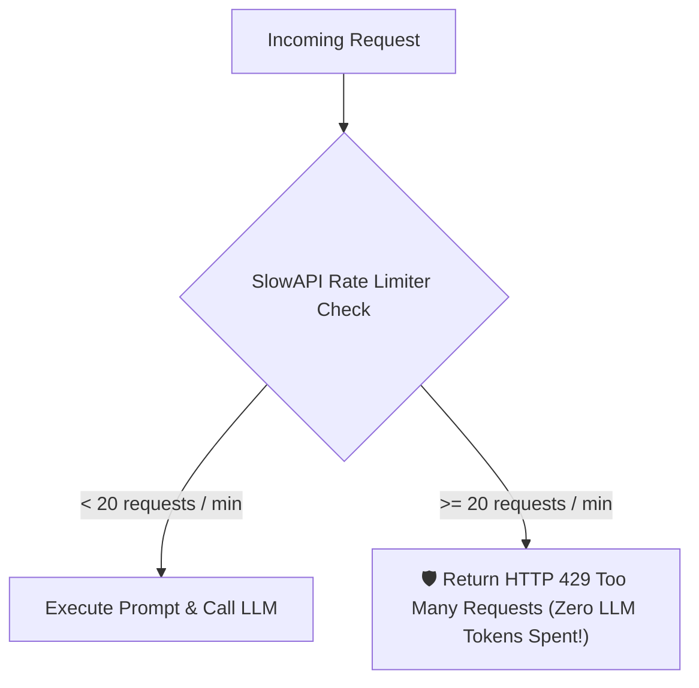
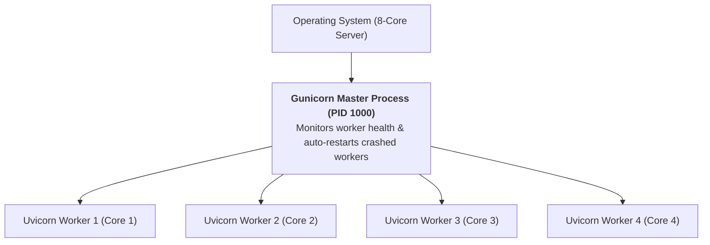

# 09 - Basic Production Concerns: Hardening FastAPI AI Services

> **Mental Model**:  
> Think of Production Hardening like **upgrading a prototype car for a Formula 1 race**:  
> * Running `uvicorn main:app --reload` on a laptop is a fun test drive in the parking lot.  
> * Deploying to production means bracing for **hostile internet traffic**:  
>   * **CORS Middleware**: The security gate that only allows your verified frontend website to speak to your backend.  
>   * **Rate Limiting**: Turnstiles that stop bots from draining your company's credit card with 100,000 spam requests.  
>   * **Structured JSON Logging**: The black-box telemetry recording every millisecond of latency and token cost for Datadog.  
>   * **Gunicorn Process Manager**: A pit-crew boss keeping 4 to 8 Uvicorn worker engines running across all CPU cores.  
>   * **Docker Containerization**: Packaging the exact runtime environment so it deploys identically on AWS, GCP, or Azure.

---

## 📑 Table of Contents
1. [The 5 Pillars of Production AI Microservices](#1-the-5-pillars-of-production-ai-microservices)
2. [CORS Middleware Configuration](#2-cors-middleware-configuration)
3. [Rate Limiting with SlowAPI](#3-rate-limiting-with-slowapi)
4. [Structured JSON Logging & Telemetry Middleware](#4-structured-json-logging--telemetry-middleware)
5. [Process Management: Gunicorn + Uvicorn Workers](#5-process-management-gunicorn--uvicorn-workers)
6. [Multi-Stage Production Dockerfile Blueprint](#6-multi-stage-production-dockerfile-blueprint)
7. [Building a Production-Hardened AI App in Python](#7-building-a-production-hardened-ai-app-in-python)
8. [Master Cheat Sheet & Reference Table](#8-master-cheat-sheet--reference-table)

---

## 1. The 5 Pillars of Production AI Microservices



---

## 2. CORS Middleware Configuration

By default, web browsers block your frontend website (`https://app.company.com`) from calling an API hosted on another domain (`https://api.company.com`):



### Production CORS Setup:
```python
from fastapi import FastAPI
from fastapi.middleware.cors import CORSMiddleware

app = FastAPI()

# ⛔ DANGER: Never use allow_origins=["*"] in production!
ALLOWED_ORIGINS = [
    "https://app.mycompany.com",
    "https://admin.mycompany.com",
    "http://localhost:3000", # Local development frontend
]

app.add_middleware(
    CORSMiddleware,
    allow_origins=ALLOWED_ORIGINS,
    allow_credentials=True,
    allow_methods=["GET", "POST", "PUT", "DELETE"],
    allow_headers=["*"],
)
```

---

## 3. Rate Limiting with SlowAPI

Prevent rogue users or scrapers from overwhelming your AI endpoints with **`slowapi`**:



```python
# pip install slowapi
from fastapi import FastAPI, Request
from slowapi import Limiter, _rate_limit_exceeded_handler
from slowapi.util import get_remote_address
from slowapi.errors import RateLimitExceeded

limiter = Limiter(key_func=get_remote_address)
app = FastAPI()
app.state.limiter = limiter
app.add_exception_handler(RateLimitExceeded, _rate_limit_exceeded_handler)

@app.post("/v1/chat")
@limiter.limit("10/minute") # Max 10 requests per minute per IP address!
async def chat(request: Request):
    return {"message": "Success"}
```

---

## 4. Structured JSON Logging & Telemetry Middleware

Never use raw `print()` statements in production. Use **JSON Structured Logging** so your log aggregation tools (Datadog, Elastic, CloudWatch) can index every field:

```mermaid
flowchart LR
    RawPrint["❌ print('Chat completed in 3.2s') ➔ Unsearchable plain text"]
    JSONLog["✅ {\"level\": \"INFO\", \"endpoint\": \"/v1/chat\", \"latency_ms\": 3200, \"status\": 200, \"model\": \"gpt-4o\"} ➔ 100% Searchable & Alertable!"]
```

### Request Timing Middleware:
```python
import time
import logging
import json
from fastapi import Request

logger = logging.getLogger("ai_gateway")

@app.middleware("http")
async def log_request_telemetry(request: Request, call_next):
    start_time = time.perf_counter()
    response = await call_next(request)
    duration_ms = (time.perf_counter() - start_time) * 1000

    log_payload = {
        "method": request.method,
        "path": request.url.path,
        "status_code": response.status_code,
        "latency_ms": round(duration_ms, 2),
        "client_ip": request.client.host if request.client else "unknown"
    }
    logger.info(json.dumps(log_payload))
    return response
```

---

## 5. Process Management: Gunicorn + Uvicorn Workers

Running `uvicorn main:app` directly on an 8-core server uses **only 1 CPU core**, wasting 87% of your server capacity!

In production, run **Gunicorn** as the master process manager, spawning **1 Uvicorn worker per CPU core**:



### Production Startup Command:
```bash
gunicorn app.main:app \
  --workers 4 \
  --worker-class uvicorn.workers.UvicornWorker \
  --bind 0.0.0.0:8000 \
  --timeout 120 \
  --access-logfile - \
  --error-logfile -
```
* **`--workers 4`**: Spawns 4 parallel worker processes.
* **`--worker-class uvicorn.workers.UvicornWorker`**: High-speed ASGI worker.
* **`--timeout 120`**: Prevents Gunicorn from killing long-running AI streams prematurely.

---

## 6. Multi-Stage Production Dockerfile Blueprint

Here is an optimized, multi-stage Dockerfile that drops image size from 1.2 GB to **under 150 MB** and runs as a non-root user:

```dockerfile
# --- Stage 1: Build & Dependency Installation ---
FROM python:3.12-slim AS builder

WORKDIR /app
RUN apt-get update && apt-get install -y --no-install-recommends build-essential

COPY requirements.txt .
RUN pip install --no-cache-dir --user -r requirements.txt

# --- Stage 2: Minimal Production Runtime ---
FROM python:3.12-slim AS runner

WORKDIR /app

# Create non-privileged user for security
RUN groupadd -r appuser && useradd -r -g appuser appuser

# Copy installed wheels from builder
COPY --from=builder /root/.local /home/appuser/.local
COPY . /app

ENV PATH=/home/appuser/.local/bin:$PATH \
    PYTHONUNBUFFERED=1

USER appuser

EXPOSE 8000

# Health check directive for Kubernetes/Docker
HEALTHCHECK --interval=30s --timeout=5s --start-period=5s --retries=3 \
  CMD python -c "import urllib.request; urllib.request.urlopen('http://localhost:8000/health')" || exit 1

CMD ["gunicorn", "app.main:app", "-w", "4", "-k", "uvicorn.workers.UvicornWorker", "-b", "0.0.0.0:8000"]
```

---

## 7. Building a Production-Hardened AI App in Python

```python
from fastapi import FastAPI, Request, status
from fastapi.middleware.cors import CORSMiddleware
from slowapi import Limiter, _rate_limit_exceeded_handler
from slowapi.util import get_remote_address
from slowapi.errors import RateLimitExceeded
import time
import json

limiter = Limiter(key_func=get_remote_address)
app = FastAPI(title="Hardened AI Microservice", version="1.0.0")

# 1. Register Rate Limiting
app.state.limiter = limiter
app.add_exception_handler(RateLimitExceeded, _rate_limit_exceeded_handler)

# 2. Register CORS Middleware
app.add_middleware(
    CORSMiddleware,
    allow_origins=["https://app.mycompany.com"],
    allow_credentials=True,
    allow_methods=["GET", "POST"],
    allow_headers=["*"],
)

# 3. Register Telemetry Middleware
@app.middleware("http")
async def telemetry_middleware(request: Request, call_next):
    start = time.perf_counter()
    res = await call_next(request)
    latency = (time.perf_counter() - start) * 1000
    print(json.dumps({"path": request.url.path, "latency_ms": round(latency, 2), "status": res.status_code}))
    return res

# 4. Production Health Probe
@app.get("/health", status_code=status.HTTP_200_OK, tags=["System"])
def health():
    return {"status": "HEALTHY", "version": "1.0.0"}
```

---

## 8. Master Cheat Sheet & Reference Table

| Production Concern | Solution / Tool | Command / Syntax |
| :--- | :--- | :--- |
| **CORS Protection** | `CORSMiddleware` | `allow_origins=["https://app.domain.com"]` |
| **DDoS / Rate Limiting** | `slowapi` | `@limiter.limit("20/minute")` |
| **Telemetry Logging** | HTTP Middleware | `json.dumps({"latency": ms, "status": code})` |
| **Multi-Core Concurrency**| Gunicorn + Uvicorn | `gunicorn -w 4 -k uvicorn.workers.UvicornWorker` |
| **Containerization** | Multi-stage Docker | `USER appuser` non-root execution. |

---

## 🏁 Phase 5 Complete!
Congratulations! You have mastered all 9 core topics of **Phase 5: FastAPI for Production AI Services**:
1. [01 - FastAPI Fundamentals](file:///home/user2/PythonProject/Python-for-ai-engineering/05-fastapi/01-fastapi-fundamentals/README.md)
2. [02 - Pydantic with FastAPI](file:///home/user2/PythonProject/Python-for-ai-engineering/05-fastapi/02-pydantic-fastapi/README.md)
3. [03 - Dependency Injection](file:///home/user2/PythonProject/Python-for-ai-engineering/05-fastapi/03-dependency-injection/README.md)
4. [04 - Async Endpoints](file:///home/user2/PythonProject/Python-for-ai-engineering/05-fastapi/04-async-endpoints/README.md)
5. [05 - Application Structure](file:///home/user2/PythonProject/Python-for-ai-engineering/05-fastapi/05-application-structure/README.md)
6. [06 - Error Handling](file:///home/user2/PythonProject/Python-for-ai-engineering/05-fastapi/06-error-handling/README.md)
7. [07 - AI API Integration](file:///home/user2/PythonProject/Python-for-ai-engineering/05-fastapi/07-ai-api-integration/README.md)
8. [08 - Streaming Responses](file:///home/user2/PythonProject/Python-for-ai-engineering/05-fastapi/08-streaming-responses/README.md)
9. [09 - Basic Production Concerns](file:///home/user2/PythonProject/Python-for-ai-engineering/05-fastapi/09-basic-production-concerns/README.md)
