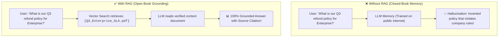
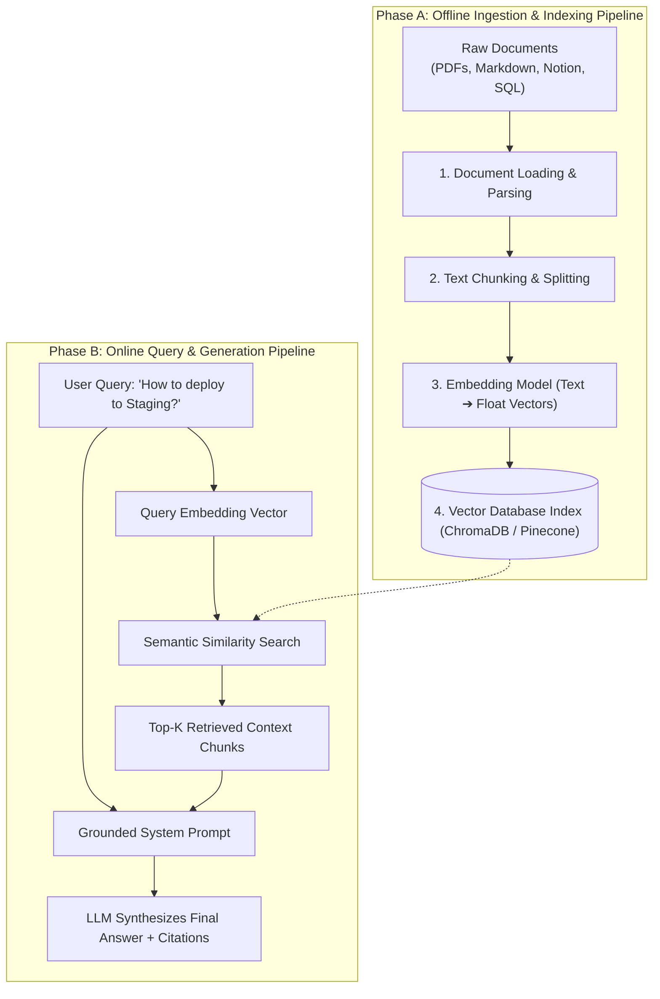
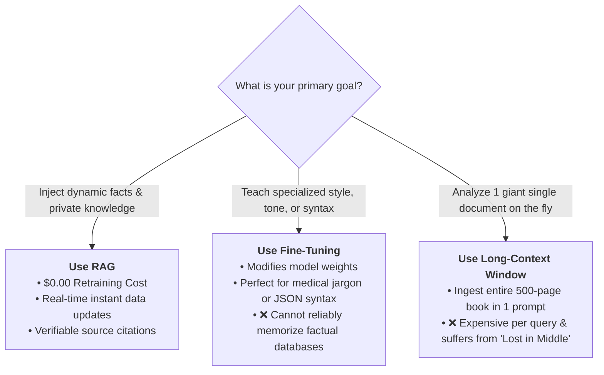
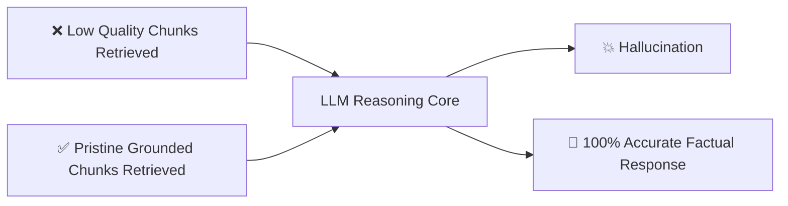

# 01 - RAG Fundamentals: The Open-Book Architecture

> **Welcome to Phase 6: Retrieval-Augmented Generation (RAG)!**  
> **Mental Model**:  
> Think of RAG like taking an **Open-Book Exam instead of a Closed-Book Exam**:  
> * **Closed-Book Exam (Base LLM)**: The student relies solely on what they memorized during school (training data cutoff). If asked about your company's private internal API or a news event from this morning, they have no data and are forced to guess (hallucinate).  
> * **Open-Book Exam (RAG System)**: An automated research assistant sprints to the library, pulls the **exact 3 most relevant pages** from your private files, and places them directly on the student's desk. The student reads the verified pages and writes an accurate, factual answer with **exact citations**.

---

## 📑 Table of Contents
1. [Why LLMs Need Retrieval-Augmented Generation](#1-why-llms-need-retrieval-augmented-generation)
2. [The 4 Core Stages of the RAG Lifecycle](#2-the-4-core-stages-of-the-rag-lifecycle)
3. [RAG vs. Fine-Tuning vs. Long-Context Windows](#3-rag-vs-fine-tuning-vs-long-context-windows)
4. [Naive RAG vs. Advanced Production RAG](#4-naive-rag-vs-advanced-production-rag)
5. [The 'Garbage In, Garbage Out' Rule of Retrieval](#5-the-garbage-in-garbage-out-rule-of-retrieval)
6. [Building a Minimal End-to-End RAG Pipeline in Python](#6-building-a-minimal-end-to-end-rag-pipeline-in-python)
7. [Master Cheat Sheet & Reference Table](#7-master-cheat-sheet--reference-table)

---

## 1. Why LLMs Need Retrieval-Augmented Generation

Frontier models (GPT-4o, Claude 3.5) suffer from **two fundamental limitations**:
1. **Knowledge Cutoffs**: They cannot know events or research published after their training date.
2. **Private Data Isolation**: They have never seen your internal company Notion docs, private customer databases, or proprietary codebases.



---

## 2. The 4 Core Stages of the RAG Lifecycle

A production RAG system is divided into two distinct operational flows: **Offline Ingestion** and **Online Retrieval**:



---

## 3. RAG vs. Fine-Tuning vs. Long-Context Windows

AI Engineers must choose the right tool for the job:



### Strategic Comparison Matrix:

| Dimension | 🏆 RAG | 🧠 Fine-Tuning | 📜 Long Context (1M Tokens) |
| :--- | :---: | :---: | :---: |
| **Primary Purpose** | Factual knowledge retrieval | Style, tone & format adaptation | Single-session document analysis |
| **Update Latency** | **Instant** (Insert row in Vector DB) | Hours to Days (GPU training) | Instant (Paste into prompt) |
| **Source Citations** | ✅ **100% Verifiable** | ❌ Impossible (Black box weights) | 🟡 Hard to pinpoint |
| **Token Cost / Query**| 🟢 **Lowest** (Injects only top 3 chunks) | 🟢 Low | 🔴 Extremely High (Billed for 1M tokens!) |
| **Hallucination Risk**| 🟢 **Lowest** | 🔴 High | 🟡 Moderate |

---

## 4. Naive RAG vs. Advanced Production RAG

```mermaid
flowchart TD
    subgraph Naive["Naive RAG (2023 Prototype)"]
        N1["Query"] --> N2["Fixed-size 500-token Chunks"] --> N3["Cosine Search"] --> N4["LLM Prompt"]
        N4 --> Fail["💥 30% Failure: Slices sentences in half & retrieves irrelevant noise"]
    end

    subgraph Advanced["Advanced Production RAG (2024-Present)"]
        A1["Query"] --> Pre["1. Pre-Retrieval: Query Expansion & HyDE"]
        Pre --> Hybrid["2. Retrieval: Hybrid Search (Vector + BM25 Keyword)"]
        Hybrid --> Post["3. Post-Retrieval: Cross-Encoder Re-Ranking & Context Pruning"]
        Post --> Gen["4. Generation: Structured Grounded Synthesis with Citations"]
    end
```



---

## 5. The 'Garbage In, Garbage Out' Rule of Retrieval

> ⚠️ **The Golden Diagnostic Rule:**  
> **80% of RAG failures are RETRIEVAL failures, not generation failures!**  
> If your vector search pulls irrelevant, noisy, or broken text chunks, even the smartest model in the world (GPT-4o) cannot output a correct answer.



---

## 6. Building a Minimal End-to-End RAG Pipeline in Python

Here is a complete, runnable RAG pipeline in pure Python demonstrating embedding generation, vector similarity search, and context-grounded synthesis:

```python
from openai import OpenAI
import os
import math

client = OpenAI(api_key=os.getenv("OPENAI_API_KEY", "mock-key"))

# 1. Mock Knowledge Base (Private Company Documents)
KNOWLEDGE_BASE = [
    {"id": "doc-1", "title": "Refund Policy", "text": "Enterprise clients receive a 100% refund within 30 days of contract signing if SLA drops below 99.9%."},
    {"id": "doc-2", "title": "Staging Deployment", "text": "To deploy to Staging, run `git push origin staging` and approve the deployment in GitHub Actions."},
    {"id": "doc-3", "title": "Office Wi-Fi", "text": "The guest Wi-Fi network is 'AcmeGuest' with password 'Welcome2026!'."}
]

def cosine_similarity(v1: list[float], v2: list[float]) -> float:
    """Calculates cosine similarity between two float vectors without third-party math libraries."""
    dot = sum(a * b for a, b in zip(v1, v2))
    mag1 = math.sqrt(sum(a * a for a in v1))
    mag2 = math.sqrt(sum(b * b for b in v2))
    return dot / (mag1 * mag2)

def get_embedding(text: str) -> list[float]:
    """Generates 1536-dimensional vector embedding."""
    res = client.embeddings.create(input=text, model="text-embedding-3-small")
    return res.data[0].embedding

def mini_rag_query(user_query: str) -> str:
    # 2. Embed the user query
    query_vector = get_embedding(user_query)

    # 3. Retrieve: Score all documents against query vector
    scored_docs = []
    for doc in KNOWLEDGE_BASE:
        doc_vector = get_embedding(doc["text"])
        score = cosine_similarity(query_vector, doc_vector)
        scored_docs.append((score, doc))

    # Sort by highest similarity score
    scored_docs.sort(key=lambda x: x[0], reverse=True)
    top_chunk = scored_docs[0][1]

    # 4. Generate: Inject retrieved chunk into prompt
    prompt = f"""You are a helpful assistant. Answer the user query strictly using the provided context document.

<context>
[Source: {top_chunk['title']}]
{top_chunk['text']}
</context>

<user_query>
{user_query}
</user_query>"""

    response = client.chat.completions.create(
        model="gpt-4o-mini",
        messages=[{"role": "user", "content": prompt}],
        temperature=0.0
    )
    return response.choices[0].message.content

# Run RAG Query:
# print(mini_rag_query("What is the refund policy for Enterprise?"))
```

---

## 7. Master Cheat Sheet & Reference Table

| RAG Concept | Definition / Role |
| :--- | :--- |
| **Ingestion** | Loading, cleaning, and extracting text from raw files (PDFs, HTML, Markdown). |
| **Chunking** | Splitting long documents into semantically coherent segments (e.g. 500 tokens). |
| **Embedding** | Converting text into high-dimensional vector representations. |
| **Vector DB** | High-speed database optimized for nearest-neighbor similarity searches. |
| **Grounding** | Conditioning the LLM to answer *strictly* using the retrieved `<context>`. |
| **RAG vs Fine-Tuning**| RAG is for facts & memory; Fine-Tuning is for form, style & syntax. |

---

## 🎯 Next Step in Phase 6
Now that you understand the 4 core stages of RAG, we will advance to **[02 - Document Loading](file:///home/user2/PythonProject/Python-for-ai-engineering/06-rag/02-document-loading)** to master loading, parsing, and cleaning PDFs, Markdown, HTML, and structured data!
