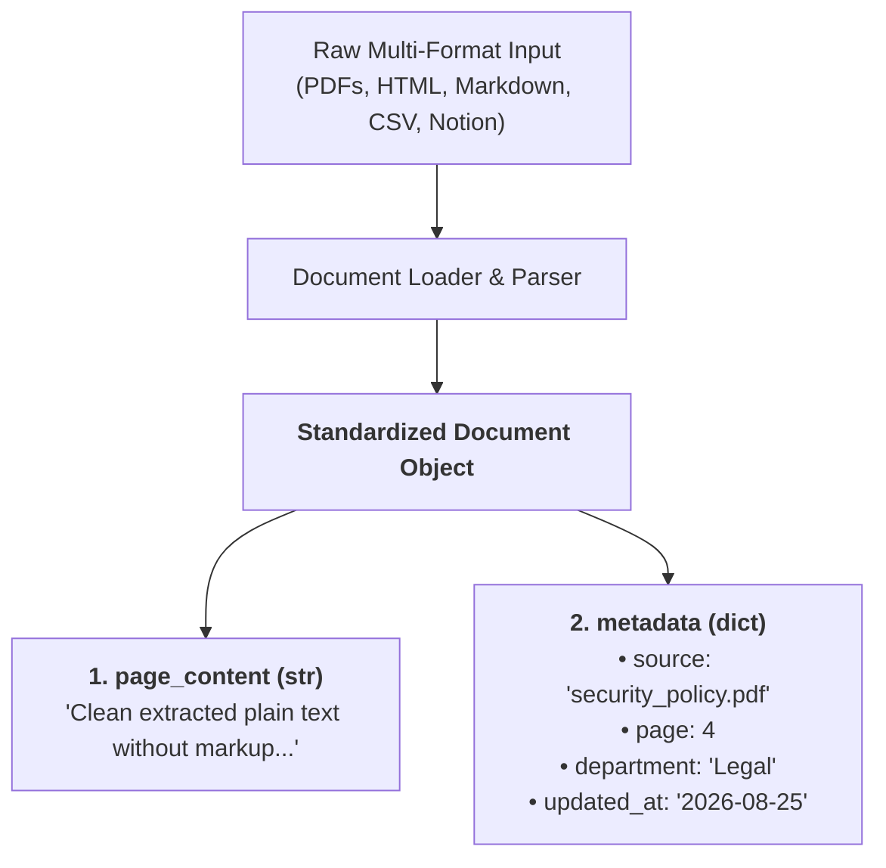
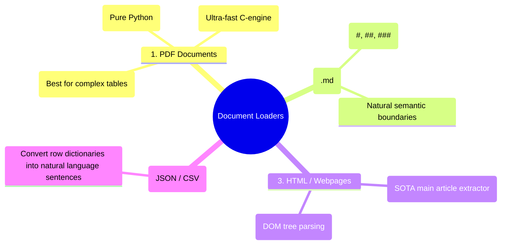
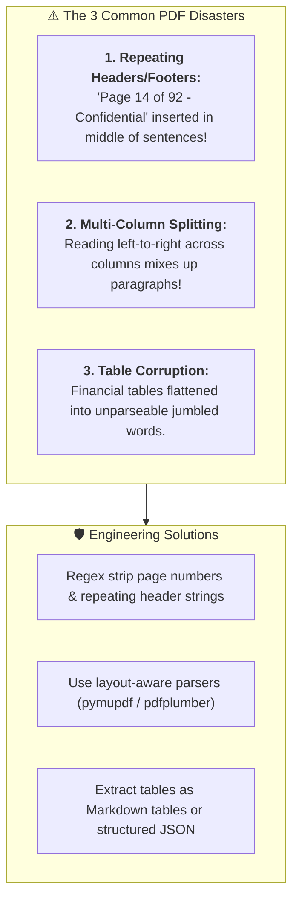
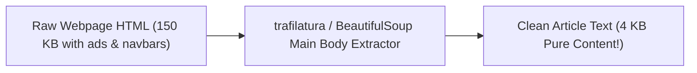
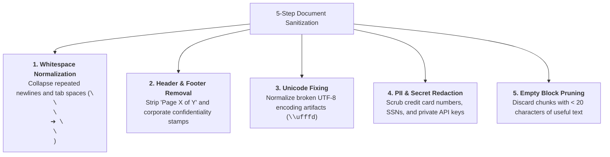

# 02 - Document Loading: Parsing PDFs, Markdown, HTML & Structured Data

> **Mental Model**:  
> Think of Document Loading like an **industrial gold smelting refinery**:  
> * **Raw Ore (Unprocessed Files)**: Raw PDFs contain annoying page numbers, repeating headers, and two-column layouts; web pages are buried in cookie banners and navigation menus; Word docs are full of formatting noise.  
> * **The Smelter (Document Loaders)**: Crushes the raw files, strips the slag (ads, script tags, footer junk), preserves rich structural metadata (author, page number, source URL), and outputs **pure gold bars: standardized, clean `Document` objects** ready for vector embedding.  
> High-quality retrieval begins with pristine document ingestion.

---

## 📑 Table of Contents
1. [The Anatomy of a Standardized Document Object](#1-the-anatomy-of-a-standardized-document-object)
2. [Parsing the Big 4 Formats (PDF, Markdown, HTML, JSON)](#2-parsing-the-big-4-formats-pdf-markdown-html-json)
3. [The PDF Pitfalls: Headers, Footers & Multi-Column Layouts](#3-the-pdf-pitfalls-headers-footers--multi-column-layouts)
4. [Web Scraping & HTML Boilerplate Extraction](#4-web-scraping--html-boilerplate-extraction)
5. [The 5 Document Sanitization & Cleaning Rules](#5-the-5-document-sanitization--cleaning-rules)
6. [Building a Universal Document Loader in Python](#6-building-a-universal-document-loader-in-python)
7. [Master Cheat Sheet & Reference Table](#7-master-cheat-sheet--reference-table)

---

## 1. The Anatomy of a Standardized `Document` Object

Regardless of whether your raw data came from a PDF, a Notion page, or a PostgreSQL database, every loader converts it into a universal **`Document` container**:



> 💡 **Why Metadata is Crucial:**  
> Metadata allows you to perform **Metadata Filtering** during retrieval (e.g. *"Only search documents where `department == 'Legal'` and `year >= 2025`"*).

---

## 2. Parsing the Big 4 Formats (PDF, Markdown, HTML, JSON)



---

## 3. The PDF Pitfalls: Headers, Footers & Multi-Column Layouts

PDFs were designed for **printing on physical paper**, not for natural language processing!



---

## 4. Web Scraping & HTML Boilerplate Extraction

When loading web pages, $70\%$ of the HTML is useless navigation bars, footer links, and cookie disclaimers.



### Clean Web Extraction Pattern:
```python
# pip install trafilatura
import trafilatura

def extract_clean_webpage(url: str) -> str:
    """Downloads webpage and extracts ONLY the core article content."""
    downloaded = trafilatura.fetch_url(url)
    clean_text = trafilatura.extract(
        downloaded,
        include_comments=False,
        include_tables=True,
        no_fallback=False
    )
    return clean_text or ""
```

---

## 5. The 5 Document Sanitization & Cleaning Rules

Before generating vector embeddings, always pass raw text through a **Cleaning Pipeline**:



---

## 6. Building a Universal Document Loader in Python

Here is a production-grade multi-format loader that automatically detects file types, extracts clean text, and enriches metadata:

```python
from pydantic import BaseModel, Field
from pathlib import Path
import re
import json

class Document(BaseModel):
    page_content: str = Field(description="Clean extracted text.")
    metadata: dict = Field(default_factory=dict, description="Source file metadata.")

class UniversalDocumentLoader:
    """Universal multi-format document parser and cleaner."""

    @classmethod
    def clean_text(cls, raw_text: str) -> str:
        """Applies whitespace and unicode normalization."""
        # 1. Normalize whitespace and excessive newlines
        text = re.sub(r"\n{3,}", "\n\n", raw_text)
        text = re.sub(r"[ \t]+", " ", text)
        # 2. Strip page numbers like "Page 14 of 92"
        text = re.sub(r"Page\s+\d+\s+of\s+\d+", "", text, flags=re.IGNORECASE)
        return text.strip()

    @classmethod
    def load_file(cls, file_path: str | Path) -> list[Document]:
        path = Path(file_path)
        if not path.exists():
            raise FileNotFoundError(f"File not found: {path}")

        ext = path.suffix.lower()
        documents = []

        # --- Format 1: Plain Text & Markdown ---
        if ext in [".txt", ".md"]:
            with open(path, "r", encoding="utf-8") as f:
                content = cls.clean_text(f.read())
                documents.append(Document(
                    page_content=content,
                    metadata={"source": path.name, "format": ext[1:]}
                ))

        # --- Format 2: JSON Files ---
        elif ext == ".json":
            with open(path, "r", encoding="utf-8") as f:
                data = json.load(f)
                if isinstance(data, list):
                    for idx, item in enumerate(data):
                        text = cls.clean_text(json.dumps(item))
                        documents.append(Document(
                            page_content=text,
                            metadata={"source": path.name, "index": idx}
                        ))
                else:
                    text = cls.clean_text(json.dumps(data))
                    documents.append(Document(
                        page_content=text,
                        metadata={"source": path.name}
                    ))

        # --- Format 3: PDF Documents (Using pypdf) ---
        elif ext == ".pdf":
            try:
                import pypdf
                reader = pypdf.PdfReader(str(path))
                for page_num, page in enumerate(reader.pages):
                    raw_page_text = page.extract_text() or ""
                    cleaned_text = cls.clean_text(raw_page_text)
                    if cleaned_text: # Skip empty blank pages
                        documents.append(Document(
                            page_content=cleaned_text,
                            metadata={"source": path.name, "page": page_num + 1}
                        ))
            except ImportError:
                raise ImportError("Please run `pip install pypdf` to parse PDF files.")

        else:
            raise ValueError(f"Unsupported file extension: {ext}")

        print(f"📄 Loaded {len(documents)} document chunk(s) from {path.name}")
        return documents

# Example Usage:
# docs = UniversalDocumentLoader.load_file("company_policy.md")
# print(docs[0].metadata)
# print(docs[0].page_content[:100])
```

---

## 7. Master Cheat Sheet & Reference Table

| Format | Recommended Python Tool | Key Parsing Rule |
| :--- | :--- | :--- |
| **PDF** | `pypdf` (simple) / `pymupdf` (fast) | Always strip repeating header/footer page stamps. |
| **Markdown** | Standard Python file I/O | Preserve `#` headers to maintain semantic chunk boundaries. |
| **HTML** | `trafilatura` | Discard navigation menus, sidebars, and cookie banners. |
| **JSON / CSV** | `json` / `csv` standard library | Convert rows into natural language key-value sentences. |
| **Metadata** | `dict` attached to `Document` | Store `source`, `page`, `author`, and `timestamp` for filtered search. |

---

## 🎯 Next Step in Phase 6
Now that you have loaded and cleaned raw documents, we will advance to **[03 - Chunking Strategies](file:///home/user2/PythonProject/Python-for-ai-engineering/06-rag/03-chunking)** to master fixed-size, recursive character, semantic, and document-specific chunking!
