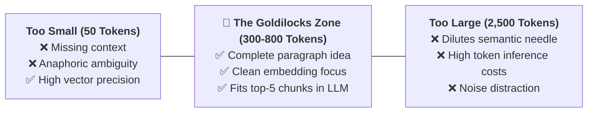
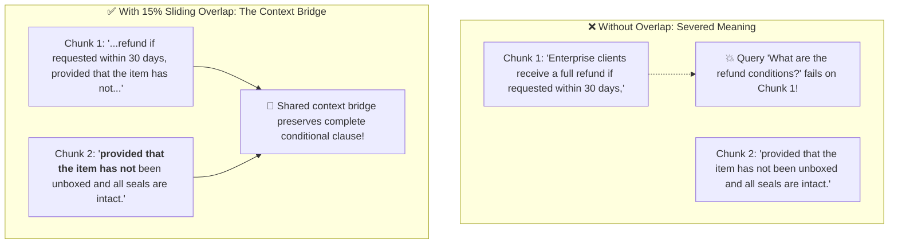
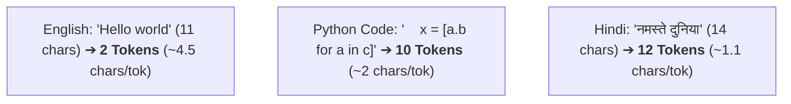
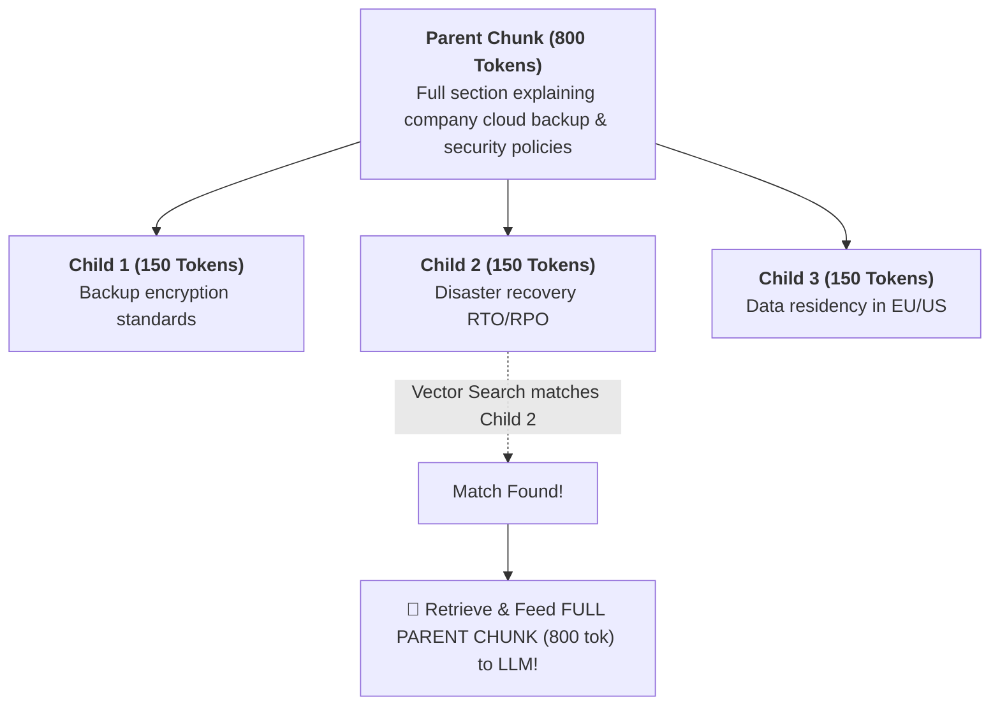

# 03 - Chunking Strategies: The Art of Splitting Text for RAG

> **Mental Model**:  
> Think of Chunking like **slicing a loaf of bread for the perfect sandwich**:  
> * **The Loaf (Unchunked 300-Page Document)**: You cannot eat an entire uncut 5-pound loaf of bread in one bite. If you convert an entire book into a single vector embedding, specific dates, names, and clauses get smeared into a meaningless average blur!  
> * **Too Small (Crumbs - 20 tokens)**: Tiny slices lose all context (*"He refused"* — Who is 'He'? Refused what?).  
> * **Too Big (Half a loaf - 4,000 tokens)**: Giant chunks dilute the specific answer in a mountain of irrelevant fluff, polluting the LLM's context window.  
> * **Just Right (The Perfect Slice - 300 to 800 tokens + 15% overlap)**: Retains full paragraph semantic meaning while maintaining high vector search precision.

---

## 📑 Table of Contents
1. [The Goldilocks Chunking Dilemma](#1-the-goldilocks-chunking-dilemma)
2. [Chunk Overlap: The Context Bridge](#2-chunk-overlap-the-context-bridge)
3. [The 4 Core Chunking Strategies](#3-the-4-core-chunking-strategies)
4. [Characters vs. Tokens: The Tokenizer Calibration Trap](#4-characters-vs-tokens-the-tokenizer-calibration-trap)
5. [Advanced Architecture: Parent-Child (Small-to-Big) Chunking](#5-advanced-architecture-parent-child-small-to-big-chunking)
6. [Building a Recursive Text Splitter in Pure Python](#6-building-a-recursive-text-splitter-in-pure-python)
7. [Master Cheat Sheet & Reference Table](#7-master-cheat-sheet--reference-table)

---

## 1. The Goldilocks Chunking Dilemma

Choosing chunk size is the **most impactful hyperparameter** in your entire RAG architecture:



---

## 2. Chunk Overlap: The Context Bridge

Without overlap, sentences that straddle chunk boundaries get severed in half:



> 💡 **The 10-20% Overlap Rule of Thumb:**  
> For a **500-token chunk size**, set **50 to 100 tokens of overlap** ($10\% - 20\%$).

---

## 3. The 4 Core Chunking Strategies

```mermaid
mindmap
  root((Chunking Strategies))
    1. Fixed-Size Chunking
      Fast & naive
      Splits arbitrarily every N characters
      Breaks words/sentences mid-thought
    2. Recursive Character Chunking
      Industry Standard
      Tries paragraph break (\n\n) first
      Falls back to newline (\n) ➔ sentence (. ) ➔ space
    3. Document Structure-Aware
      Markdown: Splits by #, ##, ### headers
      Code: Splits by Python functions & classes
      HTML: Splits by <div> & <section> tags
    4. Semantic / Embedding Chunking
      Measures vector distance between adjacent sentences
      Splits dynamically only when topic changes
```

### Strategy Comparison Matrix:

| Strategy | Best Use Case | Pros | Cons |
| :--- | :--- | :--- | :--- |
| **Fixed-Size** | Quick exploratory prototypes | Extremely fast | Slices words & sentences in half. |
| **Recursive Character** | General prose, documentation, articles | Preserves natural paragraph boundaries | Requires tuning chunk size & overlap. |
| **Markdown Header** | Technical docs, Notion exports, manuals | Retains document hierarchy in metadata | Irregular chunk sizes. |
| **Semantic Chunking** | Flowing conversational transcripts, podcasts | Highly cohesive semantic chunks | $5\times$ higher embedding cost at ingestion. |

---

## 4. Characters vs. Tokens: The Tokenizer Calibration Trap

> ⚠️ **The Multi-Lingual Trap:**  
> A naive `text[:500]` slice takes 500 **characters**, not 500 **tokens**!



Always use **`tiktoken`** to measure exact token counts when chunking for OpenAI/Anthropic models!

---

## 5. Advanced Architecture: Parent-Child (Small-to-Big) Chunking

Why choose between small chunks (high search precision) and large chunks (rich LLM context)?  
**Parent-Child Chunking gives you both!**



---

## 6. Building a Recursive Text Splitter in Pure Python

Here is a complete, production-grade Recursive Character Splitter implemented in pure Python:

```python
from typing import List

class RecursiveTextSplitter:
    """Splits text recursively by trying paragraphs, then sentences, then words."""
    
    def __init__(
        self, 
        chunk_size: int = 500, 
        chunk_overlap: int = 50, 
        separators: List[str] = None
    ):
        self.chunk_size = chunk_size
        self.chunk_overlap = chunk_overlap
        self.separators = separators or ["\n\n", "\n", ". ", " ", ""]

    def split_text(self, text: str) -> List[str]:
        final_chunks = []
        # Find the highest-priority separator present in text
        separator = self.separators[-1]
        for sep in self.separators:
            if sep == "" or sep in text:
                separator = sep
                break

        # Split text by chosen separator
        splits = text.split(separator) if separator != "" else list(text)
        
        good_splits = []
        for s in splits:
            if len(s) < self.chunk_size:
                good_splits.append(s)
            else:
                # If sub-split is still too large, recurse with next separators
                if separator != "":
                    sub_splitter = RecursiveTextSplitter(
                        chunk_size=self.chunk_size,
                        chunk_overlap=self.chunk_overlap,
                        separators=self.separators[self.separators.index(separator) + 1:]
                    )
                    good_splits.extend(sub_splitter.split_text(s))
                else:
                    good_splits.append(s)

        # Merge splits with sliding window overlap
        merged_chunks = []
        current_chunk = []
        current_length = 0

        for piece in good_splits:
            piece_len = len(piece)
            if current_length + piece_len > self.chunk_size and current_chunk:
                merged_chunks.append(separator.join(current_chunk))
                
                # Keep trailing pieces for overlap
                while current_length > self.chunk_overlap and current_chunk:
                    popped = current_chunk.pop(0)
                    current_length -= len(popped) + len(separator)

            current_chunk.append(piece)
            current_length += piece_len + len(separator)

        if current_chunk:
            merged_chunks.append(separator.join(current_chunk))

        return [c.strip() for c in merged_chunks if c.strip()]

# Test Splitter:
# splitter = RecursiveTextSplitter(chunk_size=120, chunk_overlap=20)
# sample_text = "FastAPI is modern. It is fast.\n\nRAG gives models memory. Chunking is key."
# for i, chunk in enumerate(splitter.split_text(sample_text)):
#     print(f"--- Chunk {i+1} ({len(chunk)} chars) ---\n{chunk}")
```

---

## 7. Master Cheat Sheet & Reference Table

| Content Type | Recommended Chunk Size | Overlap | Recommended Strategy |
| :--- | :---: | :---: | :--- |
| **General Prose / Articles** | 400 – 600 tokens | 15% (60 – 90 tok) | **Recursive Character** (`\n\n`, `\n`, `. `) |
| **Technical Documentation** | 300 – 500 tokens | 20% (60 – 100 tok) | **Markdown Header Splitter** (`#`, `##`) |
| **Legal / Medical Contracts** | 800 – 1,200 tokens | 20% (160 – 240 tok) | **Parent-Child Chunking** |
| **Python / TypeScript Code** | Function / Class level | 0% – 10% | **AST / Language-Aware Splitter** |
| **Customer Support Chats** | 200 – 400 tokens | 10% | **Dialogue Turn Splitter** |

---

## 🎯 Next Step in Phase 6
Now that you have mastered text chunking strategies, we will advance to **[04 - Embeddings](file:///home/user2/PythonProject/Python-for-ai-engineering/06-rag/04-embeddings)** to master vector embeddings, dimensional geometry, cosine similarity, and embedding model selection!
