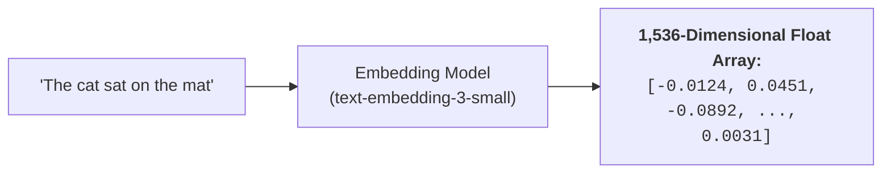
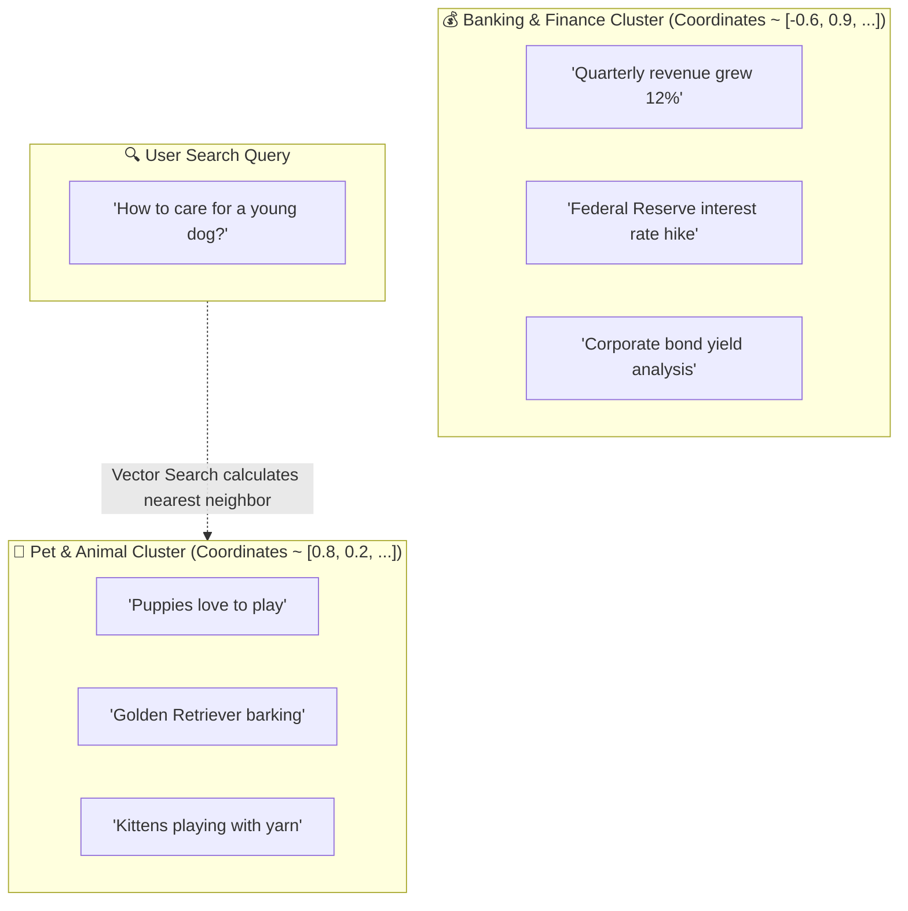
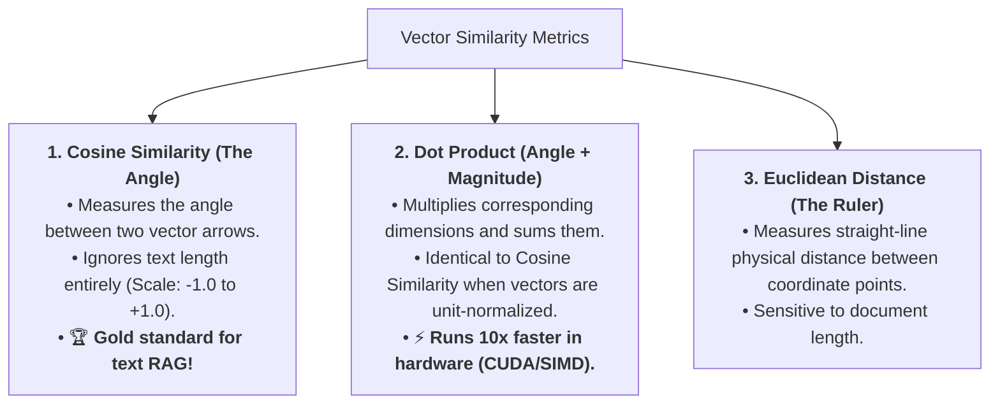
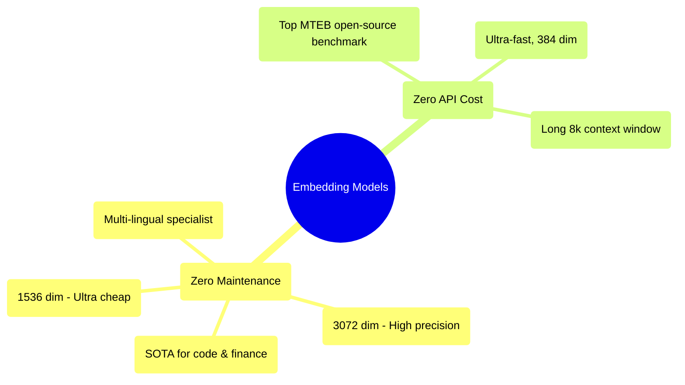
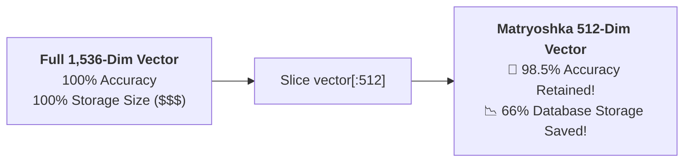

# 04 - Vector Embeddings: Semantic GPS in High-Dimensional Space

> **Mental Model**:  
> Think of Vector Embeddings like **a multi-dimensional GPS system for human concepts**:  
> * **Physical GPS**: Uses 3 numbers (Latitude, Longitude, Altitude) to pinpoint the exact physical location of a building on Earth.  
> * **Semantic Embeddings**: Uses **1,536 numbers** to pinpoint the exact conceptual meaning of a sentence in a conceptual universe!  
> * In this semantic galaxy, *"dog"* and *"puppy"* land on neighboring street corners, while *"quantum mechanics"* is on a completely different planet.  
> Embeddings allow computers to calculate the **conceptual closeness** between queries and documents without relying on exact keyword matching.

---

## 📑 Table of Contents
1. [What is a Vector Embedding?](#1-what-is-a-vector-embedding)
2. [The Conceptual Galaxy (Semantic Geometry)](#2-the-conceptual-galaxy-semantic-geometry)
3. [The 3 Core Distance Metrics Explained Visually](#3-the-3-core-distance-metrics-explained-visually)
4. [The Embedding Model Landscape (OpenAI, Voyage, BGE)](#4-the-embedding-model-landscape-openai-voyage-bge)
5. [Matryoshka Embeddings (Cutting Storage Costs by 66%)](#5-matryoshka-embeddings-cutting-storage-costs-by-66)
6. [Building an Embedding & Semantic Matcher in Python](#6-building-an-embedding--semantic-matcher-in-python)
7. [Master Cheat Sheet & Reference Table](#7-master-cheat-sheet--reference-table)

---

## 1. What is a Vector Embedding?

Computers cannot understand the dictionary definitions of words.  
An **Embedding Model** translates natural language into a **dense list of floating-point numbers** (a vector):



Every dimension represents an abstract semantic feature (e.g. topic, tone, formality, grammatical role) learned during neural network training.

---

## 2. The Conceptual Galaxy (Semantic Geometry)

When text is converted into vector coordinates, concepts with similar meanings naturally cluster together:



---

## 3. The 3 Core Distance Metrics Explained Visually

How do vector databases determine which documents are closest to a user query?



### Visualizing Cosine Similarity:
* **Score = 1.0**: Arrows point in the exact same direction (Identical meaning).
* **Score = 0.0**: Arrows are perpendicular at $90^\circ$ (Completely unrelated topics).
* **Score = -1.0**: Arrows point in opposite directions (Diametrically opposed concepts).

---

## 4. The Embedding Model Landscape (OpenAI, Voyage, BGE)

Choosing the right embedding model determines your search accuracy, latency, and operational cost:



### Leaderboard Comparison Matrix:

| Model | Dimensions | Max Input Tokens | Cost per 1M Tokens | Best Use Case |
| :--- | :---: | :---: | :---: | :--- |
| **`text-embedding-3-small`** | 1,536 | 8,191 | **\$0.02** | Default standard for 90% of RAG applications. |
| **`text-embedding-3-large`** | 3,072 | 8,191 | \$0.13 | High-precision legal, medical, and scientific RAG. |
| **`voyage-3`** | 1,024 | 32,000 | \$0.12 | Specialized financial and domain-specific retrieval. |
| **`bge-large-en-v1.5`** | 1,024 | 512 | **\$0.00 (Self-hosted)** | Private on-premise air-gapped enterprise clusters. |

---

## 5. Matryoshka Embeddings (Cutting Storage Costs by 66%)

> **Mental Model**:  
> Think of Matryoshka Embeddings like **Russian nesting dolls**:  
> The embedding model is trained so that the **first 512 dimensions** contain the most critical core semantic meaning, while the remaining 1,024 dimensions only add subtle nuances!



### In Python / OpenAI API:
```python
# Request a truncated 512-dimension vector directly:
response = client.embeddings.create(
    model="text-embedding-3-small",
    input="RAG architecture patterns",
    dimensions=512 # Matryoshka truncation!
)
vector_512 = response.data[0].embedding
print(len(vector_512)) # 512 floats!
```

---

## 6. Building an Embedding & Semantic Matcher in Python

Here is a complete, runnable script demonstrating embedding generation, Matryoshka dimension truncation, and semantic similarity scoring:

```python
from openai import OpenAI
import os
import math

client = OpenAI(api_key=os.getenv("OPENAI_API_KEY", "mock-key"))

DOCUMENTS = [
    "Python is an interpreted, high-level programming language.",
    "The Golden Retriever is a Scottish breed of retriever dog of medium size.",
    "FastAPI is a modern, fast web framework for building APIs with Python.",
    "French croissants are flaky, buttery pastries baked from laminated dough."
]

def cosine_similarity(a: list[float], b: list[float]) -> float:
    """Calculates cosine similarity between two float vectors."""
    dot_product = sum(x * y for x, y in zip(a, b))
    magnitude_a = math.sqrt(sum(x * x for x in a))
    magnitude_b = math.sqrt(sum(y * y for y in b))
    if magnitude_a == 0 or magnitude_b == 0:
        return 0.0
    return dot_product / (magnitude_a * magnitude_b)

def get_embedding(text: str, dimensions: int = 512) -> list[float]:
    """Fetches Matryoshka-truncated embeddings from OpenAI."""
    res = client.embeddings.create(
        model="text-embedding-3-small",
        input=text,
        dimensions=dimensions
    )
    return res.data[0].embedding

def semantic_search(query: str, top_k: int = 2):
    print(f"🔍 Searching for: '{query}'")
    query_vec = get_embedding(query, dimensions=512)

    results = []
    for doc in DOCUMENTS:
        doc_vec = get_embedding(doc, dimensions=512)
        score = cosine_similarity(query_vec, doc_vec)
        results.append((score, doc))

    # Sort descending by similarity score
    results.sort(key=lambda x: x[0], reverse=True)

    for rank, (score, doc) in enumerate(results[:top_k], start=1):
        print(f"  Rank #{rank} [Similarity: {score:.4f}]: {doc}")

# Example Run:
# semantic_search("What framework should I use to build a web backend?")
```

---

## 7. Master Cheat Sheet & Reference Table

| Concept | Key Metric / Rule |
| :--- | :--- |
| **Vector Length** | `text-embedding-3-small` = 1,536 floats; `text-embedding-3-large` = 3,072 floats. |
| **Distance Metric** | Use **Cosine Similarity** for text RAG; use **Dot Product** when vectors are normalized. |
| **Matryoshka Truncation**| Truncating `text-embedding-3` to 512 dimensions saves 66% RAM with $<2\%$ accuracy loss. |
| **Storage Calculation** | 1,000,000 vectors $\times$ 1,536 floats $\times$ 4 bytes = **~6.14 GB RAM**. |
| **Open-Source SOTA** | `BAAI/bge-large-en-v1.5` for free, self-hosted on-premise deployments. |

---

## 🎯 Next Step in Phase 6
Now that you understand vector embeddings and similarity metrics, we will advance to **[05 - Vector Databases](file:///home/user2/PythonProject/Python-for-ai-engineering/06-rag/05-vector-databases)** to master ChromaDB, Pinecone, Qdrant, and approximate nearest neighbor (ANN) indexes!
