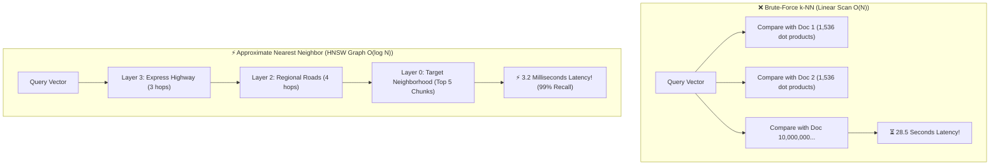
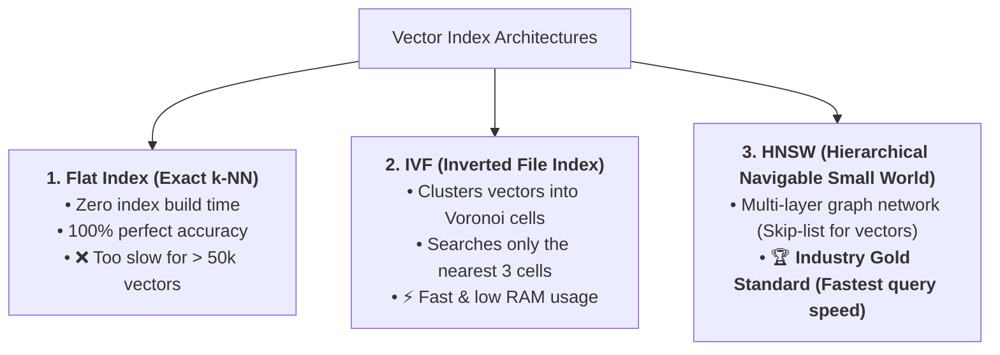
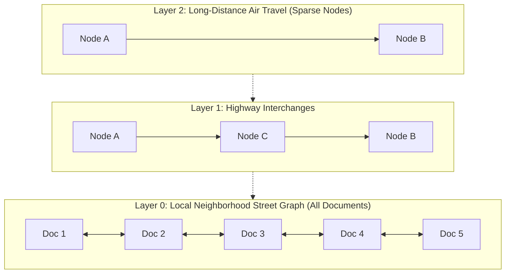
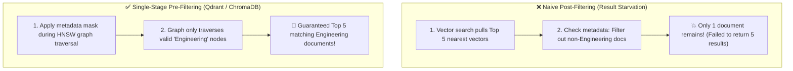

# 05 - Vector Databases: Indexing, Storage & Nearest Neighbor Search

> **Mental Model**:  
> Think of a Vector Database like a **multi-dimensional express highway postal network**:  
> * **Traditional SQL Databases (B-Trees)**: Designed for 1D ordering ($1 < 2 < 3$ or $A \rightarrow Z$). But in a 1,536-dimensional universe, there is no single alphabetical line!  
> * **Brute-Force Search (k-NN)**: A mail carrier walking up to every single house in the entire country to check if the resident looks like the recipient (Takes 30 seconds for 10 million documents!).  
> * **Vector Databases (HNSW Index)**: A multi-tiered express highway. The postal carrier takes an interstate airplane to the state hub, jumps onto a regional highway, and zooms straight to the exact neighborhood street in **under 4 milliseconds**!

---

## 📑 Table of Contents
1. [Why Relational Databases Fail at Vector Search](#1-why-relational-databases-fail-at-vector-search)
2. [The Core Indexing Architectures (HNSW vs. IVF vs. Flat)](#2-the-core-indexing-architectures-hnsw-vs-ivf-vs-flat)
3. [The Vector Database Landscape (ChromaDB, Pinecone, Qdrant, pgvector)](#3-the-vector-database-landscape-chromadb-pinecone-qdrant-pgvector)
4. [Metadata Filtering (Pre-Filtering vs. Post-Filtering)](#4-metadata-filtering-pre-filtering-vs-post-filtering)
5. [Building a ChromaDB Vector Store with Metadata Filters in Python](#5-building-a-chromadb-vector-store-with-metadata-filters-in-python)
6. [Master Cheat Sheet & Reference Table](#6-master-cheat-sheet--reference-table)

---

## 1. Why Relational Databases Fail at Vector Search

When querying 1,000,000 vectors, comparing your query vector against every single stored vector (**Exact Nearest Neighbor / k-NN**) crashes production latencies:



---

## 2. The Core Indexing Architectures (HNSW vs. IVF vs. Flat)



### The HNSW Multi-Layer Skip Graph:


---

## 3. The Vector Database Landscape

| Database | Architecture & Type | Deployment Mode | Best Use Case |
| :--- | :--- | :--- | :--- |
| **ChromaDB** | Embedded / In-Memory / SQLite | Local Python process / Docker | Rapid prototyping, local evaluation, hackathons. |
| **Qdrant** | High-performance Rust Engine | Open-Source or Managed Cloud | Enterprise production with complex metadata payload filters. |
| **Pinecone** | Cloud-Native Serverless | Managed SaaS only | Zero-ops serverless infrastructure with auto-scaling. |
| **pgvector** | PostgreSQL Extension | Self-hosted or AWS RDS / Supabase | When you want vector search inside existing SQL ACID transactions. |
| **Milvus** | Distributed Kubernetes Cluster | Self-hosted or Zilliz Cloud | Massive billion-scale vector workloads. |

---

## 4. Metadata Filtering (Pre-Filtering vs. Post-Filtering)

In production, you rarely perform raw vector searches without **business access constraints** (*"Search company policies, but only where `department == 'Engineering'` and `tenant_id == 402`"*):



---

## 5. Building a ChromaDB Vector Store with Metadata Filters in Python

Here is a complete, runnable script using `chromadb` to ingest documents, generate embeddings, and query with strict metadata filtering:

```python
# pip install chromadb
import chromadb
from chromadb.utils import embedding_functions
import os

# 1. Initialize local persistent ChromaDB client
client = chromadb.PersistentClient(path="./chroma_db_storage")

# 2. Setup OpenAI embedding function
openai_ef = embedding_functions.OpenAIEmbeddingFunction(
    api_key=os.getenv("OPENAI_API_KEY", "mock-key"),
    model_name="text-embedding-3-small"
)

# 3. Create or get collection
collection = client.get_or_create_collection(
    name="company_knowledge_base",
    embedding_function=openai_ef,
    metadata={"hnsw:space": "cosine"} # Use cosine similarity!
)

# 4. Ingest documents with rich metadata
sample_docs = [
    "Enterprise contracts receive a 100% refund within 30 days of signing.",
    "Pro tier users can request a 50% partial credit within 14 days.",
    "Engineers must rotate SSH keys every 90 days following standard protocol.",
    "All employees must complete security awareness training annually."
]

sample_metadatas = [
    {"department": "Sales", "access_tier": "Enterprise", "year": 2026},
    {"department": "Sales", "access_tier": "Pro", "year": 2026},
    {"department": "Engineering", "access_tier": "Internal", "year": 2025},
    {"department": "HR", "access_tier": "All", "year": 2026}
]

sample_ids = ["doc_sales_1", "doc_sales_2", "doc_eng_1", "doc_hr_1"]

collection.add(
    documents=sample_docs,
    metadatas=sample_metadatas,
    ids=sample_ids
)
print(f"✅ Ingested {collection.count()} documents into ChromaDB.")

# 5. Query with Single-Stage Metadata Filtering:
def search_knowledge_base(query: str, target_department: str):
    print(f"\n🔍 Query: '{query}' [Filter: department == '{target_department}']")
    
    results = collection.query(
        query_texts=[query],
        n_results=2,
        where={"department": target_department} # Pre-filtering mask!
    )
    
    for i, (doc, meta, dist) in enumerate(zip(results["documents"][0], results["metadatas"][0], results["distances"][0])):
        print(f"  Result #{i+1} [Distance: {dist:.4f}]:")
        print(f"    Content: {doc}")
        print(f"    Metadata: {meta}")

# Example Search:
# search_knowledge_base("What is the refund policy?", target_department="Sales")
```

---

## 6. Master Cheat Sheet & Reference Table

| Feature / Metric | Production Guideline |
| :--- | :--- |
| **Default Index Type** | Use **HNSW** for the best balance of query speed ($<5\text{ms}$) and high recall ($>98\%$). |
| **Local / Prototype DB** | **ChromaDB** (Zero setup, runs in-memory or on local disk). |
| **Scale & Payload Filtering**| **Qdrant** (Rust performance, single-stage metadata filtering). |
| **Serverless Cloud** | **Pinecone** (Auto-scaling, zero DevOps maintenance). |
| **Filtering Rule** | Always use **Single-Stage Pre-Filtering** to avoid result starvation bugs. |

---

## 🎯 Next Step in Phase 6
Now that you have mastered Vector Databases and Indexing, we will advance to **[06 - Similarity Search](file:///home/user2/PythonProject/Python-for-ai-engineering/06-rag/06-similarity-search)** to master Top-K tuning, similarity score thresholds, and Maximum Marginal Relevance (MMR) for diversity!
