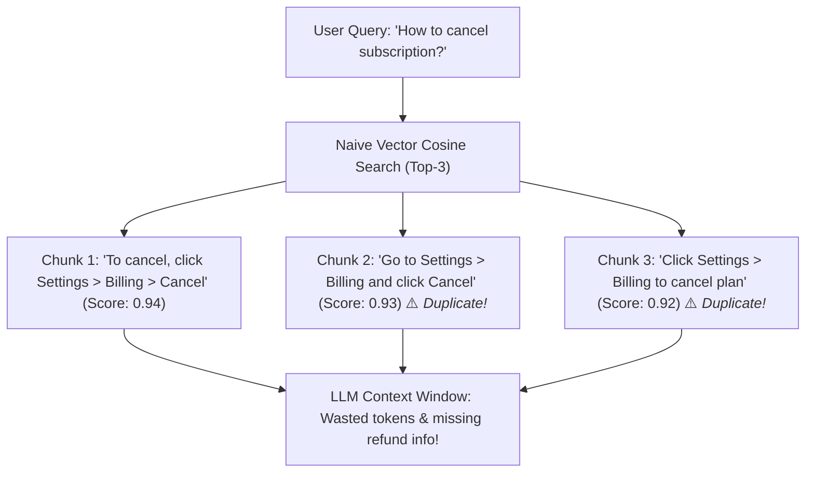
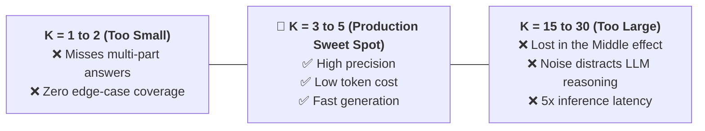
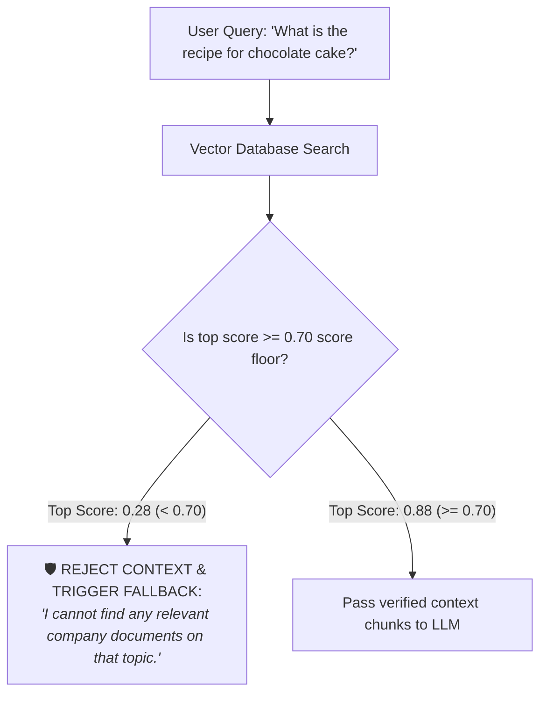
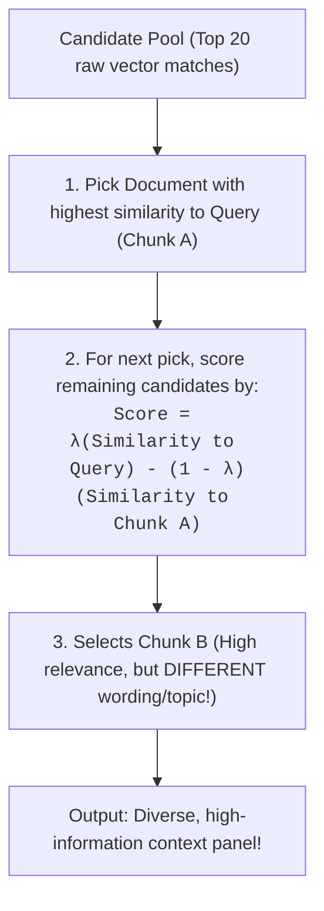

# 06 - Similarity Search: Top-K Tuning, Score Floors & MMR Diversity

> **Mental Model**:  
> Think of Similarity Search like **assembling an expert advisory panel**:  
> * **Naive Top-K Search (The Echo Chamber)**: If you ask *"How do I cancel my plan?"*, standard vector search pulls the **5 closest vectors**. But all 5 chunks might be near-identical copies of the exact same sentence from 5 different pages! You've filled your LLM's context window with redundant echoes.  
> * **Maximum Marginal Relevance (MMR - The Diverse Panel)**: Selects the #1 most relevant chunk, and then deliberately selects subsequent chunks that contain **novel, complementary information** (e.g. one on refunds, one on data export, one on grace periods) while penalizing duplicate text.  
> Advanced similarity search guarantees high factual relevance **without redundant context bloat**.

---

## 📑 Table of Contents
1. [The Pitfall of Naive Top-K Retrieval](#1-the-pitfall-of-naive-top-k-retrieval)
2. [Tuning K: The Context Window Trade-Off](#2-tuning-k-the-context-window-trade-off)
3. [Score Thresholding (The Irrelevance Floor)](#3-score-thresholding-the-irrelevance-floor)
4. [Maximum Marginal Relevance (MMR) Explained Visually](#4-maximum-marginal-relevance-mmr-explained-visually)
5. [Building an MMR Diversity Engine in Pure Python](#5-building-an-mmr-diversity-engine-in-pure-python)
6. [Master Cheat Sheet & Reference Table](#6-master-cheat-sheet--reference-table)

---

## 1. The Pitfall of Naive Top-K Retrieval

When an index contains multiple overlapping documents, standard vector search creates an **information echo chamber**:



---

## 2. Tuning K: The Context Window Trade-Off

How many chunks ($K$) should your vector database return?



---

## 3. Score Thresholding (The Irrelevance Floor)

What happens if a user asks a question completely outside your company's knowledge base (*"What is the weather on Jupiter?"*)?

> ⚠️ **The Forced Retrieval Trap:**  
> A naive vector search **always returns $K$ chunks**, even if the best match only has a terrible similarity score of $0.25$! The LLM will try to hallucinate an answer based on completely irrelevant context.



---

## 4. Maximum Marginal Relevance (MMR) Explained Visually

**MMR** solves the redundancy trap by balancing **Relevance to Query** against **Novelty / Diversity relative to previously selected chunks**:



### The $\lambda$ (Lambda) Diversity Knob:
* **$\lambda = 1.0$**: Pure standard Top-K search (Zero diversity, maximum redundancy).
* **$\lambda = 0.0$**: Pure diversity (Pulls random different topics).
* **$\lambda = 0.7$ (Recommended)**: High relevance to user query while aggressively penalizing duplicate chunks.

---

## 5. Building an MMR Diversity Engine in Pure Python

Here is a complete, runnable Python implementation of Maximum Marginal Relevance (MMR) and score threshold filtering:

```python
import math
from typing import List, Tuple

def cosine_similarity(a: List[float], b: List[float]) -> float:
    dot = sum(x * y for x, y in zip(a, b))
    mag_a = math.sqrt(sum(x * x for x in a))
    mag_b = math.sqrt(sum(y * y for y in b))
    if mag_a == 0 or mag_b == 0:
        return 0.0
    return dot / (mag_a * mag_b)

def maximal_marginal_relevance(
    query_vector: List[float],
    doc_vectors: List[List[float]],
    documents: List[str],
    top_k: int = 3,
    diversity_lambda: float = 0.7,
    score_threshold: float = 0.60
) -> List[Tuple[str, float]]:
    """Selects top_k diverse documents using MMR."""
    
    # 1. Calculate similarity of all documents to query
    query_similarities = [cosine_similarity(query_vector, doc_vec) for doc_vec in doc_vectors]
    
    # 2. Filter out documents below the score threshold
    valid_indices = [i for i, sim in enumerate(query_similarities) if sim >= score_threshold]
    if not valid_indices:
        print("⚠️ No documents met the minimum score threshold!")
        return []

    selected_indices = []
    
    # 3. Iteratively select documents balancing relevance & diversity
    while len(selected_indices) < min(top_k, len(valid_indices)):
        best_score = -float("inf")
        best_idx = None
        
        for idx in valid_indices:
            if idx in selected_indices:
                continue
                
            sim_to_query = query_similarities[idx]
            
            # Find maximum similarity to already selected documents
            if selected_indices:
                max_sim_to_selected = max(
                    cosine_similarity(doc_vectors[idx], doc_vectors[s_idx])
                    for s_idx in selected_indices
                )
            else:
                max_sim_to_selected = 0.0

            # MMR Equation: λ * Rel - (1 - λ) * Redundancy
            mmr_score = (diversity_lambda * sim_to_query) - ((1 - diversity_lambda) * max_sim_to_selected)
            
            if mmr_score > best_score:
                best_score = mmr_score
                best_idx = idx
                
        if best_idx is not None:
            selected_indices.append(best_idx)

    return [(documents[i], query_similarities[i]) for i in selected_indices]

# Test Case:
# query_vec = [1.0, 0.0, 0.0]
# docs = [
#     "Cancel by going to Settings > Billing",       # Vec: [0.95, 0.05, 0.0] (Duplicate 1)
#     "To cancel, click Settings > Billing",        # Vec: [0.94, 0.06, 0.0] (Duplicate 2)
#     "Refunds for cancellations are processed in 5d" # Vec: [0.80, 0.40, 0.0] (Diverse & Relevant!)
# ]
# doc_vecs = [[0.95, 0.05, 0.0], [0.94, 0.06, 0.0], [0.80, 0.40, 0.0]]
# results = maximal_marginal_relevance(query_vec, doc_vecs, docs, top_k=2, diversity_lambda=0.7)
# for doc, score in results:
#     print(f"Selected (Score {score:.2f}): {doc}")
```

---

## 6. Master Cheat Sheet & Reference Table

| Hyperparameter / Mechanism | Recommended Setting | Purpose |
| :--- | :---: | :--- |
| **Top-K ($K$)** | **3 to 5 chunks** | Optimal balance of context coverage and low token cost. |
| **Score Threshold Floor** | **$\ge 0.65 - 0.72$** | Discards out-of-domain noise and triggers graceful fallbacks. |
| **MMR Lambda ($\lambda$)** | **0.7** | Balances high query relevance with topic diversity. |
| **Candidate Pool Size** | **$4 \times K$ (e.g. Top 20)** | Pulls top 20 candidates from DB before applying MMR re-ranking. |

---

## 🎯 Next Step in Phase 6
Now that you understand similarity search and diversity ranking, we will advance to **[07 - Retrieval Pipeline](file:///home/user2/PythonProject/Python-for-ai-engineering/06-rag/07-retrieval-pipeline)** to master multi-query expansion, HyDE (Hypothetical Document Embeddings), and query routing!
