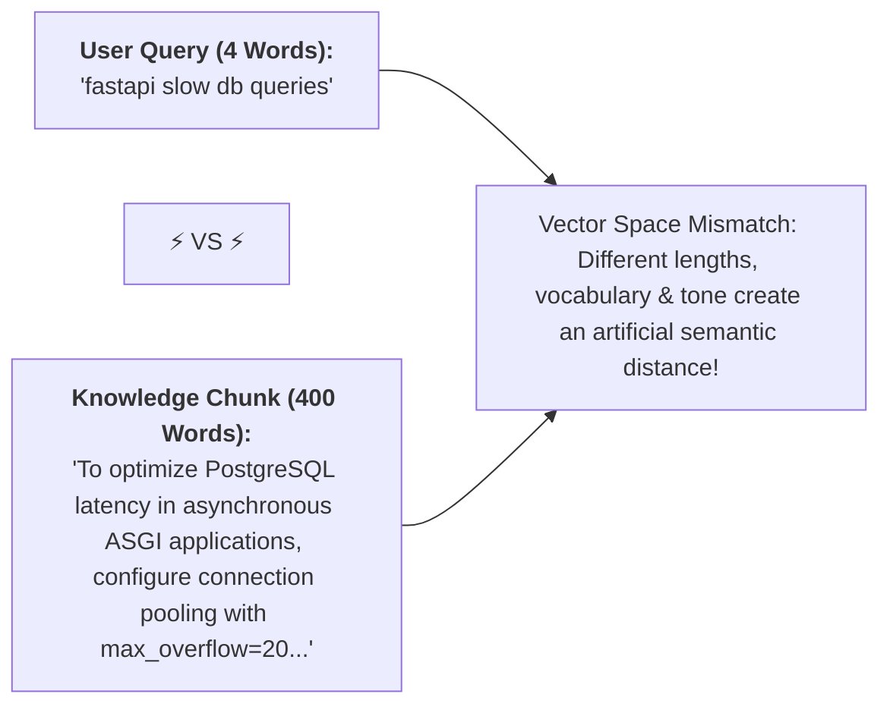
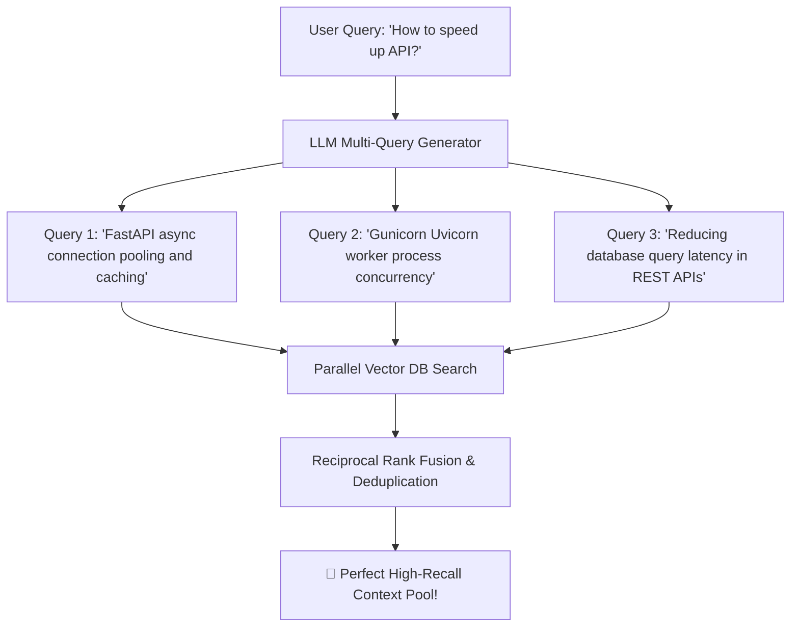
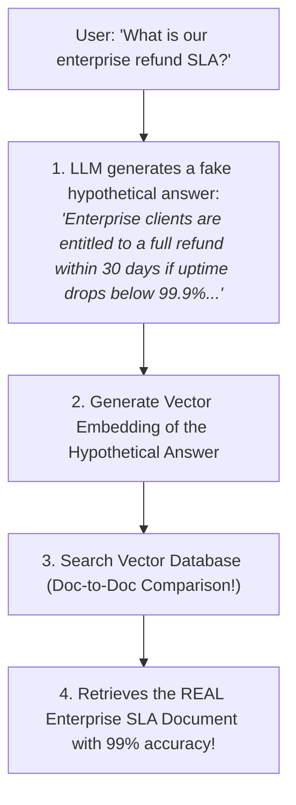
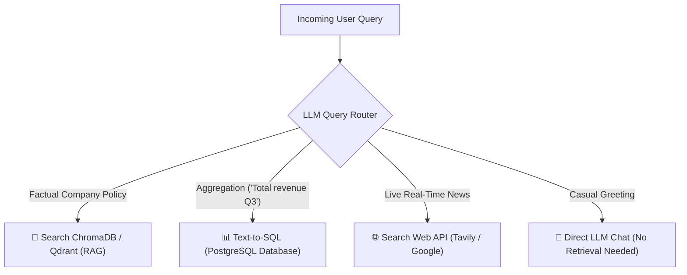
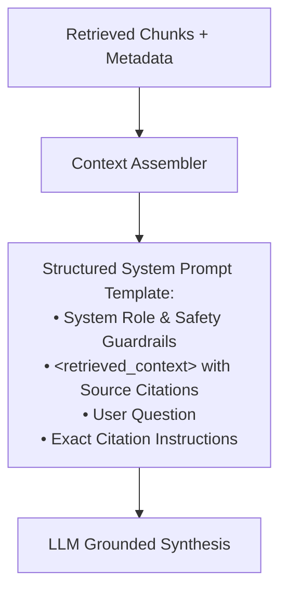

# 07 - The Retrieval Pipeline: Query Transformations & Routing

> **Mental Model**:  
> Think of Query Transformation like a **detective working with a forensic sketch artist**:  
> * **Raw User Queries (The Vague Witness)**: Real users type messy, 3-word questions (*"cancel billing?"* or *"slow api"*). If you embed this vague question directly, vector search struggles to find the 500-word detailed policy document.  
> * **The Sketch Artist (HyDE - Hypothetical Document Embeddings)**: The LLM generates a realistic *hypothetical answer* of what the ideal document should look like, and searches the database using that rich hypothetical text (**Document-to-Document matching**).  
> * **The Investigative Panel (Multi-Query)**: Translates the user's question into **3 alternative search angles** simultaneously, merging results to ensure zero blind spots!

---

## 📑 Table of Contents
1. [The Query-Document Asymmetry Problem](#1-the-query-document-asymmetry-problem)
2. [Multi-Query Expansion (360-Degree Retrieval)](#2-multi-query-expansion-360-degree-retrieval)
3. [HyDE: Hypothetical Document Embeddings](#3-hyde-hypothetical-document-embeddings)
4. [Semantic Query Routing (The Dispatch Switchboard)](#4-semantic-query-routing-the-dispatch-switchboard)
5. [Context Assembly & XML Prompt Packaging](#5-context-assembly--xml-prompt-packaging)
6. [Building a Complete Transformed Retrieval Pipeline in Python](#6-building-a-complete-transformed-retrieval-pipeline-in-python)
7. [Master Cheat Sheet & Reference Table](#7-master-cheat-sheet--reference-table)

---

## 1. The Query-Document Asymmetry Problem

Why does standard vector search fail on short user prompts?



Query transformations bridge this gap by **enriching and expanding the query** before searching.

---

## 2. Multi-Query Expansion (360-Degree Retrieval)

A user might phrase a question using slang or incomplete keywords.  
**Multi-Query Expansion** prompts an LLM to generate **3 distinct synonymous queries**, executing them in parallel:



---

## 3. HyDE: Hypothetical Document Embeddings

Instead of embedding the question, **HyDE generates a hypothetical answer** and embeds that instead:



> 💡 **Why HyDE Works So Well:**  
> Even if the LLM invents fake numbers in its hypothetical text, the **domain vocabulary, tone, and grammar structure** closely mirror the real document in high-dimensional vector space!

---

## 4. Semantic Query Routing (The Dispatch Switchboard)

Not all user queries should go to a vector database:



---

## 5. Context Assembly & XML Prompt Packaging

Once chunks are retrieved and deduplicated, package them cleanly into the LLM system prompt:



---

## 6. Building a Complete Transformed Retrieval Pipeline in Python

Here is a complete, runnable Python pipeline implementing Multi-Query expansion, HyDE generation, and deduplicated context packaging:

```python
from openai import OpenAI
import os

client = OpenAI(api_key=os.getenv("OPENAI_API_KEY", "mock-key"))

# Mock Vector Store
KNOWLEDGE_BASE = {
    "doc_1": "To optimize FastAPI throughput, use async connection pools and deploy behind 4 Gunicorn Uvicorn workers.",
    "doc_2": "Redis caching can reduce database read queries by up to 80% for frequent GET endpoints.",
    "doc_3": "Enterprise refund policy guarantees 100% money back within 30 days of contract signing."
}

def generate_multi_queries(original_query: str) -> list[str]:
    """Generates 3 diverse search query variations."""
    prompt = f"""Generate 3 distinct search queries based on the user's question to retrieve relevant technical documents.
Original Question: {original_query}
Output only the 3 queries separated by newlines with no numbering."""

    res = client.chat.completions.create(
        model="gpt-4o-mini",
        messages=[{"role": "user", "content": prompt}],
        temperature=0.7
    )
    queries = [q.strip() for q in res.choices[0].message.content.split("\n") if q.strip()]
    return queries[:3]

def generate_hyde_document(query: str) -> str:
    """Generates a hypothetical answer document to bridge query-document asymmetry."""
    prompt = f"Write a clear, technical 1-paragraph answer to this question: '{query}'"
    res = client.chat.completions.create(
        model="gpt-4o-mini",
        messages=[{"role": "user", "content": prompt}],
        temperature=0.0
    )
    return res.choices[0].message.content

def assemble_context_prompt(user_query: str, retrieved_docs: list[dict]) -> str:
    """Formats retrieved context into clean XML delimiters for LLM generation."""
    context_blocks = []
    for i, doc in enumerate(retrieved_docs, start=1):
        context_blocks.append(f'<document index="{i}" source="{doc["source"]}">\n{doc["text"]}\n</document>')
        
    formatted_context = "\n\n".join(context_blocks)
    
    return f"""You are an enterprise AI assistant. Answer the question strictly using the provided context documents.
If the documents do not contain the answer, state that you do not have enough information. Always cite document indices.

<retrieved_context>
{formatted_context}
</retrieved_context>

<question>
{user_query}
</question>"""

# Example Pipeline Execution:
# query = "how to make fastapi faster"
# print("Expanded Queries:", generate_multi_queries(query))
# print("HyDE Document:", generate_hyde_document(query))
```

---

## 7. Master Cheat Sheet & Reference Table

| Technique | When to Use | Trade-Off |
| :--- | :--- | :--- |
| **Multi-Query Expansion** | Vague, short, or ambiguous user queries. | $3\times$ higher retrieval calls; $+200\text{ms}$ LLM latency. |
| **HyDE** | High query-document vocabulary mismatch. | High recall boost; $+300\text{ms}$ latency to generate hypothetical doc. |
| **Query Routing** | Multi-source architectures (RAG vs SQL vs Web). | Prevents unnecessary vector DB calls on simple questions. |
| **XML Assembly** | Packing top chunks into prompt. | Guarantees clean boundary parsing and prevents prompt injection. |

---

## 🎯 Next Step in Phase 6
Now that you have mastered query transformation and retrieval pipelines, we will advance to **[08 - Hybrid Search](file:///home/user2/PythonProject/Python-for-ai-engineering/06-rag/08-hybrid-search)** to master combining Dense Vector Embeddings with Sparse BM25 Keyword Search!
